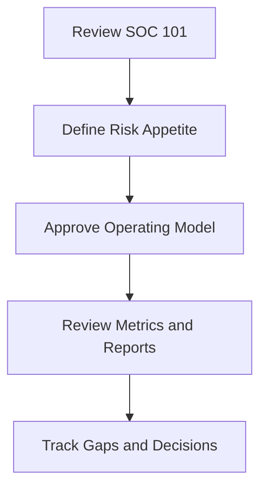

# CISO Entry Path

**Audience**: CISO, Deputy CISO, Security Director
**Purpose**: Use this guide to decide SOC scope, investment, escalation, and executive reporting priorities.

## 1. When to Use This Guide

-   [ ] Use this guide when standing up a new SOC or restructuring an existing SOC.
-   [ ] Use this guide before approving budget, staffing, or service coverage changes.
-   [ ] Use this guide during quarterly risk reviews and major incident follow-up.

## 2. Read These Documents First

-   [ ] Review [SOC 101](SOC_101.en.md) to confirm the target SOC operating model.
-   [ ] Review [Quickstart Guide](Quickstart_Guide.en.md) to understand the minimum startup sequence.
-   [ ] Review [SOC Building Roadmap](../01_SOC_Fundamentals/SOC_Building_Roadmap.en.md) to confirm phase gates and deliverables.
-   [ ] Review [Budget & Staffing](../01_SOC_Fundamentals/Budget_Staffing.en.md) before approving headcount or external support.

## 3. Key Decisions You Own

-   [ ] Approve the SOC mission, service boundaries, and escalation authority.
-   [ ] Approve the minimum logging, detection, and response coverage required for the business.
-   [ ] Decide whether the operating model is internal, co-managed, or outsourced.
-   [ ] Decide which risk scenarios require executive notification, legal review, or board reporting.
-   [ ] Approve backlog prioritization when funding, staffing, or telemetry coverage is constrained.

## 4. Minimum Outputs Expected From the Team

-   [ ] A current SOC roadmap with owners, milestones, and unresolved blockers.
-   [ ] A monthly metrics pack covering MTTD, MTTR, alert quality, and top control gaps.
-   [ ] An escalation matrix that identifies when management, legal, privacy, and executives must be engaged.
-   [ ] A decision log for major risk acceptance, deferred controls, and staffing constraints.
-   [ ] A quarterly improvement plan tied to measurable control or workflow outcomes.

## 5. Executive Review Cadence

-   [ ] Review key operational metrics monthly with the SOC Manager.
-   [ ] Review unresolved control gaps and funding needs quarterly.
-   [ ] Review incident severity trends and lessons learned after every high-impact case.
-   [ ] Review third-party dependencies, cloud exposure, and compliance gaps at least annually.

## 6. Operating Reviews You Should Attend

| Review | Cadence | Why You Attend | What You Should Decide |
|:---|:---|:---|:---|
| **Monthly Governance Review** | Monthly | Confirm service risk, overdue actions, and open executive decisions | Approve escalation, recovery plan, or deferral |
| **Quarterly Risk Acceptance Review** | Quarterly | Confirm whether open exceptions still fit business risk tolerance | Renew, close, or escalate accepted risk |
| **Board Quarterly Decision Review** | Quarterly | Present unresolved strategic gaps and funding decisions | Approve funding, formal acceptance, or scope change |
| **Annual Control Coverage Review** | Annual | Confirm whether control posture supports business and compliance commitments | Approve roadmap and investment priorities |

## 7. Metrics You Should Watch

| Metric or Signal | Why It Matters | Escalate When |
|:---|:---|:---|
| **MTTD / MTTR trend** | Shows whether detection and response are degrading | Two consecutive periods miss target |
| **SLA compliance** | Reflects delivery against agreed service scope | Below 85% or deteriorating quarter over quarter |
| **Critical telemetry or coverage gaps** | Indicates visibility loss in crown-jewel services | Blind spot remains unresolved past governance threshold |
| **Open risk acceptances and exceptions** | Shows how much exposure is being carried forward | Renewed repeatedly without credible exit plan |
| **Funding-dependent backlog** | Shows where risk reduction is blocked by budget or authority | Material item remains unfunded into next quarter |

## 8. Decisions You Personally Own

-   [ ] Approve risk acceptance, temporary tolerance, or compensating-control direction when business exposure remains open.
-   [ ] Approve funding, staffing, or managed-service support when operational metrics show persistent strain.
-   [ ] Approve escalation to board, legal, privacy, or external stakeholders when impact exceeds management authority.
-   [ ] Approve annual control coverage priorities and roadmap tradeoffs.

## Related Documents

-   [Quickstart Guide](Quickstart_Guide.en.md)
-   [SOC Building Roadmap](../01_SOC_Fundamentals/SOC_Building_Roadmap.en.md)
-   [SOC Metrics](../06_Operations_Management/SOC_Metrics.en.md)
-   [Monthly SOC Report](../11_Reporting_Templates/Monthly_SOC_Report.en.md)
-   [Monthly Governance Review Pack](../11_Reporting_Templates/Monthly_Governance_Review_Pack.en.md)
-   [Board Quarterly Decision Pack](../11_Reporting_Templates/Board_Quarterly_Decision_Pack.en.md)

## References

-   [NIST Cybersecurity Framework 2.0](https://www.nist.gov/cyberframework)
-   [FIRST CSIRT Services Framework](https://www.first.org/standards/frameworks/csirts/FIRST_CSIRT_Services_Framework_v2.1)
