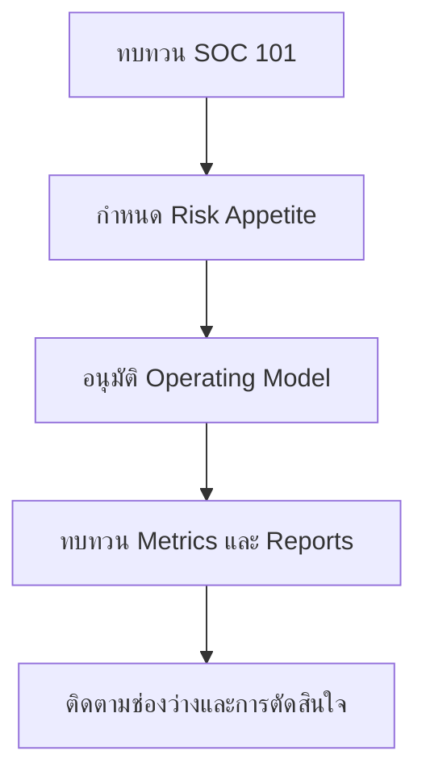

# เส้นทางเริ่มต้นสำหรับ CISO

**กลุ่มเป้าหมาย**: CISO, Deputy CISO, Security Director
**วัตถุประสงค์**: ใช้คู่มือนี้เพื่อกำหนดขอบเขต SOC, การลงทุน, การยกระดับเหตุการณ์, และลำดับความสำคัญของการรายงานผู้บริหาร

## 1. ใช้คู่มือนี้เมื่อใด

-   [ ] ใช้เมื่อกำลังก่อตั้ง SOC ใหม่หรือปรับโครงสร้าง SOC เดิม
-   [ ] ใช้ก่อนอนุมัติงบประมาณ การจัดกำลังคน หรือการเปลี่ยนขอบเขตบริการ
-   [ ] ใช้ระหว่างการทบทวนความเสี่ยงรายไตรมาสและหลังเหตุการณ์สำคัญ

## 2. เอกสารที่ควรอ่านก่อน

-   [ ] อ่าน [SOC 101](SOC_101.th.md) เพื่อยืนยันรูปแบบการดำเนินงานของ SOC ที่ต้องการ
-   [ ] อ่าน [Quickstart Guide](Quickstart_Guide.th.md) เพื่อเข้าใจลำดับเริ่มต้นขั้นต่ำ
-   [ ] อ่าน [SOC Building Roadmap](../01_SOC_Fundamentals/SOC_Building_Roadmap.th.md) เพื่อยืนยัน phase gate และ deliverables
-   [ ] อ่าน [Budget & Staffing](../01_SOC_Fundamentals/Budget_Staffing.th.md) ก่อนอนุมัติ headcount หรือ external support

## 3. การตัดสินใจสำคัญที่คุณเป็นเจ้าของ

-   [ ] อนุมัติภารกิจของ SOC ขอบเขตบริการ และอำนาจการ escalate
-   [ ] อนุมัติ logging, detection, และ response coverage ขั้นต่ำที่ธุรกิจต้องมี
-   [ ] ตัดสินใจว่าจะใช้โมเดล internal, co-managed, หรือ outsourced
-   [ ] ตัดสินใจว่าเหตุการณ์ประเภทใดต้องแจ้งผู้บริหาร, legal, หรือ board
-   [ ] อนุมัติลำดับความสำคัญของ backlog เมื่อมีข้อจำกัดด้านงบประมาณ กำลังคน หรือ telemetry coverage

## 4. ผลลัพธ์ขั้นต่ำที่ทีมต้องส่งมอบ

-   [ ] SOC roadmap ล่าสุดที่มี owner, milestone, และ blocker ที่ยังไม่ปิด
-   [ ] ชุดรายงานประจำเดือนที่ครอบคลุม MTTD, MTTR, alert quality, และ control gap สำคัญ
-   [ ] escalation matrix ที่ระบุชัดว่าเมื่อใดต้องดึง management, legal, privacy, และ executive เข้ามา
-   [ ] decision log สำหรับ risk acceptance, deferred controls, และ staffing constraints ที่สำคัญ
-   [ ] quarterly improvement plan ที่ผูกกับผลลัพธ์ด้าน control หรือ workflow ที่วัดได้

## 5. รอบการทบทวนระดับผู้บริหาร

-   [ ] ทบทวน operational metrics สำคัญรายเดือนร่วมกับ SOC Manager
-   [ ] ทบทวน control gaps ที่ยังไม่ปิดและ funding needs รายไตรมาส
-   [ ] ทบทวนแนวโน้ม severity ของ incident และ lessons learned หลังเหตุการณ์ที่มีผลกระทบสูง
-   [ ] ทบทวน third-party dependencies, cloud exposure, และ compliance gaps อย่างน้อยปีละครั้ง

## 6. วงประชุมที่คุณควรเข้าร่วม

| วงประชุม | ความถี่ | เหตุผลที่ควรเข้าร่วม | สิ่งที่คุณควรตัดสินใจ |
|:---|:---|:---|:---|
| **Monthly Governance Review** | รายเดือน | ยืนยัน service risk, งานที่ค้างเกินกำหนด, และ executive decisions ที่ยังเปิดอยู่ | อนุมัติการ escalate, recovery plan, หรือ deferral |
| **Quarterly Risk Acceptance Review** | รายไตรมาส | ยืนยันว่า exceptions ที่ยังเปิดอยู่ยังสอดคล้องกับ risk tolerance ของธุรกิจหรือไม่ | renew, close, หรือ escalate risk ที่ยอมรับไว้ |
| **Board Quarterly Decision Review** | รายไตรมาส | เสนอ strategic gaps และประเด็นด้าน funding ที่ยังไม่ปิด | อนุมัติ funding, formal acceptance, หรือ scope change |
| **Annual Control Coverage Review** | รายปี | ยืนยันว่า control posture รองรับความคาดหวังของธุรกิจและ compliance | อนุมัติ roadmap และลำดับความสำคัญด้านการลงทุน |

## 7. Metrics ที่คุณควรดู

| Metric หรือสัญญาณ | ทำไมจึงสำคัญ | ต้อง escalate เมื่อ |
|:---|:---|:---|
| **แนวโน้ม MTTD / MTTR** | บอกว่าความสามารถด้าน detection และ response กำลังแย่ลงหรือไม่ | หลุดเป้า 2 รอบติดกัน |
| **SLA compliance** | สะท้อนการส่งมอบงานตามขอบเขตบริการที่ตกลงไว้ | ต่ำกว่า 85% หรือแย่ลงต่อเนื่องรายไตรมาส |
| **critical telemetry หรือ coverage gaps** | บอกว่ากำลังสูญเสีย visibility ใน crown-jewel services | blind spot ยังไม่ปิดหลังเกณฑ์ governance |
| **open risk acceptances และ exceptions** | บอกว่าธุรกิจกำลังแบกรับ exposure ไว้มากแค่ไหน | ต่ออายุซ้ำโดยไม่มี exit plan ที่น่าเชื่อถือ |
| **backlog ที่ลดความเสี่ยงไม่ได้เพราะ funding** | บอกว่าความเสี่ยงลดลงไม่ได้เพราะข้อจำกัดด้านงบหรืออำนาจ | material item ยังไม่ได้งบจนเข้าสู่ไตรมาสถัดไป |

## 8. การตัดสินใจที่คุณเป็นเจ้าของโดยตรง

-   [ ] อนุมัติ risk acceptance, temporary tolerance, หรือแนวทาง compensating control เมื่อ exposure ของธุรกิจยังไม่ปิด
-   [ ] อนุมัติ funding, staffing, หรือ managed-service support เมื่อ operational metrics แสดงภาระที่ตึงตัวต่อเนื่อง
-   [ ] อนุมัติการยกระดับไปยัง board, legal, privacy, หรือหน่วยงานภายนอกเมื่อผลกระทบเกินอำนาจของ management
-   [ ] อนุมัติ annual control coverage priorities และ tradeoff ใน roadmap

## เอกสารที่เกี่ยวข้อง (Related Documents)

-   [Quickstart Guide](Quickstart_Guide.th.md)
-   [SOC Building Roadmap](../01_SOC_Fundamentals/SOC_Building_Roadmap.th.md)
-   [SOC Metrics](../06_Operations_Management/SOC_Metrics.th.md)
-   [Monthly SOC Report](../11_Reporting_Templates/Monthly_SOC_Report.th.md)
-   [Monthly Governance Review Pack](../11_Reporting_Templates/Monthly_Governance_Review_Pack.th.md)
-   [Board Quarterly Decision Pack](../11_Reporting_Templates/Board_Quarterly_Decision_Pack.th.md)

## References

-   [NIST Cybersecurity Framework 2.0](https://www.nist.gov/cyberframework)
-   [FIRST CSIRT Services Framework](https://www.first.org/standards/frameworks/csirts/FIRST_CSIRT_Services_Framework_v2.1)
