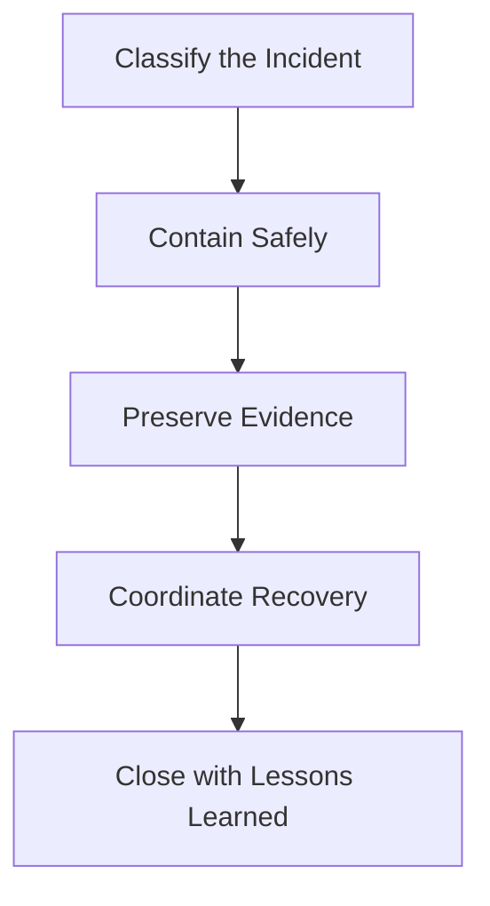

# IR Engineer Entry Path

**Audience**: IR Engineer, Incident Responder, Forensic Lead
**Purpose**: Use this guide to align investigation, containment, evidence handling, and post-incident reporting.

## 1. Start Here

-   [ ] Confirm the incident classification, severity, and business impact.
-   [ ] Confirm the evidence preservation requirements before containment or eradication actions.
-   [ ] Confirm who owns technical containment, communications, and executive updates.

## 2. Read These Documents First

-   [ ] Review [IR Framework](../05_Incident_Response/Framework.en.md) to align on response phases.
-   [ ] Review [Forensic Investigation](../05_Incident_Response/Forensic_Investigation.en.md) before deep host or evidence work.
-   [ ] Review [Evidence Collection](../05_Incident_Response/Evidence_Collection.en.md) to preserve artifacts correctly.
-   [ ] Review [Incident Report Template](../11_Reporting_Templates/incident_report.en.md) to capture closure requirements from the start.

## 3. Decisions You Own

-   [ ] Decide the safest containment action that does not unnecessarily destroy evidence.
-   [ ] Decide when to widen the investigation scope to additional users, assets, or cloud tenants.
-   [ ] Decide when legal, privacy, HR, executives, or third parties must be engaged.
-   [ ] Decide when a case is ready to move from containment to recovery and closure.

## 4. Minimum Outputs Per Incident

-   [ ] A timeline of confirmed attacker or suspicious activity.
-   [ ] An evidence list with source, custodian, and preservation status.
-   [ ] A documented containment decision with residual risk and open questions.
-   [ ] A closure pack with root cause, business impact, actions taken, and follow-up tasks.

## 5. Weekly Review Focus

-   [ ] Review open containment decisions and unresolved evidence gaps weekly.
-   [ ] Review cases that required legal, privacy, or executive notification.
-   [ ] Review lessons learned and backlog items that should reduce repeat incidents.

## 6. Operating Reviews You Should Attend

| Review | Cadence | Why You Attend | What You Should Decide |
|:---|:---|:---|:---|
| **Monthly Remediation Review** | Monthly | Keep post-incident actions moving to validated closure | Reopen, escalate, or confirm closure evidence |
| **Monthly Governance Review** | Monthly | Escalate residual risk, overdue containment follow-up, or executive actions | Request exception, risk path, or leadership decision |
| **Quarterly Risk Acceptance Review** | Quarterly | Review cases where incident risk remains partially unresolved | Accept, renew, or escalate residual risk |
| **Board Quarterly Decision Pack** | Quarterly / as needed | Present material incident exposure needing authority or funding | Recommend funding, formal tolerance, or scope change |

## 7. Metrics and Signals You Should Watch

| Metric or Signal | Why It Matters | Escalate When |
|:---|:---|:---|
| **Open containment age** | Shows whether incidents are still operationally unstable | Critical/High case remains partially contained too long |
| **Evidence gap count** | Shows closure quality and legal/compliance risk | Required artifacts remain missing beyond review cycle |
| **Residual risk from open incidents** | Shows whether the business is carrying unresolved exposure | Closure depends on long-lived workaround or exception |
| **Notification-triggered cases** | Shows legal, privacy, or executive handling load | Pattern suggests systemic exposure or repeated control failure |
| **Repeat lessons-learned actions** | Shows whether corrective action is actually reducing incident recurrence | Same incident class returns without validated remediation |

## 8. Decisions You Personally Own

-   [ ] Decide whether containment is sufficient to reduce risk without destroying evidence.
-   [ ] Decide when residual risk is low enough to move toward closure versus formal acceptance.
-   [ ] Decide when unresolved incident actions need governance, legal, privacy, or board escalation.
-   [ ] Decide which lessons learned become tracked remediation rather than informal follow-up.

## 9. Tier-2-to-IR Handoff Path

| Handoff Trigger | What Tier 2 Should Already Provide | What IR Should Confirm First |
|:---|:---|:---|
| **Material containment tradeoff** | Options considered, current containment state, and business impact | Which option is safe, proportionate, and still preserves evidence |
| **Multi-asset or multi-team scope** | Confirmed scope, suspected spread, and priority systems affected | Incident command owner, containment sequence, and comms path |
| **Legal / privacy / regulatory concern** | Evidence status, known exposure, and notification concern | Notification triggers, preservation needs, and stakeholder involvement |
| **Residual risk still High** | Open exposures, workaround status, and unresolved decisions | Whether to continue containment, move to governance, or prepare formal acceptance |

## 10. Minimum IR Intake Questions

-   [ ] What is already confirmed versus still suspected?
-   [ ] What containment actions were already taken, and which are still pending approval?
-   [ ] What evidence exists now, where is it stored, and what is still at risk of being lost?
-   [ ] Which business services, users, tenants, or third parties are already known to be affected?

## 11. Executive / Legal / Privacy Notification Path

| Trigger | Who to Notify | Primary Document | Minimum Output |
|:---|:---|:---|:---|
| **Business disruption or executive-impacting event** | CISO, business owner, executive stakeholders | [Incident Report Template](../11_Reporting_Templates/incident_report.en.md) | Executive summary and management decision record |
| **Personal data, sensitive data, or regulated exposure** | DPO, Legal, Privacy, CISO | [PDPA Incident Response Guide](../07_Compliance_Privacy/PDPA_Incident_Response.en.md) | Notification decision record and draft package |
| **Material residual risk or board-level tradeoff** | CISO, Executive Committee, Board | [Board Quarterly Decision Pack](../11_Reporting_Templates/Board_Quarterly_Decision_Pack.en.md) | Board decision item and follow-up owner |
| **Customer, vendor, or third-party reliance** | Legal, vendor owner, communications lead | [Incident Report Template](../11_Reporting_Templates/incident_report.en.md) and [PDPA Incident Response Guide](../07_Compliance_Privacy/PDPA_Incident_Response.en.md) if applicable | Agreed external-notification path |

## Related Documents

-   [IR Framework](../05_Incident_Response/Framework.en.md)
-   [Forensic Investigation](../05_Incident_Response/Forensic_Investigation.en.md)
-   [Evidence Collection](../05_Incident_Response/Evidence_Collection.en.md)
-   [Incident Report Template](../11_Reporting_Templates/incident_report.en.md)
-   [Monthly Remediation Review Pack](../11_Reporting_Templates/Monthly_Remediation_Review_Pack.en.md)
-   [Monthly Governance Review Pack](../11_Reporting_Templates/Monthly_Governance_Review_Pack.en.md)
-   [Quarterly Risk Acceptance Review Pack](../11_Reporting_Templates/Quarterly_Risk_Acceptance_Review_Pack.en.md)
-   [Tier 2 Runbook](../05_Incident_Response/Runbooks/Tier2_Runbook.en.md)
-   [PDPA Incident Response Guide](../07_Compliance_Privacy/PDPA_Incident_Response.en.md)
-   [Board Quarterly Decision Pack](../11_Reporting_Templates/Board_Quarterly_Decision_Pack.en.md)

## References

-   [NIST SP 800-61 Rev. 2](https://csrc.nist.gov/publications/detail/sp/800-61/rev-2/final)
-   [VERIS Framework](https://verisframework.org/)
