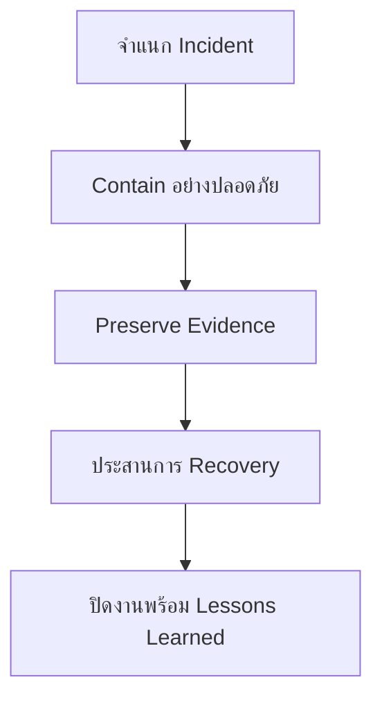

# เส้นทางเริ่มต้นสำหรับ IR Engineer

**กลุ่มเป้าหมาย**: IR Engineer, Incident Responder, Forensic Lead
**วัตถุประสงค์**: ใช้คู่มือนี้เพื่อให้การสืบสวน การ containment การจัดการหลักฐาน และการรายงานหลังเหตุการณ์ไปในแนวทางเดียวกัน

## 1. จุดเริ่มต้น

-   [ ] ยืนยัน incident classification, severity, และ business impact
-   [ ] ยืนยันข้อกำหนดด้านการเก็บรักษาหลักฐานก่อนทำ containment หรือ eradication
-   [ ] ยืนยันว่าใครเป็น owner ของ technical containment, communications, และ executive updates

## 2. เอกสารที่ควรอ่านก่อน

-   [ ] อ่าน [IR Framework](../05_Incident_Response/Framework.th.md) เพื่อให้ phase การตอบสนองตรงกัน
-   [ ] อ่าน [Forensic Investigation](../05_Incident_Response/Forensic_Investigation.th.md) ก่อนลงลึกด้าน host หรือ evidence
-   [ ] อ่าน [Evidence Collection](../05_Incident_Response/Evidence_Collection.th.md) เพื่อเก็บรักษา artifacts อย่างถูกต้อง
-   [ ] อ่าน [Incident Report Template](../11_Reporting_Templates/incident_report.th.md) เพื่อเริ่มเก็บข้อมูลให้ครบตั้งแต่ต้นเคส

## 3. การตัดสินใจที่คุณเป็นเจ้าของ

-   [ ] ตัดสินใจเลือก containment action ที่ปลอดภัยที่สุดโดยไม่ทำลายหลักฐานเกินจำเป็น
-   [ ] ตัดสินใจว่าเมื่อใดต้องขยายขอบเขตการสืบสวนไปยัง user, asset, หรือ cloud tenant อื่น
-   [ ] ตัดสินใจว่าเมื่อใดต้องดึง legal, privacy, HR, executives, หรือ third parties เข้ามา
-   [ ] ตัดสินใจว่าเมื่อใดเคสพร้อมเปลี่ยนจาก containment ไปสู่ recovery และ closure

## 4. ผลลัพธ์ขั้นต่ำต่อหนึ่งเหตุการณ์

-   [ ] timeline ของกิจกรรมผู้โจมตีหรือกิจกรรมต้องสงสัยที่ยืนยันแล้ว
-   [ ] รายการหลักฐานพร้อม source, custodian, และสถานะการเก็บรักษา
-   [ ] บันทึกการตัดสินใจด้าน containment พร้อม residual risk และคำถามที่ยังค้าง
-   [ ] closure pack ที่มี root cause, business impact, actions taken, และ follow-up tasks

## 5. จุดโฟกัสประจำสัปดาห์

-   [ ] ทบทวน open containment decisions และ evidence gaps ที่ยังไม่ปิดทุกสัปดาห์
-   [ ] ทบทวนเคสที่ต้องแจ้ง legal, privacy, หรือ executive
-   [ ] ทบทวน lessons learned และ backlog items ที่ควรช่วยลดเหตุการณ์ซ้ำ

## 6. วงประชุมที่คุณควรเข้าร่วม

| วงประชุม | ความถี่ | เหตุผลที่ควรเข้าร่วม | สิ่งที่คุณควรตัดสินใจ |
|:---|:---|:---|:---|
| **Monthly Remediation Review** | รายเดือน | คุม post-incident actions ให้ไปสู่ closure ที่ validate ได้ | reopen, escalate, หรือยืนยัน closure evidence |
| **Monthly Governance Review** | รายเดือน | ยกระดับ residual risk, follow-up ที่เกินกำหนด, หรือ executive actions | ขอ exception, risk path, หรือ leadership decision |
| **Quarterly Risk Acceptance Review** | รายไตรมาส | ทบทวนเคสที่ความเสี่ยงหลัง incident ยังไม่ถูกปิดหมด | accept, renew, หรือ escalate residual risk |
| **Board Quarterly Decision Pack** | รายไตรมาส / ตามความจำเป็น | นำเสนอ material incident exposure ที่ต้องใช้อำนาจหรือ funding | เสนอ funding, formal tolerance, หรือ scope change |

## 7. Metrics และสัญญาณที่คุณควรดู

| Metric หรือสัญญาณ | ทำไมจึงสำคัญ | ต้อง escalate เมื่อ |
|:---|:---|:---|
| **อายุของ open containment** | บอกว่า incident ยังไม่เสถียรในเชิงปฏิบัติการหรือไม่ | เคส Critical/High ยัง contain ได้ไม่สมบูรณ์นานเกินไป |
| **จำนวน evidence gaps** | บอกคุณภาพการปิดเคสและความเสี่ยงด้าน legal/compliance | artifacts ที่จำเป็นยังหายเกินรอบทบทวน |
| **residual risk จาก incident ที่ยังเปิดอยู่** | บอกว่าธุรกิจกำลังแบกรับ exposure ที่ยังไม่ปิดหรือไม่ | closure ยังต้องพึ่ง workaround หรือ exception ระยะยาว |
| **cases ที่ trigger การแจ้งหน่วยงานต่าง ๆ** | บอกภาระด้าน legal, privacy, หรือ executive handling | pattern ชี้ว่ามี systemic exposure หรือ control failure ซ้ำ |
| **repeat lessons-learned actions** | บอกว่า corrective action ลด incident recurrence ได้จริงหรือไม่ | incident class เดิมกลับมาโดยยังไม่มี validated remediation |

## 8. การตัดสินใจที่คุณเป็นเจ้าของโดยตรง

-   [ ] ตัดสินใจว่า containment เพียงพอจะลดความเสี่ยงโดยไม่ทำลายหลักฐานเกินจำเป็นหรือไม่
-   [ ] ตัดสินใจว่า residual risk ต่ำพอจะไปสู่ closure แล้วหรือยัง หรือควรย้ายเข้า formal acceptance
-   [ ] ตัดสินใจว่า unresolved incident actions ใดต้องยกระดับไป governance, legal, privacy, หรือ board
-   [ ] ตัดสินใจว่า lessons learned ข้อใดควรถูกย้ายเป็น tracked remediation แทนการ follow-up แบบไม่เป็นทางการ

## 9. เส้นทางการส่งต่อจาก T2 ไป IR

| Trigger ที่ต้องส่งต่อ | สิ่งที่ Tier 2 ควรส่งมาให้แล้ว | สิ่งที่ IR ควรยืนยันก่อน |
|:---|:---|:---|
| **containment มี tradeoff ต่อธุรกิจอย่างมีนัยสำคัญ** | ทางเลือกที่พิจารณา, สถานะ containment ปัจจุบัน, และ business impact | ทางเลือกใดปลอดภัย สมส่วน และยัง preserve evidence ได้ |
| **scope ขยายไปหลาย asset หรือหลายทีม** | scope ที่ยืนยันแล้ว, suspected spread, และระบบสำคัญที่ได้รับผลกระทบ | ใครเป็น incident command owner, ลำดับการ contain, และเส้นทางการสื่อสาร |
| **มีประเด็น legal / privacy / regulatory** | สถานะหลักฐาน, exposure ที่ทราบแล้ว, และข้อกังวลเรื่องการแจ้ง | notification triggers, preservation needs, และ stakeholder involvement |
| **residual risk ยังอยู่ระดับ High** | exposure ที่ยังเปิดอยู่, สถานะ workaround, และ decision ที่ยังไม่ปิด | ควร contain ต่อ ยกระดับเข้า governance หรือเตรียม formal acceptance |

## 10. คำถามขั้นต่ำตอนรับเคสเข้า IR

-   [ ] อะไรคือสิ่งที่ยืนยันแล้ว และอะไรคือสิ่งที่ยังเป็นเพียงข้อสงสัย
-   [ ] containment actions อะไรที่ทำไปแล้ว และอะไรที่ยังรอการอนุมัติ
-   [ ] หลักฐานอะไรมีอยู่แล้ว จัดเก็บไว้ที่ไหน และอะไรยังเสี่ยงจะสูญหาย
-   [ ] มี business services, users, tenants, หรือ third parties ใดที่ทราบแล้วว่าได้รับผลกระทบบ้าง

## 11. เส้นทางการแจ้งผู้บริหาร / กฎหมาย / Privacy

| Trigger | ต้องแจ้งใคร | เอกสารหลัก | ผลลัพธ์ขั้นต่ำ |
|:---|:---|:---|:---|
| **เกิด business disruption หรือเหตุการณ์ที่กระทบผู้บริหารโดยตรง** | CISO, business owner, executive stakeholders | [Incident Report Template](../11_Reporting_Templates/incident_report.th.md) | executive summary และ management decision record |
| **มี personal data, sensitive data, หรือ regulated exposure** | DPO, Legal, Privacy, CISO | [คู่มือ PDPA Incident Response](../07_Compliance_Privacy/PDPA_Incident_Response.th.md) | notification decision record และร่างเอกสารแจ้ง |
| **มี material residual risk หรือ tradeoff ระดับบอร์ด** | CISO, Executive Committee, Board | [Board Quarterly Decision Pack](../11_Reporting_Templates/Board_Quarterly_Decision_Pack.th.md) | board decision item และ owner ของ follow-up |
| **กระทบลูกค้า vendor หรือ third party** | Legal, vendor owner, communications lead | [Incident Report Template](../11_Reporting_Templates/incident_report.th.md) และ [คู่มือ PDPA Incident Response](../07_Compliance_Privacy/PDPA_Incident_Response.th.md) หากเกี่ยวข้อง | แนวทางการแจ้งภายนอกที่ตกลงร่วมกัน |

## เอกสารที่เกี่ยวข้อง (Related Documents)

-   [IR Framework](../05_Incident_Response/Framework.th.md)
-   [Forensic Investigation](../05_Incident_Response/Forensic_Investigation.th.md)
-   [Evidence Collection](../05_Incident_Response/Evidence_Collection.th.md)
-   [Incident Report Template](../11_Reporting_Templates/incident_report.th.md)
-   [Monthly Remediation Review Pack](../11_Reporting_Templates/Monthly_Remediation_Review_Pack.th.md)
-   [Monthly Governance Review Pack](../11_Reporting_Templates/Monthly_Governance_Review_Pack.th.md)
-   [Quarterly Risk Acceptance Review Pack](../11_Reporting_Templates/Quarterly_Risk_Acceptance_Review_Pack.th.md)
-   [Tier 2 Runbook](../05_Incident_Response/Runbooks/Tier2_Runbook.th.md)
-   [คู่มือ PDPA Incident Response](../07_Compliance_Privacy/PDPA_Incident_Response.th.md)
-   [Board Quarterly Decision Pack](../11_Reporting_Templates/Board_Quarterly_Decision_Pack.th.md)

## References

-   [NIST SP 800-61 Rev. 2](https://csrc.nist.gov/publications/detail/sp/800-61/rev-2/final)
-   [VERIS Framework](https://verisframework.org/)
