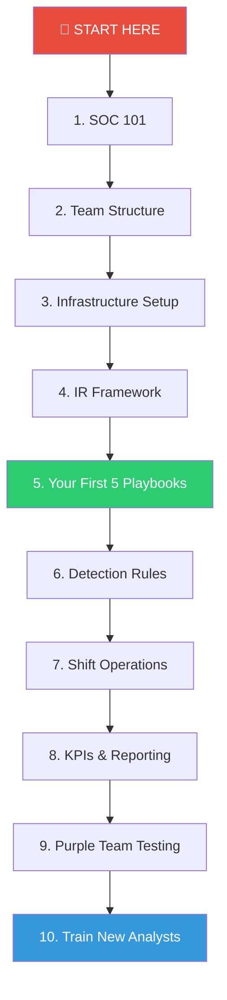
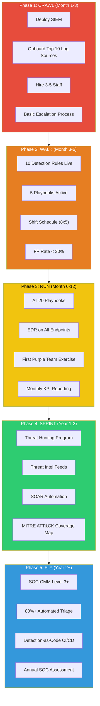

# Quickstart Guide — Your SOC in 30 Minutes

This guide shows you the **fastest path** through this repository. Follow the numbered steps to understand and implement a SOC from scratch.

## Reading Roadmap

## Step-by-Step Reading Order

### 🔴 Week 1 — Understand (Read Only)

| Step | Time | Document | What You'll Learn |
|:---:|:---:|---|---|
| 1 | 15 min | [SOC 101](SOC_101.en.md) | What a SOC is, core components, maturity phases |
| 2 | 10 min | [Glossary](Glossary.en.md) | Key terminology (SIEM, EDR, IOC, TTP, etc.) |
| 3 | 10 min | [SOC Team Structure](../06_Operations_Management/SOC_Team_Structure.en.md) | Roles, staffing model, career path |

### 🟠 Week 2 — Plan (Design Your SOC)

| Step | Time | Document | What You'll Learn |
|:---:|:---:|---|---|
| 4 | 15 min | [Infrastructure Setup](../10_Training_Onboarding/System_Activation.en.md) | What systems you need to deploy |
| 5 | 10 min | [Data Governance](../02_Platform_Operations/Database_Management.en.md) | How to manage log data and retention |
| 6 | 10 min | [SOC Assessment Checklist](../06_Operations_Management/SOC_Assessment_Checklist.en.md) | Gap analysis for your current state |

### 🟡 Week 3 — Build (Implement Core Processes)

| Step | Time | Document | What You'll Learn |
|:---:|:---:|---|---|
| 7 | 20 min | [IR Framework](../05_Incident_Response/Framework.en.md) | How to handle incidents end-to-end |
| 8 | 30 min | **Top 5 Playbooks** (see below) | How to respond to common attacks |
| 9 | 15 min | [Detection Rules](../08_Detection_Engineering/sigma_rules/) | Pre-built Sigma rules to deploy |
| 10 | 10 min | [Integration Hub](../03_User_Guides/Integration_Hub.en.md) | How to connect tools together |

### 🟢 Week 4 — Operate (Go Live)

| Step | Time | Document | What You'll Learn |
|:---:|:---:|---|---|
| 11 | 10 min | [Shift Handoff](../06_Operations_Management/Shift_Handoff.en.md) | How to run 24/7 operations |
| 12 | 10 min | [SOC Metrics](../06_Operations_Management/SOC_Metrics.en.md) | MTTD, MTTR, False Positive Rate |
| 13 | 15 min | [Monthly Report Template](../11_Reporting_Templates/Monthly_SOC_Report.en.md) | Reporting to leadership |
| 14 | 10 min | [Analyst Onboarding Path](../10_Training_Onboarding/Analyst_Onboarding_Path.en.md) | How to train new hires |

## Top 5 Playbooks to Start With

Start with these — they cover 80% of real-world incidents:

| Priority | Playbook | Why Start Here |
|:---:|---|---|
| 1️⃣ | [Phishing](../05_Incident_Response/Playbooks/Phishing.en.md) | #1 most common attack vector |
| 2️⃣ | [Malware Infection](../05_Incident_Response/Playbooks/Malware_Infection.en.md) | Most frequent escalation from Phishing |
| 3️⃣ | [Brute Force](../05_Incident_Response/Playbooks/Brute_Force.en.md) | Easy to detect, good for training Tier 1 |
| 4️⃣ | [Account Compromise](../05_Incident_Response/Playbooks/Account_Compromise.en.md) | Growing attack surface with cloud adoption |
| 5️⃣ | [Ransomware](../05_Incident_Response/Playbooks/Ransomware.en.md) | Highest business impact |

## SOC Maturity Roadmap

## Minimum Viable SOC Checklist

The absolute minimum you need to start — your "Day 1" checklist:

- [ ] **1 SIEM deployed** (Wazuh recommended for budget-conscious orgs)
- [ ] **3 log sources onboarded** (Firewall, Active Directory, Email)
- [ ] **3 people hired** (2 Tier 1 Analysts + 1 Manager)
- [ ] **5 detection rules enabled** (from our `08_Detection_Engineering/sigma_rules/`)
- [ ] **1 Playbook ready** (start with Phishing)
- [ ] **1 ticketing system** (TheHive or Jira)
- [ ] **1 escalation path defined** (Tier 1 → Manager → CISO)
- [ ] **1 communication channel** (Slack/Teams for SOC team)

> ✅ If you can check all 8 boxes above, you have a functioning SOC!

## Frequently Asked Questions

| # | Question | Answer |
|:---|:---|:---|
| 1 | How many people do I need to start a SOC? | Minimum 3: 2 T1 analysts + 1 manager. See [SOC Team Structure](../06_Operations_Management/SOC_Team_Structure.en.md) |
| 2 | What SIEM should I use? | For budget: Wazuh (free). For enterprise: Splunk, Elastic, or Sentinel. |
| 3 | How long until my SOC is effective? | Crawl (3 months), Walk (6 months), Run (12 months). Plan for at least 6 months. |
| 4 | Do I need 24/7 coverage from day 1? | No. Start with 8x5, then expand as maturity grows. |
| 5 | Which playbooks should I create first? | Phishing, Malware, Brute Force, Account Compromise, Ransomware. |
| 6 | How many detection rules do I need? | Start with 5-10 high-confidence rules, then expand. Quality > quantity. |
| 7 | Should I build or buy a SOC? | Start with internal + MSSP support if budget allows. See [SOC Assessment](../06_Operations_Management/SOC_Assessment_Checklist.en.md). |
| 8 | What certifications do analysts need? | T1: Security+/CySA+. T2: GCIH. T3: GCFA/OSCP. |
| 9 | How do I measure SOC effectiveness? | MTTD, MTTR, FP rate, SLA compliance. See [SOC Metrics](../06_Operations_Management/SOC_Metrics.en.md). |
| 10 | Can I use this repository for my organization? | Yes! Fork it, customize it, contribute back. See [CONTRIBUTING](../CONTRIBUTING.md). |

## Related Documents
-   [SOC 101](SOC_101.en.md)
-   [Glossary of Terms](Glossary.en.md)
-   [SOC Team Structure](../06_Operations_Management/SOC_Team_Structure.en.md)
-   [Analyst Onboarding Path](../10_Training_Onboarding/Analyst_Onboarding_Path.en.md)

## References
-   [NIST Cybersecurity Framework](https://www.nist.gov/cyberframework)
-   [SOC-CMM — SOC Capability Maturity Model](https://www.soc-cmm.com/)
-   [SANS SOC Survey](https://www.sans.org/white-papers/soc-survey/)
