# Quickstart Guide — Your SOC in 30 Minutes

This guide shows you the **fastest path** through this repository. Follow the numbered steps to understand and implement a SOC from scratch.

## Reading Roadmap

```mermaid
graph TD
    START[🚀 START HERE] --> S1[1. SOC 101]
    S1 --> S2[2. Team Structure]
    S2 --> S3[3. Infrastructure Setup]
    S3 --> S4[4. IR Framework]
    S4 --> S5[5. Your First 5 Playbooks]
    S5 --> S6[6. Detection Rules]
    S6 --> S7[7. Shift Operations]
    S7 --> S8[8. KPIs & Reporting]
    S8 --> S9[9. Purple Team Testing]
    S9 --> S10[10. Train New Analysts]

    style START fill:#e74c3c,color:#fff
    style S5 fill:#2ecc71,color:#fff
    style S10 fill:#3498db,color:#fff
```

## Step-by-Step Reading Order

### 🔴 Week 1 — Understand (Read Only)

| Step | Time | Document | What You'll Learn |
|:---:|:---:|---|---|
| 1 | 15 min | [SOC 101](SOC_101.en.md) | What a SOC is, core components, maturity phases |
| 2 | 10 min | [Glossary](Glossary.en.md) | Key terminology (SIEM, EDR, IOC, TTP, etc.) |
| 3 | 10 min | [SOC Team Structure](../06_Operations_Management/SOC_Team_Structure.en.md) | Roles, staffing model, career path |

### 🟠 Week 2 — Plan (Design Your SOC)

| Step | Time | Document | What You'll Learn |
|:---:|:---:|---|---|
| 4 | 15 min | [Infrastructure Setup](../01_Onboarding/System_Activation.en.md) | What systems you need to deploy |
| 5 | 10 min | [Data Governance](../02_Platform_Operations/Database_Management.en.md) | How to manage log data and retention |
| 6 | 10 min | [SOC Assessment Checklist](../06_Operations_Management/SOC_Assessment_Checklist.en.md) | Gap analysis for your current state |

### 🟡 Week 3 — Build (Implement Core Processes)

| Step | Time | Document | What You'll Learn |
|:---:|:---:|---|---|
| 7 | 20 min | [IR Framework](../05_Incident_Response/Framework.en.md) | How to handle incidents end-to-end |
| 8 | 30 min | **Top 5 Playbooks** (see below) | How to respond to common attacks |
| 9 | 15 min | [Detection Rules](../07_Detection_Rules/) | Pre-built Sigma rules to deploy |
| 10 | 10 min | [Integration Hub](../03_User_Guides/Integration_Hub.en.md) | How to connect tools together |

### 🟢 Week 4 — Operate (Go Live)

| Step | Time | Document | What You'll Learn |
|:---:|:---:|---|---|
| 11 | 10 min | [Shift Handoff](../06_Operations_Management/Shift_Handoff.en.md) | How to run 24/7 operations |
| 12 | 10 min | [SOC Metrics](../06_Operations_Management/SOC_Metrics.en.md) | MTTD, MTTR, False Positive Rate |
| 13 | 15 min | [Monthly Report Template](../11_Reporting_Templates/Monthly_SOC_Report.en.md) | Reporting to leadership |
| 14 | 10 min | [Analyst Onboarding Path](../09_Training_Onboarding/Analyst_Onboarding_Path.en.md) | How to train new hires |

## Top 5 Playbooks to Start With

Start with these — they cover 80% of real-world incidents:

| Priority | Playbook | Why Start Here |
|:---:|---|---|
| 1️⃣ | [Phishing](../05_Incident_Response/Playbooks/Phishing.en.md) | #1 most common attack vector |
| 2️⃣ | [Malware Infection](../05_Incident_Response/Playbooks/Malware_Infection.en.md) | Most frequent escalation from Phishing |
| 3️⃣ | [Brute Force](../05_Incident_Response/Playbooks/Brute_Force.en.md) | Easy to detect, good for training Tier 1 |
| 4️⃣ | [Account Compromise](../05_Incident_Response/Playbooks/Account_Compromise.en.md) | Growing attack surface with cloud adoption |
| 5️⃣ | [Ransomware](../05_Incident_Response/Playbooks/Ransomware.en.md) | Highest business impact |

## SOC Maturity Roadmap

## Minimum Viable SOC Checklist

The absolute minimum you need to start — your "Day 1" checklist:

- [ ] **1 SIEM deployed** (Wazuh recommended for budget-conscious orgs)
- [ ] **3 log sources onboarded** (Firewall, Active Directory, Email)
- [ ] **3 people hired** (2 Tier 1 Analysts + 1 Manager)
- [ ] **5 detection rules enabled** (from our `07_Detection_Rules/`)
- [ ] **1 Playbook ready** (start with Phishing)
- [ ] **1 ticketing system** (TheHive or Jira)
- [ ] **1 escalation path defined** (Tier 1 → Manager → CISO)
- [ ] **1 communication channel** (Slack/Teams for SOC team)

> ✅ If you can check all 8 boxes above, you have a functioning SOC!

## Related Documents
-   [SOC 101](SOC_101.en.md)
-   [Glossary of Terms](Glossary.en.md)
-   [SOC Team Structure](../06_Operations_Management/SOC_Team_Structure.en.md)
-   [Analyst Onboarding Path](../09_Training_Onboarding/Analyst_Onboarding_Path.en.md)

## References
-   [NIST Cybersecurity Framework](https://www.nist.gov/cyberframework)
-   [SOC-CMM — SOC Capability Maturity Model](https://www.soc-cmm.com/)
-   [SANS SOC Survey](https://www.sans.org/white-papers/soc-survey/)
