# คู่มือเริ่มต้นด่วน — สร้าง SOC ใน 30 นาที (Quickstart Guide)

คู่มือนี้แสดง **เส้นทางที่เร็วที่สุด** ในการอ่านเอกสารทั้ง Repository ทำตามขั้นตอนเพื่อทำความเข้าใจและตั้ง SOC ตั้งแต่เริ่มต้น

## แผนที่การอ่าน (Reading Roadmap)

```mermaid
graph TD
    START[🚀 เริ่มตรงนี้] --> S1[1. SOC 101]
    S1 --> S2[2. โครงสร้างทีม]
    S2 --> S3[3. ติดตั้งโครงสร้างพื้นฐาน]
    S3 --> S4[4. กรอบ IR]
    S4 --> S5[5. Playbook 5 ชุดแรก]
    S5 --> S6[6. กฎตรวจจับ]
    S6 --> S7[7. ระบบกะ]
    S7 --> S8[8. KPI และรายงาน]
    S8 --> S9[9. ทดสอบ Purple Team]
    S9 --> S10[10. ฝึกอบรม Analyst]

    style START fill:#e74c3c,color:#fff
    style S5 fill:#2ecc71,color:#fff
    style S10 fill:#3498db,color:#fff
```

## ขั้นตอนการอ่าน (Step-by-Step Reading Order)

### 🔴 สัปดาห์ที่ 1 — ทำความเข้าใจ (อ่านอย่างเดียว)

| ขั้นตอน | เวลา | เอกสาร | สิ่งที่จะเรียนรู้ |
|:---:|:---:|---|---|
| 1 | 15 นาที | [SOC 101](SOC_101.th.md) | SOC คืออะไร องค์ประกอบหลัก ขั้นตอนการเติบโต |
| 2 | 10 นาที | [คำศัพท์สำคัญ](Glossary.th.md) | ศัพท์เทคนิค (SIEM, EDR, IOC, TTP เป็นต้น) |
| 3 | 10 นาที | [โครงสร้างทีม SOC](../06_Operations_Management/SOC_Team_Structure.th.md) | บทบาท จำนวนคน เส้นทางอาชีพ |

### 🟠 สัปดาห์ที่ 2 — วางแผน (ออกแบบ SOC ของคุณ)

| ขั้นตอน | เวลา | เอกสาร | สิ่งที่จะเรียนรู้ |
|:---:|:---:|---|---|
| 4 | 15 นาที | [การติดตั้ง SOC](../01_Onboarding/System_Activation.th.md) | ต้อง Deploy ระบบอะไรบ้าง |
| 5 | 10 นาที | [นโยบายข้อมูล](../02_Platform_Operations/Database_Management.th.md) | การจัดการ Log Data และ Retention |
| 6 | 10 นาที | [แบบประเมิน SOC](../06_Operations_Management/SOC_Assessment_Checklist.th.md) | วิเคราะห์ Gap ของสถานะปัจจุบัน |

### 🟡 สัปดาห์ที่ 3 — สร้าง (ทำกระบวนการหลัก)

| ขั้นตอน | เวลา | เอกสาร | สิ่งที่จะเรียนรู้ |
|:---:|:---:|---|---|
| 7 | 20 นาที | [กรอบ IR](../05_Incident_Response/Framework.th.md) | วิธีจัดการ Incident ตั้งแต่ต้นจนจบ |
| 8 | 30 นาที | **Playbook 5 ชุดแรก** (ดูด้านล่าง) | วิธีตอบสนองต่อการโจมตีที่พบบ่อย |
| 9 | 15 นาที | [Detection Rules](../07_Detection_Rules/) | กฎ Sigma สำเร็จรูปพร้อม Deploy |
| 10 | 10 นาที | [Integration Hub](../03_User_Guides/Integration_Hub.th.md) | วิธีเชื่อมต่อเครื่องมือเข้าด้วยกัน |

### 🟢 สัปดาห์ที่ 4 — เปิดใช้งาน (Go Live)

| ขั้นตอน | เวลา | เอกสาร | สิ่งที่จะเรียนรู้ |
|:---:|:---:|---|---|
| 11 | 10 นาที | [มาตรฐานส่งมอบกะ](../06_Operations_Management/Shift_Handoff.th.md) | การทำงาน 24/7 |
| 12 | 10 นาที | [ตัวชี้วัด SOC](../06_Operations_Management/SOC_Metrics.th.md) | MTTD, MTTR, False Positive Rate |
| 13 | 15 นาที | [รายงานรายเดือน](../11_Reporting_Templates/Monthly_SOC_Report.th.md) | การรายงานให้ผู้บริหาร |
| 14 | 10 นาที | [หลักสูตร Analyst](../09_Training_Onboarding/Analyst_Onboarding_Path.th.md) | วิธีฝึก Analyst ใหม่ |

## Playbook 5 ชุดที่ต้องเริ่มก่อน

เริ่มจากชุดนี้ — ครอบคลุม 80% ของ Incident ในโลกจริง:

| ลำดับ | Playbook | ทำไมต้องเริ่มที่นี่ |
|:---:|---|---|
| 1️⃣ | [Phishing](../05_Incident_Response/Playbooks/Phishing.th.md) | ช่องทางโจมตีอันดับ 1 ที่พบมากที่สุด |
| 2️⃣ | [Malware Infection](../05_Incident_Response/Playbooks/Malware_Infection.th.md) | Escalation ที่พบบ่อยที่สุดจาก Phishing |
| 3️⃣ | [Brute Force](../05_Incident_Response/Playbooks/Brute_Force.th.md) | ตรวจจับง่าย เหมาะฝึก Tier 1 |
| 4️⃣ | [Account Compromise](../05_Incident_Response/Playbooks/Account_Compromise.th.md) | พื้นที่โจมตีขยายตัวจากการใช้ Cloud |
| 5️⃣ | [Ransomware](../05_Incident_Response/Playbooks/Ransomware.th.md) | ผลกระทบต่อธุรกิจสูงสุด |

## SOC Maturity Roadmap

```mermaid
graph TD
    subgraph Phase1["Phase 1: คลาน (เดือน 1-3)"]
        A1[Deploy SIEM]
        A2[นำเข้า Log 10 แหล่ง]
        A3[จ้างคน 3-5 คน]
        A4[กำหนดขั้นตอน Escalation]
    end

    subgraph Phase2["Phase 2: เดิน (เดือน 3-6)"]
        B1[เปิดใช้ Detection Rules 10 กฎ]
        B2[เปิดใช้ Playbook 5 ชุด]
        B3["จัดตารางกะ (8x5)"]
        B4["FP Rate < 30%"]
    end

    subgraph Phase3["Phase 3: วิ่ง (เดือน 6-12)"]
        C1[ใช้ Playbook ครบ 20 ชุด]
        C2[EDR ครบทุก Endpoint]
        C3[Purple Team ครั้งแรก]
        C4[รายงาน KPI รายเดือน]
    end

    subgraph Phase4["Phase 4: วิ่งเร็ว (ปี 1-2)"]
        D1[โปรแกรม Threat Hunting]
        D2[Threat Intel Feeds]
        D3[SOAR Automation]
        D4[MITRE ATT&CK Coverage Map]
    end

    subgraph Phase5["Phase 5: บิน (ปี 2+)"]
        E1["SOC-CMM Level 3+"]
        E2["Triage อัตโนมัติ 80%+"]
        E3[Detection-as-Code CI/CD]
        E4[SOC Assessment ประจำปี]
    end

    Phase1 --> Phase2 --> Phase3 --> Phase4 --> Phase5

    style Phase1 fill:#e74c3c,color:#fff
    style Phase2 fill:#e67e22,color:#fff
    style Phase3 fill:#f1c40f,color:#000
    style Phase4 fill:#2ecc71,color:#fff
    style Phase5 fill:#3498db,color:#fff
```

## Minimum Viable SOC Checklist

สิ่งที่ต้องมีอย่างน้อยที่สุดเพื่อเริ่มต้น — "Day 1" ของคุณ:

- [ ] **SIEM 1 ตัว** (แนะนำ Wazuh สำหรับองค์กรงบจำกัด)
- [ ] **Log Source 3 แหล่ง** (Firewall, Active Directory, Email)
- [ ] **คน 3 คน** (Tier 1 Analyst 2 คน + Manager 1 คน)
- [ ] **Detection Rules 5 กฎ** (จาก `07_Detection_Rules/`)
- [ ] **Playbook 1 ชุด** (เริ่มจาก Phishing)
- [ ] **ระบบ Ticketing 1 ตัว** (TheHive หรือ Jira)
- [ ] **เส้นทาง Escalation 1 เส้น** (Tier 1 → Manager → CISO)
- [ ] **ช่องทางสื่อสาร 1 ช่อง** (Slack/Teams สำหรับทีม SOC)

> ✅ ถ้าทำครบ 8 ข้อข้างบน คุณก็มี SOC ที่ทำงานได้แล้ว!

## เอกสารที่เกี่ยวข้อง (Related Documents)
-   [SOC 101](SOC_101.th.md)
-   [คำศัพท์สำคัญ](Glossary.th.md)
-   [โครงสร้างทีม SOC](../06_Operations_Management/SOC_Team_Structure.th.md)
-   [หลักสูตร Analyst](../09_Training_Onboarding/Analyst_Onboarding_Path.th.md)

## References
-   [NIST Cybersecurity Framework](https://www.nist.gov/cyberframework)
-   [SOC-CMM — SOC Capability Maturity Model](https://www.soc-cmm.com/)
-   [SANS SOC Survey](https://www.sans.org/white-papers/soc-survey/)
