# SOC 101 — What is a Security Operations Center?

This document explains what a SOC is, why organizations need one, and what it takes to build one from scratch. No prior cybersecurity knowledge required.

## 1. What is a SOC?

```mermaid
graph LR
    Threats[🌐 Cyber Threats] --> SOC[🛡️ SOC]
    SOC --> Detect[Detect]
    SOC --> Respond[Respond]
    SOC --> Recover[Recover]
    Detect --> Safe[✅ Organization Protected]
    Respond --> Safe
    Recover --> Safe
```

A **Security Operations Center (SOC)** is a team of cybersecurity professionals who **monitor, detect, and respond** to security threats targeting an organization — 24 hours a day, 7 days a week.

Think of it as:
-   🏥 **Hospital Emergency Room** — but for cyber incidents instead of medical emergencies
-   🚒 **Fire Station** — always ready, watching for fires (attacks), and responding immediately
-   🗼 **Air Traffic Control Tower** — monitoring everything, coordinating responses, preventing disasters

### What Does a SOC Protect?
-   **Data**: Customer records, financial data, intellectual property
-   **Systems**: Servers, networks, cloud infrastructure, endpoints (laptops/desktops)
-   **People**: Employees from phishing, social engineering, and fraud
-   **Business**: Revenue, reputation, regulatory compliance

## 2. Why Does Your Organization Need a SOC?

### The Reality of Cyber Threats
-   **Average time to detect a breach**: 204 days (without a SOC)
-   **Average cost of a data breach**: $4.45 million USD (IBM, 2023)
-   **Ransomware attacks**: Every 11 seconds, a business is hit
-   **Regulatory requirements**: PDPA (Thailand), GDPR (EU), PCI-DSS require security monitoring

### What Happens WITHOUT a SOC?
| Scenario | Without SOC | With SOC |
|---|---|---|
| Phishing email received | Nobody notices → Data stolen | Detected in minutes → Blocked |
| Ransomware deployed | Discovered days later → Systems encrypted | Detected immediately → Contained |
| Unauthorized access | Found during audit months later | Real-time alert → Account locked |
| Data exfiltration | Unknown until public disclosure | Detected by monitoring → Stopped |

## 3. Core Components of a SOC

```mermaid
graph TD
    SOC[SOC] --> People[👥 People]
    SOC --> Process[📋 Process]
    SOC --> Tech[🖥️ Technology]

    People --> T1[Tier 1: Alert Analysts]
    People --> T2[Tier 2: Incident Responders]
    People --> T3[Tier 3: Threat Hunters]
    People --> Mgr[SOC Manager]

    Process --> PB[Playbooks]
    Process --> IR[Incident Response]
    Process --> SH[Shift Handoff]

    Tech --> SIEM[SIEM]
    Tech --> EDR[EDR]
    Tech --> SOAR[SOAR]
    Tech --> TI[Threat Intel]
```

### 3.1 People — Who Works in a SOC?

| Role | What They Do | Analogy |
|---|---|---|
| **Tier 1 Analyst** | Watch screens, triage alerts, escalate real threats | Security guard watching CCTV |
| **Tier 2 Responder** | Deep-dive investigations, contain active attacks | Detective solving a case |
| **Tier 3 Hunter** | Proactively search for hidden threats | Undercover agent tracking criminals |
| **Detection Engineer** | Build and tune alert rules | Alarm system technician |
| **SOC Manager** | Lead the team, report to executives | Police chief |

> 📖 **Deep Dive**: See [SOC Team Structure](../06_Operations_Management/SOC_Team_Structure.en.md) for full role definitions, skills required, career path, and staffing models.

### 3.2 Process — How Does a SOC Operate?

| Process | Purpose | Document |
|---|---|---|
| **Incident Response** | Step-by-step guide to handle attacks | [IR Framework](../05_Incident_Response/Framework.en.md) |
| **Playbooks** | Specific procedures for each attack type | [20 Playbooks](../05_Incident_Response/Playbooks/) |
| **Shift Handoff** | Ensure continuity between shifts (24/7) | [Shift Handoff](../06_Operations_Management/Shift_Handoff.en.md) |
| **Detection Engineering** | Create rules that detect bad behavior | [Detection Lifecycle](../03_User_Guides/Content_Management.en.md) |
| **Reporting** | Show leadership what the SOC is doing | [Monthly Report](../11_Reporting_Templates/Monthly_SOC_Report.en.md) |

### 3.3 Technology — What Tools Does a SOC Use?

| Tool | What It Does | Open Source Option | Commercial Option |
|---|---|---|---|
| **SIEM** | Collects all logs, finds patterns, creates alerts | Wazuh, Elastic SIEM | Splunk, Microsoft Sentinel, QRadar |
| **EDR** | Monitors endpoints (laptops/servers) for malware | Wazuh, Velociraptor | CrowdStrike, SentinelOne, Defender |
| **SOAR** | Automates repetitive SOC tasks | TheHive + Cortex, Shuffle | Splunk SOAR, Palo Alto XSOAR |
| **Threat Intel Platform** | Tracks known bad IPs, domains, file hashes | MISP, OpenCTI | Recorded Future, Mandiant |
| **Ticketing** | Tracks incidents from start to finish | TheHive, RTIR | ServiceNow, Jira |
| **Network Monitoring** | Watches network traffic for anomalies | Zeek, Suricata | Darktrace, ExtraHop |

## 4. How to Build a SOC — The 5-Step Path

### Phase 1: Foundation (Month 1-3) — "Crawl"
**Goal**: Get visibility into what's happening in your environment.

- [ ] Choose and deploy a SIEM (start with Wazuh if budget is limited)
- [ ] Identify your top 10 critical assets (servers, databases, cloud accounts)
- [ ] Onboard log sources: Firewall, Active Directory, Email, VPN
- [ ] Hire 2-3 Tier 1 Analysts + 1 SOC Manager
- [ ] Set up a ticketing system (TheHive or Jira)
- [ ] Define basic escalation procedures

> 📖 Read: [SOC Infrastructure Setup](../01_Onboarding/System_Activation.en.md)

### Phase 2: Detection (Month 3-6) — "Walk"
**Goal**: Create meaningful alerts that detect real attacks.

- [ ] Implement top 10 detection rules (start with [our Sigma rules](../07_Detection_Rules/))
- [ ] Create your first 5 Playbooks (Phishing, Malware, Brute Force, Account Compromise, Ransomware)
- [ ] Enable a detection rule for each MITRE ATT&CK tactic
- [ ] Tune rules to reduce False Positives below 30%
- [ ] Establish shift schedule (start with 8x5, expand to 24x7 later)

> 📖 Read: [Detection Engineering Lifecycle](../03_User_Guides/Content_Management.en.md)

### Phase 3: Response (Month 6-12) — "Run"
**Goal**: Respond to real incidents effectively.

- [ ] Implement all 20 Playbooks from this repository
- [ ] Hire Tier 2 Incident Responders
- [ ] Set up EDR on all endpoints
- [ ] Conduct first Purple Team exercise ([Simulation Guide](../08_Simulation_Testing/Simulation_Guide.en.md))
- [ ] Implement SOC KPIs: MTTD, MTTR, False Positive Rate
- [ ] Begin monthly executive reporting

> 📖 Read: [SOC Metrics & KPIs](../06_Operations_Management/SOC_Metrics.en.md)

### Phase 4: Hunting (Year 1-2) — "Sprint"
**Goal**: Proactively find threats that bypass detection.

- [ ] Hire or train a Tier 3 Threat Hunter
- [ ] Implement Threat Intelligence feeds (MISP/OpenCTI)
- [ ] Map detection coverage to MITRE ATT&CK
- [ ] Conduct quarterly Threat Hunting campaigns
- [ ] Implement SOAR for automated response

> 📖 Read: [Threat Intelligence Lifecycle](../06_Operations_Management/Threat_Intelligence_Lifecycle.en.md)

### Phase 5: Optimization (Year 2+) — "Fly"
**Goal**: Measure, improve, and mature continuously.

- [ ] Achieve SOC-CMM Level 3+ Maturity
- [ ] Automate 80%+ of Tier 1 triage with SOAR
- [ ] Implement Detection-as-Code (CI/CD for rules)
- [ ] Conduct annual SOC Assessment ([Assessment Checklist](../06_Operations_Management/SOC_Assessment_Checklist.en.md))
- [ ] Publish Quarterly Business Reviews to leadership

## 5. Estimated Budget

| SOC Size | Staff | Tools (Annual) | Total Year 1 |
|---|---|---|---|
| **Minimal** (Open Source, 8x5) | 3-5 people | $0-20K | ~$150K-250K |
| **Standard** (Mixed, 16x5) | 6-10 people | $50K-150K | ~$500K-800K |
| **Enterprise** (Commercial, 24x7) | 12-20 people | $200K-500K | ~$1.5M-3M |

> **Tip**: Start small with open-source tools. You can always upgrade as you mature.

## 6. How to Use This Repository

This repository contains everything you need to operate a SOC. Here's the recommended reading order:

| # | Start Here | Document |
|---|---|---|
| 1 | 📖 You are here | **SOC 101** (this document) |
| 2 | 👥 Build your team | [SOC Team Structure](../06_Operations_Management/SOC_Team_Structure.en.md) |
| 3 | 🏗️ Set up infrastructure | [SOC Infrastructure Setup](../01_Onboarding/System_Activation.en.md) |
| 4 | 📋 Learn the IR process | [Incident Response Framework](../05_Incident_Response/Framework.en.md) |
| 5 | 📕 Study the Playbooks | [PB-01 Phishing](../05_Incident_Response/Playbooks/Phishing.en.md) (start here) |
| 6 | 🔍 Deploy detection rules | [Detection Rules](../07_Detection_Rules/) |
| 7 | ⏰ Set up shift operations | [Shift Handoff](../06_Operations_Management/Shift_Handoff.en.md) |
| 8 | 📊 Measure your KPIs | [SOC Metrics](../06_Operations_Management/SOC_Metrics.en.md) |
| 9 | 🎯 Run simulations | [Simulation Guide](../08_Simulation_Testing/Simulation_Guide.en.md) |
| 10 | 🎓 Train new analysts | [Analyst Onboarding Path](../09_Training_Onboarding/Analyst_Onboarding_Path.en.md) |

## Related Documents
-   [Quickstart Guide](Quickstart_Guide.en.md)
-   [Glossary of Terms](Glossary.en.md)
-   [SOC Team Structure](../06_Operations_Management/SOC_Team_Structure.en.md)
-   [SOC Infrastructure Setup](../01_Onboarding/System_Activation.en.md)

## References
-   [NIST Cybersecurity Framework (CSF)](https://www.nist.gov/cyberframework)
-   [CISA — Setting Up a SOC](https://www.cisa.gov/topics/cyber-threats-and-advisories)
-   [SOC-CMM — SOC Capability Maturity Model](https://www.soc-cmm.com/)
-   [MITRE ATT&CK Framework](https://attack.mitre.org/)
-   [IBM Cost of a Data Breach Report](https://www.ibm.com/reports/data-breach)
-   [SANS SOC Survey](https://www.sans.org/white-papers/soc-survey/)
