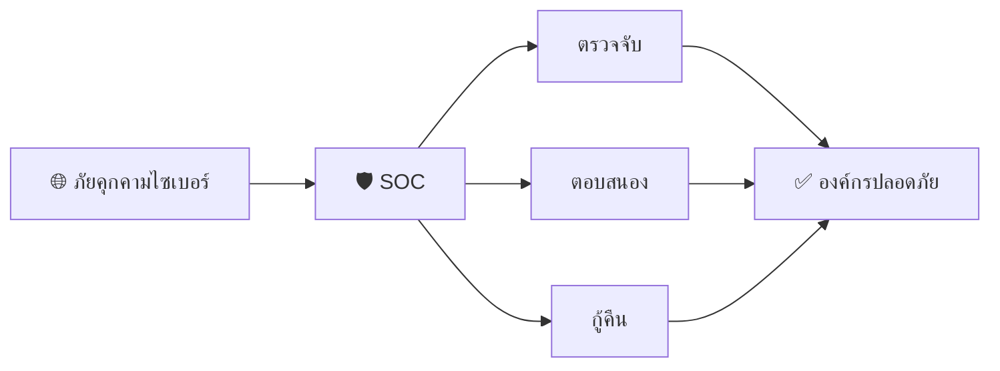
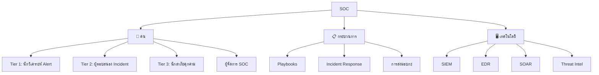
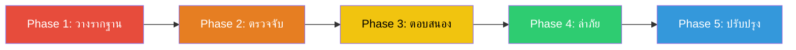

# SOC 101 — ศูนย์ปฏิบัติการความปลอดภัยคืออะไร? (What is a SOC?)

เอกสารนี้อธิบายว่า SOC คืออะไร ทำไมองค์กรถึงจำเป็นต้องมี และต้องทำอย่างไรถึงจะสร้างได้ตั้งแต่เริ่มต้น ไม่ต้องมีความรู้ด้านไซเบอร์ซีเคียวริตี้มาก่อน

## 1. SOC คืออะไร?

**Security Operations Center (SOC)** คือทีมผู้เชี่ยวชาญด้านไซเบอร์ซีเคียวริตี้ที่ทำหน้าที่ **เฝ้าระวัง ตรวจจับ และตอบสนอง** ต่อภัยคุกคามทางไซเบอร์ที่เข้ามาโจมตีองค์กร — ตลอด 24 ชั่วโมง 7 วัน

เปรียบเทียบได้กับ:
-   🏥 **ห้องฉุกเฉินโรงพยาบาล** — แต่รักษา "เหตุการณ์ไซเบอร์" แทนการรักษาผู้ป่วย
-   🚒 **สถานีดับเพลิง** — พร้อมเสมอ เฝ้าดูว่ามี "ไฟ" (การโจมตี) ที่ไหน แล้วตอบสนองทันที
-   🗼 **หอควบคุมการบิน** — เฝ้าดูทุกอย่าง ประสานงานการตอบสนอง ป้องกันหายนะ

### SOC ปกป้องอะไร?
-   **ข้อมูล**: ข้อมูลลูกค้า ข้อมูลการเงิน ทรัพย์สินทางปัญญา
-   **ระบบ**: เซิร์ฟเวอร์ เครือข่าย ระบบ Cloud เครื่องคอมพิวเตอร์พนักงาน
-   **บุคคล**: ปกป้องพนักงานจาก Phishing, Social Engineering, การฉ้อโกง
-   **ธุรกิจ**: รายได้ ชื่อเสียง และการปฏิบัติตามกฎหมาย

## 2. ทำไมองค์กรของคุณถึงต้องมี SOC?

### ความเป็นจริงของภัยคุกคามไซเบอร์
-   **เวลาเฉลี่ยในการตรวจพบการถูกแฮก**: 204 วัน (ถ้าไม่มี SOC)
-   **ค่าเสียหายเฉลี่ยจากข้อมูลรั่วไหล**: 4.45 ล้านเหรียญสหรัฐ (IBM, 2023)
-   **Ransomware**: ทุกๆ 11 วินาที มีธุรกิจถูกโจมตี
-   **กฎหมาย**: PDPA (ไทย), GDPR (ยุโรป), PCI-DSS กำหนดให้ต้องมีการเฝ้าระวัง

### เปรียบเทียบ: มี SOC vs ไม่มี SOC
| สถานการณ์ | ❌ ไม่มี SOC | ✅ มี SOC |
|---|---|---|
| ได้รับ Phishing Email | ไม่มีใครสังเกต → ข้อมูลถูกขโมย | ตรวจพบภายในนาที → บล็อก |
| Ransomware ถูกปล่อย | พบหลังหลายวัน → ระบบถูกเข้ารหัส | ตรวจพบทันที → จำกัดวง |
| มีคนเข้าถึงระบบโดยไม่ได้รับอนุญาต | พบตอน Audit เดือนถัดไป | แจ้งเตือน Real-time → ล็อกบัญชี |
| ข้อมูลรั่วไหล | ไม่รู้จนกว่าจะเป็นข่าว | ตรวจพบจากการเฝ้าระวัง → หยุดทัน |

## 3. องค์ประกอบหลักของ SOC

### 3.1 คน (People) — ใครทำงานใน SOC?

| ตำแหน่ง | หน้าที่ | เปรียบเทียบ |
|---|---|---|
| **Tier 1 Analyst** | ดูหน้าจอ คัดกรอง Alert ส่งต่อภัยจริง | รปภ. ดูกล้องวงจรปิด |
| **Tier 2 Responder** | สืบสวนเชิงลึก จำกัดวงการโจมตี | นักสืบสอบสวนคดี |
| **Tier 3 Hunter** | ล่าภัยคุกคามเชิงรุกที่ซ่อนอยู่ | สายลับติดตามอาชญากร |
| **Detection Engineer** | สร้างและปรับแต่งกฎแจ้งเตือน | ช่างติดตั้งระบบสัญญาณกันขโมย |
| **SOC Manager** | บริหารทีม รายงานผู้บริหาร | ผู้กำกับตำรวจ |

> 📖 **อ่านเพิ่มเติม**: ดู [โครงสร้างทีม SOC](../06_Operations_Management/SOC_Team_Structure.th.md) สำหรับรายละเอียดบทบาท ทักษะที่ต้องการ เส้นทางอาชีพ และจำนวนคนแนะนำ

### 3.2 กระบวนการ (Process) — SOC ทำงานอย่างไร?

| กระบวนการ | วัตถุประสงค์ | เอกสาร |
|---|---|---|
| **Incident Response** | ขั้นตอนรับมือเหตุการณ์โจมตี | [กรอบ IR](../05_Incident_Response/Framework.th.md) |
| **Playbooks** | วิธีรับมือเฉพาะแต่ละประเภทการโจมตี | [20 Playbooks](../05_Incident_Response/Playbooks/) |
| **การส่งมอบกะ** | ส่งต่อข้อมูลระหว่างกะ (24/7) | [มาตรฐานส่งมอบกะ](../06_Operations_Management/Shift_Handoff.th.md) |
| **Detection Engineering** | สร้างกฎตรวจจับพฤติกรรมอันตราย | [วงจรชีวิตการตรวจจับ](../03_User_Guides/Content_Management.th.md) |
| **การรายงาน** | แสดงผลงาน SOC ให้ผู้บริหาร | [รายงานประจำเดือน](../11_Reporting_Templates/Monthly_SOC_Report.th.md) |

### 3.3 เทคโนโลยี (Technology) — SOC ใช้เครื่องมืออะไร?

| เครื่องมือ | หน้าที่ | Open Source (ฟรี) | Commercial (เสียเงิน) |
|---|---|---|---|
| **SIEM** | รวม Log ทั้งหมด จับ Pattern สร้าง Alert | Wazuh, Elastic SIEM | Splunk, Microsoft Sentinel |
| **EDR** | เฝ้าดูเครื่อง Endpoint หามัลแวร์ | Wazuh, Velociraptor | CrowdStrike, SentinelOne |
| **SOAR** | ทำงาน SOC ซ้ำๆ อัตโนมัติ | TheHive + Cortex, Shuffle | Splunk SOAR, Palo Alto XSOAR |
| **Threat Intel** | ติดตาม IP, โดเมน, ไฟล์อันตราย | MISP, OpenCTI | Recorded Future, Mandiant |
| **Ticketing** | ติดตาม Incident ตั้งแต่ต้นจนจบ | TheHive, RTIR | ServiceNow, Jira |
| **Network Monitor** | ดู Traffic เครือข่ายหาความผิดปกติ | Zeek, Suricata | Darktrace, ExtraHop |

## 4. วิธีสร้าง SOC — เส้นทาง 5 ขั้น

### Phase 1: วางรากฐาน (เดือน 1-3) — "คลาน"
**เป้าหมาย**: มองเห็นว่าเกิดอะไรขึ้นในระบบ

- [ ] เลือกและติดตั้ง SIEM (เริ่มจาก Wazuh ถ้างบจำกัด)
- [ ] ระบุ 10 ทรัพย์สินสำคัญที่สุด (เซิร์ฟเวอร์, ฐานข้อมูล, บัญชี Cloud)
- [ ] นำเข้า Log: Firewall, Active Directory, Email, VPN
- [ ] จ้าง Tier 1 Analyst 2-3 คน + SOC Manager 1 คน
- [ ] ตั้งระบบ Ticketing (TheHive หรือ Jira)
- [ ] กำหนดขั้นตอนการ Escalate เบื้องต้น

> 📖 อ่าน: [การติดตั้ง SOC](../01_Onboarding/System_Activation.th.md)

### Phase 2: ตรวจจับ (เดือน 3-6) — "เดิน"
**เป้าหมาย**: สร้างกฎแจ้งเตือนที่ตรวจจับการโจมตีจริง

- [ ] ใช้ 10 Detection Rules แรก (เริ่มจาก [Sigma Rules ของเรา](../07_Detection_Rules/))
- [ ] สร้าง 5 Playbook แรก (Phishing, Malware, Brute Force, Account Compromise, Ransomware)
- [ ] เปิดใช้กฎตรวจจับสำหรับแต่ละ MITRE ATT&CK Tactic
- [ ] ปรับแต่งกฎให้ลด False Positive ต่ำกว่า 30%
- [ ] จัดตารางกะ (เริ่มจาก 8x5, ขยายเป็น 24x7 ทีหลัง)

> 📖 อ่าน: [วงจรชีวิตวิศวกรรมการตรวจจับ](../03_User_Guides/Content_Management.th.md)

### Phase 3: ตอบสนอง (เดือน 6-12) — "วิ่ง"
**เป้าหมาย**: ตอบสนองต่อ Incident จริงได้อย่างมีประสิทธิภาพ

- [ ] ใช้ Playbook ทั้ง 20 ชุดจาก Repository นี้
- [ ] จ้าง Tier 2 Incident Responders
- [ ] ติดตั้ง EDR บนทุก Endpoint
- [ ] จัด Purple Team ครั้งแรก ([Simulation Guide](../08_Simulation_Testing/Simulation_Guide.md))
- [ ] เริ่มวัด KPI: MTTD, MTTR, False Positive Rate
- [ ] ส่งรายงานรายเดือนให้ผู้บริหาร

> 📖 อ่าน: [ตัวชี้วัด SOC](../06_Operations_Management/SOC_Metrics.th.md)

### Phase 4: ล่าภัย (ปี 1-2) — "วิ่งเร็ว"
**เป้าหมาย**: ค้นหาภัยคุกคามเชิงรุกที่หลุดจากการตรวจจับ

- [ ] จ้างหรือฝึก Tier 3 Threat Hunter
- [ ] ติดตั้ง Threat Intelligence Feed (MISP/OpenCTI)
- [ ] แมป Detection Coverage กับ MITRE ATT&CK
- [ ] จัด Threat Hunting Campaign ทุกไตรมาส
- [ ] ติดตั้ง SOAR สำหรับ Automated Response

> 📖 อ่าน: [วงจรชีวิต Threat Intelligence](../06_Operations_Management/Threat_Intelligence_Lifecycle.th.md)

### Phase 5: ปรับปรุง (ปี 2+) — "บิน"
**เป้าหมาย**: วัดผล ปรับปรุง และพัฒนาอย่างต่อเนื่อง

- [ ] บรรลุ SOC-CMM Level 3+
- [ ] ทำ Automation ให้ Tier 1 Triage 80%+
- [ ] ใช้ Detection-as-Code (CI/CD สำหรับกฎ)
- [ ] จัด SOC Assessment ประจำปี ([แบบประเมิน](../06_Operations_Management/SOC_Assessment_Checklist.th.md))
- [ ] ส่งรายงานรายไตรมาสให้ผู้บริหาร

## 5. งบประมาณโดยประมาณ

| ขนาด SOC | จำนวนคน | ค่าเครื่องมือ (ต่อปี) | รวมปีแรก |
|---|---|---|---|
| **เล็ก** (Open Source, 8x5) | 3-5 คน | $0-20K | ~$150K-250K |
| **กลาง** (ผสม, 16x5) | 6-10 คน | $50K-150K | ~$500K-800K |
| **ใหญ่** (Commercial, 24x7) | 12-20 คน | $200K-500K | ~$1.5M-3M |

> **เคล็ดลับ**: เริ่มเล็กๆ ด้วยเครื่องมือ Open Source ค่อยอัปเกรดเมื่อ SOC เติบโต

## 6. วิธีใช้ Repository นี้

| # | เริ่มตรงนี้ | เอกสาร |
|---|---|---|
| 1 | 📖 คุณอยู่ตรงนี้ | **SOC 101** (เอกสารนี้) |
| 2 | 👥 สร้างทีม | [โครงสร้างทีม SOC](../06_Operations_Management/SOC_Team_Structure.th.md) |
| 3 | 🏗️ ติดตั้งโครงสร้างพื้นฐาน | [การติดตั้ง SOC](../01_Onboarding/System_Activation.th.md) |
| 4 | 📋 เรียนรู้กระบวนการ IR | [กรอบ Incident Response](../05_Incident_Response/Framework.th.md) |
| 5 | 📕 ศึกษา Playbook | [PB-01 Phishing](../05_Incident_Response/Playbooks/Phishing.th.md) (เริ่มที่นี่) |
| 6 | 🔍 Deploy Detection Rules | [Detection Rules](../07_Detection_Rules/) |
| 7 | ⏰ จัดระบบกะ | [มาตรฐานส่งมอบกะ](../06_Operations_Management/Shift_Handoff.th.md) |
| 8 | 📊 วัด KPI | [ตัวชี้วัด SOC](../06_Operations_Management/SOC_Metrics.th.md) |
| 9 | 🎯 จำลองการโจมตี | [Simulation Guide](../08_Simulation_Testing/Simulation_Guide.md) |
| 10 | 🎓 ฝึกอบรม Analyst ใหม่ | [หลักสูตร Analyst](../09_Training_Onboarding/Analyst_Onboarding_Path.th.md) |

## เอกสารที่เกี่ยวข้อง (Related Documents)
-   [คู่มือเริ่มต้นด่วน](Quickstart_Guide.th.md)
-   [คำศัพท์สำคัญ](Glossary.th.md)
-   [โครงสร้างทีม SOC](../06_Operations_Management/SOC_Team_Structure.th.md)
-   [การติดตั้ง SOC](../01_Onboarding/System_Activation.th.md)

## References
-   [NIST Cybersecurity Framework (CSF)](https://www.nist.gov/cyberframework)
-   [CISA — Setting Up a SOC](https://www.cisa.gov/topics/cyber-threats-and-advisories)
-   [SOC-CMM — SOC Capability Maturity Model](https://www.soc-cmm.com/)
-   [MITRE ATT&CK Framework](https://attack.mitre.org/)
-   [IBM Cost of a Data Breach Report](https://www.ibm.com/reports/data-breach)
-   [SANS SOC Survey](https://www.sans.org/white-papers/soc-survey/)
