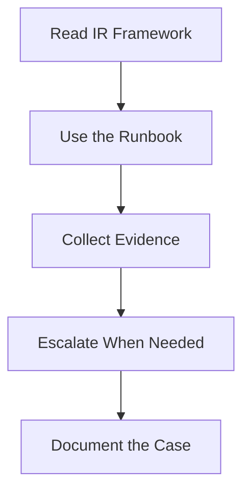

# SOC Analyst Entry Path

**Audience**: Tier 1 Analyst, Tier 2 Analyst, Junior Responder
**Purpose**: Use this guide to understand what to do first during live alerts and how to work safely inside the SOC process.

## 1. Start Here

-   [ ] Confirm the alert category, severity, and assigned owner.
-   [ ] Open the relevant runbook or playbook before taking irreversible actions.
-   [ ] Confirm the evidence sources available before making conclusions.

## 2. Read These Documents First

-   [ ] Review [IR Framework](../05_Incident_Response/Framework.en.md) to understand the response flow.
-   [ ] Review [Tier 1 Runbook](../05_Incident_Response/Runbooks/Tier1_Runbook.en.md) for alert triage expectations.
-   [ ] Review [Evidence Collection](../05_Incident_Response/Evidence_Collection.en.md) before gathering or exporting artifacts.
-   [ ] Review [Incident Classification](../05_Incident_Response/Incident_Classification.en.md) to apply the correct incident type.

## 3. Non-Negotiables

-   [ ] Preserve logs, timestamps, and artifacts before containment changes evidence.
-   [ ] Escalate immediately when the playbook or decision matrix says to escalate.
-   [ ] Record what you checked, what you found, and what you could not verify.
-   [ ] Do not close a case without documenting the reason and confidence level.

## 4. Minimum Outputs Per Case

-   [ ] A concise case summary with affected user, asset, and suspected activity.
-   [ ] Evidence references for the key logs, screenshots, or exported artifacts used in the decision.
-   [ ] A documented escalation or closure reason tied to the playbook decision path.
-   [ ] A short note on missing telemetry or unresolved uncertainty.

## 5. Daily Improvement Focus

-   [ ] Review one recent false positive and identify how it should have been recognized sooner.
-   [ ] Review one escalation that went well and one that should have happened faster.
-   [ ] Review one playbook or use case each week to improve pattern recognition.

## 6. Operating Reviews You Should Attend

| Review | Cadence | Why You Attend | What You Should Bring |
|:---|:---|:---|:---|
| **Shift Handoff** | Every shift | Transfer live case context and queue risk cleanly | Open cases, blockers, pending actions, and owner changes |
| **Weekly Detection Review** | Weekly | Share where false positives, missed signals, or noisy use cases are hurting triage | Examples of noisy alerts, missed context, and analyst pain points |
| **Weekly Telemetry Review** | Weekly when needed | Surface data gaps that blocked investigation or delayed confidence | Missing logs, broken fields, timestamp issues, and affected use cases |
| **Training / Readiness Review** | Weekly during onboarding | Confirm readiness for more independent handling | Ticket samples, escalation quality, and checklist progress |

## 7. Metrics and Signals You Should Watch

| Metric or Signal | Why It Matters | Escalate When |
|:---|:---|:---|
| **Alert response time (MTTA)** | Shows whether you are keeping pace with incoming work | Priority alerts wait past team threshold |
| **Case aging / stalled tickets** | Shows whether work is getting stuck without movement | A case has no meaningful update by the next handoff |
| **False positive repetition** | Shows whether the same benign pattern is wasting analyst time | Same pattern appears repeatedly without tuning follow-up |
| **Missing evidence or telemetry** | Shows whether you are deciding with weak visibility | You cannot confirm or dismiss a case because required data is absent |
| **Escalation hesitation** | Shows whether uncertainty is being left in queue too long | You are still unsure after the runbook time limit or playbook threshold |

## 8. Decisions You Personally Own

-   [ ] Decide when the available evidence is strong enough to close a case versus escalate it.
-   [ ] Decide when a missing log, unclear artifact, or timeline gap is important enough to record explicitly.
-   [ ] Decide when a case needs faster escalation because business context, severity, or uncertainty increased.
-   [ ] Decide which recurring false positives or playbook pain points should be fed into weekly review.

## 9. Analyst-to-Tier-2 Handoff Path

| Handoff Trigger | What Tier 1 Must Finish First | What Tier 2 Must Receive |
|:---|:---|:---|
| **Runbook time limit exceeded** | Record what was checked and what remains unclear | Alert summary, evidence reviewed, and unresolved questions |
| **Playbook says escalate** | Confirm severity, asset/user context, and decision point hit | Playbook reference, trigger condition, and current risk statement |
| **Priority asset or privileged user involved** | Verify business context and owner if known | Asset/user importance, impact concern, and current containment status |
| **Missing telemetry blocks decision** | Record exactly which data source or field is missing | Gap description, affected use case, and confidence limitation |

## 10. Minimum Handoff Packet From Analyst

-   [ ] Ticket summary stating what happened, what is suspected, and why it matters.
-   [ ] Evidence references for the key logs, screenshots, queries, or exported artifacts already reviewed.
-   [ ] A short timeline of alert, triage, pivots performed, and escalation time.
-   [ ] A clear statement of what you know, what you do not know, and what Tier 2 should check next.

## Related Documents

-   [Tier 1 Runbook](../05_Incident_Response/Runbooks/Tier1_Runbook.en.md)
-   [Evidence Collection](../05_Incident_Response/Evidence_Collection.en.md)
-   [Incident Classification](../05_Incident_Response/Incident_Classification.en.md)
-   [Phishing Playbook](../05_Incident_Response/Playbooks/Phishing.en.md)
-   [Shift Handoff](../06_Operations_Management/Shift_Handoff.en.md)
-   [Weekly Detection Review Pack](../11_Reporting_Templates/Weekly_Detection_Review_Pack.en.md)
-   [Training Checklist](../10_Training_Onboarding/Training_Checklist.en.md)
-   [Tier 2 Runbook](../05_Incident_Response/Runbooks/Tier2_Runbook.en.md)

## References

-   [NIST SP 800-61 Rev. 2](https://csrc.nist.gov/publications/detail/sp/800-61/rev-2/final)
-   [MITRE ATT&CK](https://attack.mitre.org/)
