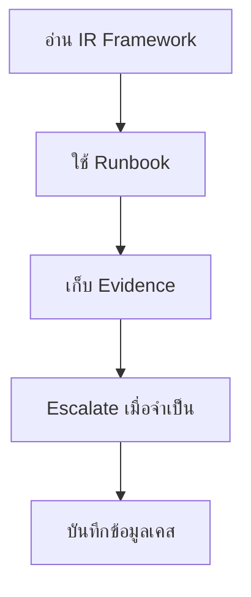

# เส้นทางเริ่มต้นสำหรับ SOC Analyst

**กลุ่มเป้าหมาย**: Tier 1 Analyst, Tier 2 Analyst, Junior Responder
**วัตถุประสงค์**: ใช้คู่มือนี้เพื่อเข้าใจว่าต้องเริ่มต้นอย่างไรเมื่อมี live alert และทำงานภายใต้กระบวนการของ SOC อย่างปลอดภัย

## 1. จุดเริ่มต้น

-   [ ] ยืนยันประเภทของ alert ระดับความรุนแรง และ owner ของเคส
-   [ ] เปิด runbook หรือ playbook ที่เกี่ยวข้องก่อนทำ action ที่ย้อนกลับไม่ได้
-   [ ] ยืนยันแหล่ง evidence ที่มีอยู่ก่อนสรุปผล

## 2. เอกสารที่ควรอ่านก่อน

-   [ ] อ่าน [IR Framework](../05_Incident_Response/Framework.th.md) เพื่อเข้าใจ flow การตอบสนอง
-   [ ] อ่าน [Tier 1 Runbook](../05_Incident_Response/Runbooks/Tier1_Runbook.th.md) เพื่อเข้าใจมาตรฐานการ triage alert
-   [ ] อ่าน [Evidence Collection](../05_Incident_Response/Evidence_Collection.th.md) ก่อนรวบรวมหรือ export artifacts
-   [ ] อ่าน [Incident Classification](../05_Incident_Response/Incident_Classification.th.md) เพื่อเลือก incident type ให้ถูกต้อง

## 3. สิ่งที่ห้ามข้าม

-   [ ] เก็บ logs, timestamps, และ artifacts ก่อนที่การ containment จะทำให้หลักฐานเปลี่ยนไป
-   [ ] escalate ทันทีเมื่อ playbook หรือ decision matrix ระบุว่าต้องส่งต่อ
-   [ ] บันทึกให้ชัดว่าตรวจอะไร พบอะไร และอะไรที่ยังยืนยันไม่ได้
-   [ ] ห้ามปิดเคสโดยไม่บันทึกเหตุผลและระดับความเชื่อมั่น

## 4. ผลลัพธ์ขั้นต่ำต่อหนึ่งเคส

-   [ ] สรุปเคสแบบสั้นที่ระบุ affected user, asset, และกิจกรรมที่สงสัย
-   [ ] อ้างอิง evidence สำหรับ log, screenshot, หรือ artifact สำคัญที่ใช้ตัดสินใจ
-   [ ] บันทึกเหตุผลของการ escalate หรือปิดเคส โดยโยงกับ decision path ของ playbook
-   [ ] บันทึกสั้น ๆ ว่ามี telemetry อะไรขาดหรือมีความไม่แน่ชัดใดค้างอยู่

## 5. จุดโฟกัสเพื่อพัฒนาในแต่ละวัน

-   [ ] ทบทวน false positive อย่างน้อยหนึ่งเคสและระบุว่าควรสังเกตให้เร็วขึ้นอย่างไร
-   [ ] ทบทวนหนึ่งเคสที่ escalate ได้ดีและอีกหนึ่งเคสที่ควร escalate เร็วกว่านี้
-   [ ] ทบทวนอย่างน้อยหนึ่ง playbook หรือ use case ต่อสัปดาห์เพื่อเพิ่ม pattern recognition

## 6. วงประชุมที่คุณควรเข้าร่วม

| วงประชุม | ความถี่ | เหตุผลที่ควรเข้าร่วม | สิ่งที่คุณควรนำเข้าไป |
|:---|:---|:---|:---|
| **Shift Handoff** | ทุกกะ | ส่งต่อบริบทของเคสที่ยังเปิดและความเสี่ยงใน queue ให้สะอาด | open cases, blockers, pending actions, และ owner changes |
| **Weekly Detection Review** | รายสัปดาห์ | สะท้อนว่า false positives, missed signals, หรือ use case ที่ noisy กำลังกระทบ triage อย่างไร | ตัวอย่าง alert ที่ noisy, context ที่พลาด, และ pain points ของ analyst |
| **Weekly Telemetry Review** | รายสัปดาห์เมื่อจำเป็น | แจ้ง data gaps ที่บล็อกการสืบสวนหรือทำให้ความมั่นใจในการตัดสินใจต่ำ | logs ที่ขาด, fields ที่เสีย, timestamp issues, และ use case ที่ได้รับผลกระทบ |
| **Training / Readiness Review** | รายสัปดาห์ช่วง onboarding | ยืนยันความพร้อมสำหรับการทำงานแบบอิสระมากขึ้น | ticket samples, คุณภาพการ escalate, และความคืบหน้าตาม checklist |

## 7. Metrics และสัญญาณที่คุณควรดู

| Metric หรือสัญญาณ | ทำไมจึงสำคัญ | ต้อง escalate เมื่อ |
|:---|:---|:---|
| **Alert response time (MTTA)** | บอกว่าคุณยังตาม workload ทันหรือไม่ | priority alerts รอเกิน threshold ของทีม |
| **case aging / tickets ที่ค้าง** | บอกว่างานกำลังติดค้างโดยไม่มีความคืบหน้าหรือไม่ | เคสไม่มี meaningful update จนถึง handoff ถัดไป |
| **false positive ซ้ำรูปแบบเดิม** | บอกว่า benign pattern เดิมกำลังเปลืองเวลา analyst หรือไม่ | pattern เดิมกลับมาเรื่อย ๆ โดยยังไม่มี tuning follow-up |
| **missing evidence หรือ telemetry** | บอกว่าคุณกำลังตัดสินใจบน visibility ที่อ่อนหรือไม่ | ยืนยันหรือปฏิเสธเคสไม่ได้เพราะข้อมูลที่ต้องใช้ไม่มี |
| **ความลังเลในการ escalate** | บอกว่าความไม่แน่ใจกำลังค้างอยู่ใน queue นานเกินไปหรือไม่ | ยังไม่มั่นใจหลังเกินเวลาที่ runbook หรือ playbook กำหนด |

## 8. การตัดสินใจที่คุณเป็นเจ้าของโดยตรง

-   [ ] ตัดสินใจว่า evidence ที่มีอยู่พอสำหรับการปิดเคสแล้วหรือควร escalate
-   [ ] ตัดสินใจว่า log ที่ขาด artifact ที่ไม่ชัด หรือ timeline gap ใดควรถูกบันทึกไว้ชัดเจน
-   [ ] ตัดสินใจว่าเมื่อใดเคสควรถูก escalate เร็วขึ้นเพราะ business context, severity, หรือความไม่แน่ใจเพิ่มขึ้น
-   [ ] ตัดสินใจว่าประเด็น false positive ซ้ำหรือ playbook pain points ใดควรถูกส่งเข้า weekly review

## 9. เส้นทางการส่งต่อจาก Analyst ไป Tier 2

| Trigger ที่ต้องส่งต่อ | สิ่งที่ Tier 1 ต้องทำให้เสร็จก่อน | สิ่งที่ Tier 2 ต้องได้รับ |
|:---|:---|:---|
| **เกินเวลาที่ runbook กำหนด** | บันทึกสิ่งที่ตรวจแล้วและสิ่งที่ยังไม่ชัด | alert summary, evidence ที่ดูแล้ว, และคำถามที่ยังค้าง |
| **playbook ระบุว่าต้อง escalate** | ยืนยัน severity, บริบทของ asset/user, และ decision point ที่ชน | playbook reference, trigger condition, และ risk statement ปัจจุบัน |
| **เกี่ยวข้องกับ priority asset หรือ privileged user** | ยืนยัน business context และ owner ถ้าทราบ | ความสำคัญของ asset/user, ข้อกังวลด้าน impact, และสถานะ containment ปัจจุบัน |
| **ขาด telemetry จนตัดสินใจไม่ได้** | บันทึกให้ชัดว่าขาด data source หรือ field ใด | คำอธิบาย gap, use case ที่ได้รับผลกระทบ, และข้อจำกัดด้านความเชื่อมั่น |

## 10. ชุดข้อมูลขั้นต่ำที่ Analyst ต้องส่งต่อ

-   [ ] ticket summary ที่บอกว่าเกิดอะไรขึ้น สงสัยอะไร และทำไมจึงสำคัญ
-   [ ] evidence references สำหรับ logs, screenshots, queries, หรือ artifacts สำคัญที่ดูแล้ว
-   [ ] timeline สั้น ๆ ของ alert, triage, pivots ที่ทำ, และเวลาที่ส่งต่อ
-   [ ] คำอธิบายที่ชัดว่าอะไรคือสิ่งที่รู้แล้ว อะไรคือสิ่งที่ยังไม่รู้ และ Tier 2 ควรตรวจอะไรต่อ

## เอกสารที่เกี่ยวข้อง (Related Documents)

-   [Tier 1 Runbook](../05_Incident_Response/Runbooks/Tier1_Runbook.th.md)
-   [Evidence Collection](../05_Incident_Response/Evidence_Collection.th.md)
-   [Incident Classification](../05_Incident_Response/Incident_Classification.th.md)
-   [Phishing Playbook](../05_Incident_Response/Playbooks/Phishing.th.md)
-   [Shift Handoff](../06_Operations_Management/Shift_Handoff.th.md)
-   [Weekly Detection Review Pack](../11_Reporting_Templates/Weekly_Detection_Review_Pack.th.md)
-   [Training Checklist](../10_Training_Onboarding/Training_Checklist.th.md)
-   [Tier 2 Runbook](../05_Incident_Response/Runbooks/Tier2_Runbook.th.md)

## References

-   [NIST SP 800-61 Rev. 2](https://csrc.nist.gov/publications/detail/sp/800-61/rev-2/final)
-   [MITRE ATT&CK](https://attack.mitre.org/)
