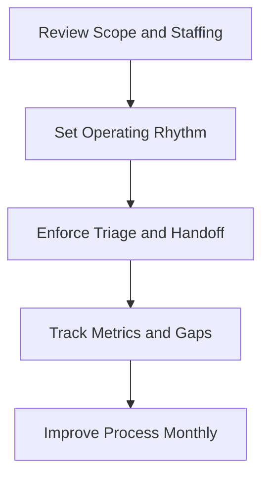

# SOC Manager Entry Path

**Audience**: SOC Manager, SOC Lead, Shift Manager
**Purpose**: Use this guide to run the SOC day to day, set cadence, and enforce quality.

## 1. Start Here

-   [ ] Confirm the SOC service scope, staffing model, and escalation authority.
-   [ ] Confirm which use cases, log sources, and playbooks are in active production.
-   [ ] Confirm shift coverage, queue ownership, and manager-on-call expectations.

## 2. Read These Documents First

-   [ ] Review [SOC Team Structure](../06_Operations_Management/SOC_Team_Structure.en.md) to confirm role boundaries.
-   [ ] Review [Shift Handoff](../06_Operations_Management/Shift_Handoff.en.md) to standardize shift turnover.
-   [ ] Review [SOC Checklists](../06_Operations_Management/SOC_Checklists.en.md) to enforce minimum operational quality.
-   [ ] Review [SOC Metrics](../06_Operations_Management/SOC_Metrics.en.md) to align on measurement and review cadence.

## 3. Decisions You Own

-   [ ] Decide queue priorities, staffing allocation, and escalation duty coverage.
-   [ ] Decide when recurring false positives justify tuning work or engineering backlog.
-   [ ] Decide when an alert handling issue becomes a process failure instead of a single-case error.
-   [ ] Decide which unresolved gaps need executive escalation, additional training, or staffing changes.

## 4. Minimum Outputs Expected From the Team

-   [ ] A complete shift handoff with open cases, risks, blockers, and owner changes.
-   [ ] A weekly review of missed alerts, delayed escalations, and alert quality trends.
-   [ ] A monthly action list for tuning, onboarding, and process improvements.
-   [ ] Updated training status for every analyst not yet ready for independent shift work.

## 5. Operating Rhythm

-   [ ] Review priority queues and aging cases daily.
-   [ ] Review detection quality, handoff quality, and telemetry gaps weekly.
-   [ ] Review staffing capacity, escalation quality, and roadmap blockers monthly.
-   [ ] Review service scope and stakeholder satisfaction quarterly.

## 6. Operating Reviews You Should Run

| Review | Cadence | Why You Run It | What You Should Decide |
|:---|:---|:---|:---|
| **Weekly Detection Review** | Weekly | Keep detection backlog, tuning, and missed detections under control | Tune, deploy, defer, or escalate |
| **Weekly Telemetry Review** | Weekly | Keep telemetry health and onboarding aligned with detection needs | Fix, reprioritize, workaround, or escalate |
| **Monthly Remediation Review** | Monthly | Keep incident and audit actions moving to closure | Reassign, reopen, accept risk path, or escalate |
| **Monthly Governance Review** | Monthly | Present service quality, overdue actions, and decisions needing leadership | Approve recovery plan, escalation, or executive decision |

## 7. Metrics You Should Watch

| Metric or Signal | Why It Matters | Escalate When |
|:---|:---|:---|
| **Queue aging and unowned cases** | Shows whether analysts can keep up with live workload | Aging exceeds internal threshold for two review cycles |
| **False positive pressure** | Shows whether analyst time is being wasted | Same use case drives repeated weekly disruption |
| **Delayed escalations / missed alerts** | Shows workflow or quality failure | Pattern appears across multiple shifts or incident types |
| **Telemetry blockers** | Shows whether engineering gaps are slowing operations | Critical source or parser issue blocks priority detections |
| **Analyst readiness / staffing utilization** | Shows burnout and coverage risk | Utilization stays high or skill gap blocks shift independence |

## 8. Decisions You Personally Own

-   [ ] Approve queue reprioritization, tuning urgency, and staffing reallocations.
-   [ ] Decide when a recurring issue becomes an engineering, process, or training problem.
-   [ ] Decide which operational gaps move into governance review instead of staying inside the team.
-   [ ] Decide when to request executive support for headcount, tooling, or service-scope change.

## Related Documents

-   [Shift Handoff](../06_Operations_Management/Shift_Handoff.en.md)
-   [SOC Checklists](../06_Operations_Management/SOC_Checklists.en.md)
-   [SOC Metrics](../06_Operations_Management/SOC_Metrics.en.md)
-   [SOC Onboarding](../10_Training_Onboarding/SOC_Onboarding.en.md)
-   [Weekly Detection Review Pack](../11_Reporting_Templates/Weekly_Detection_Review_Pack.en.md)
-   [Weekly Telemetry Review Pack](../11_Reporting_Templates/Weekly_Telemetry_Review_Pack.en.md)
-   [Monthly Governance Review Pack](../11_Reporting_Templates/Monthly_Governance_Review_Pack.en.md)

## References

-   [NIST SP 800-61 Rev. 2](https://csrc.nist.gov/publications/detail/sp/800-61/rev-2/final)
-   [SANS 2024 SOC Survey](https://www.sans.org/white-papers/sans-2024-soc-survey/)
