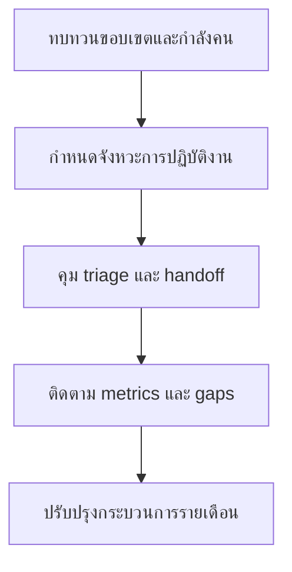

# เส้นทางเริ่มต้นสำหรับ SOC Manager

**กลุ่มเป้าหมาย**: SOC Manager, SOC Lead, Shift Manager
**วัตถุประสงค์**: ใช้คู่มือนี้เพื่อบริหาร SOC ในแต่ละวัน กำหนด cadence การทำงาน และควบคุมคุณภาพการปฏิบัติการ

## 1. จุดเริ่มต้น

-   [ ] ยืนยันขอบเขตบริการของ SOC รูปแบบกำลังคน และอำนาจในการ escalate
-   [ ] ยืนยันว่า use case, log source, และ playbook ใดอยู่ใน production จริง
-   [ ] ยืนยัน shift coverage, queue ownership, และ manager-on-call expectations

## 2. เอกสารที่ควรอ่านก่อน

-   [ ] อ่าน [SOC Team Structure](../06_Operations_Management/SOC_Team_Structure.th.md) เพื่อยืนยันขอบเขตหน้าที่ของแต่ละ role
-   [ ] อ่าน [Shift Handoff](../06_Operations_Management/Shift_Handoff.th.md) เพื่อทำให้การส่งมอบงานระหว่างกะเป็นมาตรฐานเดียวกัน
-   [ ] อ่าน [SOC Checklists](../06_Operations_Management/SOC_Checklists.th.md) เพื่อคุมคุณภาพขั้นต่ำของงานปฏิบัติการ
-   [ ] อ่าน [SOC Metrics](../06_Operations_Management/SOC_Metrics.th.md) เพื่อให้การวัดผลและรอบทบทวนสอดคล้องกัน

## 3. การตัดสินใจที่คุณเป็นเจ้าของ

-   [ ] ตัดสินใจเรื่องลำดับความสำคัญของ queue, การจัดคน, และ coverage ของ escalation duty
-   [ ] ตัดสินใจว่า false positive ที่เกิดซ้ำควรกลายเป็นงาน tuning หรือ engineering backlog เมื่อใด
-   [ ] ตัดสินใจว่าปัญหาในการจัดการ alert ใดเป็น process failure ไม่ใช่แค่ความผิดพลาดของเคสเดียว
-   [ ] ตัดสินใจว่าช่องว่างใดต้องยกระดับไปผู้บริหาร ต้องเพิ่มการฝึก หรือปรับ staffing

## 4. ผลลัพธ์ขั้นต่ำที่ทีมต้องส่งมอบ

-   [ ] shift handoff ที่ครบถ้วน พร้อม open cases, risks, blockers, และการเปลี่ยน owner
-   [ ] การทบทวนรายสัปดาห์ของ missed alerts, delayed escalations, และแนวโน้ม alert quality
-   [ ] action list รายเดือนสำหรับ tuning, onboarding, และ process improvements
-   [ ] สถานะการฝึกอบรมล่าสุดของ analyst ทุกคนที่ยังไม่พร้อมทำงานกะอย่างอิสระ

## 5. จังหวะการปฏิบัติงาน

-   [ ] ทบทวน priority queues และเคสที่ค้างเกินเวลาในทุกวัน
-   [ ] ทบทวน detection quality, handoff quality, และ telemetry gaps รายสัปดาห์
-   [ ] ทบทวน staffing capacity, escalation quality, และ roadmap blockers รายเดือน
-   [ ] ทบทวน service scope และ stakeholder satisfaction รายไตรมาส

## 6. วงประชุมที่คุณควรเป็นเจ้าภาพ

| วงประชุม | ความถี่ | เหตุผลที่คุณต้องคุม | สิ่งที่คุณควรตัดสินใจ |
|:---|:---|:---|:---|
| **Weekly Detection Review** | รายสัปดาห์ | คุม detection backlog, tuning, และ missed detections | tune, deploy, defer, หรือ escalate |
| **Weekly Telemetry Review** | รายสัปดาห์ | คุม telemetry health และ onboarding ให้สอดคล้องกับ detection needs | fix, reprioritize, workaround, หรือ escalate |
| **Monthly Remediation Review** | รายเดือน | คุม incident และ audit actions ให้ไปสู่ closure | reassign, reopen, risk path, หรือ escalate |
| **Monthly Governance Review** | รายเดือน | นำเสนอ service quality, overdue actions, และประเด็นที่ต้องใช้การตัดสินใจจากผู้บริหาร | อนุมัติ recovery plan, escalation, หรือ executive decision |

## 7. Metrics ที่คุณควรดู

| Metric หรือสัญญาณ | ทำไมจึงสำคัญ | ต้อง escalate เมื่อ |
|:---|:---|:---|
| **queue aging และเคสที่ไม่มี owner** | บอกว่าทีมตาม workload ทันหรือไม่ | aging เกิน threshold ภายใน 2 รอบทบทวน |
| **false positive pressure** | บอกว่า analyst time กำลังสูญเปล่าหรือไม่ | use case เดิมสร้างภาระซ้ำหลายสัปดาห์ |
| **delayed escalations / missed alerts** | บอกว่ามี workflow หรือ quality failure หรือไม่ | pattern เกิดซ้ำข้ามหลายกะหรือหลาย incident type |
| **telemetry blockers** | บอกว่าช่องว่างฝั่งวิศวกรรมกำลังกระทบ operations หรือไม่ | critical source หรือ parser issue บล็อก priority detections |
| **analyst readiness / staffing utilization** | บอกความเสี่ยงเรื่อง burnout และ coverage | utilization สูงต่อเนื่องหรือ skill gap ยังบล็อก shift independence |

## 8. การตัดสินใจที่คุณเป็นเจ้าของโดยตรง

-   [ ] อนุมัติการ reprioritize queue, tuning urgency, และ staffing reallocations
-   [ ] ตัดสินใจว่าปัญหาที่เกิดซ้ำเป็น engineering, process, หรือ training problem
-   [ ] ตัดสินใจว่าช่องว่างใดควรถูกยกระดับไป governance review แทนที่จะค้างอยู่ในทีม
-   [ ] ตัดสินใจเมื่อใดควรขอการสนับสนุนจากผู้บริหารด้าน headcount, tooling, หรือ service-scope change

## เอกสารที่เกี่ยวข้อง (Related Documents)

-   [Shift Handoff](../06_Operations_Management/Shift_Handoff.th.md)
-   [SOC Checklists](../06_Operations_Management/SOC_Checklists.th.md)
-   [SOC Metrics](../06_Operations_Management/SOC_Metrics.th.md)
-   [SOC Onboarding](../10_Training_Onboarding/SOC_Onboarding.th.md)
-   [Weekly Detection Review Pack](../11_Reporting_Templates/Weekly_Detection_Review_Pack.th.md)
-   [Weekly Telemetry Review Pack](../11_Reporting_Templates/Weekly_Telemetry_Review_Pack.th.md)
-   [Monthly Governance Review Pack](../11_Reporting_Templates/Monthly_Governance_Review_Pack.th.md)

## References

-   [NIST SP 800-61 Rev. 2](https://csrc.nist.gov/publications/detail/sp/800-61/rev-2/final)
-   [SANS 2024 SOC Survey](https://www.sans.org/white-papers/sans-2024-soc-survey/)
