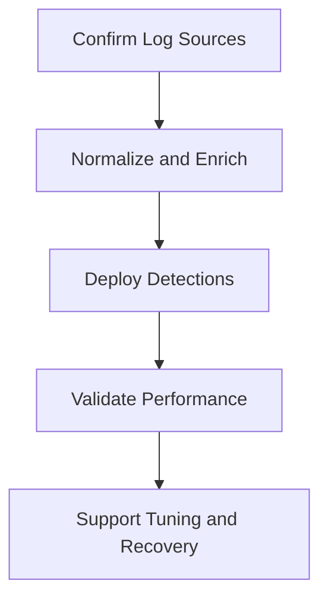

# Security Engineer Entry Path

**Audience**: Security Engineer, Detection Engineer, SOC Platform Engineer
**Purpose**: Use this guide to prioritize telemetry, integrations, detections, and production readiness.

## 1. Start Here

-   [ ] Confirm the required telemetry for the priority use cases.
-   [ ] Confirm data quality, retention, and enrichment coverage before deploying detections.
-   [ ] Confirm ownership for integrations, pipelines, and production rollback.

## 2. Read These Documents First

-   [ ] Review [Log Source Matrix](../06_Operations_Management/Log_Source_Matrix.en.md) to confirm required coverage.
-   [ ] Review [Integration Hub](../03_User_Guides/Integration_Hub.en.md) to align on integration handling.
-   [ ] Review [Deployment Procedures](../02_Platform_Operations/Deployment_Procedures.en.md) before pushing production changes.
-   [ ] Review [SOC Use Case Library](../08_Detection_Engineering/SOC_Use_Case_Library.en.md) to map engineering work to detection outcomes.

## 3. Decisions You Own

-   [ ] Decide which telemetry gaps block production readiness and which can be accepted temporarily.
-   [ ] Decide how detections are tuned, validated, and rolled back.
-   [ ] Decide when parser, normalization, or pipeline defects require incident-level escalation.
-   [ ] Decide which backlog items have the highest impact on detection coverage or analyst workload.

## 4. Minimum Outputs Expected From Engineering

-   [ ] A current list of required and optional log sources for high-priority use cases.
-   [ ] A release record for every detection or parsing change deployed to production.
-   [ ] Validation evidence showing expected alerts, noise profile, and rollback path.
-   [ ] A list of known blind spots, technical debt, and owner-assigned remediation actions.

## 5. Weekly Review Focus

-   [ ] Review telemetry health, parser quality, and ingestion failures weekly.
-   [ ] Review false positive patterns with the SOC Manager and analysts.
-   [ ] Review production changes, rollback events, and unresolved pipeline risks.

## 6. Operating Reviews You Should Attend

| Review | Cadence | Why You Attend | What You Should Decide |
|:---|:---|:---|:---|
| **Weekly Telemetry Review** | Weekly | Keep sources, parsers, and onboarding aligned with detection coverage | Fix, reprioritize, workaround, or escalate |
| **Weekly Detection Review** | Weekly | Validate whether telemetry supports deployable detections | Release, tune, rollback, or defer |
| **Monthly Remediation Review** | Monthly | Close technical actions from incidents and audits | Confirm evidence, reopen, or escalate dependency |
| **Annual Control Coverage Review** | Annual | Confirm whether structural gaps require roadmap or budget decisions | Approve engineering priorities and investment needs |

## 7. Metrics You Should Watch

| Metric or Signal | Why It Matters | Escalate When |
|:---|:---|:---|
| **Critical source availability** | Shows whether the SOC can see key services | Blind spot hits crown-jewel or regulated service |
| **Parser / schema defect rate** | Shows data quality instability | Detection logic or investigations are blocked |
| **Detection release success / rollback rate** | Shows production readiness quality | Repeated rollback or failed validation appears |
| **Telemetry backlog aging** | Shows whether onboarding debt is accumulating | Priority source slips without credible blocker |
| **False positive noise linked to data quality** | Shows whether telemetry defects are harming analysts | Same defect repeatedly drives tuning or analyst load |

## 8. Decisions You Personally Own

-   [ ] Decide which telemetry gaps block release and which can be tolerated temporarily with compensating controls.
-   [ ] Decide whether a rule or pipeline change is ready for production, rollback, or re-test.
-   [ ] Decide when a parser, schema, or pipeline issue should be treated as an operational incident.
-   [ ] Decide which engineering gaps need governance escalation because they affect service quality or compliance posture.

## Related Documents

-   [Log Source Matrix](../06_Operations_Management/Log_Source_Matrix.en.md)
-   [Integration Hub](../03_User_Guides/Integration_Hub.en.md)
-   [Deployment Procedures](../02_Platform_Operations/Deployment_Procedures.en.md)
-   [SOC Use Case Library](../08_Detection_Engineering/SOC_Use_Case_Library.en.md)
-   [Weekly Telemetry Review Pack](../11_Reporting_Templates/Weekly_Telemetry_Review_Pack.en.md)
-   [Weekly Detection Review Pack](../11_Reporting_Templates/Weekly_Detection_Review_Pack.en.md)
-   [Annual Control Coverage Review Pack](../11_Reporting_Templates/Annual_Control_Coverage_Review_Pack.en.md)

## References

-   [Sigma Rule Specification](https://sigmahq.io/sigma-specification/specification/sigma-rules-specification.html)
-   [Open Cybersecurity Schema Framework](https://schema.ocsf.io/)
