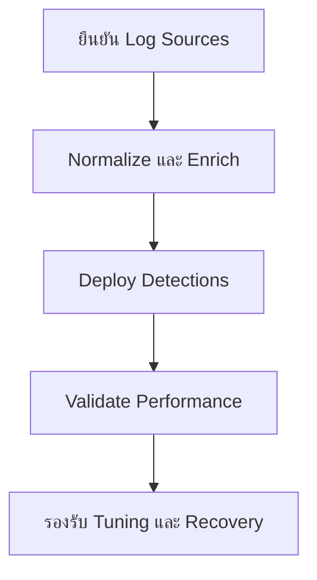

# เส้นทางเริ่มต้นสำหรับ Security Engineer

**กลุ่มเป้าหมาย**: Security Engineer, Detection Engineer, SOC Platform Engineer
**วัตถุประสงค์**: ใช้คู่มือนี้เพื่อจัดลำดับความสำคัญของ telemetry, integrations, detections, และ production readiness

## 1. จุดเริ่มต้น

-   [ ] ยืนยัน telemetry ที่จำเป็นสำหรับ use case สำคัญ
-   [ ] ยืนยัน data quality, retention, และ enrichment coverage ก่อน deploy detections
-   [ ] ยืนยัน owner ของ integrations, pipelines, และ production rollback

## 2. เอกสารที่ควรอ่านก่อน

-   [ ] อ่าน [Log Source Matrix](../06_Operations_Management/Log_Source_Matrix.th.md) เพื่อยืนยัน coverage ที่จำเป็น
-   [ ] อ่าน [Integration Hub](../03_User_Guides/Integration_Hub.th.md) เพื่อให้แนวทางการเชื่อมต่อเป็นมาตรฐานเดียวกัน
-   [ ] อ่าน [Deployment Procedures](../02_Platform_Operations/Deployment_Procedures.th.md) ก่อนปล่อยการเปลี่ยนแปลงขึ้น production
-   [ ] อ่าน [SOC Use Case Library](../08_Detection_Engineering/SOC_Use_Case_Library.th.md) เพื่อ map งานวิศวกรรมเข้ากับผลลัพธ์ด้าน detection

## 3. การตัดสินใจที่คุณเป็นเจ้าของ

-   [ ] ตัดสินใจว่า telemetry gap ใดเป็นตัวบล็อก production readiness และ gap ใดรับความเสี่ยงชั่วคราวได้
-   [ ] ตัดสินใจว่าจะ tune, validate, และ rollback detections อย่างไร
-   [ ] ตัดสินใจว่า parser, normalization, หรือ pipeline defect ใดต้อง escalate ระดับ incident
-   [ ] ตัดสินใจว่า backlog ใดมีผลมากที่สุดต่อ detection coverage หรือ analyst workload

## 4. ผลลัพธ์ขั้นต่ำที่ทีมวิศวกรรมต้องส่งมอบ

-   [ ] รายการ log sources ปัจจุบันที่แยก required และ optional สำหรับ high-priority use cases
-   [ ] release record สำหรับ detection หรือ parsing change ทุกครั้งที่ปล่อยขึ้น production
-   [ ] หลักฐานการ validate ที่แสดง expected alerts, noise profile, และ rollback path
-   [ ] รายการ blind spots, technical debt, และ remediation actions ที่มี owner ชัดเจน

## 5. จุดโฟกัสประจำสัปดาห์

-   [ ] ทบทวน telemetry health, parser quality, และ ingestion failures ทุกสัปดาห์
-   [ ] ทบทวน false positive patterns ร่วมกับ SOC Manager และ analyst
-   [ ] ทบทวน production changes, rollback events, และ pipeline risks ที่ยังไม่ปิด

## 6. วงประชุมที่คุณควรเข้าร่วม

| วงประชุม | ความถี่ | เหตุผลที่ควรเข้าร่วม | สิ่งที่คุณควรตัดสินใจ |
|:---|:---|:---|:---|
| **Weekly Telemetry Review** | รายสัปดาห์ | คุม sources, parsers, และ onboarding ให้รองรับ detection coverage | fix, reprioritize, workaround, หรือ escalate |
| **Weekly Detection Review** | รายสัปดาห์ | ยืนยันว่า telemetry รองรับ detection ที่พร้อม deploy | release, tune, rollback, หรือ defer |
| **Monthly Remediation Review** | รายเดือน | ปิด technical actions จาก incidents และ audits | confirm evidence, reopen, หรือ escalate dependency |
| **Annual Control Coverage Review** | รายปี | ยืนยันว่า structural gaps ควรถูกย้ายเป็น roadmap หรือ budget decision หรือไม่ | อนุมัติ engineering priorities และ investment needs |

## 7. Metrics ที่คุณควรดู

| Metric หรือสัญญาณ | ทำไมจึงสำคัญ | ต้อง escalate เมื่อ |
|:---|:---|:---|
| **critical source availability** | บอกว่า SOC ยังเห็น key services อยู่หรือไม่ | blind spot กระทบ crown-jewel หรือ regulated service |
| **parser / schema defect rate** | บอกความไม่เสถียรของ data quality | detection logic หรือการสืบสวนถูกบล็อก |
| **detection release success / rollback rate** | บอกคุณภาพ production readiness | มี rollback หรือ failed validation ซ้ำ |
| **telemetry backlog aging** | บอกว่า onboarding debt กำลังสะสมหรือไม่ | priority source ล่าช้าโดยไม่มี blocker ที่น่าเชื่อถือ |
| **false positive noise ที่ผูกกับ data quality** | บอกว่า telemetry defects กำลังทำร้าย analyst หรือไม่ | defect เดิมทำให้ต้อง tune ซ้ำหรือเพิ่ม analyst load |

## 8. การตัดสินใจที่คุณเป็นเจ้าของโดยตรง

-   [ ] ตัดสินใจว่า telemetry gaps ใดบล็อก release และ gap ใดรับความเสี่ยงชั่วคราวได้ด้วย compensating controls
-   [ ] ตัดสินใจว่า rule หรือ pipeline change พร้อมขึ้น production, rollback, หรือ re-test แล้วหรือไม่
-   [ ] ตัดสินใจว่า parser, schema, หรือ pipeline issue ใดต้องถูกปฏิบัติเป็น operational incident
-   [ ] ตัดสินใจว่า engineering gaps ใดต้องถูกยกระดับไป governance เพราะกระทบ service quality หรือ compliance posture

## เอกสารที่เกี่ยวข้อง (Related Documents)

-   [Log Source Matrix](../06_Operations_Management/Log_Source_Matrix.th.md)
-   [Integration Hub](../03_User_Guides/Integration_Hub.th.md)
-   [Deployment Procedures](../02_Platform_Operations/Deployment_Procedures.th.md)
-   [SOC Use Case Library](../08_Detection_Engineering/SOC_Use_Case_Library.th.md)
-   [Weekly Telemetry Review Pack](../11_Reporting_Templates/Weekly_Telemetry_Review_Pack.th.md)
-   [Weekly Detection Review Pack](../11_Reporting_Templates/Weekly_Detection_Review_Pack.th.md)
-   [Annual Control Coverage Review Pack](../11_Reporting_Templates/Annual_Control_Coverage_Review_Pack.th.md)

## References

-   [Sigma Rule Specification](https://sigmahq.io/sigma-specification/specification/sigma-rules-specification.html)
-   [Open Cybersecurity Schema Framework](https://schema.ocsf.io/)
