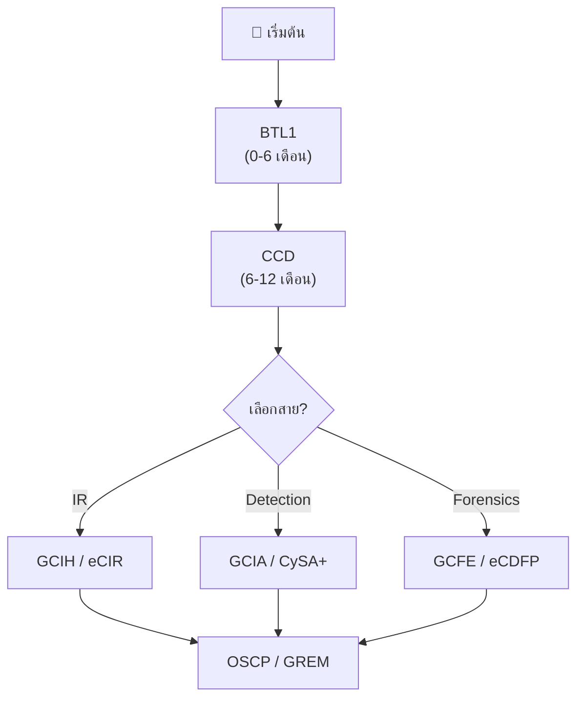

# เส้นทางฝึก SOC Analyst — จากศูนย์สู่มืออาชีพ

> **รหัสเอกสาร:** TRAIN-001  
> **เวอร์ชัน:** 1.0  
> **อัปเดตล่าสุด:** 2026-02-15  
> **กลุ่มเป้าหมาย:** Analyst ใหม่, SOC Manager, HR

---

## หลักสูตร 6 เดือน → T1 Analyst | 12 เดือน → T2 Analyst

---

## เฟส 1: พื้นฐาน (เดือน 1–2)

### เดือน 1: IT & Networking

| สัปดาห์ | หัวข้อ | แหล่งเรียน | Lab |
|:---:|:---|:---|:---|
| 1 | **Networking** — OSI, TCP/IP, DNS | CompTIA Network+, YouTube | ตั้ง lab ด้วย VirtualBox |
| 2 | **Linux** — CLI, permission, services | TryHackMe "Linux Fundamentals" | อ่าน log, หาไฟล์ |
| 3 | **Windows** — AD, Event Viewer, registry | TryHackMe "Windows Fundamentals" | อ่าน Event Log |
| 4 | **Network tools** — Wireshark, nmap, tcpdump | Wireshark tutorials | capture traffic |

### เดือน 2: Security

| สัปดาห์ | หัวข้อ | Lab |
|:---:|:---|:---|
| 5 | CIA triad, authentication, encryption | Hash ไฟล์, เข้ารหัส GPG |
| 6 | ชนิดการโจมตี — phishing, malware | วิเคราะห์ email header |
| 7 | CVE, CVSS, patch management | ค้น CVE, คำนวณ CVSS |
| 8 | Firewall, IDS/IPS, DMZ, VPN | วาดแผนภาพ network |

**สอบท้าย:** ข้อสอบ Security+ จำลอง (เป้า: >75%)

---

## เฟส 2: ทักษะ SOC (เดือน 3–4)

### เดือน 3: SIEM & Log

| สัปดาห์ | หัวข้อ | Lab |
|:---:|:---|:---|
| 9 | SIEM คืออะไร, data flow | ติดตั้ง Wazuh |
| 10 | Log analysis — Windows/Linux | สืบสวน log 10 รายการ |
| 11 | เขียน query — KQL/Lucene/regex | เขียน 10 queries |
| 12 | สร้าง Dashboard | สร้าง dashboard 5 panels |

### เดือน 4: Alert Triage

| สัปดาห์ | หัวข้อ | Lab |
|:---:|:---|:---|
| 13 | จัดลำดับ alert, true/false positive | Triage 20 alerts |
| 14 | IOC enrichment — VT, AbuseIPDB | Enrich 10 IOCs |
| 15 | MITRE ATT&CK mapping | Map 5 alerts |
| 16 | เขียน ticket | เขียน 5 tickets |

**สอบท้าย:** Alert-to-ticket exercise 10 alerts

---

## เฟส 3: Incident Response (เดือน 5–6)

| สัปดาห์ | หัวข้อ | Lab |
|:---:|:---|:---|
| 17 | IR Framework (NIST) | ซ้อมสถานการณ์ |
| 18 | Playbook PB-01 ถึง PB-05 | ทำตาม playbook ทีละขั้น |
| 19 | Containment — isolate, block, reset | ฝึกใน lab |
| 20 | เก็บหลักฐาน, chain of custody | เก็บจาก VM ที่ถูกยึด |
| 21 | Threat Intelligence, MISP | เพิ่ม IOC ใน TI platform |
| 22 | ซ้อม Tabletop | เข้าร่วมเป็นผู้เล่น |
| 23 | เตรียมสอบ Security+/CySA+ | ทำข้อสอบจำลอง 3 ชุด |
| 24 | **สอบจบ** — สถานการณ์จำลองเต็มรูปแบบ | แก้เหตุเดี่ยว 2 ชม. |

---

## เฟส 4: เส้นทาง T2 (เดือน 7–12)

| เดือน | สิ่งที่เรียน |
|:---:|:---|
| 7 | Windows forensics ลึก (Volatility, registry, prefetch) |
| 8 | Network forensics (Zeek, PCAP, C2 patterns) |
| 9 | Malware analysis เบื้องต้น (static, sandbox, YARA) |
| 10 | Cloud security (AWS/Azure investigation) |
| 11 | Detection engineering (Sigma rules, tuning) |
| 12 | Threat hunting (hypothesis-driven) |

---

## Cert แนะนำ

| Cert | ค่าใช้จ่าย | ระดับ |
|:---|:---:|:---:|
| CompTIA Security+ | ~฿10K | เริ่มต้น |
| SC-900 (Microsoft) | ~฿5K | เริ่มต้น |
| CySA+ | ~฿12K | กลาง |
| BTL1 | ~฿15K | กลาง |
| SC-200 | ~฿8K | กลาง |
| SANS GCIH | ~฿200K | สูง |

---

## แหล่งเรียนฟรี (คัดมาแล้ว)

| แหล่ง | เรียนอะไร | ระดับ |
|:---|:---|:---:|
| [TryHackMe](https://tryhackme.com) | SOC Level 1 & 2 | เริ่มต้น–กลาง |
| [LetsDefend](https://letsdefend.io) | จำลอง SOC analyst | เริ่มต้น |
| [CyberDefenders](https://cyberdefenders.org) | Blue team challenges | กลาง–สูง |
| [SANS Webcasts](https://sans.org/webcasts) | Expert sessions | ทุกระดับ |
| [Malware Traffic Analysis](https://malware-traffic-analysis.net) | วิเคราะห์ PCAP | กลาง |
| [AttackIQ Academy](https://academy.attackiq.com) | MITRE ATT&CK | เริ่มต้น–กลาง |
| **Repository นี้** | SOPs, playbooks, rules จริง | ทุกระดับ |

---

## แบบติดตามความก้าวหน้า

```
ชื่อ Analyst: ____________________
วันเริ่ม: ____________________
Mentor: ____________________

เฟส 1: พื้นฐาน [    /100]  ผ่าน: □
เฟส 2: ทักษะ SOC [    /100]  ผ่าน: □
เฟส 3: IR [    /100]  ผ่าน: □
Cert: __________________  วันที่ผ่าน: ________

พร้อมทำงานอิสระ: □ ใช่  □ ยังไม่พร้อม
ลงชื่อ SOC Manager: __________________
```

---

## งบฝึกอบรมต่อปี

| รายการ | ต่อคน | 3 คน |
|:---|:---:|:---:|
| TryHackMe Premium | ฿5K | ฿15K |
| CySA+ voucher | ฿12K | ฿36K |
| SANS 1 course | ฿130K | ฿390K |
| หนังสือ + วัสดุ | ฿5K | ฿15K |
| Conference 1 ครั้ง | ฿10–30K | ฿30–90K |
| **รวม/ปี** | **~฿162–182K** | **~฿486–546K** |

---

## Training Modules

| ลำดับ | โมดูล | ระยะเวลา | บังคับ/เลือก |
|:---|:---|:---:|:---:|
| 1 | Networking Fundamentals | 2 สัปดาห์ | บังคับ |
| 2 | Operating Systems (Windows + Linux) | 2 สัปดาห์ | บังคับ |
| 3 | SIEM Operations | 1 สัปดาห์ | บังคับ |
| 4 | Threat Intelligence Basics | 1 สัปดาห์ | บังคับ |
| 5 | Incident Response Process | 1 สัปดาห์ | บังคับ |
| 6 | Malware Analysis (Intro) | 2 สัปดาห์ | เลือก |
| 7 | Forensics (Intro) | 2 สัปดาห์ | เลือก |
| 8 | Cloud Security Basics | 1 สัปดาห์ | บังคับ |

## Certification Roadmap



## Hands-On Labs

| Lab | เครื่องมือ | ทักษะ | ระยะเวลา |
|:---|:---|:---|:---:|
| Alert Triage Simulation | SIEM (Wazuh) | คัดกรอง alert | 2 ชม. |
| Phishing Analysis | Email headers + sandbox | วิเคราะห์ phishing | 1 ชม. |
| Malware Investigation | VT + Any.Run + sandbox | วิเคราะห์ malware | 2 ชม. |
| Log Analysis Challenge | ELK/Splunk queries | เขียน query | 2 ชม. |
| IR Tabletop | Scenario-based | ตัดสินใจ IR | 2 ชม. |
| Threat Hunting | MITRE + Jupyter | Proactive hunting | 3 ชม. |

### Certification Priority Guide

| Cert | Level | Cost (approx.) | ROI |
|:---|:---|:---|:---|
| CompTIA Security+ | Entry | ~12,000 THB | High |
| CySA+ | Intermediate | ~15,000 THB | High |
| GCIA (SANS) | Advanced | ~200,000 THB | Very High |
| OSCP | Advanced | ~50,000 THB | High |
| CISSP | Management | ~25,000 THB | Strategic |

### Lab Exercise Schedule

| Week | Topic | Lab Duration |
|:---|:---|:---|
| 1-2 | SIEM basics | 4 hrs |
| 3-4 | Log analysis | 4 hrs |
| 5-6 | Incident triage | 6 hrs |
| 7-8 | Threat hunting intro | 6 hrs |

## เอกสารที่เกี่ยวข้อง

- [แผนงานสร้าง SOC](SOC_Building_Roadmap.th.md)
- [งบประมาณและจัดคน](Budget_Staffing.th.md)
- [คู่มือ Tier 1](../05_Incident_Response/Tier1_Runbook.th.md)
- [คู่มือสัมภาษณ์](../05_Incident_Response/Interview_Guide.th.md)
