# คู่มืองบประมาณและจัดคน SOC

> **รหัสเอกสาร:** BUD-001  
> **เวอร์ชัน:** 1.0  
> **อัปเดตล่าสุด:** 2026-02-15  
> **กลุ่มเป้าหมาย:** CISO, ผู้บริหาร IT, ฝ่ายการเงิน

---

## ส่วนที่ 1: โมเดลจัดคน

### Model A: SOC ขนาดเล็ก (8×5)

```
จ–ศ 08:00–17:00 | นอกเวลา: MSSP

SOC Manager (1) ← part-time ได้
T1 Analyst (2)
MSSP (นอกเวลา)

คน: 2–3 | เหมาะ: <500 พนักงาน
```

### Model B: SOC ขนาดกลาง (16×5)

```
จ–ศ 07:00–23:00 (2 กะ) | นอกเวลา: MSSP

กะเช้า: T1 + T2
กะบ่าย: T1 × 2
+ SOC Manager + Detection Engineer

คน: 5–6 | เหมาะ: 500–2,000 พนักงาน
```

### Model C: SOC 24/7

```
3 กะ + backup = 10–15 คน
เหมาะ: 2,000+ พนักงาน, อุตสาหกรรมมีกฎระเบียบ
```

### สูตรคำนวณ

```
24/7 = 8,760 ชม./ปี
1 คน = ~1,670 ชม./ปี (หลังหักลาพัก, ฝึก)
ต้องการ 5.25 คน ต่อ 1 ที่นั่ง 24/7

2 คนตลอด 24/7 = 11 คนขึ้นต่ำ
```

---

## ส่วนที่ 2: เงินเดือน (ตลาดไทย)

| ตำแหน่ง | ระดับ | เงินเดือน (฿/เดือน) | ต่อปี |
|:---|:---:|:---:|:---:|
| SOC Analyst T1 (มือใหม่) | Entry | 25K–45K | 300K–540K |
| SOC Analyst T1 (1–2 ปี) | Junior | 35K–60K | 420K–720K |
| SOC Analyst T2 (3–5 ปี) | Mid | 50K–80K | 600K–960K |
| SOC Analyst T3/IR (5+ ปี) | Senior | 70K–120K | 840K–1.44M |
| Detection Engineer | Mid-Senior | 60K–100K | 720K–1.2M |
| Threat Intel Analyst | Mid | 50K–90K | 600K–1.08M |
| SOC Manager | Senior | 80K–150K | 960K–1.8M |
| CISO | ผู้บริหาร | 150K–350K | 1.8M–4.2M |

> เพิ่ม 15–25% สำหรับสวัสดิการ (ประกันสังคม, ประกันสุขภาพ, PVD, โบนัส)

---

## ส่วนที่ 3: งบประมาณ

### Budget A: SOC ประหยัด (Open-Source)

| หมวด | ปีแรก (฿) |
|:---|:---:|
| คน (Manager 0.5 + T1 × 2) | 1.08M–1.98M |
| เทคโนโลยี (Wazuh + VMs) | 200K–500K |
| บริการ (MSSP + internet) | 660K–1.32M |
| ฝึกอบรม | 100K–300K |
| สำรอง 10% | 200K–400K |
| **รวม** | **2.24M–4.5M** |

### Budget B: SOC กลาง (เชิงพาณิชย์)

| หมวด | ปีแรก (฿) |
|:---|:---:|
| คน (Manager + T1×2 + T2 + DetEng) | 3.12M–5.4M |
| เทคโนโลยี (SIEM + EDR + Vuln) | 2.5M–8M |
| MSSP (กะดึก) | 1M–2M |
| ฝึกอบรม SANS | 400K–800K |
| สำรอง 10% | 700K–1.6M |
| **รวม** | **7.72M–17.8M** |

### Budget C: SOC Enterprise 24/7

| หมวด | ปีแรก (฿) |
|:---|:---:|
| คน (10–15 คน) | 10M–25M |
| เทคโนโลยี | 5M–15M |
| บริการ + ฝึก + ห้อง + สำรอง | 5.5M–15M |
| **รวม** | **20.5M–55M** |

---

## ส่วนที่ 4: ROI & Business Case

### ต้นทุนของการ "ไม่มี SOC"

| ความเสี่ยง | ต้นทุนเฉลี่ย/ครั้ง |
|:---|:---:|
| Data breach (ASEAN) | ฿85–120M |
| Ransomware | ฿10–50M |
| BEC/โอนเงินหลอก | ฿3–15M |
| ค่าปรับ PDPA | สูงสุด ฿5M/ครั้ง |
| Downtime (ต่อชั่วโมง) | ฿100K–1M+ |

### สูตร ROI

```
ROI = (ความเสี่ยงลด - ต้นทุน SOC) / ต้นทุน SOC × 100%

ตัวอย่าง:
  ไม่มี SOC: 2 เหตุ/ปี × ฿20M = ฿40M ความเสี่ยง
  มี SOC (95%): 0.1 เหตุ/ปี = ฿2M
  ต้นทุน SOC: ฿8M/ปี
  ROI = (฿38M - ฿8M) / ฿8M = 375%
```

---

## ส่วนที่ 5: Timeline การจ้าง

| สัปดาห์ | กิจกรรม |
|:---:|:---|
| 1–2 | เขียน JD, โพสต์ JobThai/LinkedIn |
| 3–4 | คัดกรอง, นัดสัมภาษณ์ |
| 5–6 | สัมภาษณ์เทคนิค (ใช้ [คู่มือสัมภาษณ์](../05_Incident_Response/Interview_Guide.th.md)) |
| 7 | ยื่นข้อเสนอ |
| 8–9 | Notice period (30 วัน) |
| 10–12 | Onboarding + ฝึกอบรม |

---

## แผนงบประมาณรายละเอียด

### หมวดต้นทุน

| หมวด | รายการ | ค่าใช้จ่ายโดยประมาณ (ต่อปี) |
|:---|:---|:---|
| **บุคลากร** | เงินเดือน + สวัสดิการ | 60–70% ของ budget |
| **เทคโนโลยี** | License fees, infra, SaaS | 20–25% |
| **ฝึกอบรม** | Cert, training, conference | 5–10% |
| **ดำเนินงาน** | สำนักงาน, อุปกรณ์, ค่าสาธารณูปโภค | 3–5% |

### ตารางเงินเดือน (ตลาดไทย — ประมาณ)

| ตำแหน่ง | Junior | Mid-Level | Senior |
|:---|:---:|:---:|:---:|
| **SOC Analyst** | 25,000–35,000 ฿ | 40,000–60,000 ฿ | 65,000–90,000 ฿ |
| **Detection Engineer** | 35,000–50,000 ฿ | 55,000–80,000 ฿ | 85,000–120,000 ฿ |
| **Incident Responder** | 30,000–45,000 ฿ | 50,000–75,000 ฿ | 80,000–110,000 ฿ |
| **SOC Manager** | — | 70,000–100,000 ฿ | 100,000–150,000 ฿ |
| **CISO** | — | — | 150,000–300,000 ฿ |

### ROI Calculation

```
ROI = (ค่าเสียหายที่ป้องกันได้ - ต้นทุน SOC) / ต้นทุน SOC × 100

ตัวอย่าง:
- ค่าเสียหาย data breach เฉลี่ย (ไทย): ~50 ล้านบาท
- ต้นทุน SOC ต่อปี: ~5 ล้านบาท
- ป้องกัน breach ได้ 1 ครั้ง/ปี = ROI 900%
```

## Staffing Model ตามขนาดองค์กร

### Model A: SOC ขนาดเล็ก (3–5 FTE)

| บทบาท | จำนวน | เวลาทำงาน |
|:---|:---:|:---|
| SOC Manager (เล่นหลายบท) | 1 | 8/5 |
| Tier 1/2 Analyst | 2-3 | 8/5 + on-call |
| Detection Engineer (part-time) | 0.5 | ร่วมกับ IT |
| **Coverage**: 8/5 + on-call | | |

### Model B: SOC ขนาดกลาง (8–12 FTE)

| บทบาท | จำนวน | เวลาทำงาน |
|:---|:---:|:---|
| SOC Manager | 1 | 8/5 |
| Shift Lead | 2 | 16/5 |
| Tier 1 Analyst | 4 | 16/5 + on-call |
| Tier 2 Analyst | 2 | 8/5 + on-call |
| Detection Engineer | 1 | 8/5 |
| **Coverage**: 16/5 + on-call | | |

### Model C: SOC ขนาดใหญ่ (15+ FTE)

| บทบาท | จำนวน | เวลาทำงาน |
|:---|:---:|:---|
| SOC Manager | 1 | 8/5 |
| Shift Lead | 3–4 | 24/7 |
| Tier 1 Analyst | 6–8 | 24/7 |
| Tier 2 Analyst | 3–4 | 16/7 |
| Tier 3 / Hunt | 1–2 | 8/5 |
| Detection Engineer | 2 | 8/5 |
| **Coverage**: 24/7 | | |

## Hiring Pipeline

```mermaid
graph LR
    JD["📝 JD"] --> Post["📢 ประกาศ"]
    Post --> Screen["📋 คัดกรอง"]
    Screen --> Tech["💻 ทดสอบ"]
    Tech --> Interview["🤝 สัมภาษณ์"]
    Interview --> Offer["📃 เสนองาน"]
    Offer --> Onboard["🎯 Onboarding"]
```



## เอกสารที่เกี่ยวข้อง

- [แผนงานสร้าง SOC](SOC_Building_Roadmap.th.md)
- [โครงสร้างทีม SOC](../06_Operations_Management/SOC_Team_Structure.th.md)
- [คู่มือสัมภาษณ์](../05_Incident_Response/Interview_Guide.th.md)
- [เส้นทางฝึก Analyst](Analyst_Training_Path.th.md)
