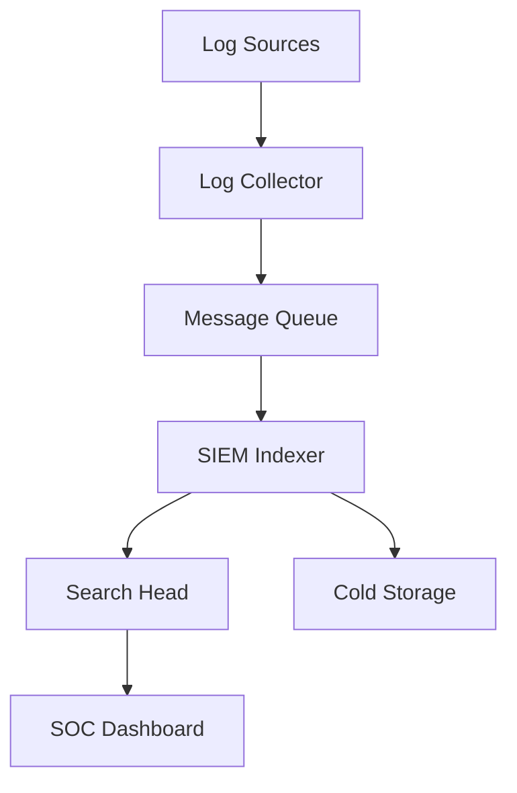

# คู่มือติดตั้ง SOC Infrastructure — Hands-On

> **รหัสเอกสาร:** INFRA-001  
> **เวอร์ชัน:** 1.0  
> **อัปเดตล่าสุด:** 2026-02-15  
> **อ่านก่อน:** [คู่มือเลือก Technology Stack](Technology_Stack.th.md)

---

## คู่มือนี้ครอบคลุม

การติดตั้ง **Open-Source Stack (Stack A)** ด้วย Wazuh ทีละขั้น — ค่าใช้จ่ายศูนย์ ฟังก์ชันครบ

---

## ส่วนที่ 1: ติดตั้ง Wazuh

### ความต้องการขั้นต่ำ
- Ubuntu 22.04 LTS
- 4 cores / 8 GB RAM / 50 GB disk
- Static IP

### ติดตั้ง

```bash
# ดาวน์โหลดและรัน
curl -sO https://packages.wazuh.com/4.9/wazuh-install.sh
curl -sO https://packages.wazuh.com/4.9/config.yml

# แก้ config.yml — ใส่ IP เซิร์ฟเวอร์
# แล้วรัน:
sudo bash wazuh-install.sh -a

# ⚠️ จดรหัส admin ที่แสดงตอนจบ!
# เข้า: https://YOUR_SERVER_IP
```

### ตรวจสอบ
```bash
sudo systemctl status wazuh-manager
sudo systemctl status wazuh-indexer
sudo systemctl status wazuh-dashboard
```

---

## ส่วนที่ 2: ติดตั้ง Agent

### Windows
```powershell
# ดาวน์โหลดจาก Wazuh Dashboard → Agents → Deploy
# หรือ:
Invoke-WebRequest -Uri https://packages.wazuh.com/4.x/windows/wazuh-agent-4.9.0-1.msi -OutFile wazuh-agent.msi
msiexec.exe /i wazuh-agent.msi /q WAZUH_MANAGER="YOUR_SERVER_IP"
net start WazuhSvc
```

### Linux
```bash
# Ubuntu/Debian
curl -s https://packages.wazuh.com/key/GPG-KEY-WAZUH | sudo gpg --dearmor -o /usr/share/keyrings/wazuh.gpg
echo "deb [signed-by=/usr/share/keyrings/wazuh.gpg] https://packages.wazuh.com/4.x/apt/ stable main" | sudo tee /etc/apt/sources.list.d/wazuh.list
sudo apt update && sudo apt install wazuh-agent -y
sudo sed -i 's/MANAGER_IP/YOUR_SERVER_IP/' /var/ossec/etc/ossec.conf
sudo systemctl enable --now wazuh-agent
```

---

## ส่วนที่ 3: ตั้งค่า Log Sources

### Active Directory
```xml
<!-- เพิ่มใน agent ossec.conf บน DC -->
<localfile>
  <location>Security</location>
  <log_format>eventchannel</log_format>
  <query>Event/System[EventID=4624 or EventID=4625 or EventID=4688 or EventID=4720 or EventID=1102]</query>
</localfile>
```

### Firewall (Syslog)
```xml
<!-- เพิ่มใน Wazuh server ossec.conf -->
<remote>
  <connection>syslog</connection>
  <port>514</port>
  <protocol>udp</protocol>
  <allowed-ips>FIREWALL_IP</allowed-ips>
</remote>
```

---


### Linux Servers

```bash
# ติดตั้ง rsyslog forwarding ไปยัง Wazuh
cat >> /etc/rsyslog.conf << 'EOF'
*.* @@<WAZUH_IP>:514
EOF
systemctl restart rsyslog
```

| Log Source | วิธีเชื่อมต่อ | ตัวอย่าง Log |
|:---|:---|:---|
| **Linux Auth** | rsyslog → Wazuh | `/var/log/auth.log` |
| **Apache/Nginx** | Filebeat → Wazuh | access.log, error.log |
| **Cloud Trail** | S3 → Wazuh module | AWS CloudTrail JSON |

## ส่วนที่ 4: ติดตั้ง Sysmon (Windows)

```powershell
# เพิ่มความสามารถการตรวจจับ Windows อย่างมาก
Invoke-WebRequest -Uri https://download.sysinternals.com/files/Sysmon.zip -OutFile Sysmon.zip
Expand-Archive Sysmon.zip
Invoke-WebRequest -Uri https://raw.githubusercontent.com/SwiftOnSecurity/sysmon-config/master/sysmonconfig-export.xml -OutFile sysmonconfig.xml
.\Sysmon64.exe -accepteula -i sysmonconfig.xml
```

---


```xml
<!-- ใช้ Sysmon config จาก SwiftOnSecurity -->
<!-- ดาวน์โหลดจาก: github.com/SwiftOnSecurity/sysmon-config -->

Sysmon64.exe -accepteula -i sysmonconfig-export.xml
```

> Events สำคัญที่ต้อง monitor: **Event ID 1** (Process Create), **Event ID 3** (Network Connect), **Event ID 11** (File Create)

## ส่วนที่ 4.5: Import Sigma Rules ไปยัง Wazuh

```bash
# ติดตั้ง sigma-cli
pip3 install sigma-cli

# แปลง rules เป็นรูปแบบ Wazuh
sigma convert -t wazuh -p wazuh rules/ -o wazuh_rules.xml

# คัดลอกไปยัง Wazuh
cp wazuh_rules.xml /var/ossec/etc/rules/local_sigma.xml
systemctl restart wazuh-manager
```

## ส่วนที่ 5: ตั้งค่า Alert (Slack)

```bash
# สร้าง Slack webhook → ตั้งค่า Wazuh integration
# เมื่อมี alert level 10+ → ส่ง Slack ทันที
```

---


### Email Alerts

```xml
<!-- /var/ossec/etc/ossec.conf -->
<global>
  <email_notification>yes</email_notification>
  <smtp_server>smtp.example.com</smtp_server>
  <email_from>wazuh@example.com</email_from>
  <email_to>soc@example.com</email_to>
  <email_maxperhour>12</email_maxperhour>
</global>

<email_alerts>
  <email_to>soc@example.com</email_to>
  <level>10</level>
</email_alerts>
```

### ตั้งค่า Slack Webhook

```bash
# สร้าง Slack integration script
cat > /var/ossec/integrations/custom-slack.sh << 'SCRIPT'
#!/bin/bash
WEBHOOK_URL="https://hooks.slack.com/services/YOUR/WEBHOOK/URL"
ALERT_JSON=$(cat "$1")
curl -s -X POST "$WEBHOOK_URL" \
  -H 'Content-Type: application/json' \
  -d "{"text": "🚨 Wazuh Alert: $(echo $ALERT_JSON | jq -r '.rule.description')"}"
SCRIPT
chmod +x /var/ossec/integrations/custom-slack.sh
```

## ส่วนที่ 6: Sentinel (ถ้าเลือก Stack B)

```
1. Azure Portal → สร้าง Microsoft Sentinel
2. สร้าง Log Analytics Workspace
3. เชื่อม Data Connectors: M365 Defender, Azure AD, Azure Activity
4. เปิด Analytics Rules → ใช้ template
5. เสร็จ! มี SIEM ใน 30 นาที
```

---


```powershell
# Quick Setup — Azure Sentinel
# 1. สร้าง Log Analytics Workspace
az monitor log-analytics workspace create \
  --resource-group SOC-RG \
  --workspace-name SOC-Sentinel \
  --location southeastasia

# 2. เปิดใช้ Sentinel
az sentinel onboard --resource-group SOC-RG \
  --workspace-name SOC-Sentinel

# 3. เปิด Data Connectors
# - Azure AD Sign-in Logs
# - Microsoft 365
# - Azure Activity
# - Syslog (Linux)
```

## ส่วนที่ 7: ติดตั้ง TheHive (Ticketing)

```bash
# ติดตั้ง TheHive 5 ด้วย Docker
docker compose up -d

# docker-compose.yml
# services:
#   thehive:
#     image: strangebee/thehive:5
#     ports:
#       - "9000:9000"
#   elasticsearch:
#     image: elasticsearch:7.17.9
#   cassandra:
#     image: cassandra:4
```

> เข้าถึง TheHive ที่ `http://<SERVER_IP>:9000` — default: `admin@thehive.local` / `secret`

## Troubleshooting

| ปัญหา | สาเหตุ | วิธีแก้ |
|:---|:---|:---|
| Agent ไม่เชื่อมต่อ | Firewall block port 1514/1515 | เปิด port ที่ firewall |
| Log ไม่เข้า SIEM | rsyslog config ผิด | ตรวจสอบ IP และ port |
| Dashboard ว่าง | Index pattern ไม่ถูกต้อง | สร้าง index pattern ใหม่ |
| Alert ไม่ส่ง email | SMTP config ไม่ถูก | ทดสอบด้วย `sendmail` |
| Disk full | Log retention ยาวเกิน | ตั้งค่า log rotation |

## Checklist ตรวจสอบ

```
□ Wazuh Dashboard เข้าได้
□ Agent เชื่อมต่อ ≥3 เครื่อง
□ เห็น event real-time
□ AD login events มาถึง
□ Firewall logs มาถึง
□ Sysmon ติดตั้งบน Windows
□ Custom rule ทำงาน
□ Alert ส่ง Email/Slack ได้
□ 🎉 พร้อมเปิดปฏิบัติการ!
```

---

## Performance Tuning

| ส่วน | ปัญหา | วิธีปรับ |
|:---|:---|:---|
| **SIEM Indexing** | Query ช้า | เพิ่ม RAM, ปรับ shard size |
| **Log Ingestion** | Buffer overflow | เพิ่ม queue size, scale nodes |
| **Dashboard** | Load ช้า | ลด time range, ใช้ summary index |
| **Agent** | CPU สูงบน endpoint | ปรับ scan interval, exclude paths |
| **Alerting** | Alert delay | ลด evaluation interval |

## Backup & Recovery

| ส่วน | Backup Strategy | Recovery Time |
|:---|:---|:---:|
| SIEM Config | Daily snapshot → S3/NFS | < 1 ชม. |
| Detection Rules | Git repository | < 15 นาที |
| Dashboard/Reports | Export JSON → Git | < 30 นาที |
| Agent Config | Centralized config mgmt | < 1 ชม. |
| TheHive Cases | DB dump + Elasticsearch snapshot | < 2 ชม. |

## การ Hardening SIEM Server

```bash
# 1. Firewall — อนุญาตเฉพาะ port ที่จำเป็น
ufw allow 1514/tcp  # Agent communication
ufw allow 1515/tcp  # Agent enrollment
ufw allow 443/tcp   # Web UI
ufw deny incoming
ufw enable

# 2. SSL/TLS สำหรับ agent communication
# (Wazuh ตั้งค่าอัตโนมัติระหว่างติดตั้ง)

# 3. Disable root login
sed -i 's/PermitRootLogin yes/PermitRootLogin no/' /etc/ssh/sshd_config
systemctl restart sshd

# 4. Log rotation
cat >> /etc/logrotate.d/wazuh << 'EOF'
/var/ossec/logs/*.log {
    weekly
    rotate 12
    compress
    missingok
}
EOF
```

## Infrastructure Sizing Guide

### SIEM Sizing Calculator

| Parameter | Small | Medium | Large |
|:---|:---|:---|:---|
| EPS (Events/sec) | 500 | 2,000 | 10,000+ |
| Storage/day | 50 GB | 200 GB | 1 TB+ |
| Retention | 90 days | 180 days | 365 days |
| CPU Cores | 8 | 16 | 32+ |
| RAM | 32 GB | 64 GB | 128+ GB |
| Total Storage | 5 TB | 36 TB | 365+ TB |

### Network Architecture



### Deployment Readiness Checklist

| Category | Items | Status |
|:---|:---|:---|
| Network | VLAN, firewall rules, DNS | ☐ |
| Compute | VMs/containers provisioned | ☐ |
| Storage | Hot/warm/cold tiers | ☐ |
| Access | Admin accounts, MFA | ☐ |
| Monitoring | Health dashboards | ☐ |

## เอกสารที่เกี่ยวข้อง

- [แผนงานสร้าง SOC](SOC_Building_Roadmap.th.md)
- [เลือก Technology Stack](Technology_Stack.th.md)
- [คู่มือ Onboard Log](../06_Operations_Management/Log_Source_Onboarding.th.md)
