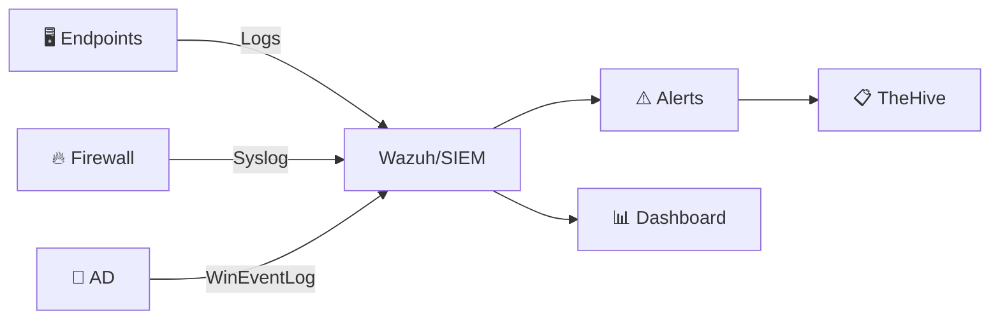

# แผนงานสร้าง SOC จากศูนย์

> **รหัสเอกสาร:** SOC-BUILD-001  
> **เวอร์ชัน:** 1.0  
> **อัปเดตล่าสุด:** 2026-02-15  
> **กลุ่มเป้าหมาย:** IT Manager, CISO, ผู้บริหารที่ต้องการสร้าง SOC ใหม่

---

## เอกสารนี้สำหรับใคร?

คุณ **ยังไม่มี SOC** วันนี้ อาจมีทีม IT เล็กๆ ที่ดูแลความปลอดภัย "เมื่อมีอะไรเกิดขึ้น" คู่มือนี้จะพาคุณสร้าง SOC ตั้งแต่ไม่มีอะไรเลย — ทีละขั้น ทีละ Phase

---

## 4 เฟส

```
เฟส 1 (เดือน 1-3)      เฟส 2 (เดือน 4-6)      เฟส 3 (เดือน 7-12)     เฟส 4 (ปีที่ 2+)
┌──────────────┐   ┌──────────────┐   ┌──────────────┐   ┌──────────────┐
│  วางรากฐาน    │──▶│  ตรวจจับ      │──▶│  ปฏิบัติการ    │──▶│  พัฒนาต่อ     │
│              │   │              │   │              │   │              │
│ • ซื้อเครื่องมือ│   │ • เพิ่ม Log   │   │ • Playbooks  │   │ • Automation │
│ • จ้างคน     │   │ • Rules แรก  │   │ • IR process │   │ • Threat hunt│
│ • ติดตั้งพื้นฐาน│   │ • SOP พื้นฐาน │   │ • ซ้อม        │   │ • SOAR       │
└──────────────┘   └──────────────┘   └──────────────┘   └──────────────┘
```

---

## เฟส 1: วางรากฐาน (เดือน 1–3)

### 1.1 ตอบคำถามพื้นฐาน

| คำถาม | ทำไมสำคัญ |
|:---|:---|
| ปกป้องอะไร? | กำหนดขอบเขต |
| ความเสี่ยงใหญ่สุดคืออะไร? | จัดลำดับว่า detect อะไรก่อน |
| กฎหมายอะไรเกี่ยวข้อง? | PDPA, ISO, PCI |
| งบเท่าไหร่? | กำหนด build vs buy vs outsource |

### 1.2 เลือกโมเดล

| โมเดล | ทีม | งบ/ปี | เหมาะกับ |
|:---|:---:|:---:|:---|
| 🟢 **Hybrid MSSP** | 1–2 คน + MSSP | ฿1.5–3M | องค์กรเล็ก <500 คน |
| 🟡 **In-house เล็ก** | 3–5 คน | ฿5–10M | กลาง 500–2000 คน |
| 🔴 **Full In-house** | 8–15+ คน | ฿15–30M+ | ใหญ่ 2000+ คน |

> **แนะนำ**: เริ่มจาก **Hybrid MSSP** — outsource 24/7 monitoring เก็บ 1–2 คนไว้ดูแล escalation

### 1.3 เลือกเครื่องมือ

#### SIEM — เครื่องมือ #1

| SIEM | ค่าใช้จ่าย | เหมาะกับ |
|:---|:---|:---|
| **Wazuh** | ฟรี (open-source) | งบจำกัด, เรียนรู้ |
| **Elastic Security** | Free tier | ยืดหยุ่น, scale ได้ |
| **Microsoft Sentinel** | จ่ายตาม GB | ใช้ Azure/M365 |
| **Splunk** | แพง | Enterprise |

> **แนะนำ**: **Wazuh** (ฟรี, รวม SIEM + EDR + Compliance)

### 1.4 จ้างทีมแรก

| ตำแหน่ง | จำนวน | เงินเดือน (ไทย) |
|:---|:---:|:---|
| SOC Lead | 1 | ฿80–150K/เดือน |
| SOC Analyst | 1–2 | ฿30–60K/เดือน |

---


#### EDR (Endpoint Detection & Response)

| เครื่องมือ | ประเภท | เหมาะกับ |
|:---|:---|:---|
| **Wazuh** | Open-Source | งบจำกัด, DIY |
| **CrowdStrike Falcon** | Commercial | องค์กรขนาดใหญ่ |
| **Microsoft Defender for Endpoint** | Commercial | สภาพแวดล้อม M365 |
| **LimaCharlie** | Cloud-native | Startup, MSSP |

#### เครื่องมือจำเป็นอื่น ๆ

| หมวด | เครื่องมือแนะนำ | วัตถุประสงค์ |
|:---|:---|:---|
| **Ticketing** | TheHive / Jira | จัดการเคส |
| **TI Platform** | MISP / OpenCTI | จัดการข่าวกรองภัยคุกคาม |
| **Vulnerability Scanner** | OpenVAS / Nessus | สแกนช่องโหว่ |
| **Network** | Suricata / Zeek | ตรวจจับเครือข่าย |

### 1.4 สถาปัตยกรรมขั้นต่ำที่ใช้งานได้ (MVA)



### 1.5 จ้างทีมแรก

#### ทีมขั้นต่ำ (Hybrid Model)

| บทบาท | จำนวน | ทักษะสำคัญ |
|:---|:---:|:---|
| **SOC Manager** | 1 | ภาวะผู้นำ, IR, GRC |
| **Tier 1 Analyst** | 2–3 | Alert triage, SIEM |
| **Tier 2 Analyst** | 1 | Investigation, forensics |
| **Detection Engineer** | 1 (shared) | Sigma, YARA, scripting |

#### หาคนที่ไหน

- ชุมชน cybersecurity ในประเทศ (NCSA, สมาคม ISC2 Thailand)
- โปรแกรมฝึกงานจากมหาวิทยาลัย
- CTF communities และ Bug Bounty programs
- Upskill ทีม IT ที่มีอยู่

### 1.6 เช็คลิสต์เฟส 1

- [ ] กำหนดขอบเขตและ mission ของ SOC
- [ ] เลือก SIEM + EDR stack
- [ ] ติดตั้งและตั้งค่า SIEM
- [ ] Deploy EDR agents บน critical endpoints
- [ ] จ้าง/มอบหมาย SOC Manager และ Analysts
- [ ] สร้าง shift schedule เบื้องต้น

## เฟส 2: ตรวจจับ (เดือน 4–6)

### เพิ่ม Log Source ตามลำดับ

| สัปดาห์ | Log Source | ทำไมก่อน |
|:---:|:---|:---|
| 1 | Active Directory | เป้าโจมตี #1 |
| 2 | Firewall | เห็น traffic |
| 3 | EDR | malware, process |
| 4 | Email gateway | phishing #1 |
| 5–6 | Cloud (AWS/Azure) | misconfig |
| 7–8 | DNS + Proxy | C2, shadow IT |

### Deploy 10 Sigma Rules แรก

เริ่มจาก `win_multiple_failed_logins`, `proc_office_spawn_powershell`, `cloud_unusual_login` + อ่าน [Tier 1 Runbook](../05_Incident_Response/Tier1_Runbook.th.md)

---


### 2.3 เขียน SOPs ชุดแรก

เริ่มจากเอกสาร 5 ฉบับนี้:

1. **Alert Triage SOP** — ขั้นตอนคัดกรอง alert
2. **Incident Response Playbook** — Playbook ตอบสนองเหตุการณ์หลัก
3. **Escalation Matrix** — เมื่อไหร่/อย่างไรที่จะ escalate
4. **Shift Handoff** — ขั้นตอนส่งมอบกะ
5. **Evidence Collection** — ขั้นตอนเก็บหลักฐาน

### 2.4 เช็คลิสต์เฟส 2

- [ ] เชื่อมต่อ log sources อย่างน้อย 5 แหล่ง
- [ ] Deploy Sigma rules อย่างน้อย 10 rules
- [ ] เขียน SOPs หลัก 5 ฉบับ
- [ ] Tune false positives รอบแรก
- [ ] สร้าง dashboard สำหรับ daily operations

## เฟส 3: ปฏิบัติการ (เดือน 7–12)

- Deploy playbooks ทั้ง 30 ชุด (ค่อยๆ ทำเป็น wave)
- ซ้อม [Tabletop Exercise](../05_Incident_Response/Tabletop_Exercises.th.md) ครั้งแรก
- เริ่มวัด metrics: MTTD < 4 ชม., MTTR < 8 ชม.

---


### 3.1 ขยาย Playbook Coverage

ครอบคลุม use cases ตาม MITRE ATT&CK:

| Tactic | Playbook | ระดับ |
|:---|:---|:---:|
| Initial Access | Phishing Response | P1 |
| Execution | Malware Execution | P1 |
| Persistence | Unauthorized Scheduled Task | P2 |
| Privilege Escalation | Admin Account Misuse | P1 |
| Lateral Movement | Pass-the-Hash | P2 |
| Exfiltration | Data Exfiltration | P1 |
| Impact | Ransomware | P1 |

### 3.2 จัด Tabletop Exercise ครั้งแรก

1. เลือก scenario (เช่น ransomware)
2. เชิญ stakeholders (IT, Legal, Management)
3. ทำ walkthrough ตาม playbook
4. บันทึก lessons learned
5. อัปเดต SOPs จากผลลัพธ์

### 3.3 กำหนด Metrics

| ตัวชี้วัด | เป้าหมาย |
|:---|:---|
| **MTTD** (Mean Time to Detect) | ≤ 60 นาที |
| **MTTR** (Mean Time to Respond) | ≤ 240 นาที |
| **False Positive Rate** | < 10% |
| **Alert-to-Incident Ratio** | < 20:1 |
| **Playbook Coverage** | ≥ 80% ของ use cases |

### 3.4 เช็คลิสต์เฟส 3

- [ ] Playbooks ครอบคลุม top 10 use cases
- [ ] จัด tabletop exercise อย่างน้อย 1 ครั้ง
- [ ] สร้าง KPI dashboard
- [ ] มี monthly SOC report
- [ ] เริ่ม threat hunting program

## เฟส 4: พัฒนา (ปีที่ 2+)

- Threat Hunting, SOAR Automation, Purple Teaming
- สอบ SOC Maturity — ใช้ [เครื่องมือวัดคะแนน](../tools/soc_maturity_scorer.html)
- Compliance audit — ใช้ [Compliance Mapping](../10_Compliance/Compliance_Mapping.th.md)

---


### 4.1 ความสามารถขั้นสูง

| ความสามารถ | เครื่องมือ/วิธี | เป้าหมาย |
|:---|:---|:---|
| **Threat Hunting** | MITRE ATT&CK, Jupyter | เชิงรุก |
| **SOAR Automation** | Shuffle, XSOAR | ลดเวลาตอบสนอง |
| **Purple Team** | Atomic Red Team | ทดสอบ detection |
| **CTI Program** | MISP, OpenCTI | ข่าวกรองเชิงกลยุทธ์ |
| **Forensics Lab** | SIFT, Volatility | วิเคราะห์เชิงลึก |

### 4.2 ระดับวุฒิภาวะ SOC

| ระดับ | ชื่อ | ลักษณะ |
|:---|:---|:---|
| 1 | **Initial** | Reactive, ไม่มี process ชัดเจน |
| 2 | **Managed** | มี SOPs, มี shift rotation |
| 3 | **Defined** | Playbooks ครบ, metrics tracking |
| 4 | **Quantitative** | Data-driven, automation |
| 5 | **Optimizing** | Continuous improvement, threat hunting |

## งบประมาณ

| แบบ | งบปีแรก | หมายเหตุ |
|:---|:---:|:---|
| 🟢 Budget (Open-Source) | ฿1.6–3.3M | Wazuh + 2 คน |
| 🟡 Mid-Range | ฿5.8–12.5M | Elastic/Sentinel + 4 คน + MSSP |
| 🔴 Enterprise | ฿18–47M | Splunk + 10+ คน + 24/7 |

---


### Option A: SOC ประหยัด (Open-Source Stack)

| รายการ | ค่าใช้จ่าย/ปี |
|:---|:---|
| Wazuh (SIEM+EDR) | ฟรี |
| TheHive (Ticketing) | ฟรี |
| MISP (TI) | ฟรี |
| Suricata (IDS) | ฟรี |
| เซิร์ฟเวอร์ (3 nodes) | ~300,000 ฿ |
| บุคลากร (3–4 FTE) | ~1,800,000 ฿ |
| **รวม** | **~2,100,000 ฿/ปี** |

### Option B: SOC ระดับกลาง (Commercial + Open-Source)

| รายการ | ค่าใช้จ่าย/ปี |
|:---|:---|
| Splunk/Elastic (SIEM) | ~1,500,000 ฿ |
| CrowdStrike (EDR) | ~800,000 ฿ |
| TheHive (Ticketing) | ฟรี |
| บุคลากร (6–8 FTE) | ~3,600,000 ฿ |
| **รวม** | **~5,900,000 ฿/ปี** |

### Option C: SOC ระดับองค์กร

| รายการ | ค่าใช้จ่าย/ปี |
|:---|:---|
| Sentinel/Splunk Enterprise | ~3,000,000 ฿ |
| CrowdStrike+Cortex XDR | ~2,000,000 ฿ |
| XSOAR (SOAR) | ~1,500,000 ฿ |
| บุคลากร (12–15 FTE) | ~9,000,000 ฿ |
| **รวม** | **~15,500,000 ฿/ปี** |

## เส้นทางฝึก Analyst

### เดือน 1–3 (มือใหม่)
| สัปดาห์ | เรียนอะไร | แหล่ง |
|:---:|:---|:---|
| 1–2 | พื้นฐาน Network | CompTIA Network+ / YouTube |
| 3–4 | Linux & Windows | TryHackMe "Pre-Security" |
| 5–6 | Security พื้นฐาน | CompTIA Security+ |
| 7–10 | SIEM + Log Analysis | TryHackMe "SOC Level 1" |
| 11–12 | IR พื้นฐาน | Repository นี้ |

### Cert แนะนำ
```
เริ่มต้น → Security+ / SC-900 (~฿10K)
กลาง   → CySA+ / BTL1 (~฿15–30K)
สูง     → SANS GCIH / GCFA (~฿100–200K)
```

---


### ทรัพยากรฝึกอบรมฟรี

| แหล่ง | เนื้อหา |
|:---|:---|
| [LetsDefend](https://letsdefend.io) | SOC Analyst simulator |
| [CyberDefenders](https://cyberdefenders.org) | Blue team challenges |
| [MITRE ATT&CK](https://attack.mitre.org) | Threat framework |
| [Malware Traffic Analysis](https://malware-traffic-analysis.net) | PCAP analysis |

## ลำดับการอ่านเอกสารใน Repository นี้

| ลำดับ | เอกสาร | วัตถุประสงค์ |
|:---|:---|:---|
| 1 | SOC Building Roadmap (เอกสารนี้) | ภาพรวมและแผนงาน |
| 2 | Technology Stack | เลือกเครื่องมือ |
| 3 | Infrastructure Setup | ติดตั้ง |
| 4 | IR Framework | กรอบการตอบสนอง |
| 5 | Playbooks (35 ฉบับ) | ขั้นตอนปฏิบัติ |
| 6 | SOC Metrics & KPIs | วัดผล |

## Quick Start 30 วัน

```
สัปดาห์ 1: อ่านคู่มือนี้ + เขียน SOC mission + ขออนุมัติงบ
สัปดาห์ 2: ติดตั้ง SIEM + deploy agent 5 เครื่อง + เชื่อม AD
สัปดาห์ 3: Import 10 Sigma rules + ทดสอบ alert แรก
สัปดาห์ 4: พิมพ์ Severity Matrix + มอบหมายคนดู alert + handle alert แรก
```

---

## ข้อผิดพลาดที่พบบ่อย

| ❌ อย่าทำ | ✅ ทำแทน |
|:---|:---|
| ซื้อ SIEM แพงก่อนจ้างคน | จ้างคนก่อน แล้วเลือกเครื่องมือด้วยกัน |
| พยายาม monitor ทุกอย่างวันแรก | เริ่มจาก 5 log sources |
| ไม่มี playbook | ใช้ playbook จาก repo นี้ตั้งแต่วันแรก |
| Alert ดังทั้งวัน (alert fatigue) | เริ่ม 10 rules, tune, แล้วค่อยเพิ่ม |
| 24/7 ด้วย 2 คน (burnout) | ใช้ MSSP ดูนอกเวลา |

---

## Quick Wins vs Long-term Investments

### Priority Matrix

| Initiative | Effort | Impact | Timeline |
|:---|:---|:---|:---|
| Log collection baseline | ต่ำ | สูง | สัปดาห์ 1-2 |
| Alert triage SOP | ต่ำ | สูง | สัปดาห์ 2-3 |
| SIEM use case tuning | กลาง | สูง | เดือน 1-2 |
| Threat hunting program | สูง | สูง | เดือน 3-6 |
| SOAR automation | สูง | กลาง | เดือน 6-12 |
| ML-based detection | สูง | กลาง | ปี 2 |

### Common Pitfalls to Avoid

> ⚠️ **ข้อควรระวัง**
> 1. อย่าซื้อเครื่องมือก่อนกำหนด process
> 2. อย่าเก็บ log ทุกอย่างโดยไม่คัดกรอง
> 3. อย่าละเลยการฝึกอบรมทีม
> 4. อย่าคาดหวัง 24/7 จากทีมเล็ก
> 5. อย่าวัดแค่จำนวน alert ที่ปิด

### Budget Planning Template

```
ปี 1 Budget Breakdown (ตัวอย่าง):
━━━━━━━━━━━━━━━━━━━━━━━━━━━━━━
Personnel (60%)    ████████████████████  60%
Technology (25%)   ████████              25%
Training (10%)     ███                   10%
Operations (5%)    ██                     5%
━━━━━━━━━━━━━━━━━━━━━━━━━━━━━━
Total: ~15-25M THB/year (mid-size org)
```

### Milestone Tracking Dashboard

| Phase | Milestone | Status | Target Date |
|:---|:---|:---|:---|
| 1 | Log collection active | ☐ | Week 4 |
| 2 | First playbook deployed | ☐ | Week 8 |
| 3 | 24/7 coverage achieved | ☐ | Month 6 |
| 4 | Threat hunting initiated | ☐ | Month 9 |
| 5 | Full automation deployed | ☐ | Month 18 |

### Success Criteria per Phase

| Phase | KPI | Target |
|:---|:---|:---|
| Foundation | Log sources onboarded | ≥ 10 |
| Operations | MTTR | < 4 hrs |
| Advanced | Detection coverage | > 60% ATT&CK |
| Optimized | Automation rate | > 40% alerts |

### Vendor Selection Criteria

| Factor | Weight | Evaluation |
|:---|:---|:---|
| Feature fit | 30% | POC results |
| Cost (TCO) | 25% | 3-year model |
| Support quality | 20% | SLA review |
| Integration | 25% | API testing |

## เอกสารที่เกี่ยวข้อง

- [กรอบ IR](../05_Incident_Response/Framework.th.md)
- [ตารางความรุนแรง](../05_Incident_Response/Severity_Matrix.th.md)
- [คู่มือ Tier 1](../05_Incident_Response/Tier1_Runbook.th.md)
- [โครงสร้างทีม SOC](../06_Operations_Management/SOC_Team_Structure.th.md)
- [เครื่องมือวัด Maturity](../tools/soc_maturity_scorer.html)
