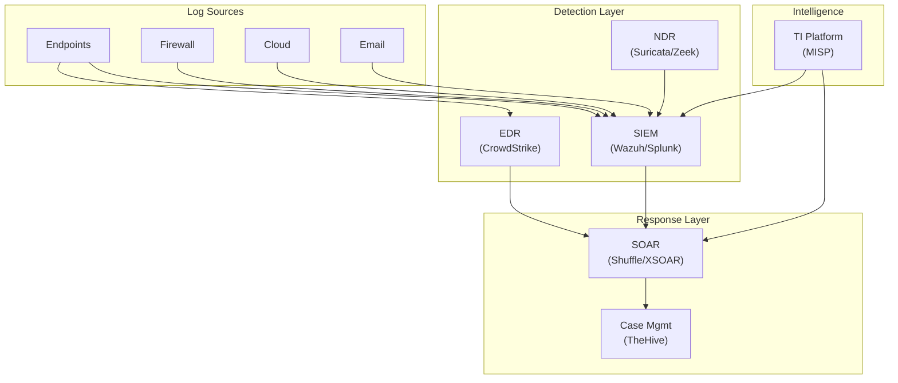

# คู่มือเลือก Technology Stack สำหรับ SOC

> **รหัสเอกสาร:** TECH-001  
> **เวอร์ชัน:** 1.0  
> **อัปเดตล่าสุด:** 2026-02-15  
> **อ่านก่อน:** [แผนงานสร้าง SOC](SOC_Building_Roadmap.th.md)

---

## เลือกตาม 3 ปัจจัย: งบ × Infrastructure × ทักษะทีม

---

## Stack A: Open-Source ทั้งหมด (฿0 License)

**เหมาะกับ:** startup, ทีมเล็ก, งบจำกัด

| ชั้น | เครื่องมือ |
|:---|:---|
| SIEM | Wazuh 4.x |
| Endpoint | Wazuh Agent |
| Network IDS | Suricata |
| Threat Intel | MISP + OpenCTI |
| Ticketing | TheHive + Cortex |
| SOAR | Shuffle |
| Vuln Scan | OpenVAS |

**เซิร์ฟเวอร์ขั้นต่ำ:** 4–5 VMs, 16 cores, 40GB RAM, 720GB disk

| ✅ ข้อดี | ❌ ข้อเสีย |
|:---|:---|
| ไม่มีค่า license | ต้องมีทักษะ Linux |
| ควบคุมข้อมูลเองทั้งหมด | ต้องดูแล update เอง |
| ปรับแต่งได้ทุกอย่าง | ไม่มี vendor support |

---

## Stack B: Microsoft (มี M365 อยู่แล้ว)

| ชั้น | เครื่องมือ |
|:---|:---|
| SIEM | Microsoft Sentinel |
| Endpoint | Defender for Endpoint |
| Identity | Entra ID Protection |
| Email | Defender for Office 365 |
| SOAR | Sentinel Playbooks |

**ค่าใช้จ่าย ~500 users:** ~฿1.7M/เดือน

> **Tip:** ถ้ามี M365 E5 อยู่แล้ว เปิด Sentinel ได้เลย — มี SIEM ใน 1 วัน!

---

## Stack C: AWS-Centric

| ชั้น | เครื่องมือ |
|:---|:---|
| SIEM | Security Lake + OpenSearch |
| Cloud Security | GuardDuty |
| Config | AWS Config + Security Hub |
| EDR | CrowdStrike / SentinelOne (ซื้อเพิ่ม) |

---

## Stack D: Elastic (ยืดหยุ่น)

| ชั้น | เครื่องมือ |
|:---|:---|
| SIEM | Elastic Security (Free tier) |
| Endpoint | Elastic Agent (Defend) |
| SOAR | n8n / Shuffle |
| Threat Intel | MISP + Elastic TI module |

---

## ตารางเปรียบเทียบ

| คุณสมบัติ | Open-Source | Microsoft | AWS | Elastic |
|:---|:---:|:---:|:---:|:---:|
| ค่า license | ฿0 | ฿฿฿ | ฿฿ | ฿ |
| ตั้งค่ายากไหม | 🔴 ยาก | 🟢 ง่าย | 🟡 กลาง | 🟡 กลาง |
| ใช้ได้เร็ว | 2–4 สัปดาห์ | 1–3 วัน | 1–2 สัปดาห์ | 1–2 สัปดาห์ |
| Multi-cloud | ⚠️ | ⚠️ | ⚠️ | ✅ |
| Vendor lock-in | ไม่มี | สูง | สูง | ต่ำ |

---

## ผังตัดสินใจ

```
เริ่ม
 ├─ มี M365 E5 อยู่? → YES → Stack B (Microsoft)
 └─ NO
    ├─ ใช้ AWS เป็นหลัก? → YES → Stack C (AWS)
    └─ NO
       ├─ งบ > ฿5M/ปี? → YES → Stack D (Elastic)
       └─ NO → Stack A (Open-Source)
```

---

## Stack Comparison: Open-Source vs Commercial

| หมวด | Open-Source | Commercial | หมายเหตุ |
|:---|:---|:---|:---|
| **SIEM** | Wazuh, ELK | Splunk, Sentinel | Wazuh = ดีสำหรับเริ่มต้น |
| **EDR** | Wazuh, Velociraptor | CrowdStrike, Defender | CrowdStrike = best-in-class |
| **SOAR** | Shuffle, n8n | XSOAR, Phantom | Shuffle = ดีสำหรับ SMB |
| **TI** | MISP, OpenCTI | Recorded Future, ThreatConnect | MISP = มาตรฐาน OSS |
| **Ticketing** | TheHive, RTIR | ServiceNow, Jira | TheHive = สร้างมาเพื่อ SOC |
| **Network** | Suricata, Zeek | Palo Alto, Darktrace | Suricata = IDS ที่ดีที่สุด (ฟรี) |
| **Forensics** | Autopsy, Volatility | EnCase, FTK | เพียงพอสำหรับส่วนใหญ่ |

## Integration Architecture



## เกณฑ์การเลือกเครื่องมือ

| เกณฑ์ | น้ำหนัก | คำถามสำคัญ |
|:---|:---:|:---|
| **ต้นทุน** | 25% | งบประมาณต่อปี? TCO 3 ปี? |
| **ความสามารถ** | 25% | ตอบ use cases ได้ครบ? |
| **Integration** | 20% | มี API? รองรับ tools อื่น? |
| **ง่ายต่อการใช้งาน** | 15% | ทีมใช้ได้เร็วแค่ไหน? |
| **Support / Community** | 15% | มี vendor support? ชุมชนใหญ่? |

## Recommended Stack ตามขนาดองค์กร

| ขนาด | SIEM | EDR | SOAR | TI | ค่าใช้จ่ายโดยประมาณ |
|:---|:---|:---|:---|:---|:---|
| **Startup** | Wazuh | Wazuh | n/a | MISP | ฟรี (+ infra) |
| **SMB** | Wazuh/Elastic | LimaCharlie | Shuffle | MISP | ~500K ฿/ปี |
| **Enterprise** | Splunk/Sentinel | CrowdStrike | XSOAR | ThreatConnect | ~5M+ ฿/ปี |

## Deployment Models

| รูปแบบ | ข้อดี | ข้อเสีย | เหมาะกับ |
|:---|:---|:---|:---|
| **On-Premises** | ควบคุมเต็มที่, ข้อมูลอยู่ภายใน | ต้นทุน infra สูง | หน่วยงานรัฐ, การเงิน |
| **Cloud-Native** | Scale ง่าย, ไม่ต้องดูแล infra | ค่าบริการต่อเนื่อง | Startup, SMB |
| **Hybrid** | ยืดหยุ่น, แยก sensitive data ได้ | ซับซ้อนกว่า | Enterprise |
| **MSSP** | ไม่ต้องจ้างทีมเต็ม | ควบคุมน้อยลง | SMB ที่ไม่มีทีม |

## Tool Evaluation Scorecard

| เครื่องมือ | Capability (1-5) | Ease of Use (1-5) | Integration (1-5) | Cost (1-5) | Total |
|:---|:---:|:---:|:---:|:---:|:---:|
| [เครื่องมือ A] | [X] | [X] | [X] | [X] | [XX] |
| [เครื่องมือ B] | [X] | [X] | [X] | [X] | [XX] |
| [เครื่องมือ C] | [X] | [X] | [X] | [X] | [XX] |

## Migration Considerations

| จาก | ไปยัง | ความท้าทาย | ระยะเวลา |
|:---|:---|:---|:---:|
| On-prem SIEM → Cloud SIEM | Data migration, rule conversion | 2–4 เดือน |
| Open-source → Commercial | License, training, data format | 1–3 เดือน |
| Commercial → Open-source | Feature parity, support gap | 3–6 เดือน |
| Single-vendor → Best-of-breed | Integration complexity | 2–4 เดือน |

## Technology Evaluation Matrix

### Tier-based Selection Guide

| Tier | Organization Size | Budget | SIEM Options |
|:---|:---|:---|:---|
| Starter | <50 users | <2M THB | Wazuh, ELK Stack |
| Growth | 50-500 users | 2-10M THB | Splunk, QRadar |
| Enterprise | 500+ users | 10M+ THB | Sentinel, Chronicle |

### Integration Compatibility Matrix

| Component | SIEM | EDR | SOAR | TI |
|:---|:---|:---|:---|:---|
| Splunk | - | ✅ CrowdStrike | ✅ Phantom | ✅ MISP |
| QRadar | - | ✅ Carbon Black | ✅ Resilient | ✅ ThreatConnect |
| Sentinel | - | ✅ Defender | ✅ Logic Apps | ✅ Sentinel TI |
| Wazuh | - | ✅ OSSEC | ⚠️ Manual | ✅ MISP |

### TCO Calculation Template

```
Total Cost of Ownership (3 years):
━━━━━━━━━━━━━━━━━━━━━━━━━━━━━━
License/Subscription     ████████████  40%
Infrastructure           ████████      25%
Personnel (FTE)          ██████        20%
Training & Certs         ███            10%
Integration & Customization ██          5%
━━━━━━━━━━━━━━━━━━━━━━━━━━━━━━
```

## เอกสารที่เกี่ยวข้อง

- [แผนงานสร้าง SOC](SOC_Building_Roadmap.th.md)
- [คู่มือติดตั้ง Infrastructure](Infrastructure_Setup.th.md)
- [คู่มือ Onboard Log](../06_Operations_Management/Log_Source_Onboarding.th.md)
