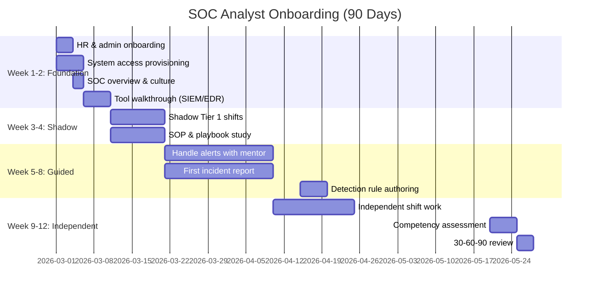

# SOC Analyst Onboarding Checklist

**Document ID**: OPS-SOP-017
**Version**: 1.0
**Classification**: Internal
**Last Updated**: 2026-02-15

> A **structured 90-day onboarding program** for new SOC analysts. Covers access provisioning, tool training, shadow shifts, and competency validation. Goal: new hires become independently productive within 90 days.

---

## Onboarding Timeline

---

## Phase 1: Foundation (Week 1–2)

### Day 1: Welcome & Admin

- [ ] Complete HR paperwork & security clearance
- [ ] Receive laptop, badges, and physical access cards
- [ ] Review and sign SOC NDA / acceptable use policy
- [ ] Meet SOC Manager and team leads
- [ ] Receive onboarding packet (this document + reading list)
- [ ] Set up communication channels (Slack, Teams, email groups)
- [ ] Add to on-call rotation calendar (observer only)

### Day 2–3: Access Provisioning

| System | Access Level | Provisioned | Verified |
|:---|:---|:---:|:---:|
| **SIEM** (search & view) | Read-only | ⬜ | ⬜ |
| **EDR Console** | Read-only | ⬜ | ⬜ |
| **Ticketing System** | Create/edit tickets | ⬜ | ⬜ |
| **SOAR** | View playbooks | ⬜ | ⬜ |
| **TI Platform** | Search IOCs | ⬜ | ⬜ |
| **Email** | SOC distribution list | ⬜ | ⬜ |
| **Wiki / Knowledge Base** | Read + contribute | ⬜ | ⬜ |
| **VPN** | SOC VPN profile | ⬜ | ⬜ |
| **Active Directory** | SOC security group | ⬜ | ⬜ |
| **SOC physical room** | 24/7 badge access | ⬜ | ⬜ |

> ⚠️ Write access to SIEM rules and EDR policies granted only after competency assessment (Week 9+).

### Day 3–5: SOC Overview

| Topic | Duration | Presenter | Materials |
|:---|:---:|:---|:---|
| SOC mission, charter, and structure | 1 hr | SOC Manager | [SOC Charter](SOC_Charter.en.md) |
| SOC tiers (1/2/3) and responsibilities | 1 hr | Team Lead | [Roles & Responsibilities](Roles_Responsibilities.en.md) |
| Shift schedule and handoff process | 30 min | Shift Lead | [SOC Checklists](../06_Operations_Management/SOC_Checklists.en.md) |
| Communication protocols | 30 min | SOC Lead | [Communication SOP](../06_Operations_Management/Communication_SOP.en.md) |
| Escalation procedures | 1 hr | SOC Lead | [Escalation Matrix](../05_Incident_Response/Escalation_Matrix.en.md) |
| Incident classification | 1 hr | Tier 2 Analyst | [Incident Classification](../05_Incident_Response/Incident_Classification.en.md) |

### Day 6–10: Tool Training

| Tool | Training Type | Duration | Trainer | Competency Check |
|:---|:---|:---:|:---|:---|
| **SIEM** | Hands-on lab | 4 hrs | Detection Engineer | Write 3 queries |
| **EDR** | Walkthrough + lab | 2 hrs | Tier 2 Analyst | Investigate 1 endpoint |
| **Ticketing** | Hands-on | 1 hr | Tier 1 Analyst | Create & close test ticket |
| **SOAR** | Demo | 1 hr | SOAR Engineer | Run 1 playbook in sandbox |
| **TI Platform** | Hands-on | 1 hr | TI Analyst | Look up 5 IOCs |
| **Internal Wiki** | Self-study | 2 hrs | Self | Navigate to 5 key SOPs |

---

## Phase 2: Shadow (Week 3–4)

### Shadow Shift Requirements

| Requirement | Details |
|:---|:---|
| **Total shadow hours** | Minimum 40 hours (5 full shifts) |
| **Shift variety** | At least 1 day shift + 1 night shift |
| **Mentor** | Assigned Tier 1/2 analyst for each shadow shift |
| **Activities** | Observe triage, watch investigations, ask questions |
| **Restrictions** | May NOT close tickets or take actions independently |
| **Log** | Document 10 interesting alerts and how they were triaged |

### Required Reading (Complete During Weeks 3–4)

| Document | Priority | Completed |
|:---|:---:|:---:|
| [IR Framework](../05_Incident_Response/Framework.en.md) | 🔴 Must | ⬜ |
| [Tier 1 Runbook](../05_Incident_Response/Tier1_Runbook.en.md) | 🔴 Must | ⬜ |
| Top 5 Playbooks (Phishing, Malware, Unauth Access, Ransomware, BEC) | 🔴 Must | ⬜ |
| [Alert Tuning SOP](../06_Operations_Management/Alert_Tuning.en.md) | 🟡 Should | ⬜ |
| [Evidence Collection](../05_Incident_Response/Evidence_Collection.en.md) | 🟡 Should | ⬜ |
| [Log Source Matrix](../06_Operations_Management/Log_Source_Matrix.en.md) | 🟡 Should | ⬜ |
| [SOC Automation Catalog](../06_Operations_Management/SOC_Automation_Catalog.en.md) | 🟢 Nice | ⬜ |

### Shadow Shift Log

| Date | Shift | Mentor | Alerts Observed | Key Learning | Mentor Sign-off |
|:---|:---:|:---|:---:|:---|:---:|
| ____-__-__ | Day/Night | ____________ | _____ | ________________________ | ⬜ |
| ____-__-__ | Day/Night | ____________ | _____ | ________________________ | ⬜ |

---

## Phase 3: Guided Work (Week 5–8)

### Guided Shift Requirements

| Requirement | Details |
|:---|:---|
| **Mentor presence** | Mentor available (same shift, not necessarily same desk) |
| **Alert handling** | Handle real alerts with mentor review before closing |
| **Escalation** | Must escalate anything P2+ to mentor |
| **Ticket quality** | Mentor reviews first 20 tickets for completeness |
| **First incident** | Write first incident report (mentor reviews) |

### Milestone Checklist

- [ ] Triage 100+ alerts independently (mentor-reviewed)
- [ ] Create 20+ properly documented tickets
- [ ] Correctly escalate at least 3 incidents
- [ ] Write 1 complete incident report
- [ ] Perform 1 guided evidence collection
- [ ] Participate in 1 shift handoff (giving handoff)
- [ ] Propose 1 alert tuning request (real FP observed)
- [ ] Pass mid-point knowledge quiz (score ≥ 70%)

### Mid-Point Knowledge Quiz Topics

| Topic | Questions | Weight |
|:---|:---:|:---:|
| Alert triage process | 5 | 20% |
| Incident classification (P1–P4) | 5 | 20% |
| SIEM query basics | 5 | 20% |
| Escalation procedures | 3 | 15% |
| Evidence handling | 3 | 15% |
| Communication protocols | 2 | 10% |

---

## Phase 4: Independent (Week 9–12)

### Independent Shift Criteria

- [ ] Mid-point quiz passed (≥ 70%)
- [ ] Mentor recommends independence
- [ ] SOC Lead approves independent shift status
- [ ] After-hours emergency contact list provided

### Week 9–12 Activities

| Activity | Completion |
|:---|:---:|
| Handle full shift independently (mentor available by phone) | ⬜ |
| Handle at least 1 P2+ incident end-to-end | ⬜ |
| Write detection rule (Sigma format) with peer review | ⬜ |
| Participate in threat hunting exercise | ⬜ |
| Complete final competency assessment | ⬜ |

---

## Competency Assessment (Day 85–90)

### Assessment Components

| Component | Weight | Assessor |
|:---|:---:|:---|
| **Written exam** (MC + short answer) | 30% | SOC Lead |
| **Practical lab** (triage 5 scenarios) | 40% | Tier 2 Mentor |
| **Ticket quality audit** (random 10 tickets) | 15% | SOC Lead |
| **Mentor evaluation** | 15% | Assigned Mentor |

### Practical Lab Scenarios

| # | Scenario | Expected Actions | Time Limit |
|:---:|:---|:---|:---:|
| 1 | Phishing email with malicious attachment | Email analysis, IOC extract, block | 20 min |
| 2 | Brute-force login followed by success | Log review, account assessment, escalate | 15 min |
| 3 | EDR alert: suspicious process | Process investigation, containment decision | 15 min |
| 4 | Data exfiltration indicators | Network analysis, scope, escalate | 20 min |
| 5 | False positive triage and documentation | Identify FP, document, propose tuning | 10 min |

### Pass Criteria

| Criteria | Required |
|:---|:---:|
| Written exam score | ≥ 70% |
| Practical lab score | ≥ 75% |
| Ticket quality score | ≥ 80% |
| Mentor recommendation | Positive |
| **Overall** | **All criteria met** |

---

## 30-60-90 Day Reviews

| Review | Date | Participants | Focus |
|:---|:---:|:---|:---|
| **30-day** | Week 4 | Analyst + Mentor + SOC Lead | Comfort level, access issues, learning gaps |
| **60-day** | Week 8 | Analyst + Mentor + SOC Lead | Skill progress, ticket quality, readiness for independence |
| **90-day** | Week 12 | Analyst + SOC Manager | Assessment results, formal role confirmation, development plan |

### Review Template

| Topic | 30-Day | 60-Day | 90-Day |
|:---|:---:|:---:|:---:|
| Tool proficiency | ⬜ | ⬜ | ⬜ |
| Alert triage quality | — | ⬜ | ⬜ |
| Communication & teamwork | ⬜ | ⬜ | ⬜ |
| SOP adherence | — | ⬜ | ⬜ |
| Escalation judgment | — | ⬜ | ⬜ |
| Documentation quality | — | ⬜ | ⬜ |
| Areas for improvement | ⬜ | ⬜ | ⬜ |
| Recommended training | ⬜ | ⬜ | ⬜ |

---

## Ongoing Development (Post-90 Days)

| Activity | Frequency | Goal |
|:---|:---:|:---|
| 1-on-1 with SOC Lead | Monthly | Career development, feedback |
| Advanced training courses | Quarterly | Skill building (threat hunting, forensics, cloud) |
| Certification pursuit | Annual | BTL1, CySA+, GCIH, GCIA |
| Cross-training (Tier 2 skills) | After 6 months | Prepare for promotion |
| Purple team participation | Quarterly | Hands-on adversary techniques |
| Conference / CTF | Annual | Industry engagement |

---

## Related Documents

-   [SOC Charter](SOC_Charter.en.md) — Mission and structure
-   [Roles & Responsibilities](Roles_Responsibilities.en.md) — Tier definitions
-   [Training Program](Training_Program.en.md) — Long-term training
-   [Tier 1 Runbook](../05_Incident_Response/Tier1_Runbook.en.md) — Day-to-day procedures
-   [IR Framework](../05_Incident_Response/Framework.en.md) — Incident response lifecycle
-   [SOC Checklists](../06_Operations_Management/SOC_Checklists.en.md) — Operational checklists
-   [Escalation Matrix](../05_Incident_Response/Escalation_Matrix.en.md) — When to escalate
