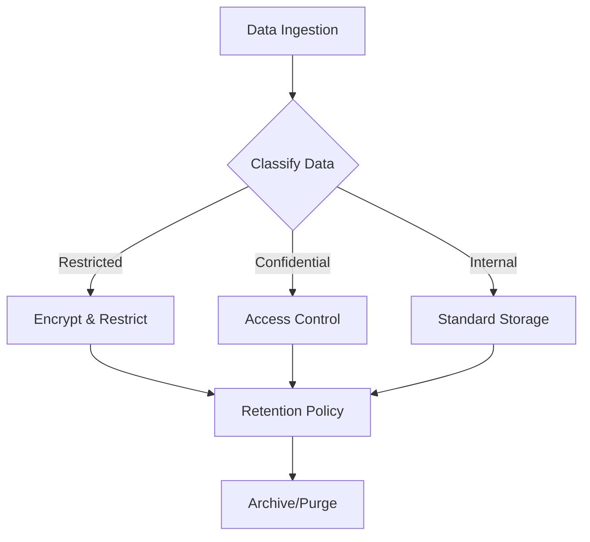
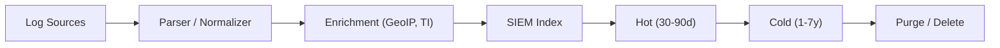

# Data Governance & Retention Policy

This document outlines the standard procedures for managing security data throughout its lifecycle.

## 1. Data Classification



Data within the SOC must be classified to determine appropriate handling and retention controls:
-   **Restricted**: Sensitive PII, Credentials, Private Keys. (Highest Protection)
-   **Confidential**: Internal IP, Network Diagrams, Vulnerability Reports.
-   **Internal**: Standard operational logs.
-   **Public**: Publicly available threat intelligence.

## 2. Retention Policy

### 2.1 Hot Storage (Immediate Access)
-   **Duration**: 30 - 90 Days.
-   **Purpose**: Real-time analysis, correlation, and immediate incident investigation.
-   **Technology**: High-performance storage (SSD/NVMe) usually within the SIEM.

### 2.2 Cold Storage (Long-term Archive)
-   **Duration**: 1 Year - 7 Years (based on compliance requirements like PCI-DSS, GDPR).
-   **Purpose**: Forensic analysis, historical trending, compliance audits.
-   **Technology**: Object Storage (S3, Blob) or Tape backup.

## 3. Data Integrity & Security

-   **Encryption**:
    -   **In-Transit**: TLS 1.2+ for all log forwarding.
    -   **At-Rest**: AES-256 encryption for storage volumes.
-   **Immutability**: Log archives should be immutable (WORM - Write Once Read Many) to prevent tampering.
-   **Access Control**: Strict least-privilege access to raw logs.

## 4. Backup & Recovery

-   **Frequency**: Daily configuration backups; Real-time or hourly data backups.
-   **Testing**: Disaster Recovery (DR) drills must be conducted quarterly to verify data restoration capabilities.

### Recovery Time Objectives

| Data Type | RTO | RPO | Backup Method |
| :--- | :---: | :---: | :--- |
| SIEM Config | 1 hour | 15 min | Automated config backup |
| Alert/Case Data | 4 hours | 1 hour | Database replication |
| Raw Logs (Hot) | 8 hours | 1 hour | Snapshot + replication |
| Raw Logs (Cold) | 24 hours | 24 hours | Object storage |
| Forensic Evidence | N/A | 0 (immutable) | WORM storage |

## 5. Log Source Data Management

### 5.1 Ingestion Pipeline



### 5.2 Data Volume Monitoring

| Metric | Threshold | Alert |
| :--- | :--- | :--- |
| Daily Ingestion Rate | > 120% of baseline | ⚠️ Capacity Warning |
| Storage Utilization | > 80% | ⚠️ Expand Storage |
| Index Size Growth | > 10% week-over-week | 📊 Review log sources |
| Query Latency (P95) | > 5 seconds | 🔴 Performance Issue |

### 5.3 Capacity Planning

- Review monthly: ingestion rate, storage growth, query performance
- Forecast quarterly: storage needs for next 12 months
- Budget annually: infrastructure costs based on data growth trends
- Monitor EPS (events per second) against SIEM license limits

## 6. Data Lifecycle Automation

| Phase | Action | Schedule | Owner |
| :--- | :--- | :--- | :--- |
| Ingest | Parse + normalize + enrich | Real-time | SOC Engineering |
| Index | Store in hot tier | Real-time | SOC Engineering |
| Tier | Move hot → cold | After 90 days | Automation |
| Archive | Compress + encrypt to cold | After 90 days | Automation |
| Purge | Delete per retention policy | Per schedule | Automation |
| Audit | Verify integrity + access logs | Monthly | SOC Manager |

## 7. Audit & Compliance

- All data access must be logged with timestamp, user, and action
- Quarterly access review of raw log data permissions
- Annual audit of retention policy compliance
- PDPA data subject access requests handled within 30 days

## 8. Minimum Governance Baseline

- [ ] **Retention approved**: Hot and cold retention periods are approved by security, legal/privacy, and data owners where required.
- [ ] **Critical log classes identified**: Identity, endpoint, network, cloud, and incident evidence data are tagged and handled consistently.
- [ ] **Access model documented**: Named roles can access raw logs, forensic evidence, and archived data with least privilege.
- [ ] **Restoration tested**: Recovery of SIEM configuration, case data, and archived logs has been validated against target RTO/RPO.
- [ ] **Purge controls active**: Data deletion follows retention policy and is auditable.

## 9. Retention Decision Criteria

| Decision Point | Minimum Input | Owner |
|:---|:---|:---|
| **Increase hot retention** | Investigations regularly require data older than current hot window, and query performance impact is understood | SOC Manager + Platform Owner |
| **Move data to cold tier** | Data remains legally or operationally necessary but no longer needs rapid search | Platform Owner |
| **Extend archive retention** | Compliance, litigation hold, or threat-hunting use case justifies cost and control impact | CISO + Legal/Privacy |
| **Approve purge** | Retention deadline is met, no hold exists, and audit trail for deletion is recorded | Data Owner + Platform Owner |

## 10. Escalation Triggers for Data Management

- [ ] **Escalate to SOC Manager** if critical logs are missing, corrupted, or delayed beyond the agreed investigation window.
- [ ] **Escalate to Platform Owner** if storage utilization exceeds forecast, restore testing fails, or archive integrity cannot be verified.
- [ ] **Escalate to CISO and Legal/Privacy** if regulated data is stored outside approved controls or retention obligations cannot be met.
- [ ] **Escalate to business owners** if data onboarding, retention, or purge constraints create investigation blind spots for critical assets.

## Capacity Planning Guide

### Storage Estimation Formula
```
Daily Storage (GB) = Average EPS × Event Size (bytes) × 86,400 / (1024^3)

Example:
  1,000 EPS × 500 bytes × 86,400 = ~40 GB/day
  Hot storage (90 days): 40 × 90 = 3.6 TB
  Cold storage (1 year): 40 × 365 = 14.6 TB
```

### Sizing by Organization

| Org Size | Estimated EPS | Daily Volume | Hot (90d) | Cold (1yr) | Recommended SIEM |
|:---|:---:|:---:|:---:|:---:|:---|
| Small (<500 users) | 100-500 | 4-20 GB | 360 GB-1.8 TB | 1.5-7 TB | Wazuh (single node) |
| Medium (500-5K) | 500-5,000 | 20-200 GB | 1.8-18 TB | 7-73 TB | Elastic (3-node) |
| Large (5K-50K) | 5,000-50,000 | 200 GB-2 TB | 18-180 TB | 73-730 TB | Splunk/Elastic cluster |

### Backup Strategy

| Component | Backup Type | Frequency | Retention | Recovery Target |
|:---|:---|:---|:---|:---|
| SIEM config | Full | Daily | 30 days | < 1 hour |
| Detection rules | Git version control | On change | Indefinite | < 15 min |
| Ticketing data | Incremental | Daily | 3 years | < 4 hours |
| TI platform (MISP) | Full | Weekly | 1 year | < 2 hours |
| SOAR playbooks | Git version control | On change | Indefinite | < 15 min |
| Dashboards | Export/JSON | Weekly | 1 year | < 1 hour |

## Database Health Check Script

Run weekly to validate SIEM database health:

```bash
#!/bin/bash
# siem_health_check.sh — Weekly SIEM DB health check

echo "=== SIEM Database Health Check ==="
echo "Date: $(date -u +%Y-%m-%dT%H:%M:%SZ)"

# 1. Check disk usage
echo "--- Disk Usage ---"
df -h /var/lib/elasticsearch 2>/dev/null || df -h /opt/splunk 2>/dev/null

# 2. Check index sizes (Elasticsearch)
curl -s 'localhost:9200/_cat/indices?v&s=store.size:desc' | head -20

# 3. Check cluster health
curl -s 'localhost:9200/_cluster/health?pretty'

# 4. Check old indices for cleanup
echo "--- Indices older than 90 days ---"
curl -s 'localhost:9200/_cat/indices?v&h=index,creation.date.string,store.size' | \
  awk -v cutoff="$(date -d '90 days ago' +%Y.%m.%d 2>/dev/null || date -v-90d +%Y.%m.%d)" \
  '$2 < cutoff { print }'
```

## Related Documents
-   [Data Handling Protocol (TLP)](../06_Operations_Management/Data_Handling_Protocol.en.md)
-   [Deployment Procedures](Deployment_Procedures.en.md)
-   [SOC Infrastructure Setup](../10_Training_Onboarding/System_Activation.en.md)

## References
-   [NIST SP 800-53 (Security/Privacy Controls)](https://csrc.nist.gov/publications/detail/sp/800-53/rev-5/final)
-   [GDPR Data Retention](https://gdpr.eu/)
