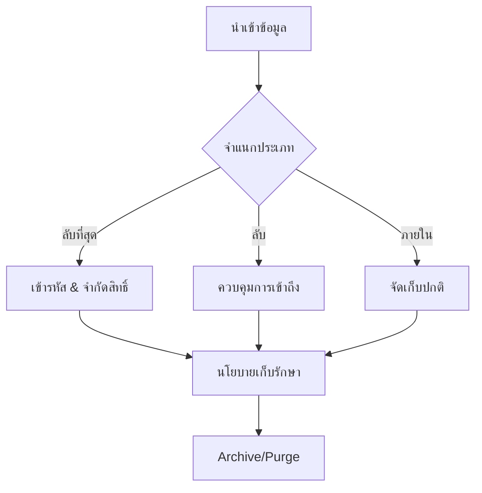

# ธรรมาภิบาลข้อมูลและนโยบายการเก็บรักษา (Data Governance & Retention Policy)

เอกสารนี้ระบุขั้นตอนมาตรฐานในการจัดการข้อมูลความปลอดภัยตลอดวงจรชีวิตของข้อมูล

## 1. การจำแนกประเภทข้อมูล (Data Classification)

ข้อมูลใน SOC ต้องได้รับการจำแนกเพื่อกำหนดการจัดการที่เหมาะสม:
-   **ลับที่สุด (Restricted)**: PII ที่ละเอียดอ่อน, รหัสผ่าน, Private Keys (ต้องป้องกันสูงสุด)
-   **ลับ (Confidential)**: ทรัพย์สินทางปัญญาภายใน, แผนผังเครือข่าย, รายงานช่องโหว่
-   **ใช้ภายใน (Internal)**: Log การทำงานทั่วไป
-   **สาธารณะ (Public)**: Threat Intelligence ที่เปิดเผยทั่วไป

## 2. นโยบายการเก็บรักษาข้อมูล (Retention Policy)

### 2.1 Hot Storage (เข้าถึงทันที)
-   **ระยะเวลา**: 30 - 90 วัน
-   **วัตถุประสงค์**: การวิเคราะห์ Real-time, Correlation, และการสืบสวนเหตุการณ์ด่วน
-   **เทคโนโลยี**: Storage ประสิทธิภาพสูง (SSD/NVMe) มักอยู่ใน SIEM

### 2.2 Cold Storage (เก็บระยะยาว)
-   **ระยะเวลา**: 1 ปี - 7 ปี (ขึ้นอยู่กับข้อกำหนดทางกฎหมาย เช่น PCI-DSS, GDPR)
-   **วัตถุประสงค์**: การวิเคราะห์ทางนิติวิทยาศาสตร์ (Forensics), ดูแนวโน้มย้อนหลัง, ตรวจสอบ (Audit)
-   **เทคโนโลยี**: Object Storage (S3, Blob) หรือ Tape backup

## 3. ความถูกต้องและความปลอดภัยของข้อมูล (Data Integrity & Security)

-   **การเข้ารหัส (Encryption)**:
    -   **In-Transit**: TLS 1.2+ สำหรับการส่ง Log ทั้งหมด
    -   **At-Rest**: เข้ารหัส AES-256 สำหรับพื้นที่จัดเก็บ
-   **ความไม่เปลี่ยนแปลง (Immutability)**: Log archive ควรเป็นแบบแก้ไขไม่ได้ (WORM - Write Once Read Many) เพื่อป้องกันการปลอมแปลง
-   **การควบคุมการเข้าถึง**: ให้สิทธิ์เท่าที่จำเป็น (Least Privilege) ในการเข้าถึง Raw Log

## 4. การสำรองและกู้คืน (Backup & Recovery)
-   **ความถี่**: สำรองค่า Configuration ทุกวัน; สำรองข้อมูล Real-time หรือทุกชั่วโมง
-   **การทดสอบ**: ต้องมีการซ้อมแผนกู้คืนภัยพิบัติ (DR) ทุกไตรมาสเพื่อยืนยันว่าสามารถกู้คืนข้อมูลได้จริง

### เป้าหมายเวลาการกู้คืน

| ประเภทข้อมูล | RTO | RPO | วิธีสำรอง |
|:---|:---:|:---:|:---|
| SIEM Config | 1 ชั่วโมง | 15 นาที | สำรอง Config อัตโนมัติ |
| Alert/Case Data | 4 ชั่วโมง | 1 ชั่วโมง | Database replication |
| Raw Logs (Hot) | 8 ชั่วโมง | 1 ชั่วโมง | Snapshot + replication |
| Raw Logs (Cold) | 24 ชั่วโมง | 24 ชั่วโมง | Object storage |
| หลักฐานทางนิติวิทยาศาสตร์ | N/A | 0 (immutable) | WORM storage |

## 5. การจัดการวงจรชีวิตข้อมูล

| ขั้นตอน | การดำเนินการ | กำหนดเวลา | ผู้รับผิดชอบ |
|:---|:---|:---|:---|
| รับเข้า | Parse + normalize + enrich | Real-time | SOC Engineering |
| จัดเก็บ | เก็บใน Hot tier | Real-time | SOC Engineering |
| ย้ายชั้น | Hot → Cold | หลัง 90 วัน | ระบบอัตโนมัติ |
| เก็บถาวร | บีบอัด + เข้ารหัส | หลัง 90 วัน | ระบบอัตโนมัติ |
| ลบ | ลบตามนโยบาย Retention | ตามกำหนด | ระบบอัตโนมัติ |
| ตรวจสอบ | ตรวจสอบความถูกต้อง + Log การเข้าถึง | รายเดือน | SOC Manager |

## 6. การตรวจสอบและการปฏิบัติตาม

- การเข้าถึงข้อมูลทั้งหมดต้องมีบันทึก timestamp, ผู้ใช้ และการดำเนินการ
- ทบทวนสิทธิ์การเข้าถึงข้อมูล Raw log รายไตรมาส
- ตรวจสอบนโยบาย Retention ประจำปี
- ดำเนินการคำขอของเจ้าของข้อมูลตาม PDPA ภายใน 30 วัน

## เอกสารที่เกี่ยวข้อง (Related Documents)
-   [โปรโตคอลการจัดการข้อมูล (TLP)](../06_Operations_Management/Data_Handling_Protocol.th.md)
-   [ขั้นตอนการ Deploy](Deployment_Procedures.th.md)
-   [การติดตั้ง SOC](../01_Onboarding/System_Activation.th.md)

## Database Performance Monitoring

### Key Metrics

| Metric | Target | Alert Threshold |
|:---|:---|:---|
| Query latency | < 100ms | > 500ms |
| Connection pool | < 70% used | > 90% |
| Storage utilization | < 75% | > 85% |
| Replication lag | < 1 sec | > 10 sec |
| Index fragmentation | < 10% | > 30% |

### Backup Verification Schedule

| Backup Type | Frequency | Verify | Retention |
|:---|:---|:---|:---|
| Full backup | Daily | Weekly restore test | 30 days |
| Transaction log | ทุก 15 min | Monthly | 7 days |
| Archive | Monthly | Quarterly | 1 year |

## References
-   [NIST SP 800-53 (Security/Privacy Controls)](https://csrc.nist.gov/publications/detail/sp/800-53/rev-5/final)
-   [GDPR Data Retention](https://gdpr.eu/)
