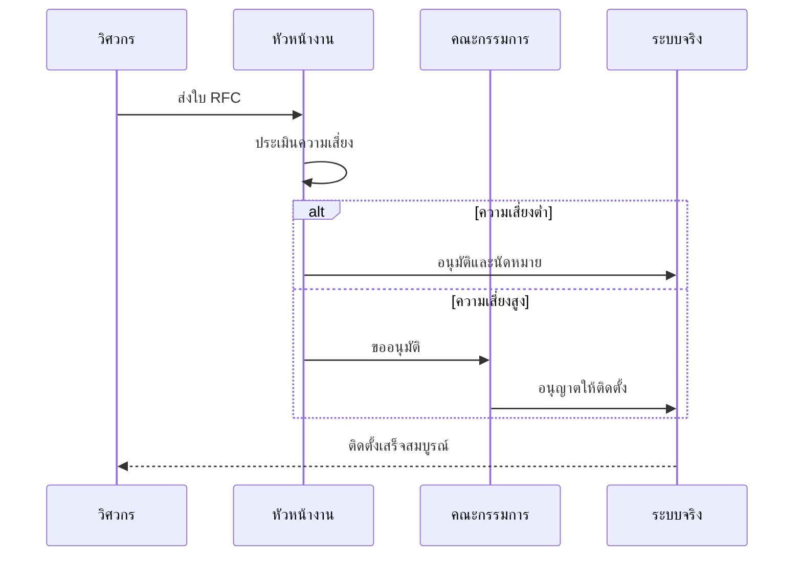

# มาตรฐานการจัดการการเปลี่ยนแปลงและการ Deploy (Change Management & Deployment Standard)

เอกสารนี้ระบุขั้นตอนมาตรฐานในการจัดการการเปลี่ยนแปลง (Change) และการติดตั้งระบบ (Deployment) ภายในสภาพแวดล้อมของ SOC

## 1. กระบวนการจัดการการเปลี่ยนแปลง (Change Management Process)

การแก้ไขทั้งหมดในสภาพแวดล้อม Production (เช่น กฎแจ้งเตือน, Parser, โครงสร้างพื้นฐาน) ต้องปฏิบัติตามขั้นตอนที่กำหนด

### 1.1 การร้องขอ (RFC)
-   ส่งคำร้องขอการเปลี่ยนแปลง (Request for Change - RFC) โดยระบุ:
    -   รายละเอียดการเปลี่ยนแปลง
    -   เหตุผล/ผลกระทบ
    -    ระดับความเสี่ยง
    -   แผนการถอยกลับ (Rollback plan)

### 1.2 การทบทวนและอนุมัติ (Review & Approval)
-   **Change Advisory Board (CAB)** จะพิจารณาการเปลี่ยนแปลงที่มีความเสี่ยงสูง
-   การแก้ไขกฎตรวจจับ (Alert Rule) ต้องผ่านการ Peer Review เสมอ

## 2. ขั้นตอนการ Deployment

### 2.1 กลยุทธ์สภาพแวดล้อม (Environment Strategy)
-   **Development/Lab**: พื้นที่ Sandbox สำหรับทดสอบกฎและ Integration ใหม่ๆ
-   **Staging**: สภาพแวดล้อมจำลองเหมือน Production เพื่อการตรวจสอบขั้นสุดท้าย
-   **Production**: ระบบจริงที่ใช้งานอยู่

### 2.2 ขั้นตอนการติดตั้ง
1.  **ทดสอบ (Test)**: ตรวจสอบความถูกต้องใน Lab
2.  **สำรองข้อมูล (Snapshot)**: สำรองค่า Configuration ปัจจุบัน
3.  **ติดตั้ง (Deploy)**: ทำการเปลี่ยนแปลงบน Production ในช่วงเวลาที่ได้รับอนุมัติ
4.  **ตรวจสอบ (Verify)**: ยืนยันสถานะการทำงานและตรวจสอบ Error

### 2.3 CI/CD สำหรับกฎตรวจจับ
-   จัดการ Detection Rules ในรูปแบบ Code (Detection-as-Code)
-   ใช้ Version Control (Git) สำหรับเก็บ Logic ของกฎทั้งหมด
-   ทำ Automated Testing (เช็ค Syntax, Unit test) ผ่าน CI pipeline ก่อน Merge เข้า `main`

## 3. แผนการถอยกลับ (Rollback Plan)

-   ทุกการ Deployment ต้องมีแผน Rollback ที่เตรียมไว้ล่วงหน้า
-   หากขั้นตอนการตรวจสอบล้มเหลว ให้ย้อนกลับไปยังสถานะก่อนหน้าทันที
-   ทำ Root Cause Analysis (RCA) สำหรับการเปลี่ยนแปลงที่ล้มเหลว

## การประเมินความเสี่ยงของการเปลี่ยนแปลง

| ระดับความเสี่ยง | เกณฑ์ | การอนุมัติ | หน้าต่างบำรุงรักษา |
|:---|:---|:---|:---|
| **ต่ำ** | เอกสาร, การเปลี่ยนแปลงที่ไม่กระทบ | SOC Lead | ทุกเวลา |
| **กลาง** | Detection rule ใหม่, อัปเดต Parser | SOC Manager | เวลาทำการ |
| **สูง** | Config SIEM, เปลี่ยน Integration | SOC Manager + CAB | หน้าต่างบำรุงรักษา |
| **วิกฤต** | โครงสร้างพื้นฐาน, เครือข่าย, Auth | CISO + CAB | Downtime ที่กำหนด |

## รายการตรวจสอบการ Deploy

| # | ขั้นตอน | ผู้รับผิดชอบ | เสร็จ |
|:---:|:---|:---|:---:|
| 1 | RFC ถูกส่งและอนุมัติ | Engineer | ☐ |
| 2 | Peer review เสร็จสมบูรณ์ | Detection Eng | ☐ |
| 3 | สร้าง Snapshot/Backup ก่อน Deploy | Engineer | ☐ |
| 4 | ทดสอบในสภาพแวดล้อม Staging | Engineer | ☐ |
| 5 | แผน Rollback มีเอกสารและทดสอบ | Engineer | ☐ |
| 6 | แจ้งผู้มีส่วนได้ส่วนเสีย | SOC Lead | ☐ |
| 7 | Deploy ไปยัง Production | Engineer | ☐ |
| 8 | ตรวจสอบหลัง Deploy 30 นาที | SOC Lead | ☐ |
| 9 | ปิด RFC พร้อมบันทึกผลลัพธ์ | Engineer | ☐ |

## เอกสารที่เกี่ยวข้อง (Related Documents)
-   [แบบฟอร์ม Change Request](../templates/change_request_rfc.th.md)
-   [ธรรมาภิบาลข้อมูล](Database_Management.th.md)
-   [การติดตั้ง SOC](../01_Onboarding/System_Activation.th.md)

### Deployment Checklist

| Phase | Checklist Item | Status |
|:---|:---|:---|
| Pre-deploy | Backup current config | ☐ |
| Pre-deploy | Test in staging | ☐ |
| Pre-deploy | Change approval | ☐ |
| Deploy | Execute change | ☐ |
| Deploy | Verify functionality | ☐ |
| Post-deploy | Monitor 30 min | ☐ |
| Post-deploy | Update documentation | ☐ |
| Post-deploy | Close change record | ☐ |

## References
-   [ITIL Change Management](https://www.axelos.com/best-practice-solutions/itil)
-   [DevSecOps Manifesto](https://www.devsecops.org/)
