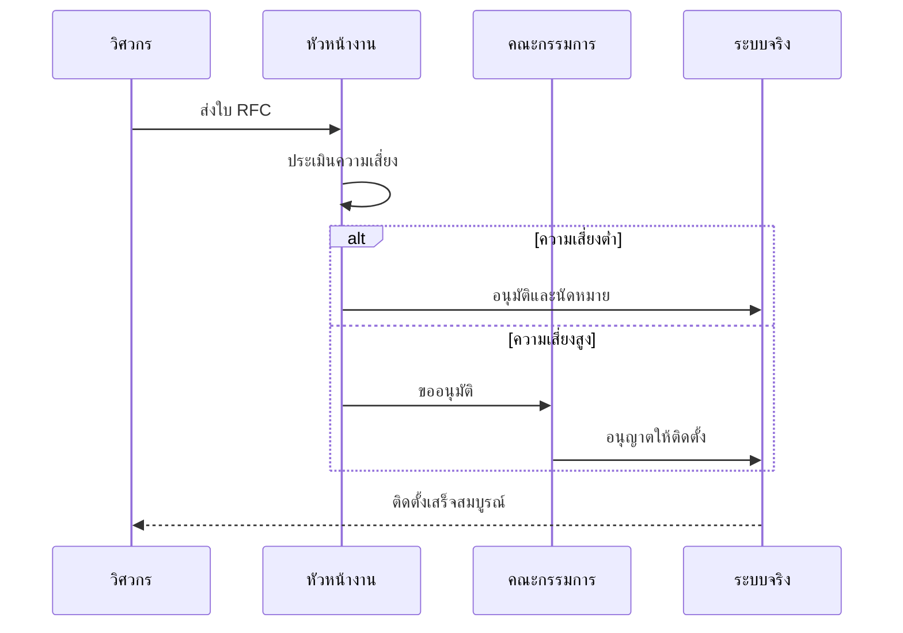

# มาตรฐานการจัดการการเปลี่ยนแปลงและการ Deploy (Change Management & Deployment Standard)

เอกสารนี้ระบุขั้นตอนมาตรฐานในการจัดการการเปลี่ยนแปลง (Change) และการติดตั้งระบบ (Deployment) ภายในสภาพแวดล้อมของ SOC

## 1. กระบวนการจัดการการเปลี่ยนแปลง (Change Management Process)

การแก้ไขทั้งหมดในสภาพแวดล้อม Production (เช่น กฎแจ้งเตือน, Parser, โครงสร้างพื้นฐาน) ต้องปฏิบัติตามขั้นตอนที่กำหนด


```mermaid
sequenceDiagram
    participant Eng as วิศวกร
    participant Mgr as หัวหน้างาน
    participant CAB as คณะกรรมการ
    participant Prod as ระบบจริง
    
    Eng->>Mgr: ส่งใบ RFC
    Mgr->>Mgr: ประเมินความเสี่ยง
    alt ความเสี่ยงต่ำ
        Mgr->>Prod: อนุมัติและนัดหมาย
    else ความเสี่ยงสูง
        Mgr->>CAB: ขออนุมัติ
        CAB->>Prod: อนุญาตให้ติดตั้ง
    end
    Prod-->>Eng: ติดตั้งเสร็จสมบูรณ์
```

### 1.1 การร้องขอ (RFC)
-   ส่งคำร้องขอการเปลี่ยนแปลง (Request for Change - RFC) โดยระบุ:
    -   รายละเอียดการเปลี่ยนแปลง
    -   เหตุผล/ผลกระทบ
    -    ระดับความเสี่ยง
    -   แผนการถอยกลับ (Rollback plan)

### 1.2 การทบทวนและอนุมัติ (Review & Approval)
-   **Change Advisory Board (CAB)** จะพิจารณาการเปลี่ยนแปลงที่มีความเสี่ยงสูง
-   การแก้ไขกฎตรวจจับ (Alert Rule) ต้องผ่านการ Peer Review เสมอ

## 2. ขั้นตอนการ Deployment

### 2.1 กลยุทธ์สภาพแวดล้อม (Environment Strategy)
-   **Development/Lab**: พื้นที่ Sandbox สำหรับทดสอบกฎและ Integration ใหม่ๆ
-   **Staging**: สภาพแวดล้อมจำลองเหมือน Production เพื่อการตรวจสอบขั้นสุดท้าย
-   **Production**: ระบบจริงที่ใช้งานอยู่

### 2.2 ขั้นตอนการติดตั้ง
1.  **ทดสอบ (Test)**: ตรวจสอบความถูกต้องใน Lab
2.  **สำรองข้อมูล (Snapshot)**: สำรองค่า Configuration ปัจจุบัน
3.  **ติดตั้ง (Deploy)**: ทำการเปลี่ยนแปลงบน Production ในช่วงเวลาที่ได้รับอนุมัติ
4.  **ตรวจสอบ (Verify)**: ยืนยันสถานะการทำงานและตรวจสอบ Error

### 2.3 CI/CD สำหรับกฎตรวจจับ
-   จัดการ Detection Rules ในรูปแบบ Code (Detection-as-Code)
-   ใช้ Version Control (Git) สำหรับเก็บ Logic ของกฎทั้งหมด
-   ทำ Automated Testing (เช็ค Syntax, Unit test) ผ่าน CI pipeline ก่อน Merge เข้า `main`

## 3. แผนการถอยกลับ (Rollback Plan)

-   ทุกการ Deployment ต้องมีแผน Rollback ที่เตรียมไว้ล่วงหน้า
-   หากขั้นตอนการตรวจสอบล้มเหลว ให้ย้อนกลับไปยังสถานะก่อนหน้าทันที
-   ทำ Root Cause Analysis (RCA) สำหรับการเปลี่ยนแปลงที่ล้มเหลว

## การประเมินความเสี่ยงของการเปลี่ยนแปลง

| ระดับความเสี่ยง | เกณฑ์ | การอนุมัติ | หน้าต่างบำรุงรักษา |
|:---|:---|:---|:---|
| **ต่ำ** | เอกสาร, การเปลี่ยนแปลงที่ไม่กระทบ | SOC Lead | ทุกเวลา |
| **กลาง** | Detection rule ใหม่, อัปเดต Parser | SOC Manager | เวลาทำการ |
| **สูง** | Config SIEM, เปลี่ยน Integration | SOC Manager + CAB | หน้าต่างบำรุงรักษา |
| **วิกฤต** | โครงสร้างพื้นฐาน, เครือข่าย, Auth | CISO + CAB | Downtime ที่กำหนด |

## รายการตรวจสอบการ Deploy

| # | ขั้นตอน | ผู้รับผิดชอบ | เสร็จ |
|:---:|:---|:---|:---:|
| 1 | RFC ถูกส่งและอนุมัติ | Engineer | ☐ |
| 2 | Peer review เสร็จสมบูรณ์ | Detection Eng | ☐ |
| 3 | สร้าง Snapshot/Backup ก่อน Deploy | Engineer | ☐ |
| 4 | ทดสอบในสภาพแวดล้อม Staging | Engineer | ☐ |
| 5 | แผน Rollback มีเอกสารและทดสอบ | Engineer | ☐ |
| 6 | แจ้งผู้มีส่วนได้ส่วนเสีย | SOC Lead | ☐ |
| 7 | Deploy ไปยัง Production | Engineer | ☐ |
| 8 | ตรวจสอบหลัง Deploy 30 นาที | SOC Lead | ☐ |
| 9 | ปิด RFC พร้อมบันทึกผลลัพธ์ | Engineer | ☐ |

## ขั้นตอน Rollback

### เมื่อไรต้อง Rollback
| สัญญาณ | การดำเนินการ |
|:---|:---|
| SIEM หยุดรับ log | Rollback ทันที |
| ปริมาณ alert ลดเป็น 0 | ตรวจสอบก่อน, rollback ถ้าแก้ไม่ได้ใน 15 นาที |
| FP rate พุ่ง > 50% | Rollback rule change, สืบสวน |
| Dashboard/query error | Rollback config change |
| Agent crash หลัง update | Rollback agent version |

### Rollback Checklist
```
□ ระบุการเปลี่ยนแปลงที่ทำให้เกิดปัญหา
□ แจ้ง SOC Manager ว่ากำลัง rollback
□ Apply rollback จาก backup/git
□ ตรวจสอบว่าระบบกลับสู่สภาพปกติ
□ บันทึก failed change และ root cause
□ นัด post-mortem ภายใน 48 ชม.
```

## ตาราง Change Window

| ประเภท Change | ช่วงเวลาอนุญาต | ต้อง Approval | เวลา Rollback |
|:---|:---|:---|:---|
| Detection rule (ใหม่) | เวลาไหนก็ได้ (test mode) | SOC Lead | < 5 นาที |
| Detection rule (production) | เวลาทำการ | SOC Lead + peer review | < 5 นาที |
| SIEM configuration | Maintenance window (อา. 02:00-06:00) | SOC Manager | < 30 นาที |
| Agent update (fleet) | Staged: 10% → 50% → 100% ใน 3 วัน | SOC Manager + IT | < 1 ชม. |
| Major platform upgrade | Maintenance window + CAB approval | CISO | < 4 ชม. |

## Smoke Test หลัง Deploy

หลังจาก deployment ใดๆ ให้รันขั้นตอนตรวจสอบ:

```bash
#!/bin/bash
# smoke_test.sh — ตรวจสอบหลัง deployment

echo "=== Post-Deployment Smoke Test ==="

# 1. เชื่อมต่อ SIEM
echo -n "SIEM API: "
curl -s -o /dev/null -w "%{http_code}" https://siem.internal/api/health && echo " ✅" || echo " ❌"

# 2. ตรวจ log ingestion (5 นาทีล่าสุด)
echo -n "Log ingestion: "
RECENT=$(curl -s 'localhost:9200/_count?q=@timestamp:>now-5m' | grep -o '"count":[0-9]*')
echo "$RECENT events ใน 5 นาทีล่าสุด"

# 3. Detection rules
echo -n "Active rules: "
echo "$(curl -s 'localhost:9200/_cat/count/sigma-*' | awk '{print $3}') rules loaded"

# 4. Alert routing
echo "ส่ง test alert..."
```

## เกณฑ์ขั้นต่ำก่อน Release (Minimum Release Criteria)

- [ ] **กำหนดขอบเขตและความเสี่ยงแล้ว**: change record ระบุระบบที่กระทบ ผลกระทบเชิงปฏิบัติการ และ rollback owner
- [ ] **เก็บหลักฐานก่อนเปลี่ยนแปลงแล้ว**: มี baseline screenshot, config export หรือ rule version reference ก่อน deploy
- [ ] **เตรียมแผน validation แล้ว**: success criteria, smoke tests และ observation window ถูกบันทึกไว้
- [ ] **rollback ทำได้จริง**: ทีมสามารถคืนค่าระบบสู่สถานะก่อนหน้าได้ภายในเวลาที่อนุมัติ
- [ ] **แจ้งผู้เกี่ยวข้องแล้ว**: ทีม SOC, service owner ที่ได้รับผลกระทบ และ on-call responder ทราบ change window และ fallback plan

## Trigger สำหรับ Emergency Change

| Trigger | เส้นทางอนุมัติ | เอกสารขั้นต่ำ |
|:---|:---|:---|
| **มี incident จริงที่ต้องเปลี่ยน control ทันที** | SOC Manager + incident lead | เปลี่ยนอะไร ทำไมเร่งด่วน และ rollback path |
| **critical detection หรือ ingestion outage** | SOC Manager | ขอบเขต outage, temporary mitigation และ verification plan |
| **มี security exposure ที่รอรอบถัดไปไม่ได้** | CISO หรือผู้ได้รับมอบหมาย | risk statement, blast radius ที่คาด และ recovery owner |

## Trigger การ Escalate ระหว่าง Deployment

- [ ] **Escalate ทันที** ถ้า critical log sources หยุดเข้า, alert routing พัง หรือ authentication ใน production ได้รับผลกระทบ
- [ ] **Escalate ไป SOC Manager** ถ้า smoke test ไม่ผ่าน, rollback เกินเวลาที่กำหนด หรือ monitoring แสดงการเสื่อมสภาพที่มีนัยสำคัญ
- [ ] **Escalate ไป CISO** ถ้ามี emergency downtime, security coverage loss หรือบริการที่ผู้บริหารใช้งานได้รับผลกระทบ

## เอกสารที่เกี่ยวข้อง (Related Documents)
-   [แบบฟอร์ม Change Request](../11_Reporting_Templates/change_request_rfc.th.md)
-   [ธรรมาภิบาลข้อมูล](Database_Management.th.md)
-   [การติดตั้ง SOC](../10_Training_Onboarding/System_Activation.th.md)

## Checklist การ Deploy (Deployment Checklist)

| Phase | Checklist Item | Status |
|:---|:---|:---|
| Pre-deploy | Backup current config | ☐ |
| Pre-deploy | Test in staging | ☐ |
| Pre-deploy | Change approval | ☐ |
| Deploy | Execute change | ☐ |
| Deploy | Verify functionality | ☐ |
| Post-deploy | Monitor 30 min | ☐ |
| Post-deploy | Update documentation | ☐ |
| Post-deploy | Close change record | ☐ |

## เกณฑ์การ Rollback (Rollback Criteria)

| Condition | Action |
|:---|:---|
| Core function broken | Immediate rollback |
| Performance > 20% drop | Rollback within 1 hr |
| Non-critical issue | Hotfix preferred |
| Cosmetic only | Fix in next release |

## References
-   [ITIL Change Management](https://www.axelos.com/best-practice-solutions/itil)
-   [DevSecOps Manifesto](https://www.devsecops.org/)
