# Detection Engineering Lifecycle

This document defines the end-to-end lifecycle for creating, maintaining, tuning, and retiring detection rules within the SOC. Detection engineering transforms threat intelligence into actionable alerts.

---

## Lifecycle Overview

```mermaid
graph TD
    Req["📋 1. Requirement & Research"] --> Dev["⚙️ 2. Development"]
    Dev --> Test["🧪 3. Testing & Tuning"]
    Test --> Deploy["🚀 4. Deployment"]
    Deploy --> Monitor["📊 5. Monitoring"]
    Monitor --> Review["🔄 6. Review / Retire"]
    Review --> Req
```



---

## 1. Requirement & Research

| Input | Action | Output |
|:---|:---|:---|
| Threat Intel reports | Analyze TTPs, IoCs, CVEs | Rule requirements doc |
| MITRE ATT&CK gaps | Map coverage heatmap | Prioritized technique list |
| Incident post-mortems | Extract detection gaps | Improvement tickets |
| Business context | Identify critical assets and data | Risk-weighted priorities |
| Regulatory requirements | Map PDPA/ISO 27001 controls | Compliance detection needs |

### Prioritization

| Priority | Criteria | Examples |
|:---:|:---|:---|
| **P1 — Critical** | Active exploitation, critical asset risk | Zero-day CVE, ransomware variant |
| **P2 — High** | Mapped to adversary TTPs targeting our sector | Credential theft, lateral movement |
| **P3 — Medium** | Coverage gap in ATT&CK matrix | Discovery techniques, collection |
| **P4 — Low** | Nice-to-have, low-risk scenarios | Shadow IT, policy violations |

---

## 2. Development

### Rule Format Standards

| Format | Use Case | Repository Path |
|:---|:---|:---|
| **Sigma** | SIEM-agnostic detection (primary format) | `08_Detection_Engineering/sigma_rules/sigma/` |
| **YARA** | File/binary analysis | `08_Detection_Engineering/sigma_rules/yara/` |
| **Snort/Suricata** | Network-level detection | `08_Detection_Engineering/sigma_rules/ids/` |

### Required Metadata

Every rule must include:

```yaml
title: Descriptive Rule Name
id: UUID (uuidgen)
status: experimental | test | stable | deprecated
level: informational | low | medium | high | critical
description: What this rule detects and why
author: Author Name
date: YYYY/MM/DD
modified: YYYY/MM/DD
references:
  - URL to threat intel or advisory
tags:
  - attack.tactic_name
  - attack.technique_id
logsource:
  category: process_creation | network_connection | ...
  product: windows | linux | ...
detection:
  selection:
    FieldName|modifier: value
  condition: selection
falsepositives:
  - Known benign scenarios
```

### Naming Convention

```
{platform}_{category}_{description}.yml

Examples:
  win_proc_mimikatz_execution.yml
  cloud_aws_s3_public_access.yml
  net_dns_tunneling.yml
```

---

## 3. Testing & Tuning

### Testing Checklist

| # | Step | Method | Pass Criteria |
|:---:|:---|:---|:---|
| 1 | **Syntax validation** | `sigmac --check` or CI validator | No syntax errors |
| 2 | **Historical data** | Run against 30-day log archive | Expected alerts fire |
| 3 | **Attack simulation** | Atomic Red Team / manual emulation | Alert triggers within 5 min |
| 4 | **False positive check** | Monitor for 7 days in "experimental" mode | FPR < 10% |
| 5 | **Performance** | Check SIEM query execution time | < 30 seconds |
| 6 | **Peer review** | Code review by second engineer | Approved |

### Tuning Actions

| FPR Range | Action | Timeline |
|:---:|:---|:---|
| **< 5%** | Promote to **stable** | Immediate |
| **5–15%** | Add whitelist/exceptions, re-test | 1 week |
| **15–30%** | Redesign logic, narrow scope | 2 weeks |
| **> 30%** | Deprecate or fundamentally rework | Immediate |

---

## 4. Deployment

### Promotion Path

```
experimental → test → stable → deprecated
```

| Stage | Environment | Duration | Approval |
|:---|:---|:---|:---|
| **Experimental** | Dev/Lab SIEM | Until initial testing passes | Detection Engineer |
| **Test** | Production (silent mode / low priority) | 7 days minimum | SOC Lead |
| **Stable** | Production (full alerting) | Ongoing | SOC Lead + peer review |
| **Deprecated** | Removed from active detection | N/A | SOC Lead + RFC |

### Deployment Process

1. Submit rule via [Change Request (RFC)](../templates/change_request_rfc.en.md)
2. Deploy to staging SIEM
3. Validate against test cases
4. Promote to production
5. Update [Detection Rules Index](../08_Detection_Engineering/README.en.md)

---

## 5. Monitoring

### Key Metrics Per Rule

| Metric | Target | Alert If |
|:---|:---|:---|
| **Alert Volume** | Baseline ± 20% | Sudden spike or drop |
| **True Positive Rate** | ≥ 90% | < 70% |
| **Mean Triage Time** | < 10 min | > 30 min |
| **Analyst Feedback** | Positive/Neutral | ≥ 3 negative ratings |
| **Query Time** | < 30 sec | > 60 sec (performance issue) |

---

## 6. Review & Deprecation

### Quarterly Audit Checklist

| # | Check | Action if Failed |
|:---:|:---|:---|
| 1 | Does the rule still map to an active threat? | Consider deprecation |
| 2 | Is FPR still within acceptable range? | Tune or retire |
| 3 | Has the log source changed format/schema? | Update parser |
| 4 | Are there duplicate or overlapping rules? | Consolidate |
| 5 | Is the rule's MITRE mapping still accurate? | Update tags |
| 6 | Has the rule been triggered in past 90 days? | If not, evaluate relevance |

### Deprecation Process

1. Set status to `deprecated` in rule file
2. Disable rule in SIEM (do not delete — archive)
3. Update Detection Rules Index
4. Document reason in rule changelog

---

## Related Documents

- [Integration Hub](Integration_Hub.en.md)
- [IR Framework](../05_Incident_Response/Framework.en.md)
- [Detection Rules Index](../08_Detection_Engineering/README.en.md)
- [Alert Tuning SOP](../06_Operations_Management/Alert_Tuning.en.md)
- [Detection Rule Testing](../06_Operations_Management/Detection_Rule_Testing.en.md)
- [Atomic Test Map](../09_Simulation_Testing/Atomic_Test_Map.en.md)

## References

- [Detection Engineering Weekly](https://detectionengineering.net/)
- [MITRE ATT&CK](https://attack.mitre.org/)
- [Sigma Rule Specification](https://github.com/SigmaHQ/sigma-specification)
- [Palantir Detection Engineering Guide](https://blog.palantir.com/alerting-and-detection-strategy-framework-52dc33722df2)
