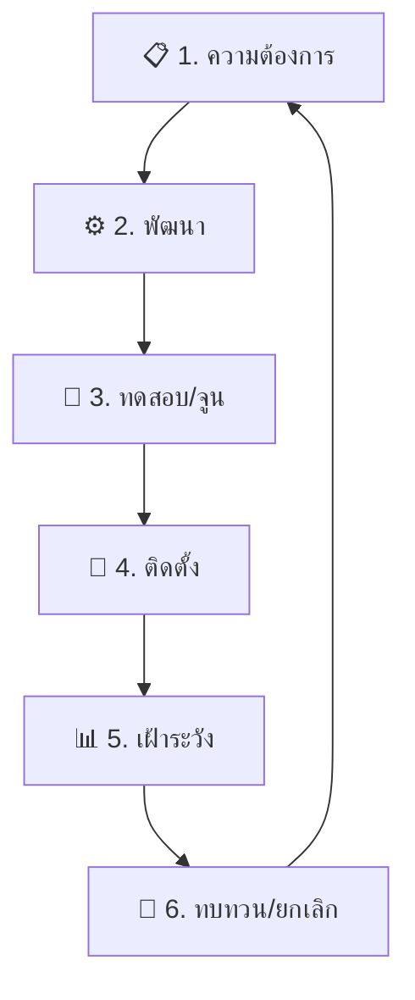
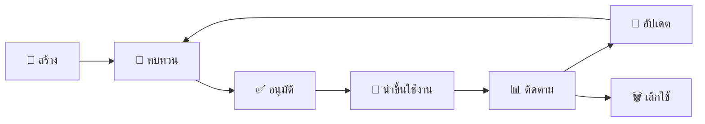

# วงจรชีวิตวิศวกรรมการตรวจจับ (Detection Engineering Lifecycle)

เอกสารนี้กำหนดวงจรชีวิตตั้งแต่การสร้าง ดูแลรักษา ปรับจูน และยกเลิกกฎการตรวจจับภายใน SOC

---

## ภาพรวมวงจรชีวิต


```mermaid
graph TD
    Req["📋 1. ความต้องการ"] --> Dev["⚙️ 2. พัฒนา"]
    Dev --> Test["🧪 3. ทดสอบ/จูน"]
    Test --> Deploy["🚀 4. ติดตั้ง"]
    Deploy --> Monitor["📊 5. เฝ้าระวัง"]
    Monitor --> Review["🔄 6. ทบทวน/ยกเลิก"]
    Review --> Req
```

---

## 1. ความต้องการและการวิจัย

| อินพุต | การดำเนินการ | ผลลัพธ์ |
|:---|:---|:---|
| รายงาน Threat Intel | วิเคราะห์ TTPs, IoCs, CVEs | เอกสารความต้องการกฎ |
| MITRE ATT&CK gaps | สร้าง coverage heatmap | รายการ technique ที่ต้องทำ |
| Post-mortem จากเหตุการณ์ | สกัด detection gaps | ตั๋วปรับปรุง |
| บริบทธุรกิจ | ระบุสินทรัพย์สำคัญ | ลำดับความสำคัญตามความเสี่ยง |

### ลำดับความสำคัญ

| ลำดับ | เกณฑ์ | ตัวอย่าง |
|:---:|:---|:---|
| **P1** | ถูกโจมตีอยู่, เสี่ยงต่อสินทรัพย์สำคัญ | Zero-day, ransomware ใหม่ |
| **P2** | ตรงกับ TTP ที่โจมตีอุตสาหกรรมเรา | Credential theft, lateral movement |
| **P3** | ช่องว่างใน ATT&CK matrix | Discovery, Collection |
| **P4** | ดีถ้ามี, ความเสี่ยงต่ำ | Shadow IT, policy violation |

---

## 2. การพัฒนา

### มาตรฐานรูปแบบกฎ

| รูปแบบ | กรณีใช้งาน | ที่เก็บ |
|:---|:---|:---|
| **Sigma** | Detection ใน SIEM (รูปแบบหลัก) | `08_Detection_Engineering/sigma_rules/` |
| **YARA** | วิเคราะห์ไฟล์/binary | `08_Detection_Engineering/sigma_rules/yara/` |
| **Snort/Suricata** | Detection ระดับเครือข่าย | `08_Detection_Engineering/sigma_rules/ids/` |

### Metadata ที่ต้องมี

```yaml
title: ชื่อกฎที่อธิบายได้ชัดเจน
id: UUID
status: experimental | test | stable | deprecated
level: low | medium | high | critical
author: ชื่อผู้เขียน
date: YYYY/MM/DD
tags:
  - attack.tactic_name
  - attack.technique_id
```

---

## 3. ทดสอบและปรับแต่ง

| # | ขั้นตอน | วิธี | เกณฑ์ผ่าน |
|:---:|:---|:---|:---|
| 1 | ตรวจ syntax | CI validator | ไม่มี error |
| 2 | ข้อมูลย้อนหลัง | รัน 30 วันย้อนหลัง | Alert ตรงตามที่คาด |
| 3 | จำลองการโจมตี | Atomic Red Team | Alert ภายใน 5 นาที |
| 4 | ตรวจ False Positive | เฝ้า 7 วันในโหมด experimental | FPR < 10% |
| 5 | Peer review | Code review โดยวิศวกรอีกคน | อนุมัติ |

### การจัดการ FPR

| ช่วง FPR | การดำเนินการ | กรอบเวลา |
|:---:|:---|:---|
| < 5% | เลื่อนเป็น **stable** | ทันที |
| 5–15% | เพิ่ม whitelist, ทดสอบซ้ำ | 1 สัปดาห์ |
| 15–30% | ออกแบบ logic ใหม่ | 2 สัปดาห์ |
| > 30% | ยกเลิกหรือเขียนใหม่ | ทันที |

---

## 4. การติดตั้ง

### เส้นทางเลื่อนขั้น

| ขั้น | สภาพแวดล้อม | ระยะเวลา | อนุมัติโดย |
|:---|:---|:---|:---|
| **Experimental** | Dev/Lab SIEM | จนผ่านทดสอบ | Detection Engineer |
| **Test** | Production (silent mode) | ≥ 7 วัน | SOC Lead |
| **Stable** | Production (แจ้งเตือนเต็มรูปแบบ) | ต่อเนื่อง | SOC Lead + peer |
| **Deprecated** | ยกเลิกจาก detection | - | SOC Lead + RFC |

---

## 5. เฝ้าระวัง

| ตัวชี้วัด | เป้าหมาย | แจ้งเตือนเมื่อ |
|:---|:---|:---|
| ปริมาณ Alert | Baseline ± 20% | พุ่งสูงหรือลดลงมาก |
| True Positive Rate | ≥ 90% | < 70% |
| เวลาคัดกรองเฉลี่ย | < 10 นาที | > 30 นาที |

---

## 6. ทบทวนและยกเลิก

### ตรวจสอบรายไตรมาส

| # | ตรวจสอบ | การแก้ไข |
|:---:|:---|:---|
| 1 | กฎยังตรงกับภัยคุกคามที่ใช้งานอยู่? | พิจารณายกเลิก |
| 2 | FPR ยังอยู่ในเกณฑ์? | ปรับจูนหรือยกเลิก |
| 3 | Log source เปลี่ยน format? | อัปเดต parser |
| 4 | มีกฎซ้ำซ้อน? | รวมกฎ |
| 5 | กฎ trigger ภายใน 90 วันที่ผ่านมา? | ประเมินความเกี่ยวข้อง |

## 7. ชุดข้อมูลขั้นต่ำก่อนปล่อย Detection (Minimum Detection Release Pack)

- [ ] **มี use case ชัดเจนแล้ว**: ระบุ threat, asset scope, required telemetry และ expected analyst action
- [ ] **เก็บหลักฐานการทดสอบแล้ว**: มี syntax validation, historical replay, simulation result และผล peer review
- [ ] **เตรียมแผนรับ false positive แล้ว**: ระบุ benign scenario ที่พบบ่อยและ tuning action แรกก่อน go-live
- [ ] **ระบุ owner แล้ว**: มีเจ้าของ detection ที่รับผิดชอบ tuning, review cadence และ feedback จาก incident

## 8. ตารางตัดสินใจปล่อย Detection

| การตัดสินใจ | เงื่อนไขขั้นต่ำ | ผู้รับผิดชอบ |
|:---|:---|:---|
| **เลื่อนเป็น test** | syntax ผ่าน, logic ผูกกับ use case จริง, และรู้ expected output | Detection Engineer |
| **เลื่อนเป็น stable** | historical validation ผ่าน, simulation ใช้งานได้, และ analyst ยืนยันว่า actionable | SOC Lead |
| **ต้อง retune** | false positives, query cost หรือ triage burden เกิน threshold ที่ตกลงไว้ | Detection Owner |
| **ยกเลิก** | log source หาย, technique ไม่เกี่ยวข้องแล้ว หรือ rule value ไม่คุ้ม noise/cost | SOC Lead + RFC Owner |

## 9. Trigger การ Escalate สำหรับ Detection Content

- [ ] **Escalate ไป SOC Manager** ถ้า Priority 1 use case ยังไม่มี detection owner หรือไม่มี telemetry path ที่ใช้งานได้
- [ ] **Escalate ไป Security Engineering** ถ้า query performance, parser quality หรือ schema instability ทำให้ deploy อย่างเชื่อถือไม่ได้
- [ ] **Escalate ไป CISO** ถ้า critical detection gap ค้างอยู่กับทรัพย์สินสำคัญหรือเกิด incident ซ้ำ

---

## Content Lifecycle


```mermaid
graph LR
    Create["📝 สร้าง"] --> Review["👀 ทบทวน"]
    Review --> Approve["✅ อนุมัติ"]
    Approve --> Deploy["🚀 นำขึ้นใช้งาน"]
    Deploy --> Monitor["📊 ติดตาม"]
    Monitor --> Update["🔄 อัปเดต"]
    Update --> Review
    Monitor --> Retire["🗑️ เลิกใช้"]
```

## Content Inventory Template

| Content ID | ประเภท | ชื่อ | เวอร์ชัน | Owner | Last Review | Status |
|:---|:---|:---|:---:|:---|:---:|:---:|
| SIG-001 | Sigma Rule | Suspicious PowerShell | 1.2 | DetEng | 2026-01 | Active |
| PB-001 | Playbook | Phishing Response | 2.1 | SOC Lead | 2026-01 | Active |
| YAR-001 | YARA Rule | Ransomware Family X | 1.0 | Malware Analyst | 2025-12 | Active |

## Content Quality Metrics

| ตัวชี้วัด | เป้าหมาย | ปัจจุบัน |
|:---|:---|:---|
| Detection rules with owner assigned | 100% | [XX]% |
| Rules reviewed in last 6 months | ≥ 80% | [XX]% |
| Rules with MITRE mapping | ≥ 90% | [XX]% |
| Playbooks with Mermaid diagrams | ≥ 90% | [XX]% |
| Average FP rate across all rules | < 10% | [XX]% |

## เอกสารที่เกี่ยวข้อง

- [ศูนย์รวมการเชื่อมต่อ](Integration_Hub.th.md)
- [กรอบ IR](../05_Incident_Response/Framework.th.md)
- [SOP ปรับจูน Alert](../06_Operations_Management/Alert_Tuning.th.md)
- [Atomic Test Map](../09_Simulation_Testing/Atomic_Test_Map.th.md)

## แนวทางบริหารวงจรชีวิตเนื้อหา (Content Lifecycle Management)

| Phase | Activity | Owner | Frequency |
|:---|:---|:---|:---|
| Create | สร้าง rule/playbook | Engineer | As needed |
| Review | Peer review + test | Senior Analyst | Per change |
| Approve | ด่านคุณภาพ | SOC Manager | ทุกครั้งที่มีการเปลี่ยนแปลง |
| Deploy | นำขึ้นใช้งานจริง | Engineer | หลังอนุมัติ |
| Monitor | Track FP/TP rates | Analyst | Weekly |
| Retire | Archive outdated | Engineer | Quarterly |

## Checklist คุณภาพเนื้อหา (Content Quality Checklist)
- [ ] มี MITRE ATT&CK mapping
- [ ] ทดสอบใน staging แล้ว
- [ ] มี expected output/alert sample
- [ ] Documentation ครบถ้วน
- [ ] False positive rate < 10%

## สรุปประเภทเนื้อหา (Content Types Summary)

| Type | Format | Owner |
|:---|:---|:---|
| Detection rules | YAML/SPL | Engineer |
| Playbooks | Markdown | Analyst |
| Dashboards | JSON | Engineer |
| Reports | Template | Manager |

## References

- [Detection Engineering Weekly](https://detectionengineering.net/)
- [MITRE ATT&CK](https://attack.mitre.org/)
- [Sigma Rule Specification](https://github.com/SigmaHQ/sigma-specification)
