# กลยุทธ์การเชื่อมต่อเครื่องมือ (Tool Integration Strategy)

เอกสารนี้กำหนดกลยุทธ์สำหรับเชื่อมต่อเครื่องมือด้านความปลอดภัยและแหล่ง Log เข้าสู่สถาปัตยกรรม SOC เพื่อลดจุดบอด เร่งการตรวจจับ และเปิดใช้งานการตอบสนองอัตโนมัติ

---

## สถาปัตยกรรมการเชื่อมต่อ

```mermaid
graph LR
    Source["🔌 แหล่ง Log"] -->|ส่งข้อมูล| Collect["📥 รวบรวม"]
    Collect -->|ปรับมาตรฐาน| Normalize["⚙️ Normalization"]
    Normalize -->|เติมบริบท| Enrich["🧠 Enrichment"]
    Enrich -->|จัดเก็บ| SIEM["💾 SIEM / Data Lake"]
    SIEM -->|ตรวจจับ| Rules["🔍 กฎตรวจจับ"]
    Rules -->|แจ้งเตือน| Alert["🚨 คิว Alert"]
    Alert -->|ตอบสนอง| SOAR["🤖 SOAR"]
```

---

## 1. การเชื่อมต่อ Log Source

### 1.1 กลไกการส่งข้อมูล

| กลไก | เหมาะสำหรับ | โปรโตคอล | ตัวอย่าง Agent |
|:---|:---|:---|:---|
| **API Polling** | Cloud (AWS, M365, SaaS) | REST/GraphQL | Native collectors |
| **Agent-based** | Server, Endpoint | Syslog, custom | Filebeat, Winlogbeat, OSQuery |
| **Syslog** | อุปกรณ์เครือข่าย, Firewall | UDP/TCP 514 | rsyslog, syslog-ng |
| **Webhook** | SaaS alerts, custom apps | HTTPS | N/A (push) |
| **SNMP Trap** | Network monitoring | UDP 162 | SNMP manager |

### 1.2 มาตรฐาน Normalization

| ฟิลด์ | คำอธิบาย | รูปแบบ | ตัวอย่าง |
|:---|:---|:---|:---|
| `@timestamp` | เวลาเหตุการณ์ | ISO 8601 UTC | `2026-02-16T07:00:00Z` |
| `source.ip` | IP ต้นทาง | IPv4/IPv6 | `10.0.1.50` |
| `destination.ip` | IP ปลายทาง | IPv4/IPv6 | `203.0.113.1` |
| `user.name` | ชื่อผู้ใช้ | String | `john.doe` |
| `host.hostname` | ชื่อเครื่อง | String | `WS-FINANCE-042` |
| `event.action` | สิ่งที่เกิดขึ้น | String | `login_failed` |
| `event.outcome` | ผลลัพธ์ | success/failure | `failure` |

### 1.3 ลำดับความสำคัญ Log Source

| ลำดับ | ประเภท | ตัวอย่าง | SLA |
|:---:|:---|:---|:---|
| **P1** | Identity & Access | AD, Azure AD, Okta, VPN | ≤ 1 สัปดาห์ |
| **P2** | Endpoint | EDR, AV, OS logs | ≤ 2 สัปดาห์ |
| **P3** | Network | Firewall, IDS/IPS, Proxy | ≤ 2 สัปดาห์ |
| **P4** | Cloud | AWS CloudTrail, Azure | ≤ 3 สัปดาห์ |
| **P5** | Application | Web server, DB, SaaS | ≤ 4 สัปดาห์ |

---

## 2. การเติมข้อมูล (Enrichment)

### 2.1 Threat Intelligence

| Feed | ประเภท | ข้อมูล | รีเฟรช |
|:---|:---|:---|:---|
| **MISP** | Open-source TIP | IoCs, Galaxy clusters | Real-time |
| **ThreatFox** | Open feed | Malware IoCs | ทุกชั่วโมง |
| **URLhaus** | Open feed | Malicious URLs | 5 นาที |
| **AbuseIPDB** | Community | IP reputation | On-demand |

### 2.2 บริบทสินทรัพย์และตัวตน

| แหล่ง | ข้อมูล | วัตถุประสงค์ |
|:---|:---|:---|
| **CMDB** | สินทรัพย์, ความสำคัญ, เจ้าของ | จัดลำดับ Alert ตามมูลค่าสินทรัพย์ |
| **AD/LDAP** | บทบาท, กลุ่ม, แผนก | ระบุผู้ใช้สิทธิ์สูง |
| **Vulnerability Scanner** | สถานะ CVE ต่อเครื่อง | เชื่อมโยงกับ exploit attempt |

---

## 3. SOAR / Automation

| Automation | Trigger | การดำเนินการ |
|:---|:---|:---|
| **IoC Enrichment** | Alert ใหม่ | Lookup hash/IP/domain ใน TI |
| **Host Isolation** | ยืนยัน malware | แยกเครื่องผ่าน EDR API |
| **Account Disable** | Account compromise | ปิดใน AD/IdP |
| **Block IP/Domain** | ยืนยัน C2 | อัปเดต firewall/proxy |

---

## 4. Health Monitoring

| การตรวจสอบ | วิธี | เกณฑ์แจ้งเตือน |
|:---|:---|:---|
| **Heartbeat** | Ping สถานะ | ไม่มีสัญญาณ > 15 นาที |
| **Data Freshness** | Timestamp เหตุการณ์ล่าสุด | ไม่มีเหตุการณ์ > 1 ชม. |
| **Event Rate** | เทียบ baseline | ลด > 50% หรือเพิ่ม > 200% |
| **API Errors** | HTTP status | Error rate > 5% |
| **Parser Errors** | อัตรา parse fail | > 1% ของ event |

---

## 5. Onboarding Checklist

| # | ขั้นตอน | ผู้รับผิดชอบ | เสร็จ |
|:---:|:---|:---|:---:|
| 1 | ระบุ log source และประเภทข้อมูล | Detection Engineer | ☐ |
| 2 | กำหนดกลไกส่งข้อมูล | SOC + IT Ops | ☐ |
| 3 | ตั้งค่า collection (agent/API/syslog) | IT Ops | ☐ |
| 4 | สร้าง normalization rules | Detection Engineer | ☐ |
| 5 | ตรวจสอบ sample events ใน SIEM | SOC Analyst | ☐ |
| 6 | ตั้งค่า enrichment (TI/CMDB) | Detection Engineer | ☐ |
| 7 | สร้าง/กำหนดกฎตรวจจับ | Detection Engineer | ☐ |
| 8 | ตั้งค่า health monitoring | SOC Ops | ☐ |
| 9 | บันทึกใน Log Source Matrix | SOC Lead | ☐ |
| 10 | Sign-off และ go-live | SOC Manager | ☐ |

---

## เอกสารที่เกี่ยวข้อง

- [วงจรชีวิตวิศวกรรมการตรวจจับ](Content_Management.th.md)
- [Log Source Matrix](../06_Operations_Management/Log_Source_Matrix.th.md)
- [TI Feeds Integration](../06_Operations_Management/TI_Feeds_Integration.th.md)

## Integration Troubleshooting Guide

### Common Integration Issues

| ปัญหา | สาเหตุ | วิธีแก้ |
|:---|:---|:---|
| Connection timeout | Firewall block | เปิด port ที่จำเป็น |
| Auth failure | Token expired | Rotate API key |
| Data mismatch | Schema change | Update parser |
| Rate limiting | Too many requests | Implement backoff |
| Duplicate events | No dedup config | Enable dedup filter |

### API Rate Limits by Platform

| Platform | Rate Limit | Burst | Reset Window |
|:---|:---|:---|:---|
| VirusTotal | 4 req/min | 500/day | 24 hours |
| AbuseIPDB | 1,000/day | 60/min | Daily |
| Shodan | 1 req/sec | 100/min | Per second |
| OTX | 10,000/day | N/A | Daily |

### Integration Health Monitoring

| Check | Frequency | Auto-alert |
|:---|:---|:---|
| Connectivity test | ทุก 5 min | Yes |
| Data freshness | ทุก 15 min | Yes |
| Error rate | Hourly | If > 5% |
| Throughput | Daily | If < baseline |

### Integration Priority Guide

| Priority | Integration Type | Benefit |
|:---|:---|:---|
| P1 | SIEM ↔ Ticketing | Alert → Ticket auto |
| P2 | SIEM ↔ TI Feed | IOC enrichment |
| P3 | EDR ↔ SOAR | Auto-contain |
| P4 | Email ↔ SOAR | Phishing auto-triage |

## อ้างอิง

- [Sigma](https://github.com/SigmaHQ/sigma)
- [Elastic Common Schema (ECS)](https://www.elastic.co/guide/en/ecs/current/index.html)
- [OCSF](https://schema.ocsf.io/)
