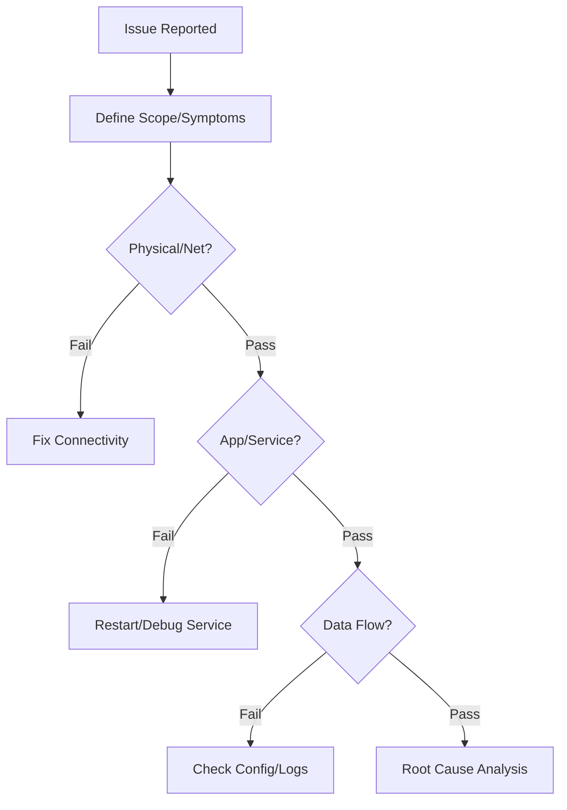

# Standard Troubleshooting Methodology

This document outlines a systematic approach to troubleshooting complex issues within the SOC infrastructure.

## 1. Defining the Problem



-   **Symptoms**: What is exactly failing? (e.g., "Alerts not showing", "Login failed").
-   **Scope**: Is it affecting one user, one sensor, or the whole platform?
-   **Timeline**: When did it start? Was there a recent change (Deployment/RFC)?

## 2. The Troubleshooting Workflow

### 2.1 Physical/Network Layer
-   **Connectivity**: Can you Ping/Telnet/Netcat to the target service?
-   **Firewall**: Are ports blocked? (Check Firewall/Security Group logs).
-   **DNS**: Is the hostname resolving correctly? (`nslookup`, `dig`).

### 2.2 Application/Service Layer
-   **Service Status**: Is the service process running? (`systemctl status`, `docker ps`).
-   **Resource Usage**: Check CPU/RAM/Disk usage (`top`, `df -h`). High load can cause timeouts.
-   **Logs**: **ALWAYS** check the logs.
    -   `/var/log/syslog`
    -   Application specific logs (STDERR/STDOUT).

### 2.3 Data Flow Verification
-   **Source**: Check if the agent is reading the file.
-   **Transport**: Check status on Log Forwarder/Broker (Kafka/RabbitMQ).
-   **Destination**: Check indexing errors in SIEM.

## 3. Common Failure Scenarios

### 3.1 Log Source Stopped Reporting
1.  Check Network/VPN status between Source and SOC.
2.  Verify Agent service status on the source.
3.  Check for disk space exhaustion on the source (Agent stops if disk full).

### 3.2 False Positives Spikes
1.  Identify the specific rule triggering.
2.  Analyze the pattern triggering the alert.
3.  Adjust the rule logic or add a suppression (whitelist) entry.

## 4. Documentation
-   Document the Root Cause Analysis (RCA).
-   Update Knowledge Base (KB) and SOPs to prevent recurrence.

### RCA Template

| Field | Description |
|:---|:---|
| **Issue ID** | Unique identifier |
| **Date Detected** | When the issue was first observed |
| **Affected Systems** | SIEM, EDR, log sources, etc. |
| **Impact** | Alerts missed, false positives, performance degradation |
| **Root Cause** | Technical explanation of why it happened |
| **Resolution** | Steps taken to fix the issue |
| **Prevention** | Changes to prevent recurrence |
| **Owner** | Who resolved and who approved |

## 5. Diagnostic Commands Quick Reference

| Purpose | Command | Platform |
|:---|:---|:---|
| Check service status | `systemctl status <service>` | Linux |
| View recent logs | `journalctl -u <service> --since "1 hour ago"` | Linux |
| Check disk space | `df -h` | Linux/macOS |
| Check memory usage | `free -m` | Linux |
| Test TCP connectivity | `nc -zv <host> <port>` | Linux/macOS |
| DNS lookup | `dig <hostname>` / `nslookup <hostname>` | All |
| Check process status | `docker ps` / `docker logs <container>` | Docker |
| Check certificate expiry | `openssl s_client -connect <host>:443 2>/dev/null \| openssl x509 -noout -dates` | All |

## 6. Additional Failure Scenarios

### 6.1 SIEM Alert Delay
1. Check SIEM indexing queue status (backlog)
2. Verify data pipeline health (Kafka/Logstash/etc.)
3. Check for hot storage capacity issues
4. Review correlation rule performance (slow queries)

### 6.2 EDR Agent Not Reporting
1. Verify agent service is running on endpoint
2. Check network connectivity to EDR cloud/management server
3. Verify agent version is compatible with server
4. Check for endpoint firewall blocking agent traffic

### 6.3 Authentication Failures (SOC Tools)
1. Verify IdP/SSO service health
2. Check MFA provider status
3. Verify user account is not locked out
4. Check certificate validity for SAML/OAuth configurations

### 6.4 SOAR Playbook Failures
1. Check API connectivity to integrated tools
2. Verify API keys/tokens are not expired
3. Review playbook execution logs for error details
4. Check rate limiting on target API endpoints

## 7. Troubleshooting Scripts

### Check SIEM Data Pipeline Health
```bash
#!/bin/bash
# Check if data is flowing from source to SIEM
echo "=== Data Pipeline Health Check ==="

# 1. Check Elasticsearch cluster health
curl -s http://localhost:9200/_cluster/health | python3 -m json.tool

# 2. Check Logstash pipeline
curl -s http://localhost:9600/_node/stats/pipelines | python3 -m json.tool | grep -E "events|queue"

# 3. Check Filebeat status
systemctl status filebeat | head -5

# 4. Check Kafka consumer lag (if applicable)
# kafka-consumer-groups.sh --bootstrap-server localhost:9092 --group logstash --describe

echo "=== Check Complete ==="
```

### Check EDR Agent Health Across Fleet
```powershell
# Get list of endpoints with stale EDR check-ins (>24 hours)
$threshold = (Get-Date).AddHours(-24)

# For CrowdStrike (via API)
# $staleHosts = Get-CsHost | Where-Object { $_.last_seen -lt $threshold }

# For Sysmon (local check)
Get-WinEvent -LogName "Microsoft-Windows-Sysmon/Operational" -MaxEvents 1 |
    Select-Object TimeCreated, Message |
    Format-Table -AutoSize
```

### Verify Log Source Completeness
```bash
#!/bin/bash
# Compare expected vs actual log sources in SIEM
echo "=== Log Source Audit ==="

# Expected sources (update this list)
EXPECTED_SOURCES=(
    "firewall" "active_directory" "dns" "proxy"
    "endpoint_edr" "email_gateway" "vpn" "waf"
    "database" "cloud_trail"
)

for source in "${EXPECTED_SOURCES[@]}"; do
    # Check if we received logs in the last hour
    count=$(curl -s "http://localhost:9200/logs-*/_count?q=source_type:${source}%20AND%20@timestamp:>now-1h" | python3 -c "import sys,json; print(json.load(sys.stdin)['count'])" 2>/dev/null)
    if [ "${count:-0}" -gt 0 ]; then
        echo "  ✅ ${source}: ${count} events/hour"
    else
        echo "  ❌ ${source}: NO DATA — investigate!"
    fi
done
```

## 8. Escalation Matrix for Infrastructure Issues

| Issue | First Response | Escalate After | Escalate To |
|:---|:---|:---|:---|
| SIEM search slow | Check cluster health | 15 min | SOC Engineer |
| Log source offline | Verify agent/network | 30 min | IT + SOC Engineer |
| EDR console unreachable | Check cloud status page | 5 min | Vendor support |
| SOAR playbook fails | Check API connectivity | 15 min | SOC Engineer |
| Alert queue > 200 | Add analyst capacity | 1 hour | SOC Manager |
| Disk space > 90% | Identify largest indices | 30 min | SOC Engineer |
| SSL certificate expired | Renew immediately | Immediate | SOC Engineer |
| MFA outage | Switch to backup auth | 5 min | IT + IAM team |

### Network Connectivity Check
```bash
#!/bin/bash
echo "=== Network Connectivity Check ==="

TARGETS=(
    "siem.internal:9200"
    "edr.internal:443"
    "soar.internal:443"
    "misp.internal:443"
    "ticketing.internal:443"
)

for target in "${TARGETS[@]}"; do
    host=$(echo $target | cut -d: -f1)
    port=$(echo $target | cut -d: -f2)
    if nc -zw3 "$host" "$port" 2>/dev/null; then
        echo "  ✅ $target — reachable"
    else
        echo "  ❌ $target — UNREACHABLE"
    fi
done
```

## Related Documents
-   [Tool Integration Strategy](../03_User_Guides/Integration_Hub.en.md)
-   [SOC Infrastructure Setup](../10_Training_Onboarding/System_Activation.en.md)
-   [Deployment Procedures](../02_Platform_Operations/Deployment_Procedures.en.md)

## References
-   [USE Method (Brendan Gregg)](https://www.brendangregg.com/usemethod.html)
-   [Google SRE Handbook](https://sre.google/sre-book/table-of-contents/)
