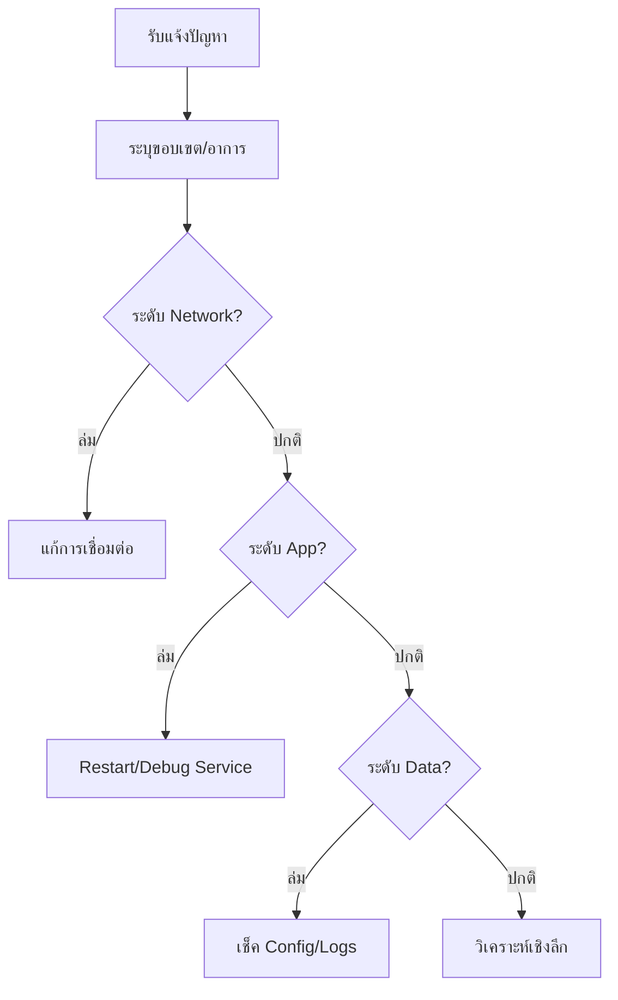

# วิธีการแก้ปัญหามาตรฐาน (Standard Troubleshooting Methodology)

เอกสารนี้ระบุแนวทางที่เป็นระบบในการแก้ปัญหาระบบโครงสร้างพื้นฐาน SOC

## 1. นิยามปัญหา (Defining the Problem)



-   **อาการ**: อะไรล้มเหลว? (เช่น "Alert ไม่ขึ้น", "Login ไม่ได้")
-   **ขอบเขต**: กระทบผู้ใช้คนเดียว, Sensor ตัวเดียว, หรือทั้งระบบ?
-   **เวลา**: เริ่มเป็นเมื่อไหร่? มีการเปลี่ยนแปลงระบบเร็วๆ นี้หรือไม่ (Deployment/RFC)?

## 2. ขั้นตอนการแก้ปัญหา (The Troubleshooting Workflow)

### 2.1 ระดับเครือข่าย (Physical/Network Layer)
-   **การเชื่อมต่อ**: Ping/Telnet/Netcat หาปลายทางเจอหรือไม่?
-   **Firewall**: พอร์ตถูกบล็อกหรือไม่? (เช็ค Log Firewall)
-   **DNS**: ชื่อ Hostname แปลงเป็น IP ถูกต้องหรือไม่? (`nslookup`, `dig`)

### 2.2 ระดับแอปพลิเคชัน (Application/Service Layer)
-   **สถานะบริการ**: Process ทำงานอยู่หรือไม่? (`systemctl status`, `docker ps`)
-   **ทรัพยากร**: เช็ค CPU/RAM/Disk (`top`, `df -h`) โหลดสูงอาจทำให้ Timeout
-   **Logs**: **ต้อง** ตรวจสอบ Log เสมอ
    -   `/var/log/syslog`
    -   Application specific logs

### 2.3 ตรวจสอบการไหลของข้อมูล (Data Flow Verification)
-   **ต้นทาง**: Agent อ่านไฟล์เจอหรือไม่?
-   **ระหว่างทาง**: สถานะบน Log Forwarder/Broker (Kafka/RabbitMQ) เป็นอย่างไร?
-   **ปลายทาง**: มี Error ในการ Index เข้า SIEM หรือไม่?

## 3. สถานการณ์ที่พบบ่อย (Common Failure Scenarios)

### 3.1 Log Source หยุดส่งข้อมูล
1.  เช็ค Network/VPN ระหว่างต้นทางและ SOC
2.  เช็คสถานะ Agent service บนเครื่องต้นทาง
3.  เช็คพื้นที่ว่าง Disk บนเครื่องต้นทาง (Agent มักหยุดทำงานถ้า Disk เต็ม)

### 3.2 แจ้งเตือนผิดพลาดพุ่งสูง (False Positives Spikes)
1.  ระบุกฎที่เป็นปัญหา
2.  วิเคราะห์ Pattern ที่ทำให้เกิด Alert
3.  ปรับ Logic ของกฎ หรือเพิ่ม Whitelist

## 4. การทำเอกสาร (Documentation)
-   บันทึกการวิเคราะห์สาเหตุที่แท้จริง (RCA)
-   อัปเดต Knowledge Base (KB) และ SOP เพื่อป้องกันการเกิดซ้ำ

### เทมเพลต RCA

| ฟิลด์ | คำอธิบาย |
|:---|:---|
| **รหัสปัญหา** | หมายเลขเฉพาะ |
| **วันที่ตรวจพบ** | เมื่อพบปัญหาครั้งแรก |
| **ระบบที่ได้รับผลกระทบ** | SIEM, EDR, log sources ฯลฯ |
| **ผลกระทบ** | แจ้งเตือนพลาด, FP, ประสิทธิภาพลดลง |
| **สาเหตุหลัก** | คำอธิบายทางเทคนิค |
| **การแก้ไข** | ขั้นตอนที่ดำเนินการ |
| **การป้องกัน** | การเปลี่ยนแปลงเพื่อป้องกันการเกิดซ้ำ |

## คำสั่งวินิจฉัยอ้างอิง

| วัตถุประสงค์ | คำสั่ง | แพลตฟอร์ม |
|:---|:---|:---|
| ตรวจสอบสถานะบริการ | `systemctl status <service>` | Linux |
| ดูล็อกล่าสุด | `journalctl -u <service> --since "1 hour ago"` | Linux |
| ตรวจสอบพื้นที่ดิสก์ | `df -h` | Linux/macOS |
| ทดสอบการเชื่อมต่อ TCP | `nc -zv <host> <port>` | Linux/macOS |
| ตรวจสอบ DNS | `dig <hostname>` / `nslookup <hostname>` | ทั้งหมด |
| ตรวจสอบ Container | `docker ps` / `docker logs <container>` | Docker |

## สถานการณ์ความล้มเหลวเพิ่มเติม

### SIEM Alert ล่าช้า
1. ตรวจสอบสถานะ Queue ของ SIEM indexing
2. ตรวจสอบ Data pipeline (Kafka/Logstash)
3. ตรวจสอบพื้นที่จัดเก็บ Hot storage

### EDR Agent ไม่รายงาน
1. ตรวจสอบ Agent service บน Endpoint
2. ตรวจสอบการเชื่อมต่อเครือข่ายไปยัง EDR server
3. ตรวจสอบเวอร์ชัน Agent ว่ารองรับ

### SOAR Playbook ล้มเหลว
1. ตรวจสอบ API connectivity
2. ตรวจสอบ API key/token ว่าหมดอายุหรือไม่
3. ตรวจสอบ Rate limiting ของ API endpoint

## 7. สคริปต์แก้ปัญหา

### ตรวจสอบ SIEM Data Pipeline
```bash
#!/bin/bash
echo "=== ตรวจสุขภาพ Data Pipeline ==="

# 1. ตรวจ Elasticsearch cluster health
curl -s http://localhost:9200/_cluster/health | python3 -m json.tool

# 2. ตรวจ Logstash pipeline
curl -s http://localhost:9600/_node/stats/pipelines | python3 -m json.tool | grep -E "events|queue"

# 3. ตรวจ Filebeat status
systemctl status filebeat | head -5

echo "=== ตรวจเสร็จ ==="
```

### ตรวจสอบ EDR Agent
```powershell
# ตรวจ endpoint ที่ EDR check-in ช้า (>24 ชม.)
$threshold = (Get-Date).AddHours(-24)

# Sysmon (ตรวจในเครื่อง)
Get-WinEvent -LogName "Microsoft-Windows-Sysmon/Operational" -MaxEvents 1 |
    Select-Object TimeCreated, Message |
    Format-Table -AutoSize
```

### ตรวจสอบ Log Source ครบถ้วน
```bash
#!/bin/bash
echo "=== ตรวจสอบ Log Source ==="

EXPECTED_SOURCES=(
    "firewall" "active_directory" "dns" "proxy"
    "endpoint_edr" "email_gateway" "vpn" "waf"
    "database" "cloud_trail"
)

for source in "${EXPECTED_SOURCES[@]}"; do
    count=$(curl -s "http://localhost:9200/logs-*/_count?q=source_type:${source}%20AND%20@timestamp:>now-1h" | python3 -c "import sys,json; print(json.load(sys.stdin)['count'])" 2>/dev/null)
    if [ "${count:-0}" -gt 0 ]; then
        echo "  ✅ ${source}: ${count} events/hour"
    else
        echo "  ❌ ${source}: ไม่มีข้อมูล — ตรวจสอบ!"
    fi
done
```

## 8. Escalation Matrix สำหรับปัญหา Infrastructure

| ปัญหา | การตอบแรก | Escalate หลัง | Escalate ไปยัง |
|:---|:---|:---|:---|
| SIEM search ช้า | ตรวจ cluster health | 15 นาที | SOC Engineer |
| Log source offline | ตรวจ agent/network | 30 นาที | IT + SOC Engineer |
| EDR console เข้าไม่ได้ | ตรวจ cloud status page | 5 นาที | Vendor support |
| SOAR playbook fail | ตรวจ API connectivity | 15 นาที | SOC Engineer |
| Alert queue > 200 | เพิ่ม analyst | 1 ชม. | SOC Manager |
| Disk space > 90% | หา index ใหญ่สุด | 30 นาที | SOC Engineer |
| SSL certificate หมดอายุ | Renew ทันที | ทันที | SOC Engineer |
| MFA ล่ม | เปลี่ยนเป็น backup auth | 5 นาที | IT + IAM team |

## เอกสารที่เกี่ยวข้อง (Related Documents)
-   [กลยุทธ์การเชื่อมต่อเครื่องมือ](../03_User_Guides/Integration_Hub.th.md)
-   [การติดตั้ง SOC](../10_Training_Onboarding/System_Activation.th.md)
-   [ขั้นตอนการ Deploy](../02_Platform_Operations/Deployment_Procedures.th.md)

### Quick Fix Reference

| Issue | First Action | Escalate If |
|:---|:---|:---|
| SIEM slow | Check indexer load | CPU > 90% for 30 min |
| No alerts | Verify log ingestion | Source offline > 15 min |
| Login failure | Reset password/MFA | Account locked 3x |
| Agent offline | Restart service | > 3 endpoints |

### ตรวจสอบ Network Connectivity
```bash
#!/bin/bash
echo "=== ตรวจ Network Connectivity ==="

TARGETS=(
    "siem.internal:9200"
    "edr.internal:443"
    "soar.internal:443"
    "misp.internal:443"
    "ticketing.internal:443"
)

for target in "${TARGETS[@]}"; do
    host=$(echo $target | cut -d: -f1)
    port=$(echo $target | cut -d: -f2)
    if nc -zw3 "$host" "$port" 2>/dev/null; then
        echo "  ✅ $target — reachable"
    else
        echo "  ❌ $target — UNREACHABLE"
    fi
done
```

## References
-   [USE Method (Brendan Gregg)](https://www.brendangregg.com/usemethod.html)
-   [Google SRE Handbook](https://sre.google/sre-book/table-of-contents/)

## Quick Fix Reference (อ้างอิงด่วน)

| ปัญหา | Action แรก | Escalate ถ้า |
|:---|:---|:---|
| SIEM ช้า | ตรวจ indexer load | CPU > 90% เกิน 30 นาที |
| ไม่มี alert | ตรวจ log ingestion | Source offline > 15 นาที |
| Login ล้มเหลว | Reset password/MFA | Account locked 3 ครั้ง |
| Agent offline | Restart service | > 3 endpoints |
| Dashboard error | Clear cache, reload | ยังไม่หายหลัง restart |
| API timeout | ตรวจ rate limit | ล้มเหลวต่อเนื่อง > 5 นาที |
