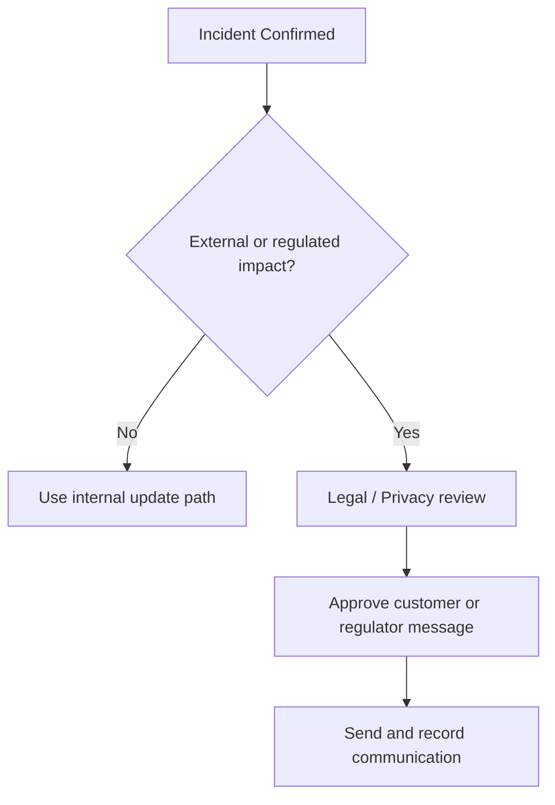

# Incident Communication Templates

> **Document ID:** COMM-001  
> **Version:** 1.0  
> **Last Updated:** 2026-02-15  
> **Owner:** SOC Manager / IR Lead

---



## Communication Matrix

| Severity | Internal Notify | Management | Legal | External | Regulator |
|:---:|:---|:---|:---|:---|:---|
| **P1 Critical** | Immediate | Immediate | Immediate | Within 4h | Per regulation |
| **P2 High** | 15 min | 1h | If data breach | As needed | If required |
| **P3 Medium** | 30 min | Daily report | No | No | No |
| **P4 Low** | Next standup | Weekly report | No | No | No |

## Customer / Regulator Communication Path

| Trigger | First Review | Sender | Required Record |
|:---|:---|:---|:---|
| Confirmed regulated data exposure | Legal + Privacy + DPO | DPO or approved privacy delegate | PDPA notification decision and submission timestamp |
| Customer data impact with action required | Legal + Communications + Business owner | Approved customer communications owner | Customer notification copy and support path |
| Third-party or vendor dependency affected | Legal + Vendor owner + IR Lead | Vendor owner or contract owner | External coordination log and agreed next update |
| Public, media, or executive-sensitive case | CISO + Legal + Communications | Approved spokesperson only | Media position and executive approval record |

## Minimum Outbound Communication Package

-   [ ] Incident ID, severity, and current status are confirmed.
-   [ ] Scope of affected systems, users, or data is stated as confirmed or estimated.
-   [ ] Legal and privacy review status is recorded before any customer or regulator message.
-   [ ] Contact path for follow-up questions is assigned and monitored.
-   [ ] Copy of the exact message sent is attached to the incident record.

## Approval Boundaries for External Communication

| Communication Type | Minimum Reviewers | Final Approver |
|:---|:---|:---|
| Customer notification | Legal + Business owner + Communications | CISO or delegated executive |
| Regulator notification | DPO + Legal | CISO or accountable privacy owner |
| Vendor / partner notification | Legal + Vendor owner + IR Lead | Service owner or CISO |
| Media statement | Legal + Communications + Executive stakeholders | CEO or delegated executive |

## Media / Public Statement Path

| Trigger | First Decision | Required Reviewers | Final Output |
|:---|:---|:---|:---|
| Public rumor, leak post, or journalist inquiry | Confirm whether the case is active and material | CISO + Legal + Communications | Holding statement or no-comment position |
| Customer-facing outage with likely public attention | Confirm business impact and service-restoration estimate | Business owner + CISO + Communications | Approved service-impact statement |
| Confirmed data breach with likely public concern | Confirm regulator and customer notification path first | Legal + DPO + Communications + CISO | Public statement aligned with legal notification |
| Executive-sensitive or reputation-threatening event | Confirm whether board/executive escalation is active | CISO + Executive stakeholders + Legal | Approved spokesperson, talking points, and escalation note |

## Minimum Public Statement Controls

-   [ ] Do not issue a public statement until incident facts, current status, and approval owner are recorded.
-   [ ] Keep public wording consistent with customer and regulator notifications already sent or being prepared.
-   [ ] Avoid technical detail that would help an attacker or contradict open investigative facts.
-   [ ] Record who approved the message, when it was released, and which channels were used.
-   [ ] Feed every material public statement into the incident report and board pack if business or regulatory impact is material.

## War Room Update Cadence

| Incident State | Audience | Minimum Cadence | Owner |
|:---|:---|:---|:---|
| **P1 active containment** | Executive stakeholders and war room | Every 30 minutes | Incident Commander |
| **P2 active containment or public-facing pressure** | Management and key stakeholders | Every 60 minutes | Incident Commander or SOC Lead |
| **Recovery in progress** | Management and service owner | Every 2-4 hours | IR Lead |
| **Stabilized monitoring** | Ticket owner and leadership as needed | On major change or agreed review time | Ticket owner |

## War Room Exit Communication Gate

-   [ ] Send one explicit transition update when the case moves from war room cadence to enhanced monitoring or normal ticket handling.
-   [ ] State who now owns monitoring, the next decision point, and whether any executive, legal, customer, or regulator path stays open.
-   [ ] Do not stop scheduled updates until closure criteria, not just technical recovery, are satisfied.

---

## Template 1: Initial Incident Notification (Internal)

**Channel:** Slack / Teams / Email  
**When:** Immediately upon P1/P2 confirmation

```
🚨 SECURITY INCIDENT — [P1/P2] — [Incident Type]

Incident ID:    INC-[YYYY]-[###]
Severity:       [P1 Critical / P2 High]
Detected:       [YYYY-MM-DD HH:MM UTC]
Affected:       [Systems / Users / Data]

Summary:
[1-2 sentences describing what happened]

Current Status:
- [ ] Containment in progress
- [ ] Investigation underway
- [ ] Affected users notified

Next Update:    [Time — typically 30-60 min for P1]
Incident Lead:  [Name]
War Room:       [Slack channel / Teams link / Bridge number]

⚠️ Do NOT discuss outside of this channel.
```

---

## Template 2: Management Executive Brief

**Channel:** Email / In-person  
**When:** Within 1 hour (P1), 4 hours (P2)

```
Subject: 🔴 Security Incident Brief — [INC-ID] — [Type]

To: [CISO, CTO, CEO as appropriate]

EXECUTIVE SUMMARY
━━━━━━━━━━━━━━━━━
Incident:     [Brief description]
Severity:     [P1/P2] — [Business impact in plain language]
Started:      [When first detected]
Status:       [Contained / Active / Investigating]

IMPACT ASSESSMENT
━━━━━━━━━━━━━━━━━
Systems:      [X servers / Y endpoints affected]
Data:         [Type of data potentially exposed]
Users:        [Number of users impacted]
Business:     [Revenue impact / operational disruption]

WHAT WE'RE DOING
━━━━━━━━━━━━━━━━━
1. [Action being taken now]
2. [Next planned step]
3. [Estimated resolution time if known]

DECISIONS NEEDED
━━━━━━━━━━━━━━━━━
- [Any decisions requiring management approval, e.g., paying ransom, public disclosure, system shutdown]

NEXT UPDATE
━━━━━━━━━━━
[When the next update will be provided]

Contact: [IR Lead Name, Phone]
```

---

## Template 3: User Notification — Password Reset Required

**Channel:** Email  
**When:** After account compromise confirmed

```
Subject: Action Required: Security-Related Password Reset

Dear [User/Team],

Our security team has detected suspicious activity related to
your account. As a precautionary measure, we have reset your
password and revoked active sessions.

REQUIRED ACTIONS:
1. Reset your password at [link] using a NEW, unique password
2. Re-enroll your MFA at [link]
3. Review your recent account activity for anything unusual
4. Report anything suspicious to security@company.com

WHAT HAPPENED:
[Brief, non-technical explanation without details that could
help an attacker]

If you did NOT initiate any unusual activity, no further
action is needed beyond the steps above.

Questions? Contact the IT Help Desk at [number/email].

— Information Security Team
```

---

## Template 4: Customer / External Notification — Data Breach

**Channel:** Email  
**When:** After legal review, within regulatory timeline (PDPA: 72h)

```
Subject: Important Security Notice from [Company Name]

Dear Valued Customer,

We are writing to inform you of a security incident that may
affect your personal information.

WHAT HAPPENED
On [date], we discovered unauthorized access to [system].
We immediately took action to contain the incident and began
a thorough investigation.

WHAT INFORMATION WAS INVOLVED
The following types of information may have been affected:
- [List specific data types: name, email, phone, etc.]

WHAT WE ARE DOING
- We engaged cybersecurity experts to investigate
- We notified relevant authorities [สำนักงานคุ้มครองข้อมูลส่วนบุคคล / PDPC]
- We implemented additional security measures
- We are offering [credit monitoring / identity protection] at no cost

WHAT YOU CAN DO
- Change your password on our platform
- Monitor your accounts for unusual activity
- Be cautious of phishing emails claiming to be from us
- [Enroll in free identity protection at: link]

FOR MORE INFORMATION
- Dedicated helpline: [phone number]
- Email: [incident-response@company.com]
- FAQ page: [link]

We sincerely apologize for any inconvenience.

[CEO/CISO Name]
[Company Name]
```

---

## Template 5: Regulator Notification (PDPA — Thailand)

**Channel:** Official letter / Online form  
**When:** Within 72 hours of discovery

```
TO:     สำนักงานคณะกรรมการคุ้มครองข้อมูลส่วนบุคคล (PDPC)
FROM:   [Company Name] — Data Protection Officer
DATE:   [Date]
RE:     แจ้งเหตุละเมิดข้อมูลส่วนบุคคล (Personal Data Breach Notification)

ตามพระราชบัญญัติคุ้มครองข้อมูลส่วนบุคคล พ.ศ. 2562 มาตรา 37(4)

1. ข้อมูลผู้แจ้ง
   - ชื่อองค์กร: [Company]
   - DPO: [Name, Contact]
   - วันที่พบเหตุ: [Date]

2. ลักษณะเหตุการณ์
   - ประเภท: [Unauthorized access / Data leak / Ransomware]
   - ระบบที่ได้รับผลกระทบ: [Systems]
   - จำนวนเจ้าของข้อมูลที่ได้รับผลกระทบ: [Number]

3. ประเภทข้อมูลที่เกี่ยวข้อง
   - [x] ชื่อ-นามสกุล
   - [ ] เลขบัตรประชาชน
   - [ ] ข้อมูลการเงิน
   - [x] อีเมล / เบอร์โทรศัพท์
   - [ ] ข้อมูลสุขภาพ

4. มาตรการที่ดำเนินการแล้ว
   - [Containment actions taken]
   - [Remediation in progress]

5. การประเมินความเสี่ยง
   - ระดับความเสี่ยง: [สูง/กลาง/ต่ำ]
   - เหตุผล: [Justification]

6. มาตรการป้องกันในอนาคต
   - [Future prevention measures]

ลงชื่อ: _______________
ตำแหน่ง: Data Protection Officer
```

---

## Template 6: Post-Incident Report (Summary)

**Channel:** Email / Meeting  
**When:** Within 5 business days after incident closure

```
Subject: Post-Incident Report — [INC-ID] — [Type]

INCIDENT SUMMARY
━━━━━━━━━━━━━━━━━
ID:           [INC-YYYY-###]
Type:         [Ransomware / Phishing / BEC / etc.]
Severity:     [P1–P4]
Duration:     [Start time] to [Resolution time]
MTTD:         [Mean Time to Detect]
MTTR:         [Mean Time to Respond]

TIMELINE
━━━━━━━━
[HH:MM] Alert received
[HH:MM] Triage completed
[HH:MM] Containment executed
[HH:MM] Investigation completed
[HH:MM] Remediation applied
[HH:MM] Recovery confirmed
[HH:MM] Incident closed

ROOT CAUSE
━━━━━━━━━━
[Technical root cause explanation]

IMPACT
━━━━━━
- Systems: [List]
- Data: [Was data compromised?]
- Financial: [Cost estimate if applicable]
- Reputation: [Any external impact?]

WHAT WENT WELL
━━━━━━━━━━━━━━
1. [Positive observation]
2. [Positive observation]

WHAT TO IMPROVE
━━━━━━━━━━━━━━━
1. [Gap identified]
2. [Gap identified]

ACTION ITEMS
━━━━━━━━━━━━
| Action | Owner | Deadline | Status |
|--------|-------|----------|--------|
| [Fix]  | [Who] | [When]   | [ ]    |
```

---

## Slack / Teams Channel Naming Convention

```
#inc-YYYY-NNN-brief-description
Example: #inc-2026-042-ransomware-finance
```

| Channel | Purpose |
|:---|:---|
| `#inc-YYYY-NNN-*` | Active incident war room |
| `#soc-alerts` | Alert notifications from SIEM |
| `#soc-handoff` | Shift handoff notes |
| `#soc-general` | Day-to-day SOC discussion |

---

## Related Documents

- [IR Framework](Framework.en.md)
- [Severity Matrix](Severity_Matrix.en.md)
- [Tabletop Exercises](Tabletop_Exercises.en.md)
- [PDPA Incident Response Guide](../07_Compliance_Privacy/PDPA_Incident_Response.en.md)
- [Incident Report Template](../11_Reporting_Templates/incident_report.en.md)
- [Executive Dashboard](../11_Reporting_Templates/Executive_Dashboard.en.md)
- [Board Quarterly Decision Pack](../11_Reporting_Templates/Board_Quarterly_Decision_Pack.en.md)

## References

- [NIST SP 800-61r2 — Incident Handling](https://csrc.nist.gov/publications/detail/sp/800-61/rev-2/final)
- [Thailand Personal Data Protection Committee (PDPC)](https://www.pdpc.or.th/)
- [CISA Cyber Incident Response and Recovery](https://www.cisa.gov/resources-tools/resources/cyber-incident-response-and-recovery)
