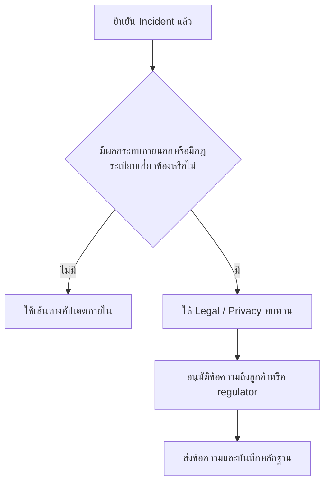

# แม่แบบการสื่อสารเหตุการณ์

> **รหัสเอกสาร:** COMM-001  
> **เวอร์ชัน:** 1.0  
> **อัปเดตล่าสุด:** 2026-02-15  
> **เจ้าของ:** SOC Manager / IR Lead

---



## ตารางการแจ้ง

| ระดับ | ภายใน | ผู้บริหาร | Legal | ภายนอก | หน่วยงานกำกับ |
|:---:|:---|:---|:---|:---|:---|
| **P1** | ทันที | ทันที | ทันที | 4 ชม. | ตามกฎหมาย |
| **P2** | 15 นาที | 1 ชม. | ถ้ามีข้อมูลรั่ว | ตามจำเป็น | ถ้าจำเป็น |
| **P3** | 30 นาที | รายงานรายวัน | ไม่ | ไม่ | ไม่ |
| **P4** | standup ถัดไป | รายงานรายสัปดาห์ | ไม่ | ไม่ | ไม่ |

## เส้นทางการสื่อสารกับลูกค้า / Regulator

| Trigger | ต้องให้ใครทบทวนก่อน | ใครเป็นผู้ส่ง | หลักฐานที่ต้องมี |
|:---|:---|:---|:---|
| ยืนยันแล้วว่ามี regulated data exposure | Legal + Privacy + DPO | DPO หรือผู้แทน privacy ที่ได้รับมอบหมาย | บันทึกผลการตัดสินใจแจ้ง PDPA และเวลาที่ส่งแจ้ง |
| ข้อมูลลูกค้าได้รับผลกระทบและลูกค้าต้องลงมือทำบางอย่าง | Legal + Communications + Business owner | ผู้รับผิดชอบด้านการสื่อสารลูกค้าที่ได้รับอนุมัติ | สำเนาข้อความแจ้งลูกค้าและช่องทาง support |
| กระทบ dependency ของ third party หรือ vendor | Legal + Vendor owner + IR Lead | Vendor owner หรือ contract owner | external coordination log และกำหนดเวลาอัปเดตถัดไป |
| เป็นเคส public, media, หรือกระทบผู้บริหารอย่างมีนัยสำคัญ | CISO + Legal + Communications | โฆษกที่ได้รับอนุมัติเท่านั้น | media position และหลักฐานการอนุมัติจากผู้บริหาร |

## ชุดข้อมูลขั้นต่ำก่อนสื่อสารออกนอกทีม

-   [ ] ยืนยัน Incident ID, severity, และ current status แล้ว
-   [ ] ระบุขอบเขตของระบบ ผู้ใช้ หรือข้อมูลที่ได้รับผลกระทบว่าเป็นข้อมูลยืนยันแล้วหรือเป็นค่าประมาณ
-   [ ] บันทึกสถานะการทบทวนโดย legal และ privacy ก่อนส่งข้อความถึงลูกค้าหรือ regulator
-   [ ] ระบุช่องทางตอบคำถามกลับและ owner ที่จะเฝ้าช่องทางนั้น
-   [ ] แนบสำเนาข้อความที่ส่งจริงไว้ใน incident record

## ขอบเขตการอนุมัติสำหรับการสื่อสารภายนอก

| ประเภทการสื่อสาร | ผู้ทบทวนขั้นต่ำ | ผู้อนุมัติสุดท้าย |
|:---|:---|:---|
| แจ้งลูกค้า | Legal + Business owner + Communications | CISO หรือผู้บริหารที่ได้รับมอบหมาย |
| แจ้ง regulator | DPO + Legal | CISO หรือ privacy owner ที่รับผิดชอบ |
| แจ้ง vendor / partner | Legal + Vendor owner + IR Lead | Service owner หรือ CISO |
| แถลงต่อสื่อ | Legal + Communications + Executive stakeholders | CEO หรือผู้บริหารที่ได้รับมอบหมาย |

## เส้นทางการสื่อสารกับสื่อ / สาธารณะ

| Trigger | จุดตัดสินใจแรก | ผู้ทบทวนที่ต้องมี | ผลลัพธ์สุดท้าย |
|:---|:---|:---|:---|
| มีข่าวลือ มีโพสต์ข้อมูลรั่ว หรือมีสื่อสอบถามเข้ามา | ยืนยันก่อนว่าเคสยัง active และเป็น material หรือไม่ | CISO + Legal + Communications | holding statement หรือ no-comment position |
| มี outage ที่กระทบลูกค้าและมีแนวโน้มกลายเป็นประเด็นสาธารณะ | ยืนยัน business impact และเวลาโดยประมาณในการกู้คืน | Business owner + CISO + Communications | ข้อความแจ้งผลกระทบบริการที่อนุมัติแล้ว |
| ยืนยันแล้วว่ามี data breach ที่สาธารณะจะกังวล | ยืนยันเส้นทางการแจ้ง regulator และลูกค้าก่อน | Legal + DPO + Communications + CISO | public statement ที่สอดคล้องกับการแจ้งตามกฎหมาย |
| เป็นเหตุการณ์ที่กระทบผู้บริหารหรือชื่อเสียงองค์กรอย่างมีนัยสำคัญ | ยืนยันว่า board/executive escalation ถูกเปิดใช้แล้วหรือไม่ | CISO + Executive stakeholders + Legal | ผู้แถลงที่อนุมัติแล้ว talking points และบันทึกการยกระดับ |

## หลักควบคุมขั้นต่ำสำหรับการสื่อสารสู่สาธารณะ

-   [ ] ห้ามออก public statement ก่อนบันทึกข้อเท็จจริง สถานะปัจจุบัน และ owner ที่อนุมัติ
-   [ ] ใช้ถ้อยคำให้สอดคล้องกับข้อความที่แจ้งลูกค้าหรือ regulator แล้ว หรือกำลังจะส่ง
-   [ ] หลีกเลี่ยง technical detail ที่ช่วยผู้โจมตีหรือขัดกับข้อเท็จจริงที่ยังสอบสวนไม่จบ
-   [ ] บันทึกว่าใครอนุมัติข้อความ ออกเมื่อใด และเผยแพร่ผ่านช่องทางใด
-   [ ] หากเป็น public statement ของเคส material ให้ส่งต่อเข้า incident report และ board pack ด้วย

## Cadence การอัปเดตใน War Room

| สถานะของ incident | กลุ่มผู้รับ | Cadence ขั้นต่ำ | Owner |
|:---|:---|:---|:---|
| **P1 ที่ยัง containment อยู่** | ผู้บริหารและผู้ที่อยู่ใน war room | ทุก 30 นาที | Incident Commander |
| **P2 ที่ยัง containment อยู่ หรือมีแรงกดดันสาธารณะ** | ฝ่ายบริหารและผู้เกี่ยวข้องหลัก | ทุก 60 นาที | Incident Commander หรือ SOC Lead |
| **อยู่ระหว่าง recovery** | ฝ่ายบริหารและ service owner | ทุก 2-4 ชั่วโมง | IR Lead |
| **เข้าสู่ช่วง monitoring ที่เริ่มนิ่ง** | owner ของ ticket และผู้บริหารตามความจำเป็น | เมื่อมีความเปลี่ยนแปลงสำคัญ หรือเวลาทบทวนที่ตกลงไว้ | owner ของ ticket |

## เกณฑ์การสื่อสารก่อนปิด War Room

-   [ ] ส่งอัปเดตการเปลี่ยนช่วงอย่างชัดเจนเมื่อเคสเปลี่ยนจาก war room cadence ไปเป็น enhanced monitoring หรือการติดตามผ่าน ticket ปกติ
-   [ ] ระบุว่าใครเป็น owner ของ monitoring ต่อ จุดตัดสินใจถัดไปคืออะไร และเส้นทาง executive, legal, customer, หรือ regulator ยังเปิดอยู่หรือไม่
-   [ ] ห้ามหยุดการอัปเดตตามรอบจนกว่าจะผ่าน closure criteria ไม่ใช่แค่ระบบกลับมาใช้งานได้

---

## แม่แบบ 1: แจ้งเตือนภายใน

```
🚨 เหตุการณ์ความปลอดภัย — [P1/P2] — [ประเภท]

Incident ID:    INC-[YYYY]-[###]
ความรุนแรง:      [P1 วิกฤต / P2 สูง]
ตรวจพบ:         [วัน-เวลา]
ระบบที่โดน:      [ระบบ / ผู้ใช้ / ข้อมูล]

สรุป: [1-2 ประโยค]

สถานะ:
- [ ] กำลังควบคุมเหตุการณ์
- [ ] กำลังสืบสวน
- [ ] แจ้งผู้ใช้ที่ได้รับผลกระทบแล้ว

อัปเดตถัดไป:    [เวลา]
ผู้รับผิดชอบ:     [ชื่อ]
ห้องปฏิบัติการ:   [Slack/Teams link]

⚠️ ห้ามพูดคุยนอกช่องทางนี้
```

---

## แม่แบบ 2: สรุปให้ผู้บริหาร

```
เรื่อง: 🔴 สรุปเหตุการณ์ — [INC-ID]

เรียน CISO / CTO

สรุป:       [คำอธิบายสั้น]
ความรุนแรง:  [P1/P2] — [ผลกระทบธุรกิจ]
สถานะ:      [ควบคุมได้ / กำลังดำเนินการ]

ผลกระทบ:
- ระบบ: [จำนวน]
- ข้อมูล: [ประเภท]
- ผู้ใช้: [จำนวน]

สิ่งที่ดำเนินการ:
1. [ตอนนี้]
2. [ขั้นต่อไป]

ต้องการอนุมัติ:
- [ถ้ามี]

อัปเดตถัดไป: [เวลา]
```

---

## แม่แบบ 3: แจ้ง User รีเซ็ตรหัสผ่าน

```
เรื่อง: กรุณาดำเนินการ: รีเซ็ตรหัสผ่านเพื่อความปลอดภัย

เรียน [ผู้ใช้],

ทีมความปลอดภัยตรวจพบกิจกรรมผิดปกติในบัญชีของคุณ
เราได้รีเซ็ตรหัสผ่านและยกเลิก session เป็นมาตรการป้องกัน

สิ่งที่ต้องทำ:
1. ตั้งรหัสผ่านใหม่ที่ [link]
2. ลงทะเบียน MFA ใหม่
3. ตรวจดูกิจกรรมล่าสุดในบัญชี
4. แจ้ง security@company.com หากพบสิ่งผิดปกติ

— ทีมรักษาความปลอดภัยข้อมูล
```

---

## แม่แบบ 4: แจ้งลูกค้า — ข้อมูลรั่วไหล

```
เรื่อง: แจ้งเตือนด้านความปลอดภัยจาก [ชื่อบริษัท]

เรียน ลูกค้า,

เราขอแจ้งให้ทราบเกี่ยวกับเหตุการณ์ด้านความปลอดภัย:

สิ่งที่เกิดขึ้น:
[คำอธิบาย]

ข้อมูลที่อาจได้รับผลกระทบ:
- [รายการข้อมูล]

สิ่งที่เราดำเนินการ:
- แจ้งหน่วยงาน PDPC แล้ว
- เสริมมาตรการป้องกัน
- ให้บริการ identity protection ฟรี

สิ่งที่คุณควรทำ:
- เปลี่ยนรหัสผ่าน
- ระวัง phishing email

สายด่วน: [เบอร์]
อีเมล: [incident@company.com]
```

---

## แม่แบบ 5: แจ้ง PDPC (สำนักงานคุ้มครองข้อมูลส่วนบุคคล)

```
เรียน สำนักงาน PDPC

ตาม พ.ร.บ.คุ้มครองข้อมูลส่วนบุคคล พ.ศ. 2562 มาตรา 37(4)

1. ข้อมูลผู้แจ้ง: [ชื่อองค์กร, DPO]
2. ลักษณะเหตุการณ์: [ประเภท, ระบบ, จำนวนเจ้าของข้อมูล]
3. ประเภทข้อมูล: [ชื่อ/อีเมล/การเงิน/สุขภาพ]
4. มาตรการที่ดำเนินการ: [containment + remediation]
5. ระดับความเสี่ยง: [สูง/กลาง/ต่ำ]
6. แผนป้องกัน: [อนาคต]

ลงชื่อ: DPO
```

---

## แม่แบบ 6: รายงานหลังเหตุการณ์

```
สรุปเหตุการณ์ INC-[ID]
ประเภท:  [Ransomware / BEC / etc.]
ระดับ:    [P1-P4]
ระยะเวลา: [เริ่ม] ถึง [จบ]
MTTD:    [เวลาตรวจพบ]
MTTR:    [เวลาแก้ไข]

Timeline + สาเหตุ + ผลกระทบ + สิ่งที่ดี + สิ่งที่ปรับปรุง + Action Items
```

---

## เทมเพลตเพิ่มเติม

### แจ้งผู้บริหาร (Critical Incident)

```
เรียน [ตำแหน่งผู้รับ],

ขอแจ้งเหตุการณ์ด้านความปลอดภัยระดับ [Critical/High]:

📋 รายละเอียด:
- Incident ID: [INC-YYYY-NNN]
- ตรวจพบเมื่อ: [วัน/เวลา]
- ประเภท: [Ransomware/Data Breach/ฯลฯ]
- ระบบที่ได้รับผลกระทบ: [ระบุ]
- ผลกระทบทางธุรกิจ: [downtime/data exposure/ฯลฯ]

🔒 สถานะการจัดการ:
- สถานะปัจจุบัน: [Contained/Under Investigation]
- มาตรการที่ดำเนินการ: [ระบุ]
- ETA แก้ไข: [ระบุ]

👤 ผู้ประสานงาน: [ชื่อ, เบอร์โทร]
อัปเดตถัดไป: [เวลา]
```

### แจ้งลูกค้า / เจ้าของข้อมูล (PDPA)

```
เรียน [ชื่อ/ท่าน],

[ชื่อองค์กร] ขอแจ้งให้ท่านทราบว่าเราตรวจพบเหตุการณ์ด้านความปลอดภัย
ที่อาจส่งผลกระทบต่อข้อมูลส่วนบุคคลของท่าน

📋 สิ่งที่เกิดขึ้น:
[อธิบายเหตุการณ์อย่างกระชับ]

📊 ข้อมูลที่อาจได้รับผลกระทบ:
[ประเภทข้อมูล — เช่น ชื่อ, อีเมล, เบอร์โทร]

🔒 สิ่งที่เราดำเนินการ:
1. [มาตรการที่ 1]
2. [มาตรการที่ 2]

🛡️ สิ่งที่ท่านควรทำ:
1. เปลี่ยนรหัสผ่าน
2. เปิดใช้งาน Multi-Factor Authentication
3. ระวังอีเมล/SMS ที่น่าสงสัย

📞 ผู้ประสานงาน DPO: [ชื่อ, อีเมล, โทร]
```

### สรุปเหตุการณ์ (Post-Incident)

```
เรื่อง: สรุปเหตุการณ์ [INC-YYYY-NNN] — [ประเภท]

📋 สรุป:
- ตรวจพบ: [วัน/เวลา]
- ควบคุมได้: [วัน/เวลา]
- แก้ไขเสร็จ: [วัน/เวลา]
- ระยะเวลาทั้งหมด: [XX ชั่วโมง]

📊 ผลกระทบ:
- ระบบที่ได้รับผลกระทบ: [XX] ระบบ
- ข้อมูลรั่วไหล: [ใช่/ไม่]
- Downtime: [XX ชั่วโมง]

✅ บทเรียน:
1. [สิ่งที่ทำได้ดี]
2. [สิ่งที่ต้องปรับปรุง]

🔧 Action Items:
- [รายการแก้ไข + ผู้รับผิดชอบ + กำหนด]
```

## Communication Do's & Don'ts

| ✅ ควรทำ | ❌ ไม่ควรทำ |
|:---|:---|
| ใช้ภาษาชัดเจน ไม่ใช้ศัพท์เทคนิค (กับผู้บริหาร) | เปิดเผยรายละเอียดทาง technical กับสื่อ |
| ระบุ Incident ID ทุกการสื่อสาร | คาดเดาสาเหตุก่อนสอบสวนเสร็จ |
| ให้ข้อมูลที่เป็นข้อเท็จจริงเท่านั้น | โทษบุคคลหรือทีมใดทีมหนึ่ง |
| ระบุ next update time | สัญญาว่า "จะไม่เกิดอีก" |
| เก็บ audit trail ของทุกการสื่อสาร | ส่งข้อมูลผ่านช่องทางไม่เข้ารหัส |

## การสื่อสารตามระดับความรุนแรง

### Communication Matrix

| Severity | แจ้งใคร | ช่องทาง | Timeline |
|:---|:---|:---|:---|
| Critical | CEO, CISO, Legal, PR | Phone + Email | ภายใน 15 นาที |
| High | CISO, IT Director | Email + Chat | ภายใน 30 นาที |
| Medium | SOC Manager, IT Lead | Email | ภายใน 2 ชั่วโมง |
| Low | SOC Team | Ticketing system | ภายใน 24 ชั่วโมง |

### Status Update Template

```markdown
## Incident Status Update #[N]
- **Incident ID**: INC-YYYY-NNNN
- **Severity**: [Critical/High/Medium/Low]
- **Current Status**: [Investigating/Containing/Eradicating/Recovering]
- **Impact**: [ระบุผลกระทบ]
- **Actions Taken**: [ดำเนินการแล้ว]
- **Next Steps**: [ขั้นตอนถัดไป]
- **ETA Resolution**: [ประมาณเวลา]
- **Contact**: [ผู้รับผิดชอบ + เบอร์]
```

### External Communication Guidelines

| ผู้รับ | เมื่อไหร่ | ใครเป็นคนส่ง | อนุมัติโดย |
|:---|:---|:---|:---|
| ลูกค้า | ข้อมูลรั่ว | PR + Legal | CEO |
| หน่วยงานกำกับ | PDPA breach | DPO | CISO |
| สื่อมวลชน | เหตุสาธารณะ | PR | CEO |
| Partner/Vendor | ส่งผลกระทบ | IT Director | CISO |

### Post-Incident Communication

| Timing | Content | Audience |
|:---|:---|:---|
| +24 hrs | Initial summary | Internal stakeholders |
| +72 hrs | Root cause update | Management |
| +7 days | Full post-mortem | All affected parties |
| +30 days | Remediation status | Regulatory (if needed) |

### Quick Contact Card

| Role | Primary | Backup |
|:---|:---|:---|
| CISO | Phone | SMS |
| SOC Lead | Chat | Phone |
| Legal | Email | Phone |

## เอกสารที่เกี่ยวข้อง

- [กรอบ IR](Framework.th.md)
- [ตารางความรุนแรง](Severity_Matrix.th.md)
- [สถานการณ์จำลอง](Tabletop_Exercises.th.md)
- [คู่มือตอบเหตุข้อมูลรั่วตาม PDPA](../07_Compliance_Privacy/PDPA_Incident_Response.th.md)
- [แบบฟอร์มรายงานเหตุการณ์](../11_Reporting_Templates/incident_report.th.md)
- [Executive Dashboard](../11_Reporting_Templates/Executive_Dashboard.th.md)
- [Board Quarterly Decision Pack](../11_Reporting_Templates/Board_Quarterly_Decision_Pack.th.md)

## References

- [NIST SP 800-61r2 — Incident Handling](https://csrc.nist.gov/publications/detail/sp/800-61/rev-2/final)
- [Thailand Personal Data Protection Committee (PDPC)](https://www.pdpc.or.th/)
- [CISA Cyber Incident Response and Recovery](https://www.cisa.gov/resources-tools/resources/cyber-incident-response-and-recovery)
