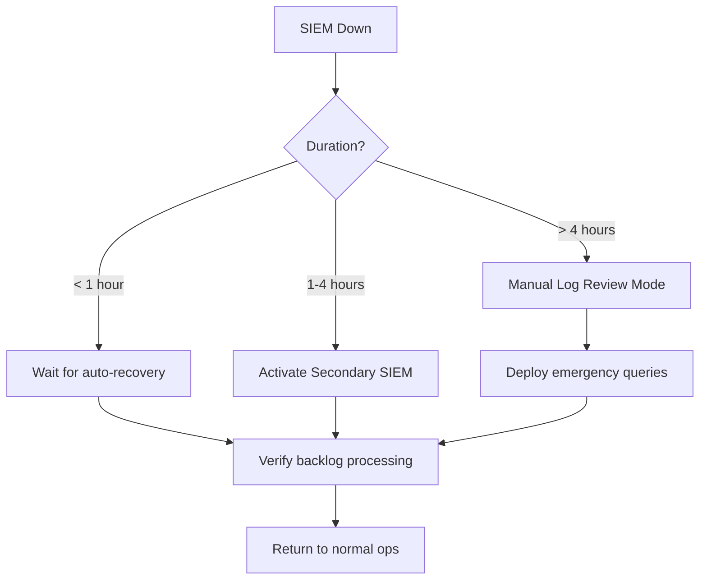

# SOC Disaster Recovery & Business Continuity Plan

**Document ID**: OPS-SOP-011
**Version**: 1.0
**Classification**: Confidential
**Last Updated**: 2026-02-15

> When the SOC itself goes down — SIEM failure, network outage, ransomware hitting SOC infrastructure — this plan tells you **how to keep operating** and **how to recover**.

---

## Scope

This document covers:
- 🛡️ SOC infrastructure failures (SIEM, EDR, ticketing, network)
- 🔄 Failover and manual operating procedures
- 📋 Recovery steps and priorities
- 🎯 RPO/RTO targets for SOC services

This does **NOT** replace the organization-wide BCP/DR plan. It supplements it with SOC-specific procedures.

---

## SOC Service Catalog & RTO/RPO

| # | SOC Service | RTO | RPO | Priority | Backup Method |
|:---:|:---|:---:|:---:|:---:|:---|
| 1 | **Alert Monitoring** (SIEM) | 1 hour | 0 min | 🔴 P1 | Secondary SIEM / manual log review |
| 2 | **Incident Response** (ticketing + comms) | 30 min | 0 min | 🔴 P1 | Email + phone + spreadsheet |
| 3 | **EDR Console** | 2 hours | 0 min | 🔴 P1 | Endpoint isolation via GPO/firewall |
| 4 | **Threat Intelligence** (TIP) | 4 hours | 24 hours | 🟠 P2 | Manual IOC lookup (VirusTotal, OTX) |
| 5 | **Log Ingestion Pipeline** | 2 hours | 1 hour | 🟠 P2 | Local log buffering / syslog failover |
| 6 | **Detection Rules Engine** | 4 hours | 0 min | 🟠 P2 | Rules stored in Git (restore from repo) |
| 7 | **Dashboard / Reporting** | 8 hours | 24 hours | 🟡 P3 | Manual reports via email |
| 8 | **SOC Wiki / Knowledge Base** | 24 hours | Weekly | 🟡 P3 | Offline copies / printed SOPs |
| 9 | **Automation / SOAR** | 4 hours | 0 min | 🟠 P2 | Manual playbook execution |
| 10 | **Communication Channels** (Slack/Teams) | 30 min | 0 min | 🔴 P1 | Phone tree + personal mobile |

> **RTO** = Recovery Time Objective (max downtime allowed)
> **RPO** = Recovery Point Objective (max data loss allowed)

---

## Disaster Scenarios & Response Procedures

### Scenario 1: SIEM Down / Unavailable

| Step | Action | Owner | Notes |
|:---:|:---|:---|:---|
| 1 | Confirm SIEM is down (not a network issue) | SOC Tier 1 | Check SIEM health endpoint |
| 2 | Notify SOC Lead + SOC Engineering | On-duty analyst | Slack + phone |
| 3 | Activate secondary SIEM (if available) | SOC Engineering | Switch DNS/proxy for log forwarding |
| 4 | If no secondary: switch to **Manual Log Review Mode** | SOC Tier 2 | Use direct log access (see below) |
| 5 | Begin reviewing critical logs directly | All analysts | Focus: Firewall, AD, EDR console |
| 6 | Track alerts manually in emergency spreadsheet | SOC Tier 1 | Template: `11_Reporting_Templates/emergency_alert_tracker.xlsx` |
| 7 | Inform stakeholders of reduced visibility | SOC Lead | Use [Communication Templates](Communication_Templates.en.md) |
| 8 | Once restored: verify no events were lost | SOC Engineering | Check log timestamps for gaps |
| 9 | Process any backlogged alerts | All analysts | Prioritize P1/P2 timeframes |

**Manual Log Review Mode — Where to look:**

| Log Source | Direct Access Method | Priority Checks |
|:---|:---|:---|
| Firewall | Firewall GUI / CLI | Blocked outbound traffic, new allow rules |
| Active Directory | Event Viewer on DC | 4720 (new account), 4728 (group change), 4625 (failed logon) |
| EDR Console | EDR web portal directly | Active detections, quarantine events |
| Email Gateway | Gateway admin portal | Phishing detections, blocked attachments |
| Cloud (AWS/Azure) | Cloud console directly | IAM changes, security findings |

---

### Scenario 2: EDR Platform Down

| Step | Action | Owner |
|:---:|:---|:---|
| 1 | Confirm EDR is down (check console + agent health) | SOC Tier 1 |
| 2 | Notify SOC Lead + vendor | SOC Lead |
| 3 | Shift to **network-based detection** (IDS/IPS, firewall) | SOC Tier 2 |
| 4 | Deploy emergency GPO to block known-bad hashes | SOC Engineering |
| 5 | Increase firewall monitoring (outbound anomalies) | SOC Tier 1 |
| 6 | If > 4 hours: consider temporary host-based logging (Sysmon) | SOC Engineering |
| 7 | Once restored: run full environment scan | EDR Admin |

---

### Scenario 3: Network Outage (SOC Can't Reach Monitored Environment)

| Step | Action | Owner |
|:---:|:---|:---|
| 1 | Confirm scope of outage (partial vs full) | SOC Tier 1 |
| 2 | Contact NOC / network team for ETA | SOC Lead |
| 3 | If partial: focus monitoring on reachable segments | SOC Tier 2 |
| 4 | If full: activate **on-site SOC personnel** (if available) | SOC Manager |
| 5 | Monitor cloud environments independently | SOC Tier 2 |
| 6 | Once restored: scan for events during blackout period | All analysts |

---

### Scenario 4: SOC Infrastructure Ransomware Attack

> ⚠️ **This is the worst-case scenario.** SOC tools themselves are compromised.

| Step | Action | Owner | Within |
|:---:|:---|:---|:---:|
| 1 | **Isolate SOC network segment immediately** | SOC Engineering | **5 min** |
| 2 | Switch to **out-of-band communication** (personal mobile, pre-shared numbers) | SOC Lead | **10 min** |
| 3 | Activate external IR vendor | SOC Manager/CISO | **30 min** |
| 4 | Assess blast radius (which SOC tools are compromised?) | IR Team | **1 hour** |
| 5 | Stand up **emergency SOC** on clean infrastructure | SOC Engineering | **2 hours** |
| 6 | Restore from known-good backups (see backup schedule below) | SOC Engineering | **4 hours** |
| 7 | Rebuild compromised systems from scratch (do NOT trust cleaned images) | SOC Engineering | **24–72 hours** |
| 8 | Conduct full post-incident review | IR Lead | **1 week** |

**Emergency SOC Kit (pre-staged):**
- Clean laptop with pre-configured VPN
- Printed copy of SOPs and escalation matrix
- Portable SIEM (e.g., Security Onion on USB)
- Pre-shared phone list (not stored digitally only)
- Backup cloud accounts (separate from production)

---

### Scenario 5: Ticketing System / SOAR Down

| Step | Action | Owner |
|:---:|:---|:---|
| 1 | Confirm ticketing/SOAR is unavailable | SOC Tier 1 |
| 2 | Switch to **emergency alert tracker** (Google Sheets / Excel) | SOC All |
| 3 | Execute playbooks **manually** using this SOP repo | SOC Tier 2 |
| 4 | Track all manual actions for later entry | SOC Tier 1 |
| 5 | Once restored: backfill tickets from emergency tracker | SOC Tier 1 |

---

## Backup Schedule

| System | Backup Type | Frequency | Retention | Storage Location |
|:---|:---|:---:|:---:|:---|
| **SIEM Configuration** | Full export | Daily | 30 days | S3 / off-site NAS |
| **SIEM Data** | Incremental | Hourly | 90 days | Separate storage cluster |
| **Detection Rules** (Sigma/YARA) | Git repo | On every change | Unlimited | GitHub + local mirror |
| **SOAR Playbooks** | Export | Daily | 30 days | S3 / off-site NAS |
| **Ticketing System DB** | Full + WAL | Hourly | 30 days | Cross-region DB replica |
| **EDR Configuration** | Vendor snapshot | Weekly | 12 weeks | Cloud backup |
| **SOC Wiki / Docs** | Git repo | On every change | Unlimited | GitHub + local mirror |
| **Dashboards / Reports** | JSON export | Weekly | 90 days | S3 / off-site NAS |
| **TI Feeds / IOC DB** | Full dump | Daily | 30 days | S3 / off-site NAS |

### Backup Verification

- [ ] **Monthly**: Restore test of SIEM config backup
- [ ] **Quarterly**: Full DR drill (simulate SIEM failure + recovery)
- [ ] **Annually**: Full SOC infrastructure recovery test

---

## Communication During DR

| Priority | Channel | Use |
|:---|:---|:---|
| 🔴 Primary | **Phone tree** (see [Escalation Matrix](Escalation_Matrix.en.md)) | When all digital channels may be compromised |
| 🟠 Secondary | **Personal mobile + WhatsApp group** | If Slack/Teams is down but phones work |
| 🟡 Tertiary | **Pre-shared email on alternate provider** (e.g., Gmail) | If corporate email is down |
| 🔵 Last resort | **Physical meetup at pre-designated location** | Total infrastructure failure |

> ⚠️ **Pre-stage these channels NOW.** Don't set them up during an incident.

---

## DR Testing Schedule

| Test Type | Frequency | Duration | Participants | Pass Criteria |
|:---|:---:|:---:|:---|:---|
| **Tabletop Exercise** (DR scenario discussion) | Quarterly | 2 hours | SOC team + Management | Roles clear, procedures understood |
| **SIEM Failover Test** | Semi-annually | 4 hours | SOC Engineering | RTO met within target, no data loss |
| **Full DR Drill** (complete SOC infrastructure) | Annually | 1 day | SOC team + IT + Management | All P1 services restored within RTO |
| **Communication Test** (phone tree + backup comms) | Quarterly | 30 min | All SOC personnel | 100% reachable via backup channel |
| **Backup Restore Test** | Monthly | 2 hours | SOC Engineering | Config restored, rules validated |

---

## SOC Degradation Levels

| Level | Condition | Capability | Actions |
|:---:|:---|:---|:---|
| 🟢 **Normal** | All systems operational | Full detection + response | Normal operations |
| 🟡 **Degraded** | 1–2 secondary tools down | Partial detection, full response | Notify stakeholders, increase manual checks |
| 🟠 **Limited** | SIEM or EDR down | Significantly reduced detection | Activate manual procedures, notify management |
| 🔴 **Emergency** | Multiple critical tools down | Manual-only operations | Full DR activation, external IR support |
| ⚫ **Black** | SOC infrastructure compromised | Zero internal capability | External IR vendor takes lead |

---

## Annual Review Checklist

- [ ] Review and update all RTO/RPO targets
- [ ] Verify backup procedures are working
- [ ] Update contact lists and phone trees
- [ ] Test DR communication channels
- [ ] Conduct at least one full DR drill
- [ ] Update emergency SOC kit contents
- [ ] Review vendor contracts for IR support
- [ ] Brief all SOC personnel on DR procedures
- [ ] Update this document with lessons learned

---

## Related Documents

-   [Escalation Matrix](Escalation_Matrix.en.md) — Who to call during incidents
-   [Communication Templates](Communication_Templates.en.md) — Pre-written notifications
-   [IR Framework](Framework.en.md) — Incident response lifecycle
-   [SOC Checklists](../06_Operations_Management/SOC_Checklists.en.md) — Daily/weekly/monthly checks
-   [SLA Template](../06_Operations_Management/SLA_Template.en.md) — Service level agreements
