# SOC Disaster Recovery & Business Continuity Plan / แผน DR/BCP สำหรับ SOC

**รหัสเอกสาร**: OPS-SOP-011
**เวอร์ชัน**: 1.0
**การจัดชั้นความลับ**: ลับ
**อัปเดตล่าสุด**: 2026-02-15

> เมื่อ SOC ล่มเอง — SIEM ล่ม, เครือข่ายขัดข้อง, ransomware โจมตีระบบของ SOC — แผนนี้บอกว่า **จะปฏิบัติงานต่ออย่างไร** และ **จะกู้คืนอย่างไร**

---

## ขอบเขต

เอกสารนี้ครอบคลุม:
- 🛡️ ระบบ SOC ล้มเหลว (SIEM, EDR, ticketing, network)
- 🔄 ขั้นตอน failover และการปฏิบัติงานแบบ manual
- 📋 ขั้นตอนการกู้คืนและลำดับความสำคัญ
- 🎯 เป้าหมาย RPO/RTO สำหรับบริการ SOC

เอกสารนี้ **ไม่** ทดแทนแผน BCP/DR ขององค์กร แต่เสริมด้วยขั้นตอนเฉพาะ SOC

---

## บริการของ SOC & RTO/RPO

| # | บริการ SOC | RTO | RPO | ลำดับ | วิธีสำรอง |
|:---:|:---|:---:|:---:|:---:|:---|
| 1 | **Alert Monitoring** (SIEM) | 1 ชม. | 0 นาที | 🔴 P1 | Secondary SIEM / ตรวจ log แบบ manual |
| 2 | **Incident Response** (ticket + สื่อสาร) | 30 นาที | 0 นาที | 🔴 P1 | Email + โทร + spreadsheet |
| 3 | **EDR Console** | 2 ชม. | 0 นาที | 🔴 P1 | Isolate endpoint ผ่าน GPO/firewall |
| 4 | **Threat Intelligence** (TIP) | 4 ชม. | 24 ชม. | 🟠 P2 | ตรวจ IOC manual (VirusTotal, OTX) |
| 5 | **Log Ingestion Pipeline** | 2 ชม. | 1 ชม. | 🟠 P2 | Buffer log ในเครื่อง / syslog failover |
| 6 | **Detection Rules Engine** | 4 ชม. | 0 นาที | 🟠 P2 | Rules เก็บใน Git (restore จาก repo) |
| 7 | **Dashboard / Reporting** | 8 ชม. | 24 ชม. | 🟡 P3 | รายงาน manual ผ่าน email |
| 8 | **SOC Wiki / Knowledge Base** | 24 ชม. | รายสัปดาห์ | 🟡 P3 | สำเนาออฟไลน์ / SOP ที่พิมพ์ |
| 9 | **Automation / SOAR** | 4 ชม. | 0 นาที | 🟠 P2 | ทำ playbook แบบ manual |
| 10 | **Communication Channels** (Slack/Teams) | 30 นาที | 0 นาที | 🔴 P1 | Phone tree + มือถือส่วนตัว |

> **RTO** = Recovery Time Objective (เวลา downtime สูงสุดที่ยอมรับได้)
> **RPO** = Recovery Point Objective (ข้อมูลที่ยอมให้สูญเสียได้สูงสุด)

---

## สถานการณ์ภัยพิบัติ & ขั้นตอนตอบสนอง

### สถานการณ์ 1: SIEM ล่ม / ใช้งานไม่ได้

```mermaid
graph TD
    A[SIEM ล่ม] --> B{ระยะเวลา?}
    B -->|< 1 ชม.| C[รอ auto-recovery]
    B -->|1-4 ชม.| D[เปิดใช้ Secondary SIEM]
    B -->|> 4 ชม.| E[โหมดตรวจ Log แบบ Manual]
    C --> F[ตรวจสอบ backlog]
    D --> F
    E --> G[Deploy emergency queries]
    G --> F
    F --> H[กลับสู่ปฏิบัติการปกติ]
```

| ขั้น | การดำเนินการ | ผู้รับผิดชอบ | หมายเหตุ |
|:---:|:---|:---|:---|
| 1 | ยืนยันว่า SIEM ล่มจริง (ไม่ใช่ปัญหา network) | SOC Tier 1 | ตรวจ health endpoint |
| 2 | แจ้ง SOC Lead + SOC Engineering | Analyst ประจำเวร | Slack + โทร |
| 3 | เปิดใช้ secondary SIEM (ถ้ามี) | SOC Engineering | เปลี่ยน DNS ส่ง log |
| 4 | ถ้าไม่มี: เปลี่ยนเป็น **โหมดตรวจ Log แบบ Manual** | SOC Tier 2 | ใช้ direct log access |
| 5 | เริ่มตรวจ critical logs โดยตรง | ทุกคน | เน้น: Firewall, AD, EDR |
| 6 | ติดตาม alert ใน emergency spreadsheet | SOC Tier 1 | Template สำรอง |
| 7 | แจ้ง stakeholders ว่า visibility ลดลง | SOC Lead | ใช้ [Communication Templates](Communication_Templates.en.md) |
| 8 | เมื่อกู้คืนแล้ว: ตรวจสอบไม่มี event หาย | SOC Engineering | ตรวจ timestamp gaps |
| 9 | ประมวลผล alert ที่ค้างอยู่ | ทุกคน | เน้น P1/P2 ก่อน |

**โหมดตรวจ Log แบบ Manual — ดูที่ไหน:**

| Log Source | วิธีเข้าถึงโดยตรง | สิ่งที่ต้องตรวจ |
|:---|:---|:---|
| Firewall | GUI / CLI ของ Firewall | Outbound ที่ถูกบล็อก, allow rules ใหม่ |
| Active Directory | Event Viewer บน DC | 4720 (สร้าง account), 4728 (เพิ่ม group) |
| EDR Console | Web portal EDR โดยตรง | Active detections, quarantine |
| Email Gateway | Admin portal ของ gateway | Phishing, attachment ที่ถูกบล็อก |
| Cloud (AWS/Azure) | Cloud console โดยตรง | IAM changes, security findings |

---

### สถานการณ์ 2: EDR Platform ล่ม

| ขั้น | การดำเนินการ | ผู้รับผิดชอบ |
|:---:|:---|:---|
| 1 | ยืนยัน EDR ล่ม (ตรวจ console + agent health) | SOC Tier 1 |
| 2 | แจ้ง SOC Lead + vendor | SOC Lead |
| 3 | เปลี่ยนไปใช้ **network-based detection** (IDS/IPS, firewall) | SOC Tier 2 |
| 4 | Deploy emergency GPO บล็อก hash ที่เป็นอันตราย | SOC Engineering |
| 5 | เพิ่มการ monitor firewall (outbound anomalies) | SOC Tier 1 |
| 6 | ถ้า > 4 ชม.: พิจารณาติดตั้ง Sysmon ชั่วคราว | SOC Engineering |
| 7 | เมื่อกู้คืนแล้ว: สแกนระบบทั้งหมด | EDR Admin |

---

### สถานการณ์ 3: Network Outage (SOC เข้าถึงระบบไม่ได้)

| ขั้น | การดำเนินการ | ผู้รับผิดชอบ |
|:---:|:---|:---|
| 1 | ยืนยันขอบเขตของ outage (บางส่วน vs ทั้งหมด) | SOC Tier 1 |
| 2 | ติดต่อ NOC / ทีมเครือข่ายเพื่อ ETA | SOC Lead |
| 3 | ถ้าบางส่วน: monitor เฉพาะ segment ที่เข้าถึงได้ | SOC Tier 2 |
| 4 | ถ้าทั้งหมด: เปิดใช้ **เจ้าหน้าที่ on-site** (ถ้ามี) | SOC Manager |
| 5 | Monitor cloud environments แยกต่างหาก | SOC Tier 2 |
| 6 | เมื่อกู้คืนแล้ว: สแกน events ช่วงที่ขาดหาย | ทุกคน |

---

### สถานการณ์ 4: SOC ถูก Ransomware โจมตี

> ⚠️ **นี่คือสถานการณ์เลวร้ายที่สุด** เครื่องมือ SOC เองถูกบุกรุก

| ขั้น | การดำเนินการ | ผู้รับผิดชอบ | ภายใน |
|:---:|:---|:---|:---:|
| 1 | **แยก SOC network segment ทันที** | SOC Engineering | **5 นาที** |
| 2 | เปลี่ยนเป็น **การสื่อสารสำรอง** (มือถือส่วนตัว) | SOC Lead | **10 นาที** |
| 3 | เปิดใช้ external IR vendor | SOC Manager/CISO | **30 นาที** |
| 4 | ประเมินขอบเขตความเสียหาย | IR Team | **1 ชม.** |
| 5 | ตั้ง **emergency SOC** บนระบบสะอาด | SOC Engineering | **2 ชม.** |
| 6 | Restore จาก backup ที่เชื่อถือได้ | SOC Engineering | **4 ชม.** |
| 7 | Rebuild ระบบที่ถูกบุกรุกตั้งแต่ต้น (ห้ามใช้ image ที่ clean แล้ว) | SOC Engineering | **24–72 ชม.** |
| 8 | ทบทวนหลังเหตุการณ์ | IR Lead | **1 สัปดาห์** |

**ชุดฉุกเฉิน SOC (เตรียมไว้ล่วงหน้า):**
- Laptop สะอาดพร้อม VPN
- SOP และ Escalation Matrix ฉบับพิมพ์
- Portable SIEM (เช่น Security Onion บน USB)
- รายชื่อโทรศัพท์ (ไม่เก็บเฉพาะในดิจิทัล)
- บัญชี cloud สำรอง (แยกจาก production)

---

### สถานการณ์ 5: Ticketing / SOAR ล่ม

| ขั้น | การดำเนินการ | ผู้รับผิดชอบ |
|:---:|:---|:---|
| 1 | ยืนยัน ticketing/SOAR ใช้งานไม่ได้ | SOC Tier 1 |
| 2 | เปลี่ยนเป็น **emergency alert tracker** (Google Sheets / Excel) | ทุกคน |
| 3 | ทำ playbook **แบบ manual** ตาม SOP repo | SOC Tier 2 |
| 4 | บันทึกทุกการดำเนินการเพื่อกรอกย้อนหลัง | SOC Tier 1 |
| 5 | เมื่อกู้คืนแล้ว: กรอก ticket จาก emergency tracker | SOC Tier 1 |

---

## ตาราง Backup

| ระบบ | ประเภท Backup | ความถี่ | เก็บนาน | ที่จัดเก็บ |
|:---|:---|:---:|:---:|:---|
| **SIEM Configuration** | Full export | ทุกวัน | 30 วัน | S3 / NAS นอกสถานที่ |
| **SIEM Data** | Incremental | ทุกชม. | 90 วัน | Storage cluster แยก |
| **Detection Rules** (Sigma/YARA) | Git repo | ทุกครั้งที่เปลี่ยน | ไม่จำกัด | GitHub + mirror ในเครื่อง |
| **SOAR Playbooks** | Export | ทุกวัน | 30 วัน | S3 / NAS นอกสถานที่ |
| **Ticketing System DB** | Full + WAL | ทุกชม. | 30 วัน | DB replica ข้ามภูมิภาค |
| **EDR Configuration** | Vendor snapshot | ทุกสัปดาห์ | 12 สัปดาห์ | Cloud backup |
| **SOC Wiki / Docs** | Git repo | ทุกครั้งที่เปลี่ยน | ไม่จำกัด | GitHub + mirror ในเครื่อง |

---

## การสื่อสารในช่วง DR

| ลำดับ | ช่องทาง | ใช้เมื่อ |
|:---|:---|:---|
| 🔴 หลัก | **Phone tree** (ดู [Escalation Matrix](Escalation_Matrix.en.md)) | เมื่อช่องทางดิจิทัลอาจถูกบุกรุก |
| 🟠 สำรอง | **มือถือส่วนตัว + WhatsApp group** | Slack/Teams ล่มแต่โทรได้ |
| 🟡 ตติยภูมิ | **Email สำรองบน provider อื่น** (เช่น Gmail) | Email องค์กรล่ม |
| 🔵 สุดท้าย | **นัดเจอตัวที่สถานที่กำหนดไว้** | ระบบล่มทั้งหมด |

> ⚠️ **เตรียมช่องทางเหล่านี้ตั้งแต่ตอนนี้** อย่ารอตั้งค่าตอนเกิดเหตุ

---

## ระดับ SOC Degradation

| ระดับ | สภาวะ | ความสามารถ | การดำเนินการ |
|:---:|:---|:---|:---|
| 🟢 **ปกติ** | ระบบทั้งหมดทำงาน | ตรวจจับ + ตอบสนองเต็มที่ | ปฏิบัติการปกติ |
| 🟡 **ลดลง** | เครื่องมือรอง 1–2 ตัวล่ม | ตรวจจับบางส่วน, ตอบสนองเต็มที่ | แจ้ง stakeholders, เพิ่ม manual |
| 🟠 **จำกัด** | SIEM หรือ EDR ล่ม | ตรวจจับลดลงมาก | เปิดใช้ขั้นตอน manual, แจ้งผู้บริหาร |
| 🔴 **ฉุกเฉิน** | เครื่องมือวิกฤตหลายตัวล่ม | ปฏิบัติการ manual เท่านั้น | DR activation เต็มรูปแบบ |
| ⚫ **Black** | ระบบ SOC ถูกบุกรุก | ไม่มีความสามารถภายใน | External IR vendor นำทีม |

---

## DR Testing Schedule

### Test Types and Frequency

| Test Type | Frequency | Duration | Participants |
|:---|:---|:---|:---|
| Tabletop | ทุก 6 เดือน | 2 ชั่วโมง | Management + IT |
| Walkthrough | ทุก 12 เดือน | 4 ชั่วโมง | All SOC + IT |
| Simulation | ทุก 12 เดือน | 1-2 วัน | SOC + IT + Business |
| Full DR test | ทุก 24 เดือน | 2-3 วัน | All stakeholders |

### RTO/RPO Matrix

| System | RTO | RPO | DR Strategy |
|:---|:---|:---|:---|
| SIEM | 4 hrs | 1 hr | Hot standby |
| Ticketing | 8 hrs | 4 hrs | Warm standby |
| Email | 2 hrs | 0 | Cloud DR |
| AD/LDAP | 1 hr | 15 min | Multi-DC replication |

### Communication Tree (DR)

| Priority | Contact | Method | Backup |
|:---|:---|:---|:---|
| 1 | CISO | Phone | SMS |
| 2 | IT Director | Phone | Email |
| 3 | SOC Manager | Chat | Phone |
| 4 | SOC Team | Mass SMS | Email |

### DR Quick Contacts

| Role | Availability |
|:---|:---|
| DR Coordinator | 24/7 |
| IT Lead | 24/7 |

## เอกสารที่เกี่ยวข้อง

-   [Escalation Matrix](Escalation_Matrix.en.md) — ใครต้องแจ้งเมื่อเกิดเหตุ
-   [Communication Templates](Communication_Templates.en.md) — แม่แบบการแจ้งเตือน
-   [IR Framework](Framework.en.md) — วงจรชีวิตการตอบสนองต่อเหตุการณ์
-   [SOC Checklists](../06_Operations_Management/SOC_Checklists.en.md) — รายการตรวจสอบ
-   [SLA Template](../06_Operations_Management/SLA_Template.en.md) — ข้อตกลงระดับบริการ
