# Escalation Matrix

**Document ID**: IR-SOP-015
**Version**: 1.0
**Classification**: Internal — Must be printed and posted in SOC
**Last Updated**: 2026-02-15

> **This is a ONE-PAGE reference.** Print it, laminate it, and keep it visible at every analyst workstation. When an incident occurs, this document tells you **WHO to call, WHEN, and HOW.**

---

## Escalation Flow

```mermaid
graph TD
    ALERT[🔔 Alert Detected] --> T1[Tier 1 Analyst]
    T1 -->|"P4/P3: Handle"| RESOLVE[Resolve & Close]
    T1 -->|"P2: Escalate 30 min"| T2[Tier 2 Analyst]
    T1 -->|"P1: Escalate IMMEDIATELY"| T2
    T2 -->|"P2: Handle"| RESOLVE
    T2 -->|"P1: Escalate 15 min"| LEAD[SOC Lead / IR Manager]
    LEAD -->|"P1: Notify 30 min"| MGMT[Management / CISO]
    LEAD -->|"Major Incident"| EXEC[Executive + Legal]
    MGMT -->|"Data Breach / Regulatory"| EXT[Regulators / Law Enforcement]

    style ALERT fill:#3b82f6,color:#fff
    style T1 fill:#22c55e,color:#fff
    style T2 fill:#f59e0b,color:#fff
    style LEAD fill:#ef4444,color:#fff
    style MGMT fill:#7c3aed,color:#fff
    style EXEC fill:#dc2626,color:#fff
    style EXT fill:#991b1b,color:#fff
```

---

## Severity Definitions (Quick Reference)

| Severity | Name | Examples | SLA (Respond) | SLA (Resolve) |
|:---:|:---|:---|:---:|:---:|
| **P1** 🔴 | **Critical** | Ransomware, active data breach, complete system compromise | **15 min** | **4 hours** |
| **P2** 🟠 | **High** | Account compromise, lateral movement, confirmed malware, exfiltration attempt | **30 min** | **8 hours** |
| **P3** 🟡 | **Medium** | Phishing (no click), policy violation, suspicious but contained activity | **2 hours** | **24 hours** |
| **P4** 🔵 | **Low** | False positive, informational, scan result, known acceptable risk | **8 hours** | **72 hours** |

---

## Escalation Matrix — Who to Contact

### 🔴 P1 Critical Incident

| Step | Action | Who | Within | Contact Method |
|:---:|:---|:---|:---:|:---|
| 1 | Detect & triage | **Tier 1 Analyst** | 0 min | — |
| 2 | Escalate to Tier 2 | **Tier 2 Analyst (on-call)** | **5 min** | Phone + Ticket |
| 3 | Notify SOC Lead | **SOC Lead** | **15 min** | Phone + Slack #incident |
| 4 | Activate IR team | **IR Manager** | **15 min** | Phone + War Room |
| 5 | Notify CISO | **CISO** | **30 min** | Phone |
| 6 | Notify executive (if data breach) | **CEO / CTO** | **1 hour** | Phone |
| 7 | Notify legal (if PDPA/regulatory) | **Legal Counsel** | **2 hours** | Phone + Email |
| 8 | Notify regulators (if required) | **DPO / Compliance** | **72 hours** | Official channel |

### 🟠 P2 High Incident

| Step | Action | Who | Within | Contact Method |
|:---:|:---|:---|:---:|:---|
| 1 | Detect & triage | **Tier 1 Analyst** | 0 min | — |
| 2 | Escalate to Tier 2 | **Tier 2 Analyst** | **30 min** | Ticket + Slack |
| 3 | Notify SOC Lead | **SOC Lead** | **1 hour** | Slack + Email |
| 4 | Update management (if trend) | **SOC Manager** | **4 hours** | Email |

### 🟡 P3 Medium Incident

| Step | Action | Who | Within | Contact Method |
|:---:|:---|:---|:---:|:---|
| 1 | Detect & triage | **Tier 1 Analyst** | 0 min | — |
| 2 | Handle or escalate to Tier 2 | **Tier 1/Tier 2** | **2 hours** | Ticket |
| 3 | Update SOC Lead (if recurring) | **SOC Lead** | **End of shift** | Shift report |

### 🔵 P4 Low Incident

| Step | Action | Who | Within | Contact Method |
|:---:|:---|:---|:---:|:---|
| 1 | Detect & triage | **Tier 1 Analyst** | — | — |
| 2 | Close or tune detection | **Tier 1 Analyst** | **8 hours** | Ticket |

---

## Contact Directory

> ⚠️ **Replace with your actual contacts.** Keep this updated monthly.

| Role | Name | Primary Phone | Secondary | Email | Availability |
|:---|:---|:---|:---|:---|:---:|
| **SOC Lead** | [Name] | [Phone] | Slack: @soc-lead | [email] | 24/7 on-call |
| **IR Manager** | [Name] | [Phone] | Slack: @ir-manager | [email] | 24/7 on-call |
| **CISO** | [Name] | [Phone] | WhatsApp | [email] | Business + on-call |
| **CTO** | [Name] | [Phone] | — | [email] | Business hours |
| **CEO** | [Name] | [Phone] | — | [email] | Via CISO |
| **Legal Counsel** | [Name] | [Phone] | — | [email] | Business hours |
| **DPO (PDPA)** | [Name] | [Phone] | — | [email] | Business hours |
| **PR / Comms** | [Name] | [Phone] | — | [email] | Business hours |
| **SOC Tier 2 (on-call)** | Rotating | See schedule | Slack: @soc-oncall | soc@company.com | 24/7 |
| **External IR vendor** | [Company] | [Phone] | — | [email] | By contract |
| **Law Enforcement** | Cyber Police | [Phone] | — | — | Business hours |

---

## Escalation Rules

### Do's ✅
- **Always escalate P1 by phone** — do NOT rely only on email or Slack
- **Start containment while escalating** — don't wait for approval on P1
- **Document everything** in the ticketing system as you go
- **Over-escalate** if unsure — it's better to escalate and be wrong than to miss a real incident
- **Use the phrase "CRITICAL INCIDENT"** in subject lines for P1 to bypass email filters

### Don'ts ❌
- **Never delay** a P1 escalation to "investigate more" — escalate first, investigate in parallel
- **Never skip levels** — always inform your direct SOC Lead before going to CISO
- **Never communicate externally** (press, regulators) without Legal/PR approval
- **Never share IOCs publicly** without SOC Lead approval
- **Never discuss incidents** on personal devices or unsecured channels

---

## Auto-Escalation Rules (SOAR)

| Condition | Auto-Action | Escalate To |
|:---|:---|:---|
| P1 alert with no analyst response in 10 min | Auto-assign + page on-call | Tier 2 + SOC Lead |
| P2 alert unacknowledged after 30 min | Auto-reassign + Slack notify | SOC Lead |
| 3+ P3 alerts from same source in 1 hour | Auto-correlate + escalate to P2 | Tier 2 |
| P1 ticket open > 2 hours without update | Auto-notify management | CISO |
| Confirmed data breach indicator | Auto-notify Legal + DPO | Legal + Compliance |

---

## After-Hours Escalation

| Time | Primary Contact | Backup |
|:---|:---|:---|
| **Business hours** (09:00–18:00) | SOC on-duty team | SOC Lead |
| **After hours** (18:00–09:00) | On-call Tier 2 | SOC Lead (phone) |
| **Weekends / Holidays** | On-call Tier 2 | SOC Lead → IR Manager |

### On-Call Rotation

| Week | Tier 2 On-Call | SOC Lead Backup |
|:---|:---|:---|
| Week 1 | Analyst A | Lead X |
| Week 2 | Analyst B | Lead Y |
| Week 3 | Analyst C | Lead X |
| Week 4 | Analyst D | Lead Y |

> 📋 Update the rotation schedule monthly. Post in Slack #soc-oncall.

---

## Communication Channels by Severity

| Channel | P1 🔴 | P2 🟠 | P3 🟡 | P4 🔵 |
|:---|:---:|:---:|:---:|:---:|
| **Phone Call** | ✅ Required | If needed | ❌ | ❌ |
| **Slack #incident** | ✅ | ✅ | ❌ | ❌ |
| **Slack #soc-alerts** | ✅ | ✅ | ✅ | ✅ |
| **Email** | ✅ (after phone) | ✅ | ✅ | ✅ |
| **War Room** (virtual/physical) | ✅ Activated | If needed | ❌ | ❌ |
| **Status Page** | If public-facing | ❌ | ❌ | ❌ |

---

## Regulatory Notification Deadlines

| Regulation | Notification Deadline | Notify To | Trigger |
|:---|:---:|:---|:---|
| **PDPA (Thailand)** | **72 hours** | Office of Personal Data Protection Committee | Personal data breach |
| **GDPR (EU)** | **72 hours** | Supervisory Authority + Data Subjects | Personal data breach |
| **PCI-DSS** | **Immediately** | Acquirer + Card Brands | Cardholder data breach |
| **SEC (US)** | **4 business days** | SEC (Form 8-K) | Material cybersecurity incident |
| **BOT (Bank of Thailand)** | **Immediately** | BOT | Financial system disruption |

---

## Related Documents

-   [Severity Matrix](Severity_Matrix.en.md) — Full severity definitions and examples
-   [Communication Templates](Communication_Templates.en.md) — Pre-written notification templates
-   [IR Framework](Framework.en.md) — Complete incident response lifecycle
-   [PDPA Incident Response](../10_Compliance/PDPA_Incident_Response.en.md) — Thai data breach notification
-   [SOC Communication SOP](../06_Operations_Management/Communication_SOP.en.md)
-   [SLA Template](../06_Operations_Management/SLA_Template.en.md)
