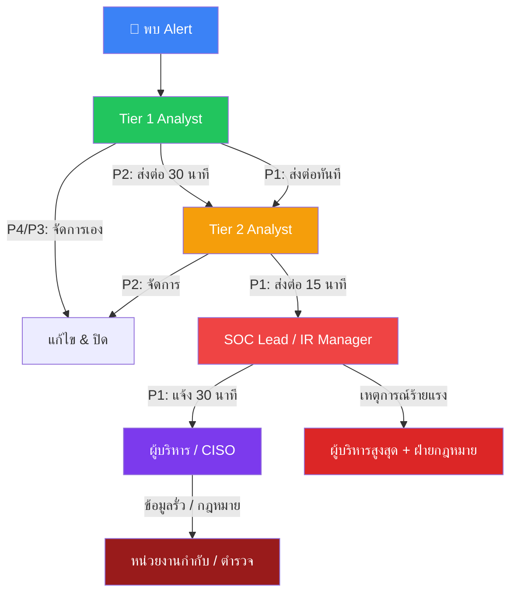

# Escalation Matrix / ตารางการส่งต่อเหตุการณ์

**รหัสเอกสาร**: IR-SOP-015
**เวอร์ชัน**: 1.0
**การจัดชั้นความลับ**: ใช้ภายใน — ต้องพิมพ์และติดในห้อง SOC
**อัปเดตล่าสุด**: 2026-02-15

> **เอกสารนี้คือเอกสารอ้างอิงแบบหน้าเดียว** พิมพ์ เคลือบ และติดไว้ที่โต๊ะทำงานของ analyst ทุกคน เมื่อเกิดเหตุการณ์ เอกสารนี้บอกว่า **ต้องแจ้งใคร เมื่อไร และอย่างไร**

---

## ผังการส่งต่อ

---

## นิยามระดับความรุนแรง (อ้างอิงด่วน)

| ระดับ | ชื่อ | ตัวอย่าง | SLA (ตอบสนอง) | SLA (แก้ไข) |
|:---:|:---|:---|:---:|:---:|
| **P1** 🔴 | **วิกฤต** | Ransomware, ข้อมูลรั่วไหล, ระบบถูกบุกรุกทั้งหมด | **15 นาที** | **4 ชั่วโมง** |
| **P2** 🟠 | **สูง** | บัญชีถูกบุกรุก, lateral movement, malware ยืนยัน | **30 นาที** | **8 ชั่วโมง** |
| **P3** 🟡 | **ปานกลาง** | Phishing (ไม่มีคนคลิก), ละเมิดนโยบาย, น่าสงสัยแต่ควบคุมได้ | **2 ชั่วโมง** | **24 ชั่วโมง** |
| **P4** 🔵 | **ต่ำ** | False positive, ข้อมูลแจ้งเตือน, ผล scan, ความเสี่ยงที่ยอมรับได้ | **8 ชั่วโมง** | **72 ชั่วโมง** |

---

## ตาราง Escalation — ใครต้องติดต่อ

### 🔴 P1 เหตุการณ์ระดับวิกฤต

| ขั้น | การดำเนินการ | ผู้รับผิดชอบ | ภายใน | ช่องทาง |
|:---:|:---|:---|:---:|:---|
| 1 | ตรวจจับ & Triage | **Tier 1 Analyst** | 0 นาที | — |
| 2 | ส่งต่อ Tier 2 | **Tier 2 Analyst (on-call)** | **5 นาที** | โทรศัพท์ + Ticket |
| 3 | แจ้ง SOC Lead | **SOC Lead** | **15 นาที** | โทรศัพท์ + Slack #incident |
| 4 | เปิดใช้ IR team | **IR Manager** | **15 นาที** | โทรศัพท์ + War Room |
| 5 | แจ้ง CISO | **CISO** | **30 นาที** | โทรศัพท์ |
| 6 | แจ้งผู้บริหาร (ถ้าข้อมูลรั่ว) | **CEO / CTO** | **1 ชั่วโมง** | โทรศัพท์ |
| 7 | แจ้งฝ่ายกฎหมาย (ถ้า PDPA) | **ที่ปรึกษากฎหมาย** | **2 ชั่วโมง** | โทรศัพท์ + Email |
| 8 | แจ้งหน่วยงานกำกับ (ถ้าจำเป็น) | **DPO / Compliance** | **72 ชั่วโมง** | ช่องทางทางการ |

### 🟠 P2 เหตุการณ์ระดับสูง

| ขั้น | การดำเนินการ | ผู้รับผิดชอบ | ภายใน | ช่องทาง |
|:---:|:---|:---|:---:|:---|
| 1 | ตรวจจับ & Triage | **Tier 1 Analyst** | 0 นาที | — |
| 2 | ส่งต่อ Tier 2 | **Tier 2 Analyst** | **30 นาที** | Ticket + Slack |
| 3 | แจ้ง SOC Lead | **SOC Lead** | **1 ชั่วโมง** | Slack + Email |
| 4 | อัปเดตผู้บริหาร (ถ้ามีแนวโน้ม) | **SOC Manager** | **4 ชั่วโมง** | Email |

### 🟡 P3 เหตุการณ์ระดับปานกลาง

| ขั้น | การดำเนินการ | ผู้รับผิดชอบ | ภายใน | ช่องทาง |
|:---:|:---|:---|:---:|:---|
| 1 | ตรวจจับ & Triage | **Tier 1 Analyst** | 0 นาที | — |
| 2 | จัดการเอง หรือส่งต่อ Tier 2 | **Tier 1/Tier 2** | **2 ชั่วโมง** | Ticket |
| 3 | อัปเดต SOC Lead (ถ้าเกิดซ้ำ) | **SOC Lead** | **สิ้นเวร** | รายงานเวร |

### 🔵 P4 เหตุการณ์ระดับต่ำ

| ขั้น | การดำเนินการ | ผู้รับผิดชอบ | ภายใน | ช่องทาง |
|:---:|:---|:---|:---:|:---|
| 1 | ตรวจจับ & Triage | **Tier 1 Analyst** | — | — |
| 2 | ปิด หรือปรับ detection | **Tier 1 Analyst** | **8 ชั่วโมง** | Ticket |

---

## สมุดรายชื่อ (Contact Directory)

> ⚠️ **แทนที่ด้วยข้อมูลจริงของคุณ** อัปเดตทุกเดือน

| บทบาท | ชื่อ | โทรศัพท์หลัก | สำรอง | Email | ความพร้อม |
|:---|:---|:---|:---|:---|:---:|
| **SOC Lead** | [ชื่อ] | [เบอร์] | Slack: @soc-lead | [email] | 24/7 on-call |
| **IR Manager** | [ชื่อ] | [เบอร์] | Slack: @ir-manager | [email] | 24/7 on-call |
| **CISO** | [ชื่อ] | [เบอร์] | WhatsApp | [email] | เวลาทำงาน + on-call |
| **CTO** | [ชื่อ] | [เบอร์] | — | [email] | เวลาทำงาน |
| **CEO** | [ชื่อ] | [เบอร์] | — | [email] | ผ่าน CISO |
| **ที่ปรึกษากฎหมาย** | [ชื่อ] | [เบอร์] | — | [email] | เวลาทำงาน |
| **DPO (PDPA)** | [ชื่อ] | [เบอร์] | — | [email] | เวลาทำงาน |
| **PR / สื่อสาร** | [ชื่อ] | [เบอร์] | — | [email] | เวลาทำงาน |
| **SOC Tier 2 (on-call)** | หมุนเวียน | ดูตาราง | Slack: @soc-oncall | soc@company.com | 24/7 |
| **External IR vendor** | [บริษัท] | [เบอร์] | — | [email] | ตามสัญญา |
| **ตำรวจไซเบอร์** | กองบังคับการปราบปราม | [เบอร์] | — | — | เวลาราชการ |

---

## กฎการส่งต่อ

### ทำ ✅
- **P1 ต้องโทร** — อย่าพึ่ง email หรือ Slack อย่างเดียว
- **เริ่ม containment ระหว่างส่งต่อ** — อย่ารออนุมัติสำหรับ P1
- **บันทึกทุกอย่าง** ใน ticketing system ทันที
- **ส่งต่อเกินไว้ดีกว่าพลาด** — ส่งต่อแล้วไม่มีอะไรดีกว่าไม่ส่งต่อแล้วพลาด
- **ใช้คำว่า "CRITICAL INCIDENT"** ในหัวข้อ email สำหรับ P1

### ห้าม ❌
- **ห้ามชะลอ** P1 เพื่อ "สืบสวนเพิ่มเติม" — ส่งต่อก่อน, สืบสวนคู่ขนาน
- **ห้ามข้ามลำดับ** — แจ้ง SOC Lead ก่อน CISO เสมอ
- **ห้ามสื่อสารภายนอก** (สื่อ, หน่วยงานกำกับ) โดยไม่ได้รับอนุมัติจากฝ่ายกฎหมาย/PR
- **ห้ามแบ่งปัน IOCs** สู่สาธารณะโดยไม่ได้รับอนุมัติ
- **ห้ามคุยเรื่อง incident** บนอุปกรณ์ส่วนตัวหรือช่องทางที่ไม่ปลอดภัย

---

## กฎ Auto-Escalation (SOAR)

| เงื่อนไข | การดำเนินการอัตโนมัติ | ส่งต่อไปยัง |
|:---|:---|:---|
| P1 ไม่มี analyst ตอบใน 10 นาที | Auto-assign + page on-call | Tier 2 + SOC Lead |
| P2 ไม่มีคนรับใน 30 นาที | Auto-reassign + Slack notify | SOC Lead |
| P3 จาก source เดียวกัน 3+ ครั้งใน 1 ชม. | Auto-correlate + ยกระดับเป็น P2 | Tier 2 |
| P1 ticket เปิด > 2 ชม. ไม่มีอัปเดต | Auto-notify ผู้บริหาร | CISO |
| มี indicator ของ data breach | Auto-notify กฎหมาย + DPO | Legal + Compliance |

---

## การส่งต่อนอกเวลาทำงาน

| เวลา | ผู้ติดต่อหลัก | สำรอง |
|:---|:---|:---|
| **เวลาทำงาน** (09:00–18:00) | ทีม SOC ประจำเวร | SOC Lead |
| **นอกเวลา** (18:00–09:00) | On-call Tier 2 | SOC Lead (โทร) |
| **เสาร์-อาทิตย์ / วันหยุด** | On-call Tier 2 | SOC Lead → IR Manager |

### ตารางหมุนเวียน On-Call

| สัปดาห์ | Tier 2 On-Call | SOC Lead สำรอง |
|:---|:---|:---|
| สัปดาห์ 1 | Analyst A | Lead X |
| สัปดาห์ 2 | Analyst B | Lead Y |
| สัปดาห์ 3 | Analyst C | Lead X |
| สัปดาห์ 4 | Analyst D | Lead Y |

> 📋 อัปเดตตารางหมุนเวียนทุกเดือน โพสต์ใน Slack #soc-oncall

---

## ช่องทางการสื่อสารตามระดับความรุนแรง

| ช่องทาง | P1 🔴 | P2 🟠 | P3 🟡 | P4 🔵 |
|:---|:---:|:---:|:---:|:---:|
| **โทรศัพท์** | ✅ ต้องโทร | ถ้าจำเป็น | ❌ | ❌ |
| **Slack #incident** | ✅ | ✅ | ❌ | ❌ |
| **Slack #soc-alerts** | ✅ | ✅ | ✅ | ✅ |
| **Email** | ✅ (หลังโทร) | ✅ | ✅ | ✅ |
| **War Room** | ✅ เปิดใช้ | ถ้าจำเป็น | ❌ | ❌ |
| **Status Page** | ถ้ากระทบลูกค้า | ❌ | ❌ | ❌ |

---

## กำหนดแจ้งหน่วยงานกำกับ

| กฎหมาย | กำหนดเวลา | แจ้งไปยัง | เงื่อนไข |
|:---|:---:|:---|:---|
| **PDPA (ไทย)** | **72 ชั่วโมง** | สำนักงานคณะกรรมการคุ้มครองข้อมูลส่วนบุคคล | ข้อมูลส่วนบุคคลรั่วไหล |
| **GDPR (EU)** | **72 ชั่วโมง** | Supervisory Authority + เจ้าของข้อมูล | ข้อมูลส่วนบุคคลรั่วไหล |
| **PCI-DSS** | **ทันที** | Acquirer + Card Brands | ข้อมูลบัตรเครดิตรั่ว |
| **SEC (US)** | **4 วันทำการ** | SEC (Form 8-K) | เหตุการณ์ไซเบอร์ที่มีนัยสำคัญ |
| **ธปท. (ไทย)** | **ทันที** | ธนาคารแห่งประเทศไทย | ระบบการเงินหยุดชะงัก |

---

## เอกสารที่เกี่ยวข้อง

-   [Severity Matrix](Severity_Matrix.en.md) — นิยามระดับความรุนแรงฉบับเต็ม
-   [Communication Templates](Communication_Templates.en.md) — แม่แบบการแจ้งเตือนสำเร็จรูป
-   [IR Framework](Framework.en.md) — วงจรชีวิตการตอบสนองต่อเหตุการณ์
-   [PDPA Incident Response](../07_Compliance_Privacy/PDPA_Incident_Response.en.md) — การแจ้ง data breach ตาม PDPA
-   [SOC Communication SOP](../06_Operations_Management/SOC_Communication.en.md)
-   [SLA Template](../06_Operations_Management/SLA_Template.en.md)
