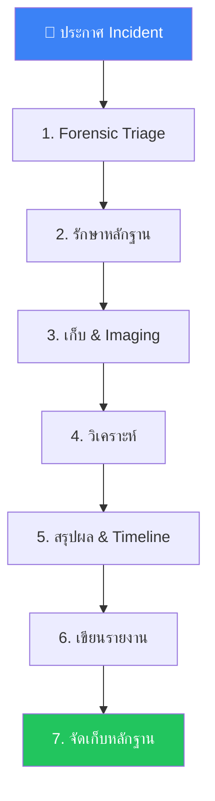

# Forensic Investigation SOP / SOP การสืบสวนทางนิติวิทยาศาสตร์ดิจิทัล

**รหัสเอกสาร**: IR-SOP-017
**เวอร์ชัน**: 1.0
**การจัดชั้นความลับ**: ลับ
**อัปเดตล่าสุด**: 2026-02-15

> นิติวิทยาศาสตร์ดิจิทัลรักษา **หลักฐานที่ยอมรับทางกฎหมาย** และช่วยวิเคราะห์ **สาเหตุที่แท้จริง** ได้อย่างละเอียด SOP นี้ครอบคลุมเมื่อไรควรทำ forensics, วิธีเก็บหลักฐานอย่างถูกต้อง, และขั้นตอนการสืบสวนทั้งหมด

---

## เมื่อไรควรทำ Forensics

| เงื่อนไข | ระดับ Forensic | ผู้เริ่ม |
|:---|:---:|:---|
| P1 incident (ยืนยันถูกบุกรุก) | **เต็มรูปแบบ** | IR Manager |
| P2 incident (สงสัยถูกบุกรุก) | **เฉพาะจุด** | SOC Lead |
| Data breach ที่มีผลกระทบกฎหมาย (PDPA/GDPR) | **เต็มรูปแบบ** + Legal hold | DPO / กฎหมาย |
| สืบสวนภัยคุกคามจากภายใน | **เต็มรูปแบบ** + HR มีส่วนร่วม | SOC Manager / HR |
| คำร้องจากหน่วยงานบังคับใช้กฎหมาย | **เต็มรูปแบบ** + Chain of custody | กฎหมาย |
| สืบสวนเชิงลึกหลังควบคุมเหตุการณ์ | **เฉพาะจุด** | IR Lead |
| Malware ต้อง reverse engineering | **เฉพาะจุด** (malware) | Tier 3 Analyst |

---

## ประเภทหลักฐาน & ลำดับความสำคัญ

| ลำดับ | ประเภท | ความเปลี่ยนแปลงง่าย | วิธีเก็บ | เครื่องมือ |
|:---:|:---|:---:|:---|:---|
| 🔴 1 | **หน่วยความจำ (RAM)** | สูงมาก | Memory dump ก่อนปิดเครื่อง | WinPmem, LiME, Velociraptor |
| 🔴 2 | **Running Processes** | สูงมาก | รายการ process + network connections | Velociraptor, EDR |
| 🔴 3 | **Network Connections** | สูงมาก | Active connections + DNS cache | netstat, Velociraptor |
| 🟠 4 | **Temporary / Swap Files** | สูง | Pagefile, hibernation file | FTK Imager, dd |
| 🟠 5 | **Event Logs** | ปานกลาง | Windows Event, syslog, auth logs | Velociraptor, wevtutil |
| 🟡 6 | **Disk Image** | ต่ำ | สำเนาดิสก์แบบ bit-for-bit | FTK Imager, dd |
| 🟡 7 | **Registry / Config** | ต่ำ | Registry hives, crontab, scheduled tasks | RegRipper, Autopsy |
| 🔵 8 | **Network Logs** | ต่ำ | PCAP, NetFlow, firewall logs | Wireshark, SIEM |
| 🔵 9 | **Application Logs** | ต่ำ | Web server, database, app logs | SIEM |

> ⚠️ **ต้องเก็บตามลำดับ volatility เสมอ** — สิ่งที่เปลี่ยนง่ายที่สุดก่อน

---

## ขั้นตอนการสืบสวน



---

### ขั้นที่ 1: Forensic Triage (15–30 นาที)

- [ ] รับรายละเอียด incident จากทีม IR
- [ ] ทบทวนหลักฐานที่มี (alerts, logs, EDR timeline)
- [ ] กำหนด **ขอบเขต**: ระบบใดเกี่ยวข้อง?
- [ ] กำหนด **ระดับ forensic**: เต็มรูปแบบหรือเฉพาะจุด?
- [ ] ติดต่อฝ่ายกฎหมายถ้ามีผลกระทบ data breach / กฎหมาย
- [ ] เริ่ม **legal hold** ถ้าจำเป็น (รักษาข้อมูลทั้งหมดที่เกี่ยวข้อง)

### ขั้นที่ 2: รักษาหลักฐาน (ทันที)

> ⚠️ **ห้ามปิดเครื่อง** จนกว่าจะเก็บ memory เสร็จ

- [ ] **ห้าม** สแกน antivirus (อาจทำลาย artifacts)
- [ ] **ห้าม** ติดตั้งเครื่องมือบนเครื่องต้องสงสัย (ถ้าเป็นไปได้)
- [ ] **ห้าม** เปิดดูไฟล์บนเครื่องต้องสงสัย
- [ ] ถ่ายรูปหน้าจอและการตั้งค่าทางกายภาพ
- [ ] บันทึก processes ที่ทำงาน, ผู้ใช้ที่ login, ไฟล์ที่เปิด
- [ ] แยกเครื่องออกจากเครือข่าย (แต่เปิดเครื่องไว้)
- [ ] จดวันเวลาและ timezone ที่แน่นอน

### ขั้นที่ 3: เก็บ & Imaging (1–4 ชม.)

#### Memory Acquisition

```bash
# Windows (รันจาก USB / network share ไม่ใช่จากดิสก์ต้องสงสัย)
winpmem_mini_x64.exe output_memory.raw

# Linux
sudo ./LiME/src/lime-$(uname -r).ko "path=/mnt/usb/memory.lime format=lime"

# ผ่าน Velociraptor (remote)
velociraptor collect -artifact Windows.Memory.Acquisition
```

#### Disk Imaging

```bash
# Linux forensic workstation (สำเนา bit-for-bit)
sudo dc3dd if=/dev/sda of=/mnt/evidence/disk_image.dd hash=sha256 log=/mnt/evidence/imaging.log
```

#### Log Collection

```bash
# Windows Event Logs (ทั้งหมด)
wevtutil epl Security C:\evidence\security.evtx
wevtutil epl System C:\evidence\system.evtx
wevtutil epl "Microsoft-Windows-Sysmon/Operational" C:\evidence\sysmon.evtx

# Linux logs
tar czf /mnt/usb/linux_logs.tar.gz /var/log/
```

#### ตรวจสอบ Hash

```bash
# Hash หลักฐานทันทีหลังเก็บ
sha256sum /mnt/evidence/disk_image.dd > /mnt/evidence/disk_image.dd.sha256
sha256sum /mnt/evidence/memory.raw > /mnt/evidence/memory.raw.sha256
```

### ขั้นที่ 4: วิเคราะห์ (4–48 ชม.)

#### 4a. Timeline Analysis

สร้าง unified timeline จากทุกแหล่งหลักฐาน:

| แหล่ง | เครื่องมือ | สิ่งที่ดึง |
|:---|:---|:---|
| Windows Events | EvtxECmd, Hayabusa | Logons, process creation, service install |
| MFT (NTFS) | MFTECmd | เวลาสร้าง/แก้ไข/เข้าถึงไฟล์ |
| Prefetch | PECmd | ประวัติการรันโปรแกรม |
| Registry | RegRipper | กิจกรรมผู้ใช้, USB history |
| Browser | Hindsight | URLs, downloads, searches |
| Memory | Volatility 3 | Processes, network, injected code |

```bash
# Volatility 3: รายการ process
vol -f memory.raw windows.pslist
vol -f memory.raw windows.netscan
vol -f memory.raw windows.malfind
```

#### 4b. Artifacts สำคัญ

| OS | Artifact | ตำแหน่ง | สิ่งที่เปิดเผย |
|:---|:---|:---|:---|
| Windows | Prefetch | `C:\Windows\Prefetch\` | โปรแกรมที่รัน, เมื่อไร, กี่ครั้ง |
| Windows | Amcache | `C:\Windows\appcompat\Programs\Amcache.hve` | โปรแกรมที่ติดตั้ง/รัน |
| Windows | $MFT | Root ของ NTFS volume | Metadata ไฟล์ทั้งหมด |
| Linux | auth.log | `/var/log/auth.log` | Authentication events |
| Linux | .bash_history | `~/.bash_history` | ประวัติคำสั่ง |
| Linux | crontab | `/var/spool/cron/` | Scheduled tasks (persistence) |

#### 4c. วิเคราะห์ Malware (ถ้ามี)

| ระดับ | กิจกรรม | เครื่องมือ |
|:---|:---|:---|
| **Static** | ค้นหา hash, strings, PE header | VirusTotal, PEStudio |
| **Dynamic** | รันใน sandbox, สังเกตพฤติกรรม | ANY.RUN, Cuckoo |
| **Code** | Decompile, reverse engineer | Ghidra, IDA Pro |

### ขั้นที่ 5: สรุปผล & Timeline (2–4 ชม.)

- [ ] สร้าง timeline ตามลำดับเวลาของกิจกรรมผู้บุกรุก
- [ ] ระบุ **ช่องทางเข้าเริ่มต้น** (initial access vector)
- [ ] แมปกิจกรรมกับ **MITRE ATT&CK techniques**
- [ ] ระบุ **accounts, ระบบ, และข้อมูล** ที่ถูกบุกรุก
- [ ] คำนวณ **dwell time** (เข้าถึงครั้งแรก → ตรวจพบ)
- [ ] ระบุ **ข้อมูลที่ถูกเข้าถึงหรือนำออก**

### ขั้นที่ 6: เขียนรายงาน (4–8 ชม.)

รายงาน forensic ต้องประกอบด้วย:

1. **สรุปผู้บริหาร** — ภาพรวมไม่เทคนิคสำหรับผู้บริหาร
2. **Timeline** — ลำดับเวลาของเหตุการณ์
3. **ขอบเขตการถูกบุกรุก** — ระบบ, accounts, ข้อมูลที่ได้รับผลกระทบ
4. **สาเหตุที่แท้จริง** — เหตุการณ์เกิดขึ้นได้อย่างไร
5. **MITRE ATT&CK Mapping** — Techniques ที่ใช้
6. **รายการหลักฐาน** — หลักฐานทั้งหมดพร้อม hashes
7. **ผลการวิเคราะห์** — รายละเอียดทางเทคนิค
8. **IOCs** — Indicators of Compromise สำหรับ detection
9. **คำแนะนำ** — ขั้นตอนแก้ไขและป้องกัน
10. **บันทึก Chain of Custody** — ประวัติการจัดการหลักฐาน

### ขั้นที่ 7: จัดเก็บหลักฐาน

| รายการ | เก็บนาน | ที่จัดเก็บ | สิทธิ์เข้าถึง |
|:---|:---:|:---|:---|
| Forensic images (disk, memory) | 2 ปี | Encrypted offline storage | ทีม Forensic + กฎหมาย |
| Case files และรายงาน | 5 ปี | Secure file server | SOC Lead + กฎหมาย |
| IOCs ที่ดึงออกมา | ไม่จำกัด | TI Platform | ทีม SOC |
| Chain of custody logs | 7 ปี | Legal archives | กฎหมายเท่านั้น |

---

## Template Chain of Custody

| # | วันเวลา | การดำเนินการ | รายการ | จาก | ถึง | ลายเซ็น |
|:---:|:---|:---|:---|:---|:---|:---|
| 1 | [datetime] | เก็บ | Memory dump (sha256: abc...) | System X | Analyst A | [เซ็น] |
| 2 | [datetime] | เก็บ | Disk image (sha256: def...) | System X | Analyst A | [เซ็น] |
| 3 | [datetime] | ส่งต่อ | Disk image | Analyst A | ตู้เก็บหลักฐาน | [เซ็น] |
| 4 | [datetime] | วิเคราะห์ | Disk image (working copy) | ตู้เก็บหลักฐาน | Analyst B | [เซ็น] |

> การส่งต่อหลักฐานทุกครั้ง **ต้อง** บันทึก Chain of custody ที่ต่อเนื่องจำเป็นสำหรับการดำเนินคดี

---

## ชุดเครื่องมือ Forensic

### เครื่องมือจำเป็น (ฟรี / Open Source)

| เครื่องมือ | วัตถุประสงค์ | OS |
|:---|:---|:---|
| **Velociraptor** | เก็บหลักฐานระยะไกล, hunting | Cross-platform |
| **Volatility 3** | Memory forensics | Cross-platform |
| **Autopsy** | Disk forensics (GUI) | Windows/Linux |
| **Hayabusa** | วิเคราะห์ Windows event log (เร็ว) | Cross-platform |
| **KAPE** | เก็บ artifact อัตโนมัติ | Windows |
| **FTK Imager** | Disk imaging, preview หลักฐาน | Windows |
| **Plaso / log2timeline** | สร้าง super timeline | Cross-platform |
| **Ghidra** | Reverse engineering | Cross-platform |
| **Wireshark** | Network forensics | Cross-platform |
| **CyberChef** | Decode/แปลงข้อมูล | Web |

---

### Chain of Custody Log

| # | Item | Collected By | Date/Time | Hash (SHA256) | Storage |
|:---|:---|:---|:---|:---|:---|
| E-001 | Disk image | Analyst A | YYYY-MM-DD | abc123... | Evidence locker |
| E-002 | Memory dump | Analyst B | YYYY-MM-DD | def456... | Encrypted NAS |
| E-003 | Network PCAP | Analyst A | YYYY-MM-DD | ghi789... | Evidence server |

### Forensic Tool Quick Reference

| Tool | Purpose | Platform |
|:---|:---|:---|
| FTK Imager | Disk imaging | Windows |
| Volatility 3 | Memory analysis | Cross-platform |
| Wireshark | Packet analysis | Cross-platform |
| Autopsy | File system analysis | Windows/Linux |
| KAPE | Artifact collection | Windows |

### Evidence Priority

| Type | Volatility |
|:---|:---|
| RAM | สูงมาก |
| Processes | สูง |
| Network | ปานกลาง |
| Disk | ต่ำ |

## เอกสารที่เกี่ยวข้อง

-   [Evidence Collection](Evidence_Collection.en.md) — ขั้นตอนเก็บหลักฐานเบื้องต้น
-   [IR Framework](Framework.en.md) — วงจรชีวิตการตอบสนอง
-   [Incident Classification](Incident_Classification.en.md) — วิธีจำแนกเหตุการณ์
-   [Escalation Matrix](Escalation_Matrix.en.md) — ขั้นตอนการส่งต่อ
-   [Communication Templates](Communication_Templates.en.md) — แม่แบบการแจ้งเตือน
-   [Lessons Learned Template](Lessons_Learned_Template.en.md) — ทบทวนหลังเหตุการณ์
