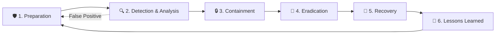
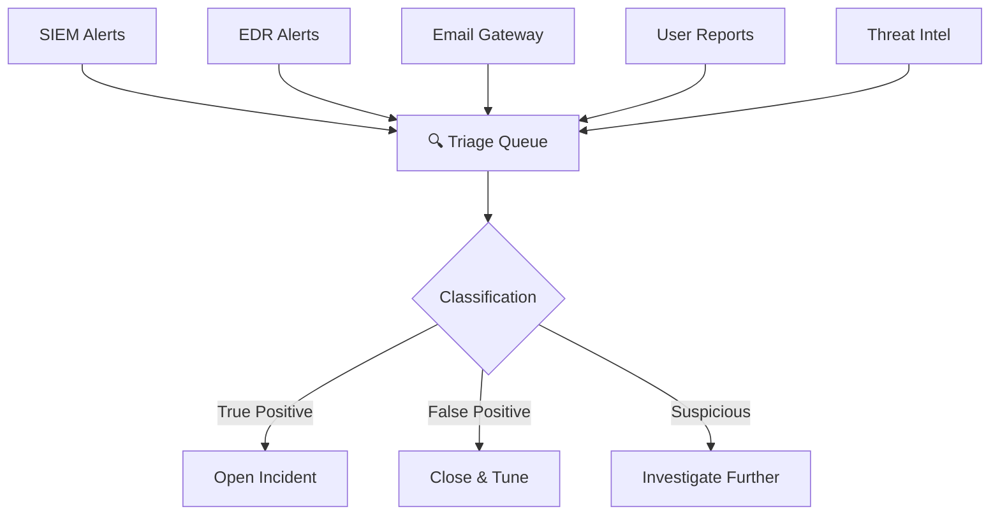

# Incident Response Framework

This document defines the standard Incident Response (IR) lifecycle for the organization's Security Operations Center (SOC), aligned with **NIST SP 800-61r2** and **ISO/IEC 27035**. It serves as the master reference for all IR activities — all playbooks, procedures, and templates derive from this framework.

## Overview

```mermaid
graph LR
    A["🛡️ 1. Preparation"] --> B["🔍 2. Detection & Analysis"]
    B --> C["🔒 3. Containment"]
    C --> D["🧹 4. Eradication"]
    D --> E["🔄 5. Recovery"]
    E --> F["📝 6. Lessons Learned"]
    F --> A
    B -.->|False Positive| A
```

| Phase | Objective | Key Activities | Owner |
|:---|:---|:---|:---|
| Preparation | Readiness | Tools, training, playbooks | SOC Manager |
| Detection & Analysis | Identify & triage | Alert triage, classification, investigation | Tier 1–2 Analyst |
| Containment | Limit damage | Isolate, block, preserve evidence | Tier 2–3 Analyst |
| Eradication | Remove threat | Clean, patch, harden | Tier 2–3 + IT Ops |
| Recovery | Restore operations | Re-deploy, monitor, validate | IT Ops + SOC |
| Lessons Learned | Improve | PIR, update rules, metrics | SOC Manager |

---

## 1. Preparation

Preparation ensures the SOC has the **people, processes, and technology** ready to respond effectively.

### 1.1 People
| Area | Requirements |
|:---|:---|
| **Staffing** | Adequate coverage per [SOC Team Structure](../06_Operations_Management/SOC_Team_Structure.en.md) |
| **Training** | Analysts trained on all playbooks and IR procedures quarterly |
| **On-Call** | Escalation roster maintained and tested monthly |
| **Communication** | Contact lists for management, legal, PR, law enforcement |

### 1.2 Technology
| Tool Category | Purpose | Status Check |
|:---|:---|:---|
| **SIEM** | Log aggregation, correlation, alerting | Daily health check |
| **EDR** | Endpoint detection, isolation, forensics | Agent coverage ≥ 95% |
| **SOAR** | Automated triage, enrichment, response | Playbook test monthly |
| **Network** | NSM, IDS/IPS, PCAP, NetFlow | Sensor coverage verified |
| **Ticketing** | Case management, SLA tracking | Queue reviewed per shift |
| **TI Platform** | IoC feeds, enrichment APIs | Feed freshness < 24h |
| **Forensics** | Disk/memory/network acquisition tools | Tools tested quarterly |

### 1.3 Documentation
- IR Plan reviewed and approved by management annually
- All playbooks current and tested via [tabletop exercises](Tabletop_Exercises.en.md)
- Communication templates pre-drafted (internal, customer, regulatory, media)
- Legal counsel and PDPA notification process documented

### 1.4 Readiness Metrics
| Metric | Target | Measurement |
|:---|:---|:---|
| Playbook coverage (MITRE ATT&CK) | ≥ 80% of top techniques | Quarterly review |
| IR drill frequency | ≥ 1 per quarter | Drill log |
| Analyst certification rate | ≥ 70% | Training records |
| Contact roster accuracy | 100% | Monthly validation |

---

## 2. Detection & Analysis

The most critical phase — correctly identifying real threats and filtering noise.

### 2.1 Alert Sources

```mermaid
graph TD
    SIEM["SIEM Alerts"] --> Triage
    EDR["EDR Alerts"] --> Triage
    Email["Email Gateway"] --> Triage
    Users["User Reports"] --> Triage
    TI["Threat Intel"] --> Triage
    Triage["🔍 Triage Queue"]
    Triage --> Classify{Classification}
    Classify -->|True Positive| Incident["Open Incident"]
    Classify -->|False Positive| FP["Close & Tune"]
    Classify -->|Suspicious| Investigate["Investigate Further"]
```

### 2.2 Triage Process (Tier 1)

| Step | Action | SLA |
|:---|:---|:---|
| 1 | **Acknowledge** — Pick up alert from queue | < 10 min |
| 2 | **Context** — Check affected user, source IP, asset criticality | — |
| 3 | **Enrich** — Query TI feeds (VirusTotal, AbuseIPDB, URLScan) | — |
| 4 | **Correlate** — Search SIEM for related events (±1 hour window) | — |
| 5 | **Classify** — Assign: TP / FP / Suspicious | < 30 min |
| 6 | **Route** — TP → Open incident, FP → Close & tune, Suspicious → Escalate | — |

> 📚 **Detailed procedure**: [Tier 1 Runbook](Runbooks/Tier1_Runbook.en.md)

### 2.3 Classification

| Dimension | Options | Reference |
|:---|:---|:---|
| **Severity** | Critical · High · Medium · Low | [Severity Matrix](Severity_Matrix.en.md) |
| **Category** | Phishing · Malware · Ransomware · Account Compromise · DDoS · Insider · Data Breach · etc. | [Incident Classification](Incident_Classification.en.md) |
| **Priority** | P1 (Immediate) · P2 (Urgent) · P3 (Normal) · P4 (Low) | [Escalation Matrix](Escalation_Matrix.en.md) |

### 2.4 Investigation (Tier 2)

When an alert is classified as a true positive or requires further investigation:

1. **Scope** — Determine affected assets, users, and data
2. **Timeline** — Build event timeline using SIEM, EDR, and network logs
3. **Root Cause** — Identify initial access vector and attack path
4. **Impact** — Assess business impact and data exposure
5. **IoC Extraction** — Document all IoCs (IPs, domains, hashes, email addresses)

> 📚 **Log sources**: [Log Source Matrix](../06_Operations_Management/Log_Source_Matrix.en.md)

### 2.5 Crisis Command / War Room Activation

| Trigger | Activate War Room? | Incident Commander | Minimum Immediate Output |
|:---|:---:|:---|:---|
| **P1 Critical incident** | ✅ Yes | SOC Lead or assigned IR Lead | Named commander, war room channel, first update time |
| **P2 incident with unresolved business disruption** | ✅ Yes | SOC Manager or IR Lead | Decision owner, service-impact summary, update cadence |
| **Multi-team containment or legal / privacy coordination** | ✅ Yes | IR Lead | Stakeholder list, decision log owner, coordination path |
| **Single-team incident with contained scope** | Optional | Shift Lead | Ticket-based coordination unless scope expands |

### 2.6 War Room Command Rules

-   [ ] Name one **Incident Commander** and one backup before the first broad escalation.
-   [ ] Open one primary war room channel and record it in the incident ticket.
-   [ ] Set an update cadence at activation time and keep it until the case stabilizes.
-   [ ] Record every containment tradeoff, approval, and unresolved blocker in one decision log.
-   [ ] Close the war room only after ownership returns to normal ticket-based handling or recovery governance.

---

## 3. Containment

Objective: **Stop the bleeding** — limit attacker access and prevent further damage while preserving evidence.

### 3.1 Containment Strategy

| Type | Actions | When to Use |
|:---|:---|:---|
| **Short-term** | Isolate host (EDR), block IP/domain (FW), disable account (IAM), quarantine email | Immediately upon confirmation |
| **Long-term** | Patch vulnerability, apply network segmentation, enforce MFA, revoke API keys | After initial containment |

### 3.2 Containment Decision Matrix

| Severity | Auto-Contain? | Approval Required? | Communication |
|:---|:---:|:---:|:---|
| **Critical** | ✅ Yes (EDR auto-isolate) | Post-action notification to Manager | Immediate escalation to CISO |
| **High** | ⚠️ Partial (block IoCs) | SOC Lead approval | Email to SOC Manager |
| **Medium** | ❌ No | Analyst judgment | Ticket update |
| **Low** | ❌ No | Not required | Ticket update |

### 3.3 Evidence Preservation

> ⚠️ **Before eradication**, always preserve:

- Memory dump of affected systems
- Disk image (if warranted by severity)
- Network captures (PCAP)
- Relevant log exports
- Screenshots of attacker artifacts

> 📚 **Detailed procedure**: [Forensic Investigation](Forensic_Investigation.en.md)

---

## 4. Eradication

Objective: **Completely remove** the threat from the environment.

### 4.1 Eradication Actions

| Threat Type | Eradication Steps |
|:---|:---|
| **Malware** | Remove malicious files, registry keys, scheduled tasks; scan with updated signatures |
| **Compromised Account** | Reset credentials, revoke sessions, review account activity |
| **Vulnerability Exploit** | Apply patch, update WAF rules, verify fix |
| **Persistence Mechanism** | Remove backdoors, rogue services, unauthorized SSH keys |
| **Data Staging** | Remove exfiltration tools, review data access logs |

### 4.2 Verification

- [ ] Run full scan on all affected systems
- [ ] Verify no remaining IoCs in SIEM (24-hour lookback)
- [ ] Confirm all compromised credentials have been rotated
- [ ] Validate no persistence mechanisms remain
- [ ] Test that containment blocks are effective

---

## 5. Recovery

Objective: **Safely restore** systems to normal operations with enhanced monitoring.

### 5.1 Recovery Steps

| # | Step | Owner | Verification |
|:---:|:---|:---|:---|
| 1 | Deploy clean/patched systems | IT Ops | System integrity check |
| 2 | Restore from clean backups (if needed) | IT Ops | Data integrity validation |
| 3 | Re-enable network connectivity | Network Team | Traffic monitoring |
| 4 | Re-enable user accounts | IAM Team | Access review |
| 5 | Enhanced monitoring period | SOC | 24–72 hour watch |

### 5.2 Recovery Decision Gates

| Recovery Decision | Usual Owner | Minimum Evidence Gate | Escalate Further When |
|:---|:---|:---|:---|
| **Restore from backup / snapshot** | IT Ops + service owner | Restore source is known-good, recovery point is accepted, integrity validation is defined | Backup trust is uncertain, regulated data may be inconsistent, or downtime becomes material |
| **Rollback to prior release / configuration** | Service owner + change owner | Prior version is verified, rollback impact is understood, rollback window is approved | Rollback could reintroduce exploitable weakness or break another critical service |
| **Re-enable identity or privileged access** | IAM owner + Incident Commander | Credential reset complete, session revocation confirmed, access review finished | Privileged access is involved, account owner is disputed, or compromise scope remains unclear |
| **Reconnect host / segment / integration** | Network owner + Incident Commander | Containment is stable, host is clean, monitoring coverage exists, and compensating controls are active | Reconnection exposes crown-jewel systems, third parties, or unresolved lateral-movement risk |
| **Return service to production** | Business owner + CISO for material cases | Business validation passed, monitoring cadence defined, rollback path remains available | Customer impact, board visibility, or residual risk remains High |

### 5.3 Enhanced Monitoring Period

| Severity | Monitoring Duration | Focus Areas |
|:---|:---|:---|
| **Critical** | 72 hours | Re-infection, lateral movement, data exfiltration |
| **High** | 48 hours | Persistence, C2 communication |
| **Medium** | 24 hours | Similar alerts, related accounts |
| **Low** | Normal monitoring | Standard alerting |

### 5.4 Exit Criteria for Enhanced Monitoring

| Exit Check | Minimum Requirement | Escalate Again When |
|:---|:---|:---|
| **No recurrence observed** | No repeat indicator, matching alert pattern, or confirmed suspicious activity during the agreed watch window | The same behavior, account, or asset triggers again |
| **Controls remain active** | Blocks, credential resets, segmentation, or compensating controls are still in place and verified | A temporary control expired, failed, or was bypassed |
| **Business validation complete** | Service owner confirms the restored workflow is stable enough for normal operation | Users, customers, or downstream teams report material degradation |
| **Telemetry coverage intact** | Required logs, EDR, and alerting stayed available during monitoring | Monitoring blind spot, parser failure, or log outage affects validation |

### 5.5 War Room Exit and Incident Closure Gate

-   [ ] Close the war room only after an owner is assigned for enhanced monitoring, open remediation, and stakeholder follow-up.
-   [ ] Return from war room cadence to normal ticket cadence only after the next update time, notification path, and decision backlog are explicitly handed off.
-   [ ] Close the incident only after enhanced monitoring exit criteria pass, residual risk is accepted at the right level, and closure evidence is complete.
-   [ ] Re-open severity or governance escalation if monitoring reveals recurrence, material instability, or unresolved external obligations.

---

## 6. Lessons Learned

Objective: **Continuously improve** IR capabilities based on real incidents.

### 6.1 Post-Incident Review (PIR)

> PIR must be conducted within **72 hours** of incident closure for High/Critical incidents.

| Agenda Item | Questions to Answer |
|:---|:---|
| **Timeline Review** | What happened and when? Were SLAs met? |
| **Detection** | How was it detected? Could we have detected it faster? |
| **Response** | Was the response effective? What went well / poorly? |
| **Communication** | Was stakeholder communication adequate and timely? |
| **Root Cause** | What enabled the attack? What control failed? |
| **Improvements** | What specific changes will prevent recurrence? |

### 6.2 PIR Outputs → Actions

| Output | Action Required | Owner | Deadline |
|:---|:---|:---|:---|
| Detection gap identified | Create/update detection rule | Detection Engineer | 1 week |
| Playbook inadequacy | Update/create playbook | SOC Analyst (T2+) | 2 weeks |
| Process failure | Update SOP | SOC Manager | 2 weeks |
| Training gap | Schedule training session | Training Lead | 1 month |
| Technology gap | Submit requirement to budget | CISO | Next cycle |

### 6.3 Metrics to Track

| Metric | Definition | Target |
|:---|:---|:---|
| **MTTD** | Mean Time To Detect | < 30 minutes |
| **MTTR** | Mean Time To Respond | < 60 minutes (Critical/High) |
| **MTTA** | Mean Time To Acknowledge | < 10 minutes |
| **FPR** | False Positive Rate | < 10% |
| **Closure Rate** | Incidents closed within SLA | ≥ 95% |
| **PIR Completion** | PIR conducted within 72h | 100% (Critical/High) |

> 📚 **Detailed metrics**: [SOC Metrics & KPIs](../06_Operations_Management/SOC_Metrics.en.md) · [KPI Dashboard](../06_Operations_Management/KPI_Dashboard_Template.en.md)

---

## Severity → Response Time Matrix

Quick reference for SLA targets across all phases:

| Severity | MTTA | MTTD | Containment | Eradication | Recovery | PIR |
|:---|:---:|:---:|:---:|:---:|:---:|:---:|
| **Critical** | 5 min | 15 min | 1 hour | 4 hours | 24 hours | Required (72h) |
| **High** | 10 min | 30 min | 4 hours | 24 hours | 48 hours | Required (72h) |
| **Medium** | 30 min | 2 hours | 24 hours | 72 hours | 1 week | Recommended |
| **Low** | 1 hour | 8 hours | 72 hours | 1 week | 2 weeks | Optional |

---

## RACI Matrix

| Activity | SOC Analyst | SOC Lead | SOC Manager | CISO | IT Ops | Legal |
|:---|:---:|:---:|:---:|:---:|:---:|:---:|
| Alert Triage | **R** | A | I | — | — | — |
| Investigation | **R** | A | I | — | C | — |
| Containment | R | **A** | I | I | C | — |
| Eradication | R | **A** | I | — | **R** | — |
| Recovery | C | I | A | I | **R** | — |
| Communication (Internal) | — | R | **A** | I | — | C |
| Communication (External) | — | — | R | **A** | — | **R** |
| PIR | R | **R** | A | I | C | — |

*R = Responsible, A = Accountable, C = Consulted, I = Informed*

---

## Related Documents

- [Tier 1 Runbook](Runbooks/Tier1_Runbook.en.md) — Step-by-step triage procedure
- [Severity Matrix](Severity_Matrix.en.md) — Classification criteria
- [Incident Classification](Incident_Classification.en.md) — Taxonomy and categories
- [Escalation Matrix](Escalation_Matrix.en.md) — Escalation paths and SLAs
- [Forensic Investigation](Forensic_Investigation.en.md) — Evidence handling procedures
- [Communication Templates](Communication_Templates.en.md) — Pre-drafted notifications
- [Incident Report Template](../11_Reporting_Templates/incident_report.en.md) — Post-incident documentation
- [Shift Handoff Standard](../06_Operations_Management/Shift_Handoff.en.md) — Operational continuity

### Playbooks
- [PB-01 Phishing](Playbooks/Phishing.en.md) · [PB-02 Ransomware](Playbooks/Ransomware.en.md) · [PB-03 Malware](Playbooks/Malware_Infection.en.md)
- [PB-04 Account Compromise](Playbooks/Account_Compromise.en.md) · [PB-05 DDoS](Playbooks/DDoS_Attack.en.md) · [PB-06 BEC](Playbooks/BEC.en.md)
- [Full playbook list →](../README.md)

## References

- [NIST SP 800-61r2 — Computer Security Incident Handling Guide](https://csrc.nist.gov/publications/detail/sp/800-61/rev-2/final)
- [MITRE ATT&CK Framework](https://attack.mitre.org/)
- [ISO/IEC 27035 — Information Security Incident Management](https://www.iso.org/standard/60803.html)
- [SANS Incident Handler's Handbook](https://www.sans.org/white-papers/33901/)
- [FIRST CSIRT Framework](https://www.first.org/standards/frameworks/)
