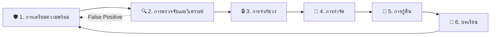
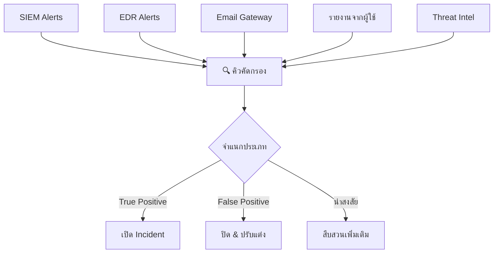
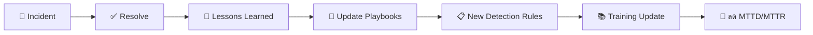

# กรอบการตอบสนองต่อเหตุการณ์ (Incident Response Framework)

เอกสารนี้กำหนดวงจรชีวิตมาตรฐานของการตอบสนองต่อเหตุการณ์ความปลอดภัย (IR) สำหรับศูนย์ปฏิบัติการความมั่นคงปลอดภัยทางไซเบอร์ (SOC) โดยอ้างอิงตามมาตรฐาน **NIST SP 800-61r2** และ **ISO/IEC 27035** เอกสารนี้เป็นเอกสารอ้างอิงหลักสำหรับกิจกรรม IR ทั้งหมด

## ภาพรวม

| ขั้นตอน | วัตถุประสงค์ | กิจกรรมหลัก | ผู้รับผิดชอบ |
|:---|:---|:---|:---|
| เตรียมความพร้อม | ความพร้อม | เครื่องมือ, การฝึกอบรม, playbooks | SOC Manager |
| ตรวจจับและวิเคราะห์ | ระบุและคัดกรอง | คัดกรอง alert, จำแนกประเภท, สืบสวน | Analyst T1–T2 |
| จำกัดวง | จำกัดความเสียหาย | แยกเครื่อง, บล็อก, เก็บหลักฐาน | Analyst T2–T3 |
| กำจัด | ลบภัยคุกคาม | ทำความสะอาด, อุดช่องโหว่, เสริมความแข็งแกร่ง | T2–T3 + IT Ops |
| กู้คืน | คืนสภาพระบบ | ติดตั้งใหม่, เฝ้าระวัง, ตรวจสอบ | IT Ops + SOC |
| บทเรียน | ปรับปรุง | PIR, อัปเดตกฎ, ตัวชี้วัด | SOC Manager |

---

## 1. การเตรียมความพร้อม (Preparation)

การเตรียมความพร้อมเพื่อให้ SOC มี **คน, กระบวนการ, และเทคโนโลยี** พร้อมตอบสนองอย่างมีประสิทธิภาพ

### 1.1 บุคลากร
| ด้าน | ข้อกำหนด |
|:---|:---|
| **จำนวนคน** | เพียงพอตาม [โครงสร้างทีม SOC](../06_Operations_Management/SOC_Team_Structure.th.md) |
| **การฝึกอบรม** | Analyst ผ่านการฝึก playbook ทุกรายไตรมาส |
| **เวรรับเรื่อง** | รายชื่อ escalation ทดสอบทุกเดือน |
| **การสื่อสาร** | รายชื่อผู้ติดต่อ: ผู้บริหาร, กฎหมาย, PR, หน่วยงานบังคับใช้กฎหมาย |

### 1.2 เทคโนโลยี
| ประเภทเครื่องมือ | วัตถุประสงค์ | การตรวจสอบ |
|:---|:---|:---|
| **SIEM** | รวบรวม log, correlation, แจ้งเตือน | ตรวจสุขภาพรายวัน |
| **EDR** | ตรวจจับ endpoint, แยกเครื่อง, forensics | Agent coverage ≥ 95% |
| **SOAR** | Triage อัตโนมัติ, enrichment, ตอบสนอง | ทดสอบ playbook รายเดือน |
| **Network** | NSM, IDS/IPS, PCAP, NetFlow | ตรวจ sensor coverage |
| **Ticketing** | จัดการเคส, ติดตาม SLA | ตรวจคิวทุกกะ |
| **TI Platform** | IoC feeds, enrichment APIs | ข้อมูลสดภายใน 24 ชม. |
| **Forensics** | เก็บหลักฐาน disk/memory/network | ทดสอบเครื่องมือทุกไตรมาส |

### 1.3 ตัวชี้วัดความพร้อม
| ตัวชี้วัด | เป้าหมาย | การวัด |
|:---|:---|:---|
| Playbook coverage (MITRE ATT&CK) | ≥ 80% ของเทคนิคสำคัญ | ทบทวนรายไตรมาส |
| ความถี่การซ้อม IR | ≥ 1 ครั้ง/ไตรมาส | บันทึกการซ้อม |
| อัตราใบรับรองของ analyst | ≥ 70% | บันทึกการฝึกอบรม |
| ความถูกต้องของรายชื่อเวร | 100% | ตรวจสอบรายเดือน |

---

## 2. การตรวจจับและวิเคราะห์ (Detection & Analysis)

ขั้นตอนที่สำคัญที่สุด — ระบุภัยคุกคามจริงและกรอง noise

### 2.1 แหล่งที่มาของ Alert

### 2.2 กระบวนการคัดกรอง (Tier 1)

| ขั้นตอน | การดำเนินการ | SLA |
|:---|:---|:---|
| 1 | **รับเรื่อง** — หยิบ alert จากคิว | < 10 นาที |
| 2 | **บริบท** — ตรวจสอบผู้ใช้, IP ต้นทาง, ความสำคัญของสินทรัพย์ | — |
| 3 | **Enrich** — สอบทาม TI feeds (VirusTotal, AbuseIPDB, URLScan) | — |
| 4 | **Correlate** — ค้นหาเหตุการณ์ที่เกี่ยวข้องใน SIEM (±1 ชั่วโมง) | — |
| 5 | **จำแนก** — กำหนด: TP / FP / น่าสงสัย | < 30 นาที |
| 6 | **ส่งต่อ** — TP → เปิด incident, FP → ปิด & tune, น่าสงสัย → Escalate | — |

### 2.3 การจำแนกประเภท

| มิติ | ตัวเลือก | อ้างอิง |
|:---|:---|:---|
| **ความรุนแรง** | Critical · High · Medium · Low | [Severity Matrix](Severity_Matrix.th.md) |
| **หมวดหมู่** | Phishing · Malware · Ransomware · Account Compromise · DDoS · Insider · Data Breach | [การจำแนกเหตุการณ์](Incident_Classification.th.md) |
| **ลำดับความสำคัญ** | P1 (ทันที) · P2 (เร่งด่วน) · P3 (ปกติ) · P4 (ต่ำ) | [Escalation Matrix](../06_Operations_Management/Escalation_Matrix.th.md) |

---

## 3. การจำกัดความเสียหาย (Containment)

วัตถุประสงค์: **หยุดเลือด** — จำกัดการเข้าถึงของผู้โจมตีและป้องกันความเสียหายเพิ่มเติม

### 3.1 กลยุทธ์การจำกัดวง

| ประเภท | การดำเนินการ | ใช้เมื่อ |
|:---|:---|:---|
| **ระยะสั้น** | แยกเครื่อง (EDR), บล็อก IP/domain (FW), ปิดบัญชี (IAM) | ทันทีเมื่อยืนยันผล |
| **ระยะยาว** | อุดช่องโหว่, แบ่ง segment เครือข่าย, บังคับ MFA | หลัง containment เบื้องต้น |

### 3.2 ตารางตัดสินใจ Containment

| ความรุนแรง | Auto-Contain? | ต้องอนุมัติ? | การสื่อสาร |
|:---|:---:|:---:|:---|
| **Critical** | ✅ ใช่ | แจ้ง Manager หลังดำเนินการ | Escalate ถึง CISO ทันที |
| **High** | ⚠️ บางส่วน | SOC Lead อนุมัติ | อีเมลถึง SOC Manager |
| **Medium** | ❌ ไม่ | ดุลยพินิจ Analyst | อัปเดต ticket |
| **Low** | ❌ ไม่ | ไม่จำเป็น | อัปเดต ticket |

### 3.3 การเก็บรักษาหลักฐาน

> ⚠️ **ก่อนกำจัด** ต้องเก็บรักษาเสมอ:
- Memory dump ของระบบที่ได้รับผลกระทบ
- Disk image (ถ้าความรุนแรงสูง)
- Network captures (PCAP)
- Log exports ที่เกี่ยวข้อง
- Screenshots ของ artifacts ของผู้โจมตี

---

## 4. การกำจัดภัยคุกคาม (Eradication)

| ประเภทภัยคุกคาม | ขั้นตอนการกำจัด |
|:---|:---|
| **Malware** | ลบไฟล์อันตราย, registry keys, scheduled tasks; สแกนด้วย signatures ล่าสุด |
| **บัญชีเข้ารหัส** | รีเซ็ตรหัสผ่าน, เพิกถอน session, ตรวจสอบกิจกรรมบัญชี |
| **ช่องโหว่** | ติดตั้ง patch, อัปเดตกฎ WAF, ตรวจสอบผล |
| **Persistence** | ลบ backdoors, rogue services, SSH keys ที่ไม่ได้อนุญาต |

---

## 5. การกู้คืนระบบ (Recovery)

| # | ขั้นตอน | ผู้รับผิดชอบ | การตรวจสอบ |
|:---:|:---|:---|:---|
| 1 | ติดตั้งระบบที่สะอาด/อัปเดตแล้ว | IT Ops | ตรวจ integrity |
| 2 | กู้คืนจาก backup ที่สะอาด | IT Ops | ตรวจ data integrity |
| 3 | เปิดการเชื่อมต่อเครือข่าย | Network Team | เฝ้าระวัง traffic |
| 4 | เปิดบัญชีผู้ใช้ | IAM Team | ตรวจสอบสิทธิ์ |
| 5 | เฝ้าระวังเข้มข้น | SOC | 24–72 ชั่วโมง |

### ระยะเวลาเฝ้าระวังเข้มข้น

| ความรุนแรง | ระยะเวลา | จุดสนใจ |
|:---|:---|:---|
| **Critical** | 72 ชั่วโมง | การติดเชื้อซ้ำ, lateral movement, data exfiltration |
| **High** | 48 ชั่วโมง | Persistence, C2 communication |
| **Medium** | 24 ชั่วโมง | Alert ที่คล้ายกัน, บัญชีที่เกี่ยวข้อง |
| **Low** | เฝ้าระวังปกติ | Standard alerting |

---

## 6. บทเรียนที่ได้รับ (Lessons Learned)

### 6.1 การทบทวนหลังเหตุการณ์ (PIR)

> PIR ต้องดำเนินการภายใน **72 ชั่วโมง** หลังปิดเหตุการณ์สำหรับ High/Critical

| หัวข้อ | คำถามที่ต้องตอบ |
|:---|:---|
| **Timeline** | เกิดอะไรขึ้นและเมื่อไหร่? ตรงตาม SLA ไหม? |
| **การตรวจจับ** | ตรวจจับได้อย่างไร? ตรวจจับเร็วกว่านี้ได้ไหม? |
| **การตอบสนอง** | การตอบสนองมีประสิทธิภาพไหม? อะไรดี / อะไรไม่ดี? |
| **การสื่อสาร** | สื่อสารกับผู้มีส่วนได้ส่วนเสียเพียงพอไหม? |
| **สาเหตุ** | อะไรทำให้เกิดการโจมตี? control ไหนล้มเหลว? |
| **การปรับปรุง** | เปลี่ยนแปลงอะไรเพื่อป้องกันไม่ให้เกิดซ้ำ? |

---

## ตาราง SLA ตามความรุนแรง

| ความรุนแรง | MTTA | MTTD | Containment | Eradication | Recovery | PIR |
|:---|:---:|:---:|:---:|:---:|:---:|:---:|
| **Critical** | 5 นาที | 15 นาที | 1 ชม. | 4 ชม. | 24 ชม. | จำเป็น (72 ชม.) |
| **High** | 10 นาที | 30 นาที | 4 ชม. | 24 ชม. | 48 ชม. | จำเป็น (72 ชม.) |
| **Medium** | 30 นาที | 2 ชม. | 24 ชม. | 72 ชม. | 1 สัปดาห์ | แนะนำ |
| **Low** | 1 ชม. | 8 ชม. | 72 ชม. | 1 สัปดาห์ | 2 สัปดาห์ | ไม่บังคับ |

---

## RACI Matrix

| กิจกรรม | SOC Analyst | SOC Lead | SOC Manager | CISO | IT Ops | Legal |
|:---|:---:|:---:|:---:|:---:|:---:|:---:|
| คัดกรอง Alert | **R** | A | I | — | — | — |
| สืบสวน | **R** | A | I | — | C | — |
| จำกัดวง | R | **A** | I | I | C | — |
| กำจัด | R | **A** | I | — | **R** | — |
| กู้คืน | C | I | A | I | **R** | — |
| สื่อสาร (ภายใน) | — | R | **A** | I | — | C |
| สื่อสาร (ภายนอก) | — | — | R | **A** | — | **R** |
| PIR | R | **R** | A | I | C | — |

*R = รับผิดชอบ, A = ตัดสินใจ, C = ให้คำปรึกษา, I = รับทราบ*

---

## IR Maturity Indicators

| ระดับ | ลักษณะ | ตัวชี้วัด |
|:---|:---|:---|
| **1 — Reactive** | ตอบสนองแบบ ad-hoc | ไม่มี MTTD/MTTR tracking |
| **2 — Repeatable** | มี playbook, มี process | MTTD < 24 ชม. |
| **3 — Defined** | Process สม่ำเสมอ, มี metrics | MTTD < 4 ชม., MTTR < 24 ชม. |
| **4 — Managed** | Data-driven, automated triage | MTTD < 1 ชม., MTTR < 8 ชม. |
| **5 — Optimizing** | Continuous improvement, proactive | MTTD < 15 นาที, MTTR < 4 ชม. |

## Incident Severity Classification Quick Reference

| ระดับ | เกณฑ์ | ตัวอย่าง | Response SLA |
|:---|:---|:---|:---:|
| 🔴 **P1 — Critical** | Business-critical ล่ม, data breach confirmed | Ransomware, active exfil | 15 นาที |
| 🟠 **P2 — High** | ระบบสำคัญถูกกระทบ, possible breach | Malware on server, lateral movement | 30 นาที |
| 🟡 **P3 — Medium** | Suspicious activity, no confirmed impact | Phishing click, policy violation | 2 ชม. |
| 🟢 **P4 — Low** | Info only, best effort | Failed login spike, scan activity | 8 ชม. |

## Lessons Learned Integration

## เอกสารที่เกี่ยวข้อง

- [Tier 1 Runbook](Tier1_Runbook.th.md) — ขั้นตอนคัดกรองโดยละเอียด
- [Severity Matrix](Severity_Matrix.th.md) — เกณฑ์จำแนกประเภท
- [การจำแนกเหตุการณ์](Incident_Classification.th.md) — แท็กโซโนมีและหมวดหมู่
- [Escalation Matrix](../06_Operations_Management/Escalation_Matrix.th.md) — เส้นทาง escalation
- [การสืบสวนนิติวิทยาศาสตร์](Forensic_Investigation.th.md) — ขั้นตอนจัดการหลักฐาน
- [แบบฟอร์มรายงานเหตุการณ์](../templates/incident_report.th.md) — เอกสารหลังเหตุการณ์
- [มาตรฐานส่งมอบกะ](../06_Operations_Management/Shift_Handoff.th.md) — ความต่อเนื่องปฏิบัติการ

### Playbooks
- [PB-01 Phishing](Playbooks/Phishing.th.md) · [PB-02 Ransomware](Playbooks/Ransomware.th.md) · [PB-03 Malware](Playbooks/Malware_Infection.th.md)
- [PB-04 Account Compromise](Playbooks/Account_Compromise.th.md) · [PB-05 DDoS](Playbooks/DDoS_Attack.th.md) · [PB-06 BEC](Playbooks/BEC.th.md)

## IR Maturity Indicators

### Level Assessment

| Capability | Level 1 | Level 3 | Level 5 |
|:---|:---|:---|:---|
| Detection | Manual review | Rule-based | ML + Hunting |
| Response | Ad-hoc | Playbook-based | Automated |
| Communication | ไม่มีแผน | Templates | Automated notify |
| Recovery | Manual | Semi-automated | Full automation |
| Lessons Learned | ไม่ทำ | บางครั้ง | ทุกเหตุการณ์ |

### Incident Metrics Dashboard

| Metric | Formula | Target |
|:---|:---|:---|
| MTTD | First alert → Confirmed | < 15 min |
| MTTR | Confirmed → Resolved | < 4 hrs |
| MTTC | Confirmed → Contained | < 1 hr |
| Reopen Rate | Reopened / Total × 100 | < 5% |

### Framework Adoption Checklist

| Step | Activity | Timeline |
|:---|:---|:---|
| 1 | Define IR policy | Week 1-2 |
| 2 | Build core team | Week 2-3 |
| 3 | Create playbooks (top 5) | Week 3-6 |
| 4 | Tabletop exercise | Week 7 |
| 5 | Go-live + monitor | Week 8 |

## อ้างอิง (References)

- [NIST SP 800-61r2 — Computer Security Incident Handling Guide](https://csrc.nist.gov/publications/detail/sp/800-61/rev-2/final)
- [MITRE ATT&CK Framework](https://attack.mitre.org/)
- [ISO/IEC 27035 — Information Security Incident Management](https://www.iso.org/standard/60803.html)
- [SANS Incident Handler's Handbook](https://www.sans.org/white-papers/33901/)
