# Incident Classification Taxonomy / อนุกรมวิธานการจำแนกเหตุการณ์

**รหัสเอกสาร**: IR-SOP-016
**เวอร์ชัน**: 1.0
**การจัดชั้นความลับ**: ใช้ภายใน
**อัปเดตล่าสุด**: 2026-02-15

> การจำแนกเหตุการณ์อย่างสม่ำเสมอมีความสำคัญต่อ **ตัวชี้วัดที่แม่นยำ**, **การส่งต่อที่ถูกต้อง**, และ **การรายงานตามกฎหมาย** อนุกรมวิธานนี้ช่วยให้ analyst ทุกคนจำแนกเหตุการณ์ในรูปแบบเดียวกัน

---

## ลำดับชั้นการจำแนก

```mermaid
graph TD
    INC[🔔 เหตุการณ์ใหม่] --> CAT[1. หมวดหมู่]
    CAT --> SUB[2. หมวดย่อย]
    SUB --> SEV[3. ระดับความรุนแรง P1-P4]
    SEV --> SCOPE[4. ขอบเขต]
    SCOPE --> TTP[5. MITRE ATT&CK TTP]
    TTP --> CLASSIFIED[✅ จำแนกครบ]

    style INC fill:#3b82f6,color:#fff
    style CLASSIFIED fill:#22c55e,color:#fff
```



ทุกเหตุการณ์ **ต้อง** จำแนกใน **5 มิติ** ก่อนจบการ triage

---

## 1. หมวดหมู่เหตุการณ์

| รหัส | หมวดหมู่ | คำอธิบาย | ตัวอย่าง |
|:---:|:---|:---|:---|
| **MAL** | มัลแวร์ | ซอฟต์แวร์อันตรายถูกตรวจพบหรือทำงาน | Ransomware, trojan, worm, cryptominer |
| **PHI** | Phishing / Social Engineering | หลอกลวงที่มุ่งเป้าคน | Email phishing, vishing, smishing, BEC |
| **UNA** | การเข้าถึงโดยไม่ได้รับอนุญาต | เข้าถึงระบบหรือข้อมูลอย่างผิดกฎ | Brute force, credential stuffing |
| **PRV** | การยกระดับสิทธิ์ | ได้สิทธิ์สูงกว่าที่อนุญาต | Local privilege escalation, admin abuse |
| **LAT** | Lateral Movement | ผู้โจมตีเคลื่อนตัวระหว่างระบบ | Pass-the-hash, RDP abuse |
| **EXF** | การนำข้อมูลออก / รั่วไหล | ข้อมูลออกจากองค์กรโดยไม่ได้รับอนุญาต | DNS tunneling, cloud upload |
| **DOS** | Denial of Service | ทำให้ระบบหยุดให้บริการ | DDoS, resource exhaustion |
| **WEB** | การโจมตี Web Application | มุ่งเป้า web services | SQLi, XSS, SSRF |
| **INS** | ภัยคุกคามจากภายใน | ภัยคุกคามจากคนในองค์กร | ขโมยข้อมูล, sabotage |
| **CLD** | เหตุการณ์ Cloud / SaaS | ปัญหาความปลอดภัยเฉพาะ cloud | IAM misconfiguration, bucket เปิดสาธารณะ |
| **SUP** | Supply Chain | บุกรุกผ่านบุคคลที่สามที่เชื่อถือ | Compromised update |
| **VUL** | การใช้ช่องโหว่ | ใช้ช่องโหว่ที่รู้จักหรือ zero-day | CVE exploitation |
| **POL** | การละเมิดนโยบาย | ละเมิดนโยบายความปลอดภัย | Shadow IT, ซอฟต์แวร์ไม่ได้รับอนุมัติ |
| **PHY** | ความปลอดภัยทางกายภาพ | การละเมิดทางกายภาพ | อุปกรณ์หาย, tailgating |
| **OTH** | อื่น ๆ | ไม่เข้าหมวดใด | — |

---

## 2. หมวดย่อย (ตามหมวดหลัก)

<details>
<summary><b>MAL — หมวดย่อยมัลแวร์</b></summary>

| รหัส | หมวดย่อย | คำอธิบาย |
|:---:|:---|:---|
| MAL-RAN | Ransomware | เข้ารหัสข้อมูล + เรียกค่าไถ่ |
| MAL-TRO | Trojan / RAT | Backdoor เข้าถึงระยะไกล |
| MAL-WRM | Worm | มัลแวร์แพร่กระจายเอง |
| MAL-CRY | Cryptominer | ขุดเหมืองโดยไม่ได้รับอนุญาต |
| MAL-BOT | Botnet | เป็นส่วนหนึ่งของ C2 network |
| MAL-WIP | Wiper | มัลแวร์ทำลายข้อมูล |
| MAL-DRP | Dropper / Loader | ดาวน์โหลดและติดตั้งมัลแวร์เพิ่ม |
| MAL-PUP | PUP / Adware | โปรแกรมไม่พึงประสงค์ |

</details>

<details>
<summary><b>PHI — หมวดย่อย Phishing</b></summary>

| รหัส | หมวดย่อย | คำอธิบาย |
|:---:|:---|:---|
| PHI-EML | Email Phishing | Email อันตรายมี link หรือ attachment |
| PHI-SPR | Spear Phishing | Phishing มุ่งเป้าบุคคลเฉพาะ |
| PHI-BEC | BEC | ปลอมตัวเพื่อฉ้อโกงทางการเงิน |
| PHI-VSH | Vishing | หลอกลวงทางโทรศัพท์ |
| PHI-SMI | Smishing | Phishing ผ่าน SMS |
| PHI-QRS | QR Phishing (Quishing) | QR code อันตราย |

</details>

<details>
<summary><b>UNA — หมวดย่อยการเข้าถึงผิดกฎ</b></summary>

| รหัส | หมวดย่อย | คำอธิบาย |
|:---:|:---|:---|
| UNA-BRU | Brute Force | โจมตีด้วยการเดารหัสผ่าน |
| UNA-CRD | Credential Theft | ข้อมูลรับรองถูกขโมย |
| UNA-IMP | Impossible Travel | Login จากสถานที่ที่เป็นไปไม่ได้ |
| UNA-MFA | MFA Bypass / Fatigue | หลีกเลี่ยง MFA |
| UNA-DEF | Default Credentials | ใช้รหัสผ่านเริ่มต้นที่ไม่เปลี่ยน |
| UNA-SSO | SSO / Token Abuse | ขโมยหรือ replay OAuth token |

</details>

<details>
<summary><b>CLD — หมวดย่อย Cloud</b></summary>

| รหัส | หมวดย่อย | คำอธิบาย |
|:---:|:---|:---|
| CLD-IAM | IAM Misconfiguration | Role หรือ policy อนุญาตมากเกินไป |
| CLD-EXP | Public Exposure | Storage/service เปิดสาธารณะ |
| CLD-TOK | Token / Key Leak | API keys หรือ tokens ถูกเปิดเผย |
| CLD-CFG | Infrastructure Misconfiguration | Security group, network config ผิด |
| CLD-BIL | Billing Anomaly | ค่าใช้จ่ายเพิ่มสูงผิดปกติ |

</details>

<details>
<summary><b>EXF — หมวดย่อยการนำข้อมูลออก</b></summary>

| รหัส | หมวดย่อย | คำอธิบาย |
|:---:|:---|:---|
| EXF-DNS | DNS Tunneling | นำข้อมูลออกผ่าน DNS |
| EXF-WEB | Web Upload | อัปโหลดไป cloud storage / paste site |
| EXF-USB | Removable Media | คัดลอกข้อมูลใส่ USB/external drive |
| EXF-EML | Email | ส่งข้อมูลจำนวนมากทาง email |
| EXF-ENC | Encrypted Channel | นำข้อมูลออกผ่าน encrypted tunnel |

</details>

---

## 3. การจำแนกระดับความรุนแรง

> อ้างอิง: [Severity Matrix](Severity_Matrix.en.md) สำหรับนิยามเต็ม

| ระดับ | เกณฑ์ผลกระทบ | ตัวอย่าง |
|:---:|:---|:---|
| **P1** 🔴 วิกฤต | กระทบธุรกิจทันที, ข้อมูลรั่ว, หลายระบบถูกบุกรุก | Ransomware ทำงาน, data breach ยืนยัน |
| **P2** 🟠 สูง | กระทบมาก, ระบบเดียวถูกบุกรุก, มีโอกาสแพร่กระจาย | Malware ยืนยัน, account takeover |
| **P3** 🟡 ปานกลาง | กระทบจำกัด, ควบคุมได้หรือเป็นไปได้ | Phishing (ไม่มีคนคลิก), ละเมิดนโยบาย |
| **P4** 🔵 ต่ำ | กระทบน้อย/ไม่กระทบ, ข้อมูลแจ้งเตือน | False positive, ผล vulnerability scan |

### สูตรคำนวณความรุนแรง

| ปัจจัย | น้ำหนัก | คะแนน 1 (ต่ำ) | คะแนน 2 (กลาง) | คะแนน 3 (สูง) | คะแนน 4 (วิกฤต) |
|:---|:---:|:---|:---|:---|:---|
| **ผลกระทบต่อความลับ** | 3× | ไม่มีข้อมูล | ข้อมูลภายใน | PII ลูกค้า | ข้อมูลการเงิน/สุขภาพ |
| **จำนวนระบบ** | 2× | 1 ระบบ | 2–10 ระบบ | 11–100 ระบบ | 100+ / ระบบวิกฤต |
| **ภัยคุกคามที่ยังทำงาน** | 3× | เก่า/FP | เป็นไปได้ | น่าจะใช่ | ยืนยันว่าทำงานอยู่ |
| **การควบคุม** | 2× | ควบคุมได้แล้ว | ควบคุมบางส่วน | ยังไม่ควบคุม | กำลังแพร่กระจาย |

**เกณฑ์คะแนน:**
- 10–15 → P4, 16–25 → P3, 26–35 → P2, 36–40 → P1

---

## 4. การจำแนกขอบเขต

| ขอบเขต | นิยาม | ตัวอย่าง |
|:---:|:---|:---|
| **บุคคล** | ผู้ใช้หรือ endpoint เดียวได้รับผลกระทบ | Laptop เครื่องเดียวมี malware |
| **แผนก** | ผู้ใช้/ระบบหลายตัวในแผนกเดียว | ทีมการเงินถูก phishing |
| **องค์กร** | กระทบหลายแผนกหรือหลายสาขา | Ransomware แพร่ทั้ง network |
| **ภายนอก** | เกี่ยวข้องกับบุคคลที่สาม, ลูกค้า, สาธารณะ | ข้อมูลลูกค้ารั่วไหล |
| **อุตสาหกรรม** | เป็นส่วนหนึ่งของแคมเปญที่มุ่งเป้าภาคส่วน | APT โจมตีภาคการเงิน |

---

## 5. การแมปกับ MITRE ATT&CK

ทุกเหตุการณ์ **ต้อง** แมปกับอย่างน้อยหนึ่ง ATT&CK technique

| Tactic | Techniques ที่พบบ่อย | ตัวอย่างเหตุการณ์ |
|:---|:---|:---|
| **Initial Access** | T1566 (Phishing), T1190 (Exploit) | Email phishing มี macro |
| **Execution** | T1059 (Command/Scripting), T1204 (User Execution) | PowerShell download cradle |
| **Persistence** | T1053 (Scheduled Task), T1547 (Autostart) | Scheduled task สำหรับ backdoor |
| **Privilege Escalation** | T1548 (Abuse Elevation), T1068 (PE Exploit) | Local admin exploit |
| **Defense Evasion** | T1027 (Obfuscation), T1070 (Indicator Removal) | ลบ log หลังบุกรุก |
| **Credential Access** | T1003 (Credential Dumping), T1110 (Brute Force) | LSASS memory dump |
| **Lateral Movement** | T1021 (Remote Services), T1570 (Tool Transfer) | PsExec ไป domain controller |
| **Exfiltration** | T1048 (Alt Protocol), T1567 (Web Service) | DNS tunneling |
| **Impact** | T1486 (Encryption for Impact), T1489 (Service Stop) | Ransomware encryption |

---

## ขั้นตอนการจำแนก

```mermaid
flowchart TD
    A[รับ Alert] --> B[กำหนดรหัสหมวดหมู่]
    B --> C[กำหนดหมวดย่อย]
    C --> D[กำหนดระดับ P1-P4]
    D --> E[กำหนดขอบเขต]
    E --> F[แมปกับ MITRE TTP]
    F --> G{กรอกครบ 5 ฟิลด์?}
    G -->|ใช่| H[✅ จำแนกเสร็จ]
    G -->|ไม่| I[🔄 เก็บข้อมูลเพิ่ม]
    I --> B
    H --> J[ดำเนินการสืบสวน]

    style A fill:#3b82f6,color:#fff
    style H fill:#22c55e,color:#fff
    style I fill:#f59e0b,color:#fff
```



### Template สำหรับ Ticket

```
Category:      [MAL/PHI/UNA/PRV/LAT/EXF/DOS/WEB/INS/CLD/SUP/VUL/POL/PHY/OTH]
Sub-Category:  [เช่น MAL-RAN]
Severity:      [P1/P2/P3/P4]
Scope:         [บุคคล/แผนก/องค์กร/ภายนอก/อุตสาหกรรม]
MITRE TTP:     [T-code, เช่น T1486, T1059.001]
```

---

## กฎการเปลี่ยนระดับ

| เงื่อนไข | การดำเนินการ |
|:---|:---|
| หลักฐานใหม่เปลี่ยนการประเมินผลกระทบ | เปลี่ยนระดับ, บันทึกเหตุผล |
| พบระบบที่ถูกบุกรุกเพิ่ม | ยกระดับขอบเขต, พิจารณายกระดับความรุนแรง |
| Root cause เปลี่ยนหมวดหมู่ | อัปเดตหมวดหมู่ |
| ยืนยัน false positive | ลดเป็น P4 หรือปิด |
| เกินเวลาส่งต่อ | Auto-upgrade หนึ่งระดับ |

> ⚠️ **การเปลี่ยนระดับทุกครั้งต้องบันทึก** พร้อม timestamp และเหตุผลใน ticket

---

## ตัวชี้วัดการจำแนก

| ตัวชี้วัด | เป้าหมาย | เหตุผล |
|:---|:---:|:---|
| % เหตุการณ์ที่จำแนกครบ | ≥ 95% | วัดการนำ taxonomy ไปใช้ |
| อัตราการเปลี่ยนระดับ | < 15% | วัดความแม่นยำเริ่มต้น |
| เวลาในการจำแนก | < 10 นาที | วัดความเร็ว triage |
| MITRE coverage (unique techniques) | ติดตามแนวโน้ม | วัด visibility ของ threat landscape |
| การกระจายตัวตามหมวดหมู่ | ติดตามรายเดือน | ระบุแนวโน้มและภัยคุกคามใหม่ |

---

### Classification Quick Reference

| Type | Example | Default Severity |
|:---|:---|:---|
| Malware | Ransomware, trojan | High |
| Unauthorized access | Credential theft | Critical |
| Data loss | Exfiltration | Critical |
| DoS | DDoS attack | Medium |

## เอกสารที่เกี่ยวข้อง

-   [Severity Matrix](Severity_Matrix.en.md) — นิยามระดับความรุนแรงฉบับเต็ม
-   [Escalation Matrix](Escalation_Matrix.en.md) — ใครต้องส่งต่อเมื่อไร
-   [IR Framework](Framework.en.md) — วงจรชีวิตการตอบสนอง
-   [Tier 1 Runbook](Tier1_Runbook.en.md) — ขั้นตอน triage สำหรับ analyst
-   [SOAR Playbooks](SOAR_Playbooks.en.md) — Playbooks อัตโนมัติ
-   [Threat Hunting Playbook](Threat_Hunting_Playbook.en.md) — การล่าเชิงรุก
