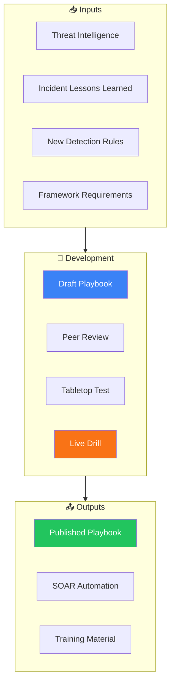

# Incident Playbook Development Guide

**Document ID**: IR-SOP-015
**Version**: 1.0
**Classification**: Internal
**Last Updated**: 2026-02-16

> Guide for **creating, testing, and maintaining incident response playbooks**. Ensures consistency, quality, and completeness across all SOC playbooks. Covers structure standards, MITRE mapping, testing methodology, and lifecycle management.

---

## Playbook Architecture


```mermaid
graph TD
    subgraph Inputs["📥 Inputs"]
        A[Threat Intelligence]
        B[Incident Lessons Learned]
        C[New Detection Rules]
        D[Framework Requirements]
    end
    
    subgraph Development["🔨 Development"]
        E[Draft Playbook]
        F[Peer Review]
        G[Tabletop Test]
        H[Live Drill]
    end
    
    subgraph Output["📤 Outputs"]
        I[Published Playbook]
        J[SOAR Automation]
        K[Training Material]
    end
    
    Inputs --> Development --> Output
    
    style E fill:#3b82f6,color:#fff
    style H fill:#f97316,color:#fff
    style I fill:#22c55e,color:#fff
```

---

## Playbook Structure Standard

Every playbook MUST contain these sections:

| # | Section | Required | Description |
|:---:|:---|:---:|:---|
| 1 | **Metadata** | ✅ | ID, version, classification, MITRE mapping, last updated |
| 2 | **Overview** | ✅ | What this playbook covers and when to use it |
| 3 | **Severity mapping** | ✅ | How to determine P1/P2/P3/P4 for this incident type |
| 4 | **Detection** | ✅ | How this incident is detected (alert sources, indicators) |
| 5 | **Triage steps** | ✅ | Step-by-step initial analysis |
| 6 | **Investigation** | ✅ | Deep-dive analysis procedures |
| 7 | **Containment** | ✅ | Immediate actions to stop the attack |
| 8 | **Eradication** | ✅ | Remove threat from environment |
| 9 | **Recovery** | ✅ | Restore normal operations |
| 10 | **Escalation criteria** | ✅ | When and to whom to escalate |
| 11 | **Decision matrix** | ✅ | Close / monitor / contain / escalate / notify decisions with criteria |
| 12 | **Communication** | ✅ | Who to notify at each severity level |
| 13 | **Evidence checklist** | ✅ | What to collect and preserve |
| 14 | **Minimum telemetry required** | ✅ | Logs, sensors, and blind spots required to use the playbook reliably |
| 15 | **False positive and tuning guide** | ✅ | Common benign causes, tuning actions, and residual risk notes |
| 16 | **Related playbooks** | ✅ | Links to related procedures |
| 17 | **Automation hooks** | ⬜ | SOAR integration points |
| 18 | **Metrics** | ⬜ | Playbook-specific KPIs |

### Metadata Template

```yaml
---
playbook_id: PB-XXX
title: [Playbook Title]
version: 1.0
classification: Internal
mitre_attack:
  tactics: [TA0001, TA0003]
  techniques: [T1566, T1566.001]
severity_range: P1-P3
last_updated: YYYY-MM-DD
author: [Name]
reviewer: [Name]
approver: [SOC Lead]
---
```

---

## Development Process

### Step-by-Step

| Step | Activity | Owner | Deliverable | Duration |
|:---:|:---|:---|:---|:---:|
| 1 | **Identify need** | SOC Lead / TI Analyst | Justification document | 1 day |
| 2 | **Research** | Analyst / Engineer | Threat research notes, MITRE mapping | 2–3 days |
| 3 | **Draft playbook** | Assigned author | Draft EN version | 3–5 days |
| 4 | **Peer review** | 2nd analyst + SOC Lead | Review feedback | 2 days |
| 5 | **Revise** | Author | Updated draft | 1–2 days |
| 6 | **Tabletop test** | SOC team | Test results, identified gaps | 1 day |
| 7 | **Revise (final)** | Author | Final version | 1 day |
| 8 | **Translate (TH)** | Assigned translator | Thai version | 2–3 days |
| 9 | **Approval** | SOC Manager | Approved playbook | 1 day |
| 10 | **Publish** | Author | Published + team notification | 1 day |
| 11 | **SOAR integration** | SOAR Engineer | Automated workflow | 3–5 days |

### Quality Checklist

- [ ] All required sections present
- [ ] MITRE ATT&CK techniques mapped
- [ ] Severity criteria clearly defined
- [ ] Step-by-step triage with decision trees
- [ ] Containment actions have rollback procedures
- [ ] Escalation thresholds clearly stated
- [ ] Decision matrix included with close / escalate / contain criteria
- [ ] Communication matrix included
- [ ] Evidence checklist complete
- [ ] Minimum telemetry requirements and blind spots documented
- [ ] False positive and tuning guidance documented
- [ ] Related playbooks linked
- [ ] Peer reviewed by ≥ 1 analyst
- [ ] Tabletop tested with SOC team
- [ ] Thai translation completed
- [ ] Published to repository

---

## MITRE ATT&CK Mapping

### Coverage Matrix

| Tactic | Existing Playbooks | Coverage |
|:---|:---|:---:|
| **Initial Access** (TA0001) | PB-01 Phishing, PB-17 BEC, PB-18 Exploit | ✅ |
| **Execution** (TA0002) | PB-11 Suspicious Script | 🟡 |
| **Persistence** (TA0003) | PB-14 Insider Threat, PB-15 Rogue Admin | 🟡 |
| **Privilege Escalation** (TA0004) | PB-07 Privilege Escalation | ✅ |
| **Defense Evasion** (TA0005) | PB-20 Log Clearing | 🟡 |
| **Credential Access** (TA0006) | PB-04 Brute Force, PB-05 Account Compromise, PB-26 MFA Bypass | ✅ |
| **Discovery** (TA0007) | — | 🔴 Gap |
| **Lateral Movement** (TA0008) | PB-12 Lateral Movement | ✅ |
| **Collection** (TA0009) | — | 🔴 Gap |
| **C2** (TA0011) | PB-13 C2, PB-25 DNS Tunneling | ✅ |
| **Exfiltration** (TA0010) | PB-08 Data Exfiltration | ✅ |
| **Impact** (TA0040) | PB-02 Ransomware, PB-09 DDoS, PB-31 Cryptomining | ✅ |

---

## Testing Methodology

## Decision Matrix Standard

Every playbook should include a decision matrix that lets the reader answer these questions quickly:

- [ ] Can the analyst close this as a false positive?
- [ ] Can the team keep the service running under monitoring?
- [ ] Must the team contain immediately?
- [ ] Must legal, privacy, executive, or business owners be notified?

### Minimum Decision Matrix Template

| Condition | Decision | Owner | SLA |
|:---|:---|:---|:---|
| Alert validated but no malicious impact | Monitor and tune | SOC Analyst | Same shift |
| Credible malicious behavior with limited scope | Escalate and investigate | SOC Analyst → SOC Manager | 15–30 min |
| Active compromise or material business risk | Contain immediately | IR Engineer / Security Engineer | Immediate |
| Regulated data, executive impact, or external reporting trigger | Notify legal/privacy/executive stakeholders | SOC Manager / CISO | Per policy |

### Decision Matrix Quality Rules

| Rule | Why it matters |
|:---|:---|
| Use observable conditions | Analysts need facts they can verify from logs or evidence |
| Name the owner for each decision | Prevents ambiguity during time-sensitive response |
| Include timing expectations | Helps SOC Managers enforce response discipline |
| Include business and compliance triggers | Makes the playbook useful to CISO and IR leadership, not only analysts |

## Evidence Checklist Standard

Every playbook should include an evidence checklist that answers three operational questions:

- [ ] What must be collected immediately before evidence disappears?
- [ ] Where should the analyst or IR engineer collect it from?
- [ ] Why is that artifact important for scope, attribution, or legal review?

### Minimum Evidence Checklist Template

| Evidence Type | What to Collect | Source | Why It Matters |
|:---|:---|:---|:---|
| Alert context | Original alert, correlation ID, timestamps, severity | SIEM / EDR / gateway | Preserves the initial trigger and timeline |
| Identity artifacts | User, account, token, API key, source IP, device | IAM / auth logs | Confirms who or what was involved |
| System artifacts | Hostname, process tree, files, registry/service/task changes | EDR / forensic tools | Shows execution and persistence |
| Network artifacts | Destination IP/domain, URLs, ports, transfer volume | Proxy / firewall / DNS / NetFlow | Shows communication and possible exfiltration |
| Business impact artifacts | Affected users, systems, datasets, records | DLP / app logs / asset inventory | Supports severity and notification decisions |

### Evidence Checklist Quality Rules

| Rule | Why it matters |
|:---|:---|
| Prioritize volatile data first | Tokens, sessions, memory, and transient logs disappear quickly |
| Name the system of record | Reduces confusion during stressful response windows |
| Include both technical and business artifacts | Helps CISO, legal, and privacy teams make defensible decisions |
| Keep it incident-specific | Generic evidence lists are rarely useful in real response |

## Minimum Telemetry Required Standard

Every playbook should state the minimum telemetry required to operate the playbook with confidence:

- [ ] Which log sources are mandatory to validate the incident?
- [ ] Which enrichment sources improve speed or confidence?
- [ ] What blind spots remain if the telemetry is missing?

### Minimum Telemetry Template

| Telemetry Source | Required For | Priority | Blind Spot If Missing |
|:---|:---|:---:|:---|
| Authentication logs | Confirm sign-ins, token use, account abuse | Required | Cannot distinguish user error from compromise |
| Endpoint telemetry | Process, file, service, registry, or script execution | Required | Host-level execution and persistence remain invisible |
| Network telemetry | Outbound connections, DNS, proxy, or transfer data | Required | C2 and exfiltration paths cannot be scoped reliably |
| Asset and identity inventory | Business owner, criticality, role, account type | Recommended | Severity and notification decisions become inconsistent |
| Case and ticket history | Prior incidents, exceptions, maintenance windows | Recommended | Analysts may escalate benign repeat patterns unnecessarily |

### Telemetry Quality Rules

| Rule | Why it matters |
|:---|:---|
| Separate required from recommended telemetry | Helps SOC Managers see what must exist before rollout |
| Name the exact system or control family | Reduces ambiguity for Security Engineers and platform owners |
| Describe the blind spot in plain language | Lets CISO and IR leadership understand residual risk quickly |
| Keep the telemetry list specific to the incident | Makes the section useful during real triage instead of generic governance text |

## False Positive and Tuning Guide Standard

Every playbook should help the analyst decide whether the alert is benign and what tuning action is appropriate:

- [ ] What normal or expected activity commonly looks similar to the incident?
- [ ] What evidence separates benign behavior from real malicious activity?
- [ ] What tuning action reduces noise without hiding real attacks?

### Minimum Tuning Guide Template

| Scenario | Why It Looks Suspicious | How to Validate | Tuning Action | Escalate If |
|:---|:---|:---|:---|:---|
| Approved admin or maintenance activity | May trigger the same rule or workflow | Check change ticket, owner, and maintenance window | Suppress for approved scope and time window only | Activity falls outside approved scope |
| User travel, VPN, or mobile network change | Can distort source IP, location, or device context | Validate with user, device posture, and prior login pattern | Tune location or ASN logic with compensating controls | MFA anomalies or risky post-login actions appear |
| Security scanning or test automation | Produces high-volume requests or unusual behavior | Confirm scanner identity, source range, and schedule | Allowlist approved scanner identities and schedules | Targeting exceeds approved ranges or uses exploit behavior |
| Bulk business process or integration activity | Creates unusual volume, file movement, or API use | Confirm application owner, job ID, and historical baseline | Raise thresholds only for known process signatures | New data access pattern or privileged action appears |

### Tuning Guide Quality Rules

| Rule | Why it matters |
|:---|:---|
| Tune narrowly by scope, identity, or time window | Broad exclusions create silent coverage gaps |
| Require a validation step before suppression | Prevents analysts from normalizing attacker behavior accidentally |
| Record what remains risky after tuning | Helps CISO and SOC Managers understand residual exposure |
| Tie tuning advice to observable evidence | Makes the section usable during real triage instead of retrospective review |

### Tabletop Test Procedure

| Step | Activity | Duration |
|:---:|:---|:---:|
| 1 | Facilitator presents scenario | 5 min |
| 2 | Team walks through playbook step-by-step | 20 min |
| 3 | Identify gaps, ambiguities, missing steps | 15 min |
| 4 | Discuss improvements | 10 min |
| 5 | Document action items | 5 min |

### Test Scoring

| Criteria | 1 — Poor | 2 — Fair | 3 — Good | 4 — Excellent |
|:---|:---|:---|:---|:---|
| **Completeness** | Many steps missing | Some gaps | Minor omissions | Comprehensive |
| **Clarity** | Ambiguous, confusing | Some confusion | Mostly clear | Crystal clear |
| **Actionability** | Vague instructions | Some specifics | Mostly actionable | All steps actionable |
| **Flow** | Illogical order | Some flow issues | Good flow | Perfect logical flow |
| **Automation** | No SOAR hooks | Partial automation | Most steps automatable | Fully integrated |

| Overall Score | Result | Action |
|:---:|:---|:---|
| 16–20 | ✅ Publish | Ready for production |
| 11–15 | 🟡 Minor revisions | Address feedback, re-review |
| 6–10 | 🟠 Major revisions | Significant rewrite needed |
| 1–5 | 🔴 Reject | Start over with new approach |

---

## Lifecycle Management

### Review Schedule

| Trigger | Action | Owner |
|:---|:---|:---|
| **Quarterly** | Content review, update links | Playbook author |
| **After major incident** | Update with lessons learned | IR Lead |
| **New TI** | Add new IOCs, techniques | TI Analyst |
| **MITRE update** | Re-map to updated framework | SOC Engineer |
| **Tool change** | Update tool-specific steps | SOAR Engineer |
| **Annual** | Full review, tabletop re-test | SOC Manager |

### Version Control

| Change Type | Version Bump | Approval |
|:---|:---:|:---|
| Typo / formatting | Patch (1.0.1) | Author |
| Step update / clarification | Minor (1.1.0) | Peer review |
| New section / major rewrite | Major (2.0.0) | SOC Manager |
| New playbook | Initial (1.0.0) | SOC Manager |

---

## Metrics

| Metric | Target |
|:---|:---:|
| Playbook coverage (MITRE tactics) | ≥ 90% |
| Playbooks with tabletop test | 100% |
| Playbooks reviewed within 12 months | 100% |
| Average playbook development time | < 15 days |
| Analyst satisfaction score | ≥ 4/5 |
| Playbooks with SOAR integration | ≥ 60% |

---

## Related Documents

-   [IR Framework](Framework.en.md) — NIST-based framework
-   [Severity Matrix](Severity_Matrix.en.md) — P1–P4 definitions
-   [Tier 1 Runbook](Runbooks/Tier1_Runbook.en.md) — Day-to-day procedures
-   [SOAR Playbooks](SOAR_Playbooks.en.md) — Automation templates
-   [Lessons Learned Template](Lessons_Learned_Template.en.md) — Post-incident review
-   [SOC Automation Catalog](../06_Operations_Management/SOC_Automation_Catalog.en.md) — Automation inventory
