# Incident Playbook Development Guide

**Document ID**: IR-SOP-015
**Version**: 1.0
**Classification**: Internal
**Last Updated**: 2026-02-16

> Guide for **creating, testing, and maintaining incident response playbooks**. Ensures consistency, quality, and completeness across all SOC playbooks. Covers structure standards, MITRE mapping, testing methodology, and lifecycle management.

---

## Playbook Architecture

```mermaid
graph TD
    subgraph Inputs["📥 Inputs"]
        A[Threat Intelligence]
        B[Incident Lessons Learned]
        C[New Detection Rules]
        D[Framework Requirements]
    end
    
    subgraph Development["🔨 Development"]
        E[Draft Playbook]
        F[Peer Review]
        G[Tabletop Test]
        H[Live Drill]
    end
    
    subgraph Output["📤 Outputs"]
        I[Published Playbook]
        J[SOAR Automation]
        K[Training Material]
    end
    
    Inputs --> Development --> Output
    
    style E fill:#3b82f6,color:#fff
    style H fill:#f97316,color:#fff
    style I fill:#22c55e,color:#fff
```



---

## Playbook Structure Standard

Every playbook MUST contain these sections:

| # | Section | Required | Description |
|:---:|:---|:---:|:---|
| 1 | **Metadata** | ✅ | ID, version, classification, MITRE mapping, last updated |
| 2 | **Overview** | ✅ | What this playbook covers and when to use it |
| 3 | **Severity mapping** | ✅ | How to determine P1/P2/P3/P4 for this incident type |
| 4 | **Detection** | ✅ | How this incident is detected (alert sources, indicators) |
| 5 | **Triage steps** | ✅ | Step-by-step initial analysis |
| 6 | **Investigation** | ✅ | Deep-dive analysis procedures |
| 7 | **Containment** | ✅ | Immediate actions to stop the attack |
| 8 | **Eradication** | ✅ | Remove threat from environment |
| 9 | **Recovery** | ✅ | Restore normal operations |
| 10 | **Escalation criteria** | ✅ | When and to whom to escalate |
| 11 | **Communication** | ✅ | Who to notify at each severity level |
| 12 | **Evidence checklist** | ✅ | What to collect and preserve |
| 13 | **Related playbooks** | ✅ | Links to related procedures |
| 14 | **Automation hooks** | ⬜ | SOAR integration points |
| 15 | **Metrics** | ⬜ | Playbook-specific KPIs |

### Metadata Template

```yaml
---
playbook_id: PB-XXX
title: [Playbook Title]
version: 1.0
classification: Internal
mitre_attack:
  tactics: [TA0001, TA0003]
  techniques: [T1566, T1566.001]
severity_range: P1-P3
last_updated: YYYY-MM-DD
author: [Name]
reviewer: [Name]
approver: [SOC Lead]
---
```

---

## Development Process

### Step-by-Step

| Step | Activity | Owner | Deliverable | Duration |
|:---:|:---|:---|:---|:---:|
| 1 | **Identify need** | SOC Lead / TI Analyst | Justification document | 1 day |
| 2 | **Research** | Analyst / Engineer | Threat research notes, MITRE mapping | 2–3 days |
| 3 | **Draft playbook** | Assigned author | Draft EN version | 3–5 days |
| 4 | **Peer review** | 2nd analyst + SOC Lead | Review feedback | 2 days |
| 5 | **Revise** | Author | Updated draft | 1–2 days |
| 6 | **Tabletop test** | SOC team | Test results, identified gaps | 1 day |
| 7 | **Revise (final)** | Author | Final version | 1 day |
| 8 | **Translate (TH)** | Assigned translator | Thai version | 2–3 days |
| 9 | **Approval** | SOC Manager | Approved playbook | 1 day |
| 10 | **Publish** | Author | Published + team notification | 1 day |
| 11 | **SOAR integration** | SOAR Engineer | Automated workflow | 3–5 days |

### Quality Checklist

- [ ] All 13 required sections present
- [ ] MITRE ATT&CK techniques mapped
- [ ] Severity criteria clearly defined
- [ ] Step-by-step triage with decision trees
- [ ] Containment actions have rollback procedures
- [ ] Escalation thresholds clearly stated
- [ ] Communication matrix included
- [ ] Evidence checklist complete
- [ ] Related playbooks linked
- [ ] Peer reviewed by ≥ 1 analyst
- [ ] Tabletop tested with SOC team
- [ ] Thai translation completed
- [ ] Published to repository

---

## MITRE ATT&CK Mapping

### Coverage Matrix

| Tactic | Existing Playbooks | Coverage |
|:---|:---|:---:|
| **Initial Access** (TA0001) | PB-01 Phishing, PB-17 BEC, PB-18 Exploit | ✅ |
| **Execution** (TA0002) | PB-11 Suspicious Script | 🟡 |
| **Persistence** (TA0003) | PB-14 Insider Threat, PB-15 Rogue Admin | 🟡 |
| **Privilege Escalation** (TA0004) | PB-07 Privilege Escalation | ✅ |
| **Defense Evasion** (TA0005) | PB-20 Log Clearing | 🟡 |
| **Credential Access** (TA0006) | PB-04 Brute Force, PB-05 Account Compromise, PB-26 MFA Bypass | ✅ |
| **Discovery** (TA0007) | — | 🔴 Gap |
| **Lateral Movement** (TA0008) | PB-12 Lateral Movement | ✅ |
| **Collection** (TA0009) | — | 🔴 Gap |
| **C2** (TA0011) | PB-13 C2, PB-24 DNS Tunneling | ✅ |
| **Exfiltration** (TA0010) | PB-08 Data Exfiltration | ✅ |
| **Impact** (TA0040) | PB-02 Ransomware, PB-09 DDoS, PB-23 Cryptomining | ✅ |

---

## Testing Methodology

### Tabletop Test Procedure

| Step | Activity | Duration |
|:---:|:---|:---:|
| 1 | Facilitator presents scenario | 5 min |
| 2 | Team walks through playbook step-by-step | 20 min |
| 3 | Identify gaps, ambiguities, missing steps | 15 min |
| 4 | Discuss improvements | 10 min |
| 5 | Document action items | 5 min |

### Test Scoring

| Criteria | 1 — Poor | 2 — Fair | 3 — Good | 4 — Excellent |
|:---|:---|:---|:---|:---|
| **Completeness** | Many steps missing | Some gaps | Minor omissions | Comprehensive |
| **Clarity** | Ambiguous, confusing | Some confusion | Mostly clear | Crystal clear |
| **Actionability** | Vague instructions | Some specifics | Mostly actionable | All steps actionable |
| **Flow** | Illogical order | Some flow issues | Good flow | Perfect logical flow |
| **Automation** | No SOAR hooks | Partial automation | Most steps automatable | Fully integrated |

| Overall Score | Result | Action |
|:---:|:---|:---|
| 16–20 | ✅ Publish | Ready for production |
| 11–15 | 🟡 Minor revisions | Address feedback, re-review |
| 6–10 | 🟠 Major revisions | Significant rewrite needed |
| 1–5 | 🔴 Reject | Start over with new approach |

---

## Lifecycle Management

### Review Schedule

| Trigger | Action | Owner |
|:---|:---|:---|
| **Quarterly** | Content review, update links | Playbook author |
| **After major incident** | Update with lessons learned | IR Lead |
| **New TI** | Add new IOCs, techniques | TI Analyst |
| **MITRE update** | Re-map to updated framework | SOC Engineer |
| **Tool change** | Update tool-specific steps | SOAR Engineer |
| **Annual** | Full review, tabletop re-test | SOC Manager |

### Version Control

| Change Type | Version Bump | Approval |
|:---|:---:|:---|
| Typo / formatting | Patch (1.0.1) | Author |
| Step update / clarification | Minor (1.1.0) | Peer review |
| New section / major rewrite | Major (2.0.0) | SOC Manager |
| New playbook | Initial (1.0.0) | SOC Manager |

---

## Metrics

| Metric | Target |
|:---|:---:|
| Playbook coverage (MITRE tactics) | ≥ 90% |
| Playbooks with tabletop test | 100% |
| Playbooks reviewed within 12 months | 100% |
| Average playbook development time | < 15 days |
| Analyst satisfaction score | ≥ 4/5 |
| Playbooks with SOAR integration | ≥ 60% |

---

## Related Documents

-   [IR Framework](Framework.en.md) — NIST-based framework
-   [Severity Matrix](Severity_Matrix.en.md) — P1–P4 definitions
-   [Tier 1 Runbook](Tier1_Runbook.en.md) — Day-to-day procedures
-   [SOAR Playbooks](SOAR_Playbooks.en.md) — Automation templates
-   [Lessons Learned Template](Lessons_Learned_Template.en.md) — Post-incident review
-   [SOC Automation Catalog](../06_Operations_Management/SOC_Automation_Catalog.en.md) — Automation inventory
