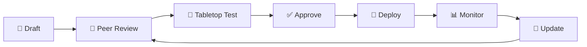

# คู่มือการพัฒนา Playbook ตอบสนองเหตุการณ์

**รหัสเอกสาร**: IR-SOP-015
**เวอร์ชัน**: 1.0
**การจัดชั้นความลับ**: ใช้ภายใน
**อัปเดตล่าสุด**: 2026-02-16

> คู่มือ **สร้าง, ทดสอบ, และบำรุงรักษา IR playbooks** เพื่อความสม่ำเสมอ คุณภาพ และครบถ้วนทุก playbook ครอบคลุมมาตรฐานโครงสร้าง, MITRE mapping, วิธีทดสอบ, และ lifecycle management

---

## มาตรฐานโครงสร้าง Playbook

ทุก playbook **ต้องมี** sections เหล่านี้:

| # | Section | จำเป็น | คำอธิบาย |
|:---:|:---|:---:|:---|
| 1 | **Metadata** | ✅ | ID, version, MITRE mapping |
| 2 | **ภาพรวม** | ✅ | ขอบเขตและเมื่อไรใช้ |
| 3 | **Severity mapping** | ✅ | เกณฑ์ P1–P4 |
| 4 | **การตรวจจับ** | ✅ | แหล่ง alert, indicators |
| 5 | **Triage steps** | ✅ | ขั้นตอนวิเคราะห์เบื้องต้น |
| 6 | **การสืบสวน** | ✅ | วิเคราะห์เชิงลึก |
| 7 | **Containment** | ✅ | หยุดการโจมตี |
| 8 | **Eradication** | ✅ | ลบภัยคุกคาม |
| 9 | **Recovery** | ✅ | กู้คืนระบบ |
| 10 | **เกณฑ์ Escalation** | ✅ | เมื่อไรเลื่อนระดับ |
| 11 | **การสื่อสาร** | ✅ | แจ้งใครในแต่ละ severity |
| 12 | **Evidence checklist** | ✅ | เก็บหลักฐานอะไร |
| 13 | **Playbooks ที่เกี่ยวข้อง** | ✅ | Link เอกสารอื่น |

---

## กระบวนการพัฒนา

| ขั้น | กิจกรรม | ผู้ดำเนินการ | ระยะเวลา |
|:---:|:---|:---|:---:|
| 1 | ระบุความจำเป็น | SOC Lead | 1 วัน |
| 2 | Research + MITRE mapping | Analyst | 2–3 วัน |
| 3 | ร่าง playbook (EN) | ผู้เขียน | 3–5 วัน |
| 4 | Peer review | Analyst + SOC Lead | 2 วัน |
| 5 | แก้ไข | ผู้เขียน | 1–2 วัน |
| 6 | Tabletop test | ทีม SOC | 1 วัน |
| 7 | แก้ไขรอบสุดท้าย | ผู้เขียน | 1 วัน |
| 8 | แปลภาษาไทย | ผู้แปล | 2–3 วัน |
| 9 | อนุมัติ | SOC Manager | 1 วัน |
| 10 | เผยแพร่ | ผู้เขียน | 1 วัน |
| 11 | SOAR integration | SOAR Engineer | 3–5 วัน |

### Quality Checklist

- [ ] ครบ 13 sections ที่จำเป็น
- [ ] MITRE ATT&CK mapped
- [ ] เกณฑ์ severity ชัดเจน
- [ ] Triage steps เป็นขั้นตอน
- [ ] Containment มี rollback
- [ ] Escalation threshold ชัด
- [ ] Communication matrix ครบ
- [ ] Evidence checklist ครบ
- [ ] Peer reviewed ≥ 1 คน
- [ ] Tabletop tested
- [ ] แปลไทยแล้ว
- [ ] Publish ลง repository

---

## MITRE ATT&CK Coverage

| Tactic | Playbooks ปัจจุบัน | Coverage |
|:---|:---|:---:|
| Initial Access | PB-01 Phishing, PB-17 BEC, PB-18 Exploit | ✅ |
| Execution | PB-11 Suspicious Script | 🟡 |
| Persistence | PB-14 Insider Threat, PB-15 Rogue Admin | 🟡 |
| Privilege Escalation | PB-07 | ✅ |
| Defense Evasion | PB-20 Log Clearing | 🟡 |
| Credential Access | PB-04, PB-05, PB-26 | ✅ |
| Discovery | — | 🔴 Gap |
| Lateral Movement | PB-12 | ✅ |
| Collection | — | 🔴 Gap |
| C2 | PB-13, PB-24 | ✅ |
| Exfiltration | PB-08 | ✅ |
| Impact | PB-02, PB-09, PB-23 | ✅ |

---

## วิธีทดสอบ Tabletop

| ขั้น | กิจกรรม | ระยะเวลา |
|:---:|:---|:---:|
| 1 | Facilitator นำเสนอ scenario | 5 นาที |
| 2 | ทีมเดินตาม playbook ทีละขั้น | 20 นาที |
| 3 | ระบุช่องว่าง, ความคลุมเครือ | 15 นาที |
| 4 | อภิปรายปรับปรุง | 10 นาที |
| 5 | บันทึก action items | 5 นาที |

### เกณฑ์ให้คะแนน

| คะแนนรวม | ผลลัพธ์ | การดำเนินการ |
|:---:|:---|:---|
| 16–20 | ✅ เผยแพร่ได้ | พร้อม production |
| 11–15 | 🟡 ปรับแก้เล็กน้อย | แก้ไขตาม feedback |
| 6–10 | 🟠 ปรับแก้มาก | เขียนใหม่บางส่วน |
| 1–5 | 🔴 ไม่ผ่าน | เริ่มใหม่ |

---

## Lifecycle Management

| Trigger | Action | ผู้รับผิดชอบ |
|:---|:---|:---|
| รายไตรมาส | ทบทวน content, อัปเดต links | ผู้เขียน |
| หลังเหตุการณ์สำคัญ | อัปเดตจาก lessons learned | IR Lead |
| TI ใหม่ | เพิ่ม IOCs, techniques | TI Analyst |
| MITRE update | Re-map framework | SOC Engineer |
| เปลี่ยนเครื่องมือ | อัปเดตขั้นตอน | SOAR Engineer |
| รายปี | ทบทวนทั้งหมด + ทดสอบ tabletop | SOC Manager |

---

## ตัวชี้วัด

| ตัวชี้วัด | เป้าหมาย |
|:---|:---:|
| Playbook coverage (MITRE tactics) | ≥ 90% |
| Playbooks ผ่าน tabletop | 100% |
| Playbooks ทบทวนภายใน 12 เดือน | 100% |
| เวลาพัฒนาเฉลี่ย | < 15 วัน |
| ความพึงพอใจ analyst | ≥ 4/5 |
| Playbooks มี SOAR | ≥ 60% |

---

## Playbook Template Structure

| ส่วน | เนื้อหา | ตัวอย่าง |
|:---|:---|:---|
| **Metadata** | ID, version, owner, MITRE mapping | PB-001, v2.1, DetEng |
| **Scope** | เมื่อไหร่ที่ใช้ playbook นี้ | เมื่อ EDR alert ransomware |
| **Prerequisites** | สิ่งที่ต้องมีก่อน | SIEM access, EDR console |
| **Step-by-step** | ขั้นตอนการตอบสนอง | 1. Verify → 2. Contain → ... |
| **Escalation** | เมื่อไหร่ + ใคร | P1 → SOC Manager ทันที |
| **Evidence** | สิ่งที่ต้องเก็บ | Memory dump, disk image |
| **Resolution** | เกณฑ์การปิดเคส | Clean scan + 48h monitoring |
| **References** | เอกสารอ้างอิง | MITRE, Sigma rules |

## Quality Checklist

| # | เกณฑ์ | ✅/❌ |
|:---:|:---|:---:|
| 1 | มี Mermaid diagram สำหรับ workflow | ☐ |
| 2 | ทุกขั้นตอนสามารถทำได้จริง (actionable) | ☐ |
| 3 | มี decision points ที่ชัดเจน | ☐ |
| 4 | Evidence collection ระบุเครื่องมือและคำสั่ง | ☐ |
| 5 | Escalation criteria ชัดเจน | ☐ |
| 6 | มี SLA timeline | ☐ |
| 7 | ทดสอบจริงด้วย tabletop/purple team | ☐ |
| 8 | มี Sigma rule cross-reference | ☐ |
| 9 | Link ไปยัง playbooks ที่เกี่ยวข้อง | ☐ |
| 10 | ผ่าน peer review | ☐ |

## Playbook Lifecycle

## Playbook Metrics

| ตัวชี้วัด | เป้าหมาย | สิ่งที่บอก |
|:---|:---|:---|
| **Usage Rate** | ≥ 80% ของ incidents ใช้ playbook | Coverage ดีพอหรือไม่ |
| **Accuracy** | ≥ 90% ทำตาม playbook ได้สำเร็จ | Playbook เขียนดีหรือไม่ |
| **Time Savings** | ลด MTTR ≥ 30% | Automation คุ้มหรือไม่ |
| **Version Freshness** | อัปเดตภายใน 6 เดือน | เอกสาร stale หรือไม่ |
| **Coverage** | ≥ top 20 incident types | ครอบคลุมพอหรือไม่ |

## Playbook Quality Standards

### Mandatory Sections

| Section | Required Content | Review Criteria |
|:---|:---|:---|
| Objective | ระบุเป้าหมายชัดเจน | Measurable |
| Scope | ขอบเขตและข้อจำกัด | Complete |
| Prerequisites | เครื่องมือ + สิทธิ์ | Verified |
| Steps | ขั้นตอนละเอียด | Actionable |
| Decision Points | เงื่อนไข + ทางเลือก | Clear criteria |
| Escalation | เมื่อไร + ส่งใคร | Defined |
| References | MITRE + logs | Up-to-date |

### Playbook Review Cycle

| Trigger | Reviewer | SLA |
|:---|:---|:---|
| New playbook | Peer + Manager | 5 วันทำการ |
| Post-incident update | Incident owner | 3 วันทำการ |
| Quarterly review | SOC Lead | 2 สัปดาห์ |
| Tool change | Engineer | 1 สัปดาห์ |

## เอกสารที่เกี่ยวข้อง

-   [IR Framework](Framework.en.md) — กรอบงาน NIST
-   [Severity Matrix](Severity_Matrix.en.md) — คำจำกัดความ P1–P4
-   [SOAR Playbooks](SOAR_Playbooks.en.md) — Automation templates
-   [SOC Automation Catalog](../06_Operations_Management/SOC_Automation_Catalog.en.md) — คลัง Automation
