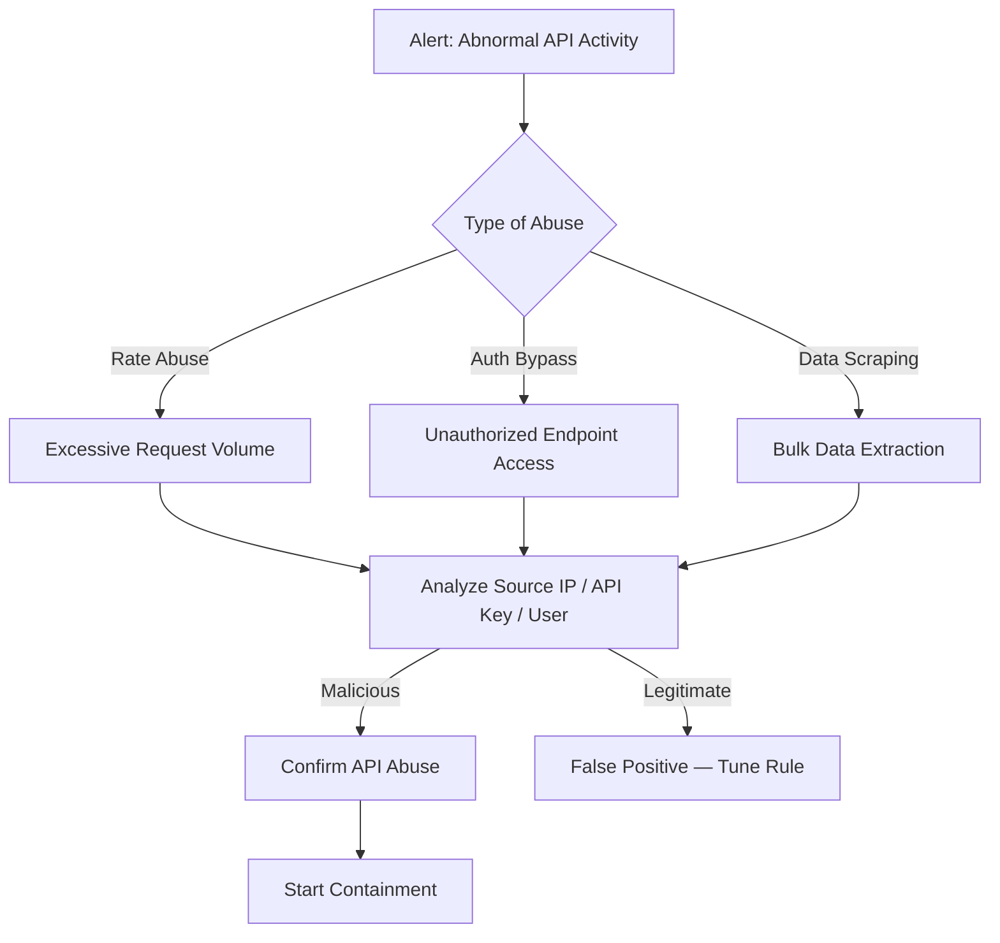

# Playbook: API Abuse Response

**Severity**: High | **Category**: Application Security

## 1. Analysis (Triage)

-   **Identify the Source**: Determine the API key, OAuth token, IP address, or user account generating the abnormal traffic.
-   **Request Analysis**: Review API logs for unusual patterns — excessive calls, access to unauthorized endpoints, abnormal query parameters, bulk data retrieval.
-   **Check Authentication**: Verify whether the requests use valid credentials or exploit authentication weaknesses (broken auth, BOLA/IDOR).
-   **Business Context**: Confirm with the API owner whether the usage pattern is expected (e.g., a partner integration ramping up).

## 2. Containment
-   **Rate Limit**: Apply aggressive rate limiting to the offending API key/IP.
-   **Revoke Credentials**: Disable the compromised API key or OAuth token immediately.
-   **IP Block**: Add the source IP(s) to the WAF/API Gateway blocklist.
-   **Disable Endpoint**: If a vulnerable endpoint is being exploited, temporarily disable it.
-   **Geo-Block**: If abuse originates from unexpected geographies, apply geo-restrictions.

## 3. Remediation
-   **Credential Rotation**: Issue new API keys to the legitimate owner; invalidate all existing tokens.
-   **Fix Vulnerability**: Patch the underlying API vulnerability (BOLA, excessive data exposure, broken function-level authorization).
-   **Implement Controls**: Add input validation, pagination limits, field-level filtering, and proper authorization checks.
-   **WAF Rules**: Create custom WAF rules targeting the specific attack pattern.

## 4. Recovery
-   **Restore Service**: Re-enable the endpoint once the vulnerability is patched.
-   **Notify Consumers**: Inform legitimate API consumers of key rotation.
-   **Data Impact Assessment**: Determine if any data was exfiltrated and notify affected parties if required by PDPA/GDPR.

## Related Documents
-   [Incident Response Framework](../Framework.en.md)
-   [Data Exfiltration Playbook](Data_Exfiltration.en.md)
-   [Web Attack Playbook](Web_Attack.en.md)
-   [Incident Report Template](../../templates/incident_report.en.md)
-   [Shift Handover Log](../../templates/shift_handover.en.md)

## References
-   [MITRE ATT&CK T1106 — Native API](https://attack.mitre.org/techniques/T1106/)
-   [OWASP API Security Top 10 (2023)](https://owasp.org/API-Security/editions/2023/en/0x11-t10/)
-   [NIST SP 800-95 — Guide to Secure Web Services](https://csrc.nist.gov/publications/detail/sp/800-95/final)
