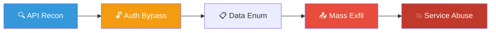
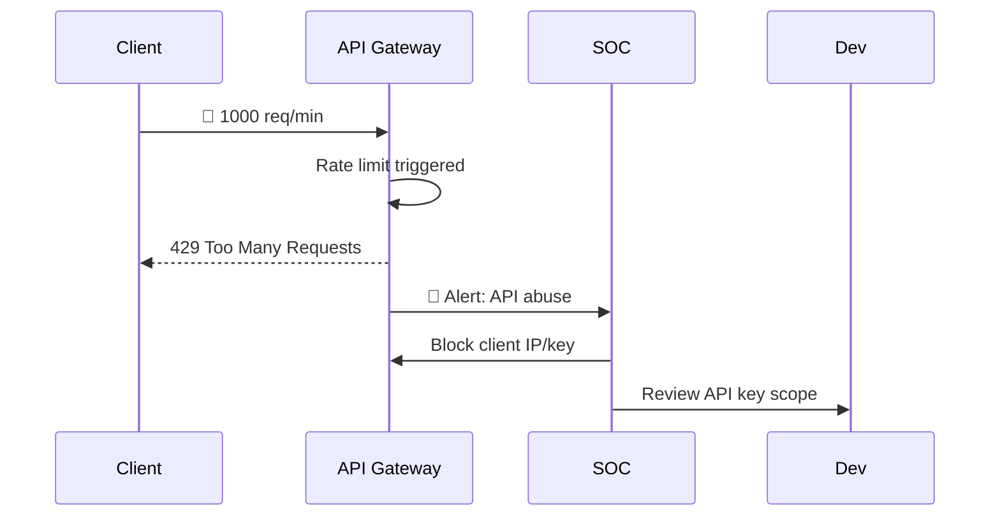
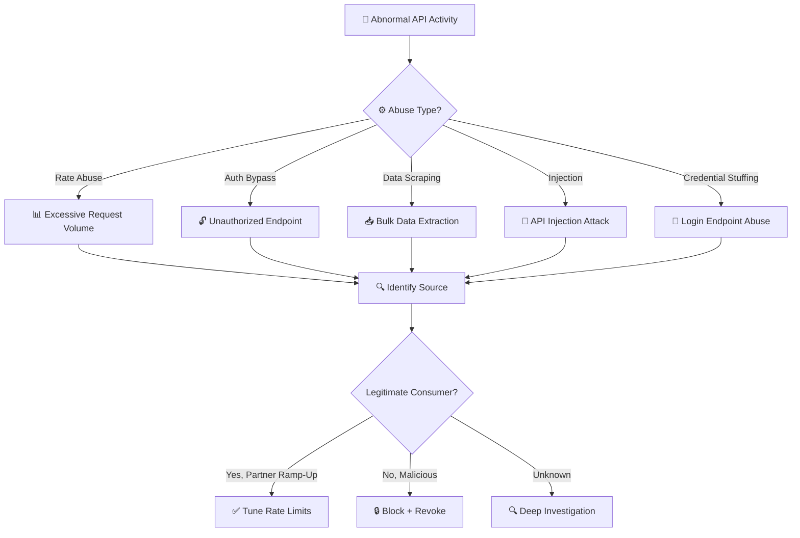
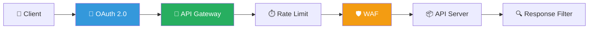
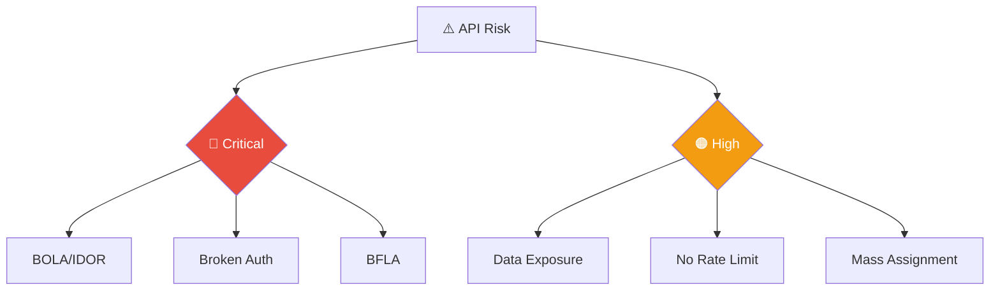

# Playbook: API Abuse Response

**ID**: PB-30
**Severity**: High | **Category**: Application Security
**MITRE ATT&CK**: [T1106](https://attack.mitre.org/techniques/T1106/) (Native API), [T1530](https://attack.mitre.org/techniques/T1530/) (Data from Cloud Storage)
**Trigger**: API Gateway alert (rate limit), WAF (API attack signature), SIEM correlation, Customer report

### API Attack Chain

```mermaid
graph LR
    Recon["🔍 API Recon"] --> Auth["🔓 Auth Bypass"]
    Auth --> Enum["📋 Data Enum"]
    Enum --> Exfil["📤 Mass Exfil"]
    Exfil --> Abuse["💥 Service Abuse"]
    style Recon fill:#3498db,color:#fff
    style Auth fill:#f39c12,color:#fff
    style Exfil fill:#e74c3c,color:#fff
    style Abuse fill:#c0392b,color:#fff
```

### Rate Limiting Response

```mermaid
sequenceDiagram
    participant Client
    participant Gateway as API Gateway
    participant SOC
    participant Dev
    Client->>Gateway: 📡 1000 req/min
    Gateway->>Gateway: Rate limit triggered
    Gateway-->>Client: 429 Too Many Requests
    Gateway->>SOC: 🚨 Alert: API abuse
    SOC->>Gateway: Block client IP/key
    SOC->>Dev: Review API key scope
```

---

## Decision Flow

```mermaid
graph TD
    Alert["🚨 Abnormal API Activity"] --> Type{"⚙️ Abuse Type?"}
    Type -->|Rate Abuse| Rate["📊 Excessive Request Volume"]
    Type -->|Auth Bypass| Auth["🔓 Unauthorized Endpoint"]
    Type -->|Data Scraping| Scrape["📥 Bulk Data Extraction"]
    Type -->|Injection| Inject["💉 API Injection Attack"]
    Type -->|Credential Stuffing| Cred["🔑 Login Endpoint Abuse"]
    Rate --> Source["🔍 Identify Source"]
    Auth --> Source
    Scrape --> Source
    Inject --> Source
    Cred --> Source
    Source --> Legit{"Legitimate Consumer?"}
    Legit -->|Yes, Partner Ramp-Up| Tune["✅ Tune Rate Limits"]
    Legit -->|No, Malicious| Contain["🔒 Block + Revoke"]
    Legit -->|Unknown| Investigate["🔍 Deep Investigation"]
```

---

## 1. Analysis

### 1.1 API Abuse Classification

| Type | Pattern | OWASP API Top 10 | Severity |
|:---|:---|:---|:---|
| **BOLA / IDOR** | Accessing other users' data via ID manipulation | API1:2023 | 🔴 Critical |
| **Broken Authentication** | Invalid/stolen tokens accessing endpoints | API2:2023 | 🔴 Critical |
| **Excessive Data Exposure** | API returning more data than needed | API3:2023 | 🟠 High |
| **Rate Abuse / DoS** | Flooding endpoints to degrade service | API4:2023 | 🟠 High |
| **BFLA** | Accessing admin functions without authorization | API5:2023 | 🔴 Critical |
| **Mass Assignment** | Modifying restricted fields in requests | API6:2023 | 🟠 High |
| **Data Scraping** | Systematic extraction of all records | — | 🟠 High |
| **Credential Stuffing** | Bulk login attempts via API | API2:2023 | 🟠 High |
| **Injection** | SQLi, NoSQLi, command injection through API | API8:2023 | 🔴 Critical |

### 1.2 Investigation Checklist

| Check | How | Done |
|:---|:---|:---:|
| Source identification (API key, OAuth token, IP, user) | API gateway logs | ☐ |
| Request pattern analysis (volume, endpoints, parameters) | API logs / SIEM | ☐ |
| Valid credentials or exploiting auth weakness? | Auth logs, token analysis | ☐ |
| What data was accessed/returned? | API response logs | ☐ |
| Is the API consumer known (partner, internal, unknown)? | API key registry | ☐ |
| Was data exfiltrated (volume, sensitivity)? | DLP / API metrics | ☐ |
| Is the vulnerability known or new? | Security testing history | ☐ |

### 1.3 Impact Assessment

| Question | Answer | Done |
|:---|:---|:---:|
| How much data was accessed? | | ☐ |
| Was PII or sensitive data retrieved? | | ☐ |
| Was data modified or deleted? | | ☐ |
| Were other API consumers affected (degradation)? | | ☐ |
| Is the vulnerable endpoint still exposed? | | ☐ |

---

## 2. Containment

### 2.1 Immediate Actions

| # | Action | Tool | Done |
|:---:|:---|:---|:---:|
| 1 | **Rate limit** aggressively on offending API key/IP | API Gateway | ☐ |
| 2 | **Revoke** compromised API key or OAuth token | API management | ☐ |
| 3 | **Block source IP(s)** | WAF / Firewall | ☐ |
| 4 | **Disable vulnerable endpoint** if actively exploited | DevOps | ☐ |
| 5 | **GeoIP block** if abuse from non-business region | API Gateway / WAF | ☐ |

### 2.2 If Authentication Bypass

| # | Action | Done |
|:---:|:---|:---:|
| 1 | Rotate all API keys associated with the compromised service | ☐ |
| 2 | Invalidate all OAuth tokens for the endpoint | ☐ |
| 3 | Disable the endpoint until auth is fixed | ☐ |
| 4 | Review and fix authorization logic (BOLA, BFLA) | ☐ |

---

## 3. Eradication

| # | Action | Done |
|:---:|:---|:---:|
| 1 | **Credential rotation**: Issue new API keys to legitimate consumers | ☐ |
| 2 | **Fix vulnerability**: Patch auth bypass, injection, or data exposure | ☐ |
| 3 | **Implement controls**: Input validation, pagination, field filtering | ☐ |
| 4 | **WAF rules**: Create custom rules targeting the specific attack pattern | ☐ |
| 5 | **Rate limiting**: Enforce per-key and per-IP rate limits | ☐ |

---

## 4. Recovery

| # | Action | Done |
|:---:|:---|:---:|
| 1 | Re-enable endpoint after vulnerability patched and tested | ☐ |
| 2 | Notify legitimate API consumers of key rotation | ☐ |
| 3 | Run API security scan (OWASP ZAP, Burp) | ☐ |
| 4 | Implement API behavioral analytics / anomaly detection | ☐ |
| 5 | Deploy API security gateway with schema validation | ☐ |
| 6 | Monitor API metrics for 72 hours post-fix | ☐ |

---

## 5. IoC Collection

| Type | Value | Source |
|:---|:---|:---|
| Attacker IP(s) | | API Gateway / WAF |
| Compromised API Key / Token | | API management |
| Attack pattern (endpoint + params) | | API logs |
| User-Agent string | | API logs |
| Data volume extracted | | API metrics |
| Vulnerable endpoint | | Security testing |

---

## 6. Evidence Checklist

| Evidence Type | What to Collect | Source | Why It Matters |
|:---|:---|:---|:---|
| Request evidence | Endpoint, method, parameters, request IDs, timestamps | API gateway / app logs | Reconstructs the abuse pattern precisely |
| Identity evidence | API key, OAuth token, client ID, user account, source IP | API management / auth logs | Determines which identity or credential was abused |
| Response evidence | Response codes, returned fields, record counts, downloaded objects | App logs / API metrics | Shows whether data exposure or auth bypass occurred |
| Vulnerability evidence | Auth logic flaw, schema issue, rate-limit bypass, injection payloads | Security test results / code review / WAF logs | Helps engineering fix the root cause |
| Consumer impact evidence | Affected partners, degraded endpoints, business transactions impacted | API analytics / support tickets | Supports stakeholder communication |

---

## 7. Minimum Telemetry Required

| Telemetry Source | Required For | Priority | Blind Spot If Missing |
|:---|:---|:---:|:---|
| API gateway and application logs | Request path, method, parameters, request IDs, response codes | Required | Cannot reconstruct the abuse sequence or affected endpoint behavior |
| Authentication and API key telemetry | Token use, client identity, key rotation history, auth failures | Required | Cannot identify which credential or integration was abused |
| WAF, rate-limit, and edge telemetry | Burst patterns, bypass attempts, geo anomalies, blocking actions | Required | Cannot distinguish targeted abuse from noisy internet traffic |
| API analytics and data access metrics | Record counts, object downloads, latency, partner impact | Required | Cannot measure exposure or business impact reliably |
| Secure SDLC and testing records | Known defects, schema changes, recent releases, prior findings | Recommended | Root cause analysis and remediation speed degrade |

---

## 8. False Positive and Tuning Guide

| Scenario | Why It Looks Suspicious | How to Validate | Tuning Action | Escalate If |
|:---|:---|:---|:---|:---|
| Load test or performance test | High request rate and error volume can resemble abuse | Confirm test window, source ranges, and test owner | Allowlist approved source ranges and test headers during the test window | Traffic exceeds approved endpoints or includes auth bypass patterns |
| Partner batch integration | Repetitive API calls and large record pulls may look like scraping | Validate partner ID, contract scope, and historical baseline | Tune thresholds per approved partner and endpoint profile | Access expands to new objects, tenants, or sensitive fields |
| Mobile app release rollout | New client versions can change request shape and spike traffic | Confirm release schedule, app version, and rollout region | Tune schema and volume expectations per approved app version | Requests come from unknown clients or trigger authorization failures |
| Security scanner or QA automation | Fuzzing and negative tests can look like attack traffic | Validate scanner identity, environment, and schedule | Suppress only for known scanner identities in approved environments | Scanner activity appears in production without approval or finds live data exposure |

---

## 9. Escalation Criteria

| Condition | Escalate To |
|:---|:---|
| PII/customer data exfiltrated | Legal + DPO (PDPA 72h) |
| Auth bypass on production API | CISO + DevOps lead |
| Revenue-generating API degraded/down | Business unit + DevOps |
| Injection with backend access | [PB-10 Web Attack](Web_Attack.en.md) + CISO |
| Partner API key compromised | Partner rel. manager + Security |
| Bulk credential stuffing via API | [PB-04 Brute Force](Brute_Force.en.md) |

---

### API Security Architecture

```mermaid
graph LR
    Client["📱 Client"] --> Auth["🔑 OAuth 2.0"]
    Auth --> Gateway["🚪 API Gateway"]
    Gateway --> RateLimit["⏱️ Rate Limit"]
    RateLimit --> WAF["🛡️ WAF"]
    WAF --> App["📦 API Server"]
    App --> DLP["🔍 Response Filter"]
    style Auth fill:#3498db,color:#fff
    style Gateway fill:#27ae60,color:#fff
    style WAF fill:#f39c12,color:#fff
```

### OWASP API Risk Classification

```mermaid
graph TD
    Risk["⚠️ API Risk"] --> Critical{"🔴 Critical"}
    Risk --> High{"🟠 High"}
    Critical --> BOLA["BOLA/IDOR"]
    Critical --> BrokenAuth["Broken Auth"]
    Critical --> BFLA["BFLA"]
    High --> DataExp["Data Exposure"]
    High --> NoLimit["No Rate Limit"]
    High --> MassAssign["Mass Assignment"]
    style Critical fill:#e74c3c,color:#fff
    style High fill:#f39c12,color:#fff
```

## Detection Rules (Sigma)

| Rule | File |
|:---|:---|
| API Authentication Bypass | [web_api_abuse_auth_bypass.yml](../../08_Detection_Engineering/sigma_rules/web_api_abuse_auth_bypass.yml) |
| High Web Request Rate | [web_high_rate_limit.yml](../../08_Detection_Engineering/sigma_rules/web_high_rate_limit.yml) |

## Related Documents

- [IR Framework](../Framework.en.md)
- [Incident Report](../../11_Reporting_Templates/incident_report.en.md)
- [PB-08 Data Exfiltration](Data_Exfiltration.en.md)
- [PB-10 Web Attack](Web_Attack.en.md)
- [Shift Handover Log](../../11_Reporting_Templates/shift_handover.en.md)

## References

- [MITRE ATT&CK T1106 — Native API](https://attack.mitre.org/techniques/T1106/)
- [OWASP API Security Top 10 (2023)](https://owasp.org/API-Security/editions/2023/en/0x11-t10/)
- [NIST SP 800-95 — Guide to Secure Web Services](https://csrc.nist.gov/publications/detail/sp/800-95/final)
