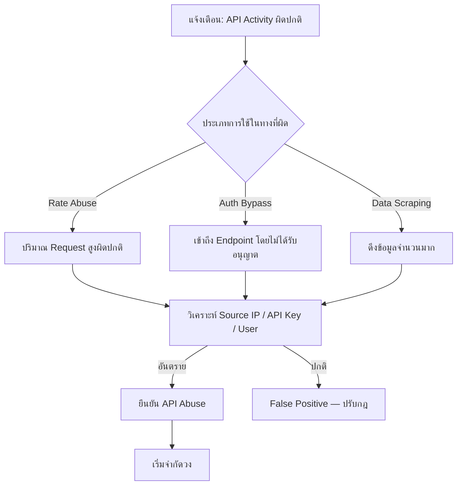

# Playbook: การตอบสนองต่อ API Abuse (การใช้ API ในทางที่ผิด)

**ความรุนแรง**: สูง | **หมวดหมู่**: Application Security

## 1. การวิเคราะห์ (Triage)

-   **ระบุต้นทาง**: หา API Key, OAuth Token, IP Address หรือบัญชีผู้ใช้ที่สร้าง Traffic ผิดปกติ
-   **วิเคราะห์ Request**: ดู API Log หา Pattern ผิดปกติ — เรียก API ถี่เกินไป, เข้าถึง Endpoint ที่ไม่ได้รับอนุญาต, Query Parameter แปลก, ดึงข้อมูลจำนวนมาก
-   **ตรวจ Authentication**: ยืนยันว่า Request ใช้ Credential ถูกต้องหรือใช้ช่องโหว่ Authentication (Broken Auth, BOLA/IDOR)
-   **บริบทธุรกิจ**: ยืนยันกับเจ้าของ API ว่ารูปแบบการใช้งานเป็นปกติหรือไม่

## 2. การจำกัดวง (Containment)
-   **Rate Limit**: ใช้ Rate Limiting เข้มงวดกับ API Key/IP ที่ละเมิด
-   **ยกเลิก Credential**: ปิด API Key หรือ OAuth Token ที่ถูก Compromise ทันที
-   **บล็อก IP**: เพิ่ม Source IP เข้า Blocklist ใน WAF/API Gateway
-   **ปิด Endpoint**: ถ้า Endpoint ที่มีช่องโหว่ถูกใช้งาน ให้ปิดชั่วคราว
-   **Geo-Block**: ถ้าการโจมตีมาจากพื้นที่ไม่คาดคิด ให้ใช้ Geo-restriction

## 3. การแก้ไข (Remediation)
-   **หมุนเวียน Credential**: ออก API Key ใหม่ให้เจ้าของจริง ยกเลิก Token ทั้งหมดที่มี
-   **แก้ช่องโหว่**: Patch ช่องโหว่ API (BOLA, Excessive Data Exposure, Broken Function-Level Authorization)
-   **เพิ่ม Control**: ใส่ Input Validation, Pagination Limit, Field-Level Filtering และ Authorization Check
-   **กฎ WAF**: สร้าง Custom WAF Rule สำหรับ Attack Pattern เฉพาะ

## 4. การกู้คืน (Recovery)
-   **เปิดบริการ**: เปิด Endpoint อีกครั้งหลัง Patch ช่องโหว่แล้ว
-   **แจ้ง Consumer**: แจ้งผู้ใช้ API ที่ถูกต้องเรื่องการเปลี่ยน Key
-   **ประเมินผลกระทบข้อมูล**: ตรวจสอบว่ามีข้อมูลรั่วไหลหรือไม่ แจ้งผู้เกี่ยวข้องตาม PDPA/GDPR

## เอกสารที่เกี่ยวข้อง (Related Documents)
-   [กรอบ Incident Response](../Framework.th.md)
-   [Playbook: Data Exfiltration](Data_Exfiltration.th.md)
-   [Playbook: Web Attack](Web_Attack.th.md)
-   [แบบฟอร์มรายงาน Incident](../../templates/incident_report.th.md)
-   [แบบฟอร์มส่งมอบกะ](../../templates/shift_handover.th.md)

## References
-   [MITRE ATT&CK T1106 — Native API](https://attack.mitre.org/techniques/T1106/)
-   [OWASP API Security Top 10 (2023)](https://owasp.org/API-Security/editions/2023/en/0x11-t10/)
-   [NIST SP 800-95 — Guide to Secure Web Services](https://csrc.nist.gov/publications/detail/sp/800-95/final)
