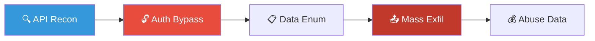
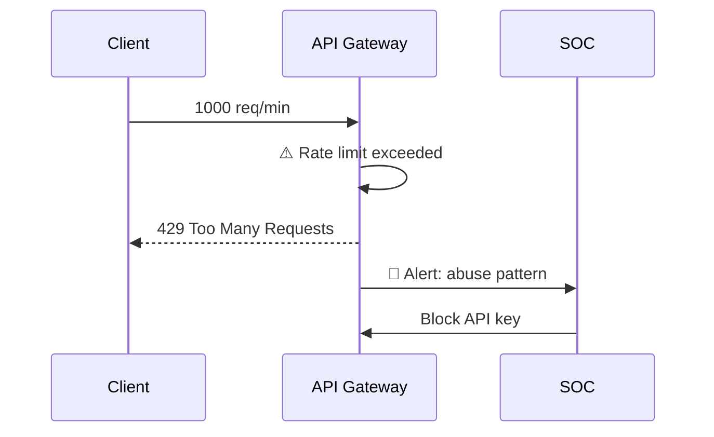
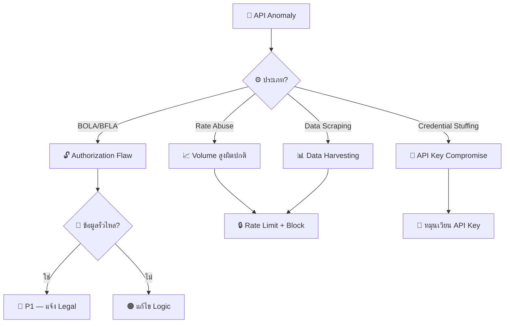
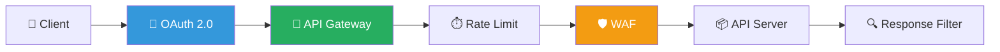
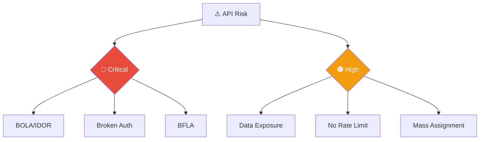

# Playbook: API Abuse / การใช้ API ในทางที่ผิด

**ID**: PB-30
**ระดับความรุนแรง**: สูง | **หมวดหมู่**: ความปลอดภัยแอปพลิเคชัน
**MITRE ATT&CK**: [T1106](https://attack.mitre.org/techniques/T1106/) (Native API), [T1190](https://attack.mitre.org/techniques/T1190/) (Exploit Public-Facing Application)
**ทริกเกอร์**: API Gateway alert (rate limit), WAF, SIEM (authentication anomaly), ผู้ใช้รายงาน

### ผัง API Attack Chain

### ผัง Rate Limiting Response

---

## ผังการตัดสินใจ

---

## 1. การวิเคราะห์

### 1.1 ประเภท API Abuse (OWASP API Top 10)

| ประเภท | ลักษณะ | ตัวอย่าง | ความรุนแรง |
|:---|:---|:---|:---|
| **BOLA** (Broken Object Level Auth) | เข้าถึงข้อมูล user อื่นผ่าน IDOR | `GET /api/users/1234` → `GET /api/users/5678` | 🔴 วิกฤต |
| **Broken Authentication** | API key/token ที่ถูกขโมย | Hardcoded key ใน GitHub | 🔴 วิกฤต |
| **Excessive Data Exposure** | API คืนข้อมูลเกินจำเป็น | Return full user object incl. SSN | 🟠 สูง |
| **Lack of Rate Limiting** | Request volume สูงผิดปกติ | >10,000 req/min จาก IP เดียว | 🟠 สูง |
| **BFLA** (Function Level Auth) | เรียก admin endpoints จาก user role | `POST /api/admin/delete-user` | 🔴 วิกฤต |
| **Mass Assignment** | ส่ง fields ที่ไม่ควรแก้ได้ | `{"role": "admin"}` | 🟠 สูง |
| **SSRF via API** | ใช้ API เรียก internal resources | `{"url": "http://169.254.169.254"}` | 🔴 วิกฤต |

### 1.2 รายการตรวจสอบ

| รายการ | วิธีตรวจสอบ | เสร็จ |
|:---|:---|:---:|
| API endpoint ที่ถูกโจมตี | API gateway logs | ☐ |
| API key / OAuth token ที่ใช้ | API gateway | ☐ |
| Request volume / pattern (burst? sustained?) | API analytics | ☐ |
| ข้อมูลที่ถูกเข้าถึง / ดาวน์โหลด | Response logs | ☐ |
| Source IP / User Agent | API logs | ☐ |
| API key leaked publicly? | GitHub search, TI | ☐ |
| ข้อมูล PII ถูกเข้าถึงหรือไม่? | DLP / data classification | ☐ |

---

## 2. การควบคุม

| # | การดำเนินการ | เครื่องมือ | เสร็จ |
|:---:|:---|:---|:---:|
| 1 | **หมุนเวียน API key / token** ที่ถูกบุกรุก | API gateway | ☐ |
| 2 | **Block** source IP ที่ WAF/API gateway | WAF | ☐ |
| 3 | **Rate limit** เพิ่มเติม (per-key, per-IP) | API gateway | ☐ |
| 4 | **บล็อก endpoint** หากรั่วไหลข้อมูล PII | API gateway | ☐ |
| 5 | **Revoke** leaked API keys ทั้งหมด | API management | ☐ |

---

## 3. การกำจัด

| # | การดำเนินการ | เสร็จ |
|:---:|:---|:---:|
| 1 | แก้ authorization logic (BOLA/BFLA) | ☐ |
| 2 | ลบ API keys ที่ leaked / hardcoded ใน source code | ☐ |
| 3 | ตรวจ response schema — ลบ fields ที่เกินจำเป็น | ☐ |
| 4 | แก้ mass assignment — whitelist allowed fields | ☐ |

---

## 4. การฟื้นฟู

| # | การดำเนินการ | เสร็จ |
|:---:|:---|:---:|
| 1 | ใช้ **API gateway** พร้อม rate limiting + throttling | ☐ |
| 2 | เปิด **behavioral analytics** สำหรับ API | ☐ |
| 3 | ใช้ **OAuth 2.0 + short-lived tokens** แทน static API keys | ☐ |
| 4 | สั่ง **API security audit / pen test** | ☐ |
| 5 | เปิด **API key rotation policy** (90 วัน) | ☐ |
| 6 | ใช้ **secrets scanning** ใน CI/CD (prevent key leaks) | ☐ |

---

## 5. เกณฑ์การยกระดับ

| เงื่อนไข | ยกระดับไปยัง |
|:---|:---|
| PII ถูกเข้าถึงหรือดาวน์โหลด | Legal + DPO (PDPA 72 ชม.) |
| Admin API ถูกเรียกจาก unauthorized user | CISO |
| DDoS ผ่าน API (volume-based) | [PB-12 DDoS](DDoS_Attack.th.md) |
| SSRF เข้าถึง internal/cloud metadata | Major Incident |
| API key leaked สาธารณะ (GitHub, Pastebin) | SOC Lead ทันที |

---

### ผัง API Security Architecture

### ผัง OWASP API Risk Classification

## เอกสารที่เกี่ยวข้อง

- [กรอบการตอบสนองต่อเหตุการณ์](../Framework.th.md)
- [PB-10 Web Attack](Web_Attack.th.md)

## อ้างอิง

- [OWASP API Security Top 10](https://owasp.org/API-Security/)
- [MITRE ATT&CK T1106 — Native API](https://attack.mitre.org/techniques/T1106/)
