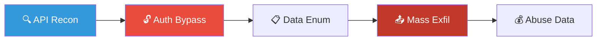
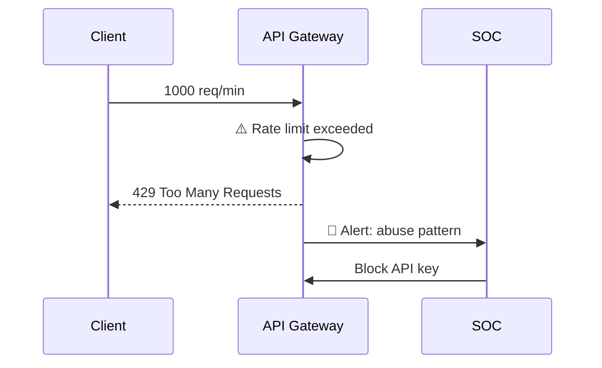
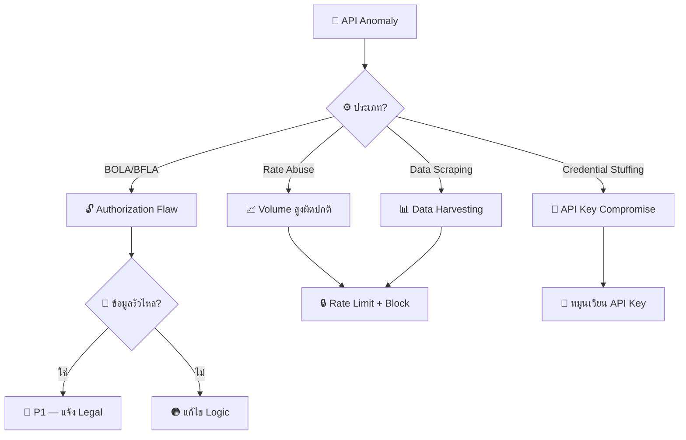
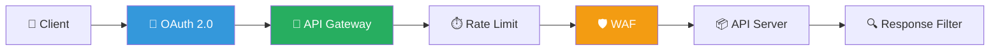
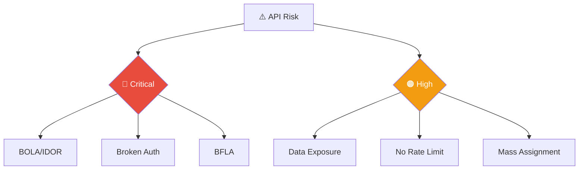

# Playbook: API Abuse / การใช้ API ในทางที่ผิด

**ID**: PB-30
**ระดับความรุนแรง**: สูง | **หมวดหมู่**: ความปลอดภัยแอปพลิเคชัน
**MITRE ATT&CK**: [T1106](https://attack.mitre.org/techniques/T1106/) (Native API), [T1190](https://attack.mitre.org/techniques/T1190/) (Exploit Public-Facing Application)
**ทริกเกอร์**: API Gateway alert (rate limit), WAF, SIEM (authentication anomaly), ผู้ใช้รายงาน

## หลังเหตุการณ์ (Post-Incident)

- [ ] ทบทวน API rate limiting และ throttling
- [ ] ใช้ API gateway security policies
- [ ] ทบทวน API key rotation policies
- [ ] ตรวจ OWASP API Top 10 risks
- [ ] ใช้ API security testing ใน CI/CD
- [ ] จัดทำ [Incident Report](../../11_Reporting_Templates/incident_report.th.md)

### ผัง API Attack Chain

```mermaid
graph LR
    Recon["🔍 API Recon"] --> Auth["🔓 Auth Bypass"]
    Auth --> Enum["📋 Data Enum"]
    Enum --> Exfil["📤 Mass Exfil"]
    Exfil --> Abuse["💰 Abuse Data"]
    style Recon fill:#3498db,color:#fff
    style Auth fill:#e74c3c,color:#fff
    style Exfil fill:#c0392b,color:#fff
```

### ผัง Rate Limiting Response

```mermaid
sequenceDiagram
    participant Client
    participant Gateway as API Gateway
    participant SOC
    Client->>Gateway: 1000 req/min
    Gateway->>Gateway: ⚠️ Rate limit exceeded
    Gateway-->>Client: 429 Too Many Requests
    Gateway->>SOC: 🚨 Alert: abuse pattern
    SOC->>Gateway: Block API key
```

---

## ผังการตัดสินใจ

```mermaid
graph TD
    Alert["🚨 API Anomaly"] --> Type{"⚙️ ประเภท?"}
    Type -->|BOLA/BFLA| Auth["🔓 Authorization Flaw"]
    Type -->|Rate Abuse| Rate["📈 Volume สูงผิดปกติ"]
    Type -->|Credential Stuffing| Cred["🔑 API Key Compromise"]
    Type -->|Data Scraping| Scrape["📊 Data Harvesting"]
    Auth --> Data{"📁 ข้อมูลรั่วไหล?"}
    Rate --> Block["🔒 Rate Limit + Block"]
    Cred --> Rotate["🔄 หมุนเวียน API Key"]
    Scrape --> Block
    Data -->|ใช่| Critical["🔴 P1 — แจ้ง Legal"]
    Data -->|ไม่| Fix["🟠 แก้ไข Logic"]
```

---

## 1. การวิเคราะห์

### 1.1 ประเภท API Abuse (OWASP API Top 10)

| ประเภท | ลักษณะ | ตัวอย่าง | ความรุนแรง |
|:---|:---|:---|:---|
| **BOLA** (Broken Object Level Auth) | เข้าถึงข้อมูล user อื่นผ่าน IDOR | `GET /api/users/1234` → `GET /api/users/5678` | 🔴 วิกฤต |
| **Broken Authentication** | API key/token ที่ถูกขโมย | Hardcoded key ใน GitHub | 🔴 วิกฤต |
| **Excessive Data Exposure** | API คืนข้อมูลเกินจำเป็น | Return full user object incl. SSN | 🟠 สูง |
| **Lack of Rate Limiting** | Request volume สูงผิดปกติ | >10,000 req/min จาก IP เดียว | 🟠 สูง |
| **BFLA** (Function Level Auth) | เรียก admin endpoints จาก user role | `POST /api/admin/delete-user` | 🔴 วิกฤต |
| **Mass Assignment** | ส่ง fields ที่ไม่ควรแก้ได้ | `{"role": "admin"}` | 🟠 สูง |
| **SSRF via API** | ใช้ API เรียก internal resources | `{"url": "http://169.254.169.254"}` | 🔴 วิกฤต |

### 1.2 รายการตรวจสอบ

| รายการ | วิธีตรวจสอบ | เสร็จ |
|:---|:---|:---:|
| API endpoint ที่ถูกโจมตี | API gateway logs | ☐ |
| API key / OAuth token ที่ใช้ | API gateway | ☐ |
| Request volume / pattern (burst? sustained?) | API analytics | ☐ |
| ข้อมูลที่ถูกเข้าถึง / ดาวน์โหลด | Response logs | ☐ |
| Source IP / User Agent | API logs | ☐ |
| API key leaked publicly? | GitHub search, TI | ☐ |
| ข้อมูล PII ถูกเข้าถึงหรือไม่? | DLP / data classification | ☐ |

---

## 2. การควบคุม

| # | การดำเนินการ | เครื่องมือ | เสร็จ |
|:---:|:---|:---|:---:|
| 1 | **หมุนเวียน API key / token** ที่ถูกบุกรุก | API gateway | ☐ |
| 2 | **Block** source IP ที่ WAF/API gateway | WAF | ☐ |
| 3 | **Rate limit** เพิ่มเติม (per-key, per-IP) | API gateway | ☐ |
| 4 | **บล็อก endpoint** หากรั่วไหลข้อมูล PII | API gateway | ☐ |
| 5 | **Revoke** leaked API keys ทั้งหมด | API management | ☐ |

---

## 3. การกำจัด

| # | การดำเนินการ | เสร็จ |
|:---:|:---|:---:|
| 1 | แก้ authorization logic (BOLA/BFLA) | ☐ |
| 2 | ลบ API keys ที่ leaked / hardcoded ใน source code | ☐ |
| 3 | ตรวจ response schema — ลบ fields ที่เกินจำเป็น | ☐ |
| 4 | แก้ mass assignment — whitelist allowed fields | ☐ |

---

## 4. การฟื้นฟู

| # | การดำเนินการ | เสร็จ |
|:---:|:---|:---:|
| 1 | ใช้ **API gateway** พร้อม rate limiting + throttling | ☐ |
| 2 | เปิด **behavioral analytics** สำหรับ API | ☐ |
| 3 | ใช้ **OAuth 2.0 + short-lived tokens** แทน static API keys | ☐ |
| 4 | สั่ง **API security audit / pen test** | ☐ |
| 5 | เปิด **API key rotation policy** (90 วัน) | ☐ |
| 6 | ใช้ **secrets scanning** ใน CI/CD (prevent key leaks) | ☐ |

---

## 5. เกณฑ์การยกระดับ

| เงื่อนไข | ยกระดับไปยัง |
|:---|:---|
| PII ถูกเข้าถึงหรือดาวน์โหลด | Legal + DPO (PDPA 72 ชม.) |
| Admin API ถูกเรียกจาก unauthorized user | CISO |
| DDoS ผ่าน API (volume-based) | [PB-12 DDoS](DDoS_Attack.th.md) |
| SSRF เข้าถึง internal/cloud metadata | Major Incident |
| API key leaked สาธารณะ (GitHub, Pastebin) | SOC Lead ทันที |

---

## 6. Evidence Checklist

| ประเภทหลักฐาน | สิ่งที่ต้องเก็บ | แหล่งข้อมูล | เหตุผลที่ต้องเก็บ |
|:---|:---|:---|:---|
| หลักฐานของ request | endpoint, method, parameters, request IDs, timestamps | API gateway / app logs | ใช้ reconstruct รูปแบบการ abuse อย่างแม่นยำ |
| หลักฐานด้านตัวตน | API key, OAuth token, client ID, user account, source IP | API management / auth logs | ใช้ระบุ credential หรือตัวตนที่ถูก abuse |
| หลักฐานของ response | response code, returned fields, จำนวน records, downloaded objects | App logs / API metrics | ใช้ดูว่ามี data exposure หรือ auth bypass หรือไม่ |
| หลักฐานด้านช่องโหว่ | auth logic flaw, schema issue, rate-limit bypass, injection payload | Security test results / code review / WAF logs | ใช้แก้ root cause เชิงวิศวกรรม |
| หลักฐานผลกระทบต่อผู้ใช้งาน | partner ที่ได้รับผลกระทบ, endpoint ที่ช้า/ล่ม, ธุรกรรมธุรกิจที่เสียหาย | API analytics / support tickets | ใช้สื่อสารกับผู้เกี่ยวข้อง |

---

## 7. Minimum Telemetry Required

| แหล่ง Telemetry | ใช้เพื่ออะไร | ความสำคัญ | Blind Spot ถ้าไม่มี |
|:---|:---|:---:|:---|
| API gateway และ application logs | ดู request path, method, parameter, request ID, response code | Required | สร้างลำดับเหตุการณ์หรือผลกระทบของ endpoint ไม่ได้ |
| Authentication และ API key telemetry | ดู token usage, client identity, key rotation history, auth failure | Required | ระบุไม่ได้ว่า credential หรือ integration ใดถูกใช้ในทางที่ผิด |
| WAF, rate-limit, และ edge telemetry | ดู burst pattern, bypass attempt, geo anomaly, blocking action | Required | แยก targeted abuse ออกจาก noisy traffic ไม่ได้ |
| API analytics และ data access metrics | ดู record count, object download, latency, partner impact | Required | วัด exposure และ business impact ไม่ได้อย่างน่าเชื่อถือ |
| Secure SDLC และ testing records | ดู defect เดิม, schema change, release ล่าสุด, finding ก่อนหน้า | Recommended | root cause analysis และ remediation จะช้าลง |

---

## 8. False Positive และ Tuning Guide

| Scenario | ทำไมจึงดูน่าสงสัย | วิธีตรวจสอบ | Tuning Action | ต้องยกระดับเมื่อ |
|:---|:---|:---|:---|:---|
| งาน load test หรือ performance test | request rate สูงและ error volume มากดูเหมือน abuse | ยืนยัน test window, source range, และ owner ของการทดสอบ | allowlist source range และ test header เฉพาะช่วงเวลาทดสอบ | traffic เกิน endpoint ที่อนุมัติหรือมี auth bypass pattern |
| งาน batch integration ของ partner | API call ซ้ำ ๆ และการดึงข้อมูลจำนวนมากดูเหมือน scraping | ยืนยัน partner ID, scope ตามสัญญา, และ baseline เดิม | tune threshold ตาม partner และ endpoint profile ที่อนุมัติ | การเข้าถึงขยายไปยัง object, tenant, หรือ field อ่อนไหวใหม่ |
| การ rollout mobile app version ใหม่ | request shape เปลี่ยนและ traffic spike ได้ | ยืนยัน release schedule, app version, และ rollout region | tune schema และปริมาณที่คาดไว้ตาม app version ที่อนุมัติ | request มาจาก client ที่ไม่รู้จักหรือเริ่มมี authorization failure |
| การทำงานของ security scanner หรือ QA automation | fuzzing และ negative test ดูเหมือน attack traffic | ยืนยัน scanner identity, environment, และ schedule | suppress เฉพาะ scanner ที่รู้จักใน environment ที่อนุมัติ | scanner ไปอยู่ใน production โดยไม่ได้รับอนุมัติหรือเจอ live data exposure |

---

### ผัง API Security Architecture

```mermaid
graph LR
    Client["📱 Client"] --> Auth["🔑 OAuth 2.0"]
    Auth --> Gateway["🚪 API Gateway"]
    Gateway --> RateLimit["⏱️ Rate Limit"]
    RateLimit --> WAF["🛡️ WAF"]
    WAF --> App["📦 API Server"]
    App --> DLP["🔍 Response Filter"]
    style Auth fill:#3498db,color:#fff
    style Gateway fill:#27ae60,color:#fff
    style WAF fill:#f39c12,color:#fff
```

### ผัง OWASP API Risk Classification

```mermaid
graph TD
    Risk["⚠️ API Risk"] --> Critical{"🔴 Critical"}
    Risk --> High{"🟠 High"}
    Critical --> BOLA["BOLA/IDOR"]
    Critical --> BrokenAuth["Broken Auth"]
    Critical --> BFLA["BFLA"]
    High --> DataExp["Data Exposure"]
    High --> NoLimit["No Rate Limit"]
    High --> MassAssign["Mass Assignment"]
    style Critical fill:#e74c3c,color:#fff
    style High fill:#f39c12,color:#fff
```

## กฎตรวจจับ (Sigma)

| กฎ | ไฟล์ |
|:---|:---|
| API Authentication Bypass | [web_api_abuse_auth_bypass.yml](../../08_Detection_Engineering/sigma_rules/web_api_abuse_auth_bypass.yml) |
| High Web Request Rate | [web_high_rate_limit.yml](../../08_Detection_Engineering/sigma_rules/web_high_rate_limit.yml) |

## เอกสารที่เกี่ยวข้อง

- [กรอบการตอบสนองต่อเหตุการณ์](../Framework.th.md)
- [PB-10 Web Attack](Web_Attack.th.md)

## API Threat Landscape

| Attack Type | Method | Detection |
|:---|:---|:---|
| Credential stuffing | Automated login attempts | Rate analysis |
| BOLA/IDOR | Object ID manipulation | Auth boundary check |
| Mass data scraping | Systematic enumeration | Volume anomaly |
| Injection | SQLi/XSS via API params | WAF + input validation |
| Token theft | JKT/OAuth hijack | Token anomaly |

### Rate Limiting Strategy

| Endpoint Type | Normal Rate | Alert Threshold | Block Threshold |
|:---|:---|:---|:---|
| Authentication | 5/min | 10/min | 20/min |
| Data query | 60/min | 120/min | 200/min |
| File upload | 10/min | 20/min | 50/min |
| Admin actions | 30/min | 60/min | 100/min |

### API Security Checklist
- [ ] Authentication on all endpoints
- [ ] Rate limiting configured
- [ ] Input validation active
- [ ] Logging all API calls
- [ ] Token expiration enforced
- [ ] CORS properly configured

### API Incident Severity Matrix

| Factor | Low | High |
|:---|:---|:---|
| Data accessed | Public | PII/sensitive |
| Volume | < 100 requests | 10K+ requests |
| Auth required | Yes (legit key) | Bypassed auth |

### API Key Rotation

| When | Action |
|:---|:---|
| Compromised key | Rotate immediately |
| Suspicious usage | Rotate + investigate |
| Regular rotation | Every 90 days |

## References

- [OWASP API Security Top 10](https://owasp.org/API-Security/)
- [MITRE ATT&CK T1106 — Native API](https://attack.mitre.org/techniques/T1106/)
