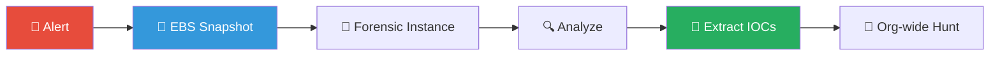
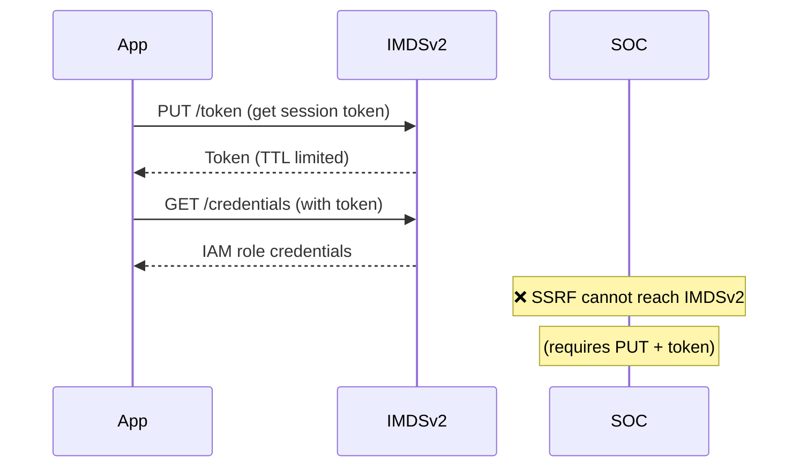
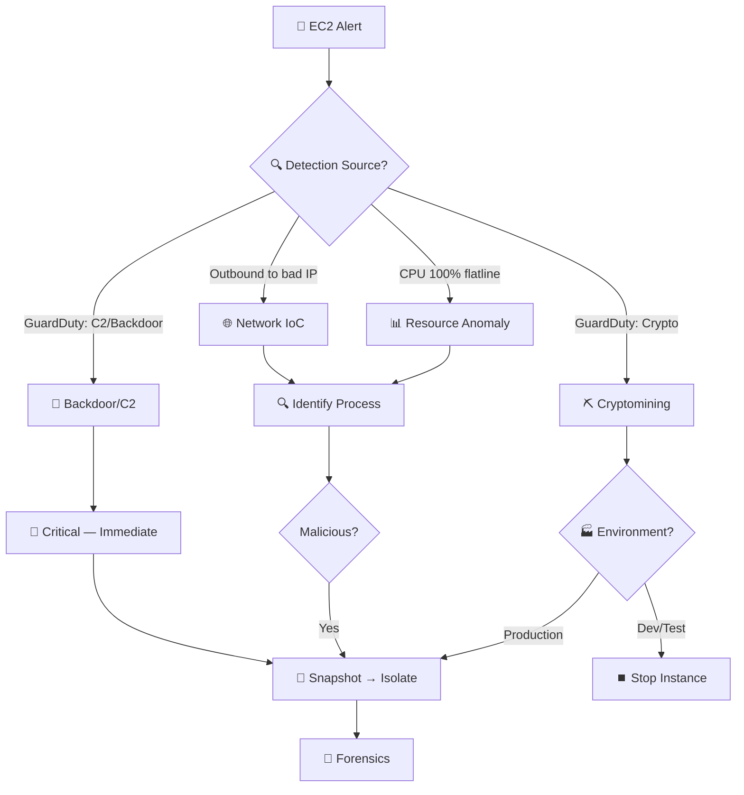
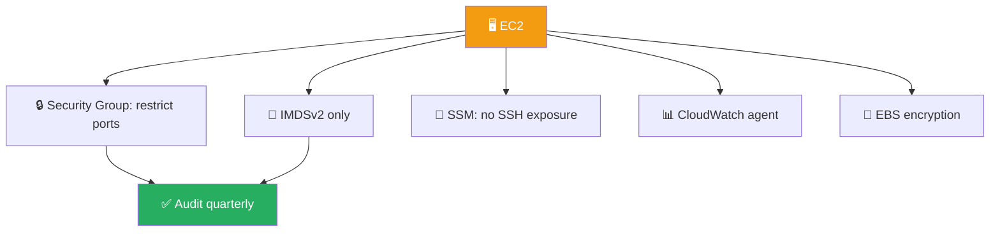
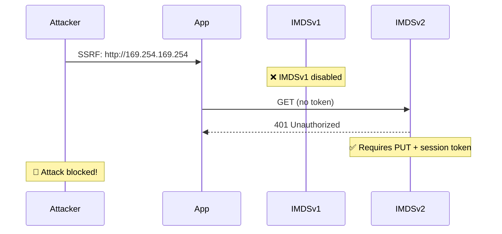

# Playbook: AWS EC2 Instance Compromise

**ID**: PB-22
**Severity**: Critical | **Category**: Cloud Security (AWS)
**MITRE ATT&CK**: [T1190](https://attack.mitre.org/techniques/T1190/) (Exploit Public-Facing Application), [T1496](https://attack.mitre.org/techniques/T1496/) (Resource Hijacking), [T1078.004](https://attack.mitre.org/techniques/T1078/004/) (Cloud Accounts)
**TLP**: AMBER
**Trigger**: GuardDuty alert, CloudTrail anomaly, EDR detection, VPC Flow Logs anomaly

### EC2 Forensics Flow

### IMDSv2 Protection

---

## Decision Flow

---

## 1. Analysis

### 1.1 GuardDuty Finding Types

| Finding Type | Severity | Description |
|:---|:---|:---|
| `CryptoCurrency:EC2/BitcoinTool.B` | High | Instance communicating with crypto mining pool |
| `Backdoor:EC2/C&CActivity.B` | High | Instance communicating with known C2 |
| `UnauthorizedAccess:EC2/SSHBruteForce` | Medium | SSH brute force detected |
| `Recon:EC2/PortProbeUnprotectedPort` | Low | Port scan from external source |
| `Trojan:EC2/BlackholeTraffic` | High | Outbound traffic to black hole IP |
| `UnauthorizedAccess:EC2/TorIPCaller` | Medium | API call from Tor exit node |

### 1.2 Investigation Checklist

| Check | How | Done |
|:---|:---|:---:|
| Instance ID, Region, VPC, Owner tag | AWS Console / CLI | ☐ |
| Instance role (production/dev/test?) | Tags, ASG | ☐ |
| Launch time — when was it created? | EC2 console | ☐ |
| IAM role attached to instance | Instance metadata | ☐ |
| Security Group rules (what's exposed?) | EC2 → SG | ☐ |
| Public IP / EIP? Internet-facing? | EC2 console | ☐ |
| VPC Flow Logs — unusual outbound | CloudWatch / Athena | ☐ |
| CloudTrail — who launched / modified? | CloudTrail | ☐ |
| SSH key used for access | EC2 key pair, SSM sessions | ☐ |
| Running processes (if accessible) | SSM Run Command | ☐ |

### 1.3 Entry Vector Assessment

| Vector | How to Check | Done |
|:---|:---|:---:|
| Exposed SSH (22) / RDP (3389) | Security Group review | ☐ |
| Vulnerable web application | Access logs, CVE check | ☐ |
| Compromised IAM credentials | CloudTrail `RunInstances` | ☐ |
| Compromised SSM / Session Manager | SSM session history | ☐ |
| Docker / container escape | Container logs | ☐ |
| Supply chain (backdoored AMI) | AMI source verification | ☐ |

---

## 2. Containment

### 2.1 Immediate Actions

| # | Action | AWS Command / Console | Done |
|:---:|:---|:---|:---:|
| 1 | **Snapshot EBS** for forensics | `aws ec2 create-snapshot` | ☐ |
| 2 | **Isolate** — attach restrictive SG (deny all, allow forensics IP only) | EC2 → SG | ☐ |
| 3 | **Deregister** from ALB/NLB and ASG | EC2 / ELB | ☐ |
| 4 | **Disable IAM role** credentials (revoke session) | IAM | ☐ |
| 5 | **Tag** instance as `Status: Compromised` | EC2 tags | ☐ |
| 6 | **Capture memory** if forensics required | SSM + memory dump tool | ☐ |

### 2.2 If Cryptomining

| # | Action | Done |
|:---:|:---|:---:|
| 1 | Block mining pool domains/IPs at VPC DNS / firewall | ☐ |
| 2 | Block mining ports (3333, 4444, 5555, 8333) | ☐ |
| 3 | Check for other instances by same IAM user | ☐ |
| 4 | Check billing for unexpected GPU/compute instances | ☐ |

---

## 3. Eradication

| # | Action | Done |
|:---:|:---|:---:|
| 1 | **Terminate** compromised instance (if stateless) | ☐ |
| 2 | **Rebuild** from clean, patched AMI (Golden Image) | ☐ |
| 3 | **Rotate** IAM credentials (access keys, role policies) | ☐ |
| 4 | **Rotate** SSH key pairs used on the instance | ☐ |
| 5 | **Patch** the entry vector (close SG rules, patch app) | ☐ |
| 6 | **Review** all instances launched by same IAM identity | ☐ |

---

## 4. Recovery

| # | Action | Done |
|:---:|:---|:---:|
| 1 | Launch clean replacement instance from Golden AMI | ☐ |
| 2 | Register in ALB/ASG | ☐ |
| 3 | Validate application health | ☐ |
| 4 | Restrict SSH/RDP — use SSM Session Manager instead | ☐ |
| 5 | Enable GuardDuty if not already active | ☐ |
| 6 | Implement IMDSv2 (disable IMDSv1) to prevent SSRF credential theft | ☐ |
| 7 | Monitor instance for 72 hours | ☐ |

---

## 5. IoC Collection

| Type | Value | Source |
|:---|:---|:---|
| Instance ID | | EC2 |
| Malicious process / binary hash | | SSM / Forensics |
| C2 / Mining pool IP/domain | | VPC Flow Logs |
| Attacker IAM identity | | CloudTrail |
| Source IP of initial compromise | | CloudTrail / VPC Flow |
| Modified files | | EBS forensics |

---

## 6. Escalation Criteria

| Condition | Escalate To |
|:---|:---|
| Production instance compromised | SOC Lead + Cloud team |
| Multiple instances compromised | Major Incident |
| IAM credentials stolen via SSRF | CISO + IAM team |
| Data exfiltration from instance | Legal + DPO (PDPA 72h) |
| Billing spike > $1K unauthorized | Finance + Cloud team |
| Lateral movement to other instances | [PB-09 Lateral Movement](Lateral_Movement.en.md) |

---

## Root Cause Analysis (VERIS)

| Field | Value |
|:---|:---|
| **Actor** | External |
| **Action** | Malware / Hacking |
| **Asset** | EC2 Instance |
| **Attribute** | Integrity / Availability |

---

### EC2 Security Hardening

### SSRF Metadata Protection

## Related Documents

- [IR Framework](../Framework.en.md)
- [Incident Report](../../templates/incident_report.en.md)
- [PB-16 Cloud IAM](Cloud_IAM.en.md)
- [PB-21 AWS S3](AWS_S3_Compromise.en.md)

## References

- [AWS Security Incident Response Guide](https://docs.aws.amazon.com/whitepapers/latest/aws-security-incident-response-guide/welcome.html)
- [Amazon EC2 Security Best Practices](https://docs.aws.amazon.com/AWSEC2/latest/UserGuide/ec2-security-best-practices.html)
- [AWS GuardDuty Finding Types](https://docs.aws.amazon.com/guardduty/latest/ug/guardduty_finding-types-ec2.html)
