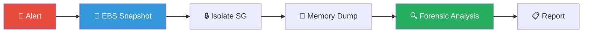
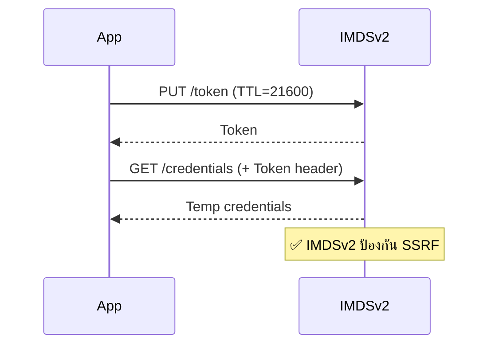
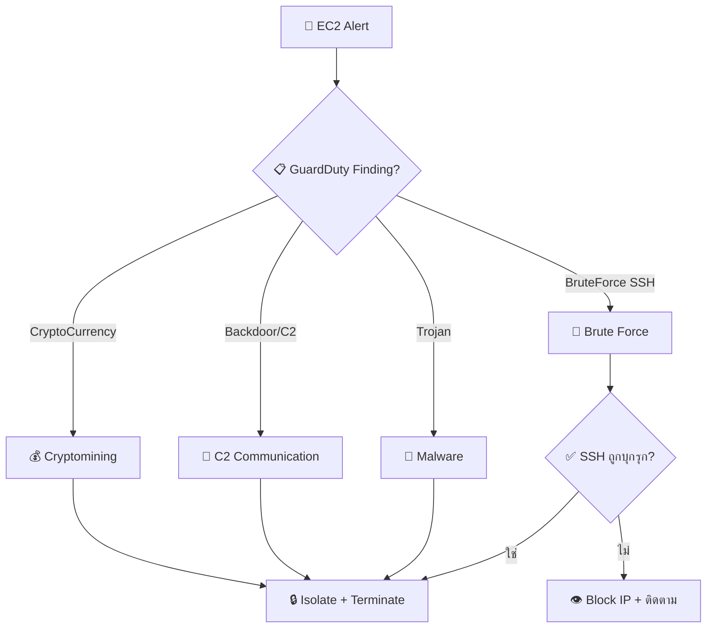
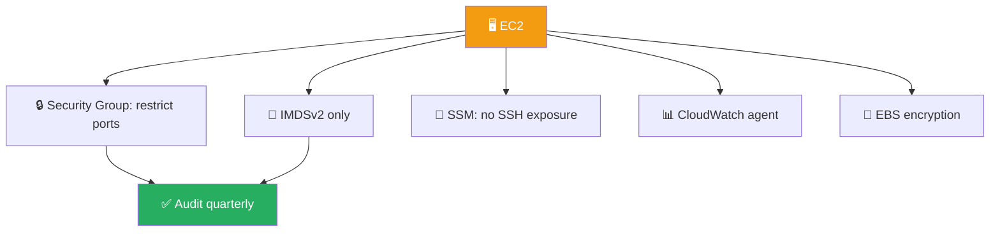
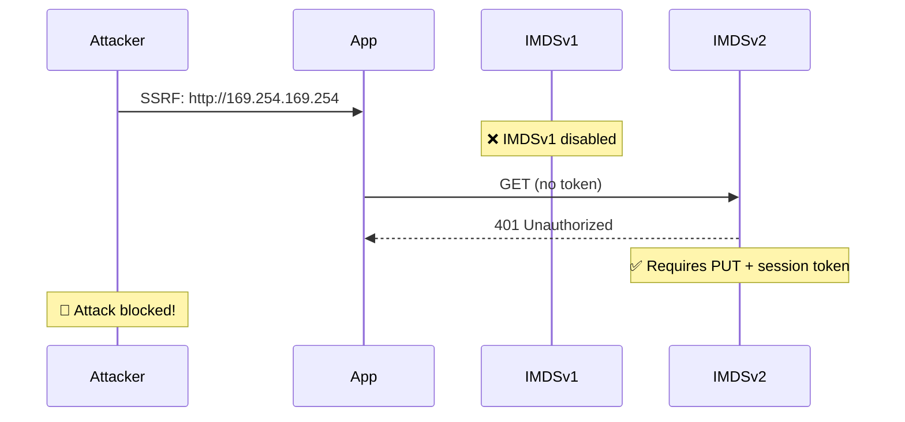

# Playbook: AWS EC2 Instance Compromise

**ID**: PB-22
**ระดับความรุนแรง**: วิกฤต | **หมวดหมู่**: ความปลอดภัยคลาวด์
**MITRE ATT&CK**: [T1190](https://attack.mitre.org/techniques/T1190/) (Exploit Public-Facing App), [T1496](https://attack.mitre.org/techniques/T1496/) (Resource Hijacking)
**ทริกเกอร์**: GuardDuty finding, CloudWatch CPU alarm, VPC Flow Log anomaly, billing spike

### ผังขั้นตอน Forensics

### ผังป้องกัน IMDS Credential Theft

---

## ผังการตัดสินใจ

---

## 1. การวิเคราะห์

### 1.1 GuardDuty Finding Types

| Finding | ลักษณะ | ความรุนแรง |
|:---|:---|:---|
| `CryptoCurrency:EC2/BitcoinTool` | Mining binary ตรวจพบ | 🔴 สูง |
| `Backdoor:EC2/C&CActivity` | EC2 ติดต่อ C2 server | 🔴 สูง |
| `UnauthorizedAccess:EC2/SSHBruteForce` | SSH brute force | 🟠 ปานกลาง |
| `Trojan:EC2/BlackholeTraffic` | Traffic ไป blackhole IP | 🔴 สูง |
| `Recon:EC2/PortProbeUnprotectedPort` | Port scanning | 🟡 ปานกลาง |
| `UnauthorizedAccess:EC2/RDPBruteForce` | RDP brute force | 🟠 ปานกลาง |

### 1.2 รายการตรวจสอบ

| รายการ | วิธีตรวจสอบ | เสร็จ |
|:---|:---|:---:|
| Instance ID, Region, VPC | AWS Console | ☐ |
| Owner tag / Cost center | AWS tags | ☐ |
| Production หรือ Dev/Test? | Tags / CMDB | ☐ |
| IAM role ที่ attach (สิทธิ์อะไร?) | IAM Console | ☐ |
| Security Group (ports ที่เปิด) | EC2 Console | ☐ |
| VPC Flow Logs — outbound ผิดปกติ | VPC Flow Logs | ☐ |
| Entry vector (SSH เปิด? web app? SSRF?) | SG + application | ☐ |
| User data script มี secrets? | EC2 Console | ☐ |
| IMDSv1 เปิด? (credential theft risk) | `curl http://169.254.169.254/` | ☐ |

---

## 2. การควบคุม

| # | การดำเนินการ | คำสั่ง/เครื่องมือ | เสร็จ |
|:---:|:---|:---|:---:|
| 1 | **Snapshot EBS volumes** สำหรับ forensics | `aws ec2 create-snapshot` | ☐ |
| 2 | **Isolate** — attach restrictive Security Group (deny all) | AWS Console | ☐ |
| 3 | **Deregister** จาก ALB/Target Group/ASG | AWS Console | ☐ |
| 4 | **ปิด IAM role** temp credentials (revoke session) | `aws iam put-role-policy` (deny all) | ☐ |
| 5 | **Block** outbound C2/mining IPs | NACL / SG | ☐ |
| 6 | **Capture** memory dump (ถ้า forensics จำเป็น) | SSM / SSH | ☐ |

---

## 3. การกำจัด

| # | การดำเนินการ | เสร็จ |
|:---:|:---|:---:|
| 1 | **Terminate** instance (ถ้า stateless / immutable) | ☐ |
| 2 | **Rebuild** จาก clean AMI (patched) | ☐ |
| 3 | **หมุนเวียน** IAM credentials + SSH keys | ☐ |
| 4 | **Patch** entry vector (web app vulnerability, SSH config) | ☐ |
| 5 | **ลบ** unauthorized users/SSH keys จาก AMI | ☐ |

---

## 4. การฟื้นฟู

| # | การดำเนินการ | เสร็จ |
|:---:|:---|:---:|
| 1 | ใช้ **SSM** แทน SSH (ไม่ต้องเปิด port 22) | ☐ |
| 2 | บังคับ **IMDSv2** (ปิด v1 — ป้องกัน credential theft) | ☐ |
| 3 | เปิด **GuardDuty** ทุก region | ☐ |
| 4 | ใช้ **Inspector** สำหรับ vulnerability scanning | ☐ |
| 5 | ตั้ง **billing alerts** + **budget caps** | ☐ |
| 6 | ตรวจสอบ Security Groups ทุกไตรมาส | ☐ |

---

## 5. เกณฑ์การยกระดับ

| เงื่อนไข | ยกระดับไปยัง |
|:---|:---|
| Production instance ถูกบุกรุก | SOC Lead + Cloud team |
| IAM credentials ถูกขโมย | [PB-16 Cloud IAM](Cloud_IAM.th.md) |
| Billing spike > $1,000 ผิดปกติ | Finance + Cloud team |
| Cryptomining ยืนยัน | [PB-31 Cryptomining](Cryptomining.th.md) |
| C2 confirmed | [PB-13 C2](C2_Communication.th.md) |
| หลาย instances / accounts | Major Incident |

---

### ผัง EC2 Security Hardening

### ผัง SSRF Metadata Protection

## เอกสารที่เกี่ยวข้อง

- [กรอบการตอบสนองต่อเหตุการณ์](../Framework.th.md)
- [PB-16 Cloud IAM](Cloud_IAM.th.md)
- [PB-31 Cryptomining](Cryptomining.th.md)

## อ้างอิง

- [MITRE ATT&CK T1190 — Exploit Public-Facing Application](https://attack.mitre.org/techniques/T1190/)
- [AWS Security Incident Response Guide](https://docs.aws.amazon.com/whitepapers/latest/aws-security-incident-response-guide/welcome.html)
